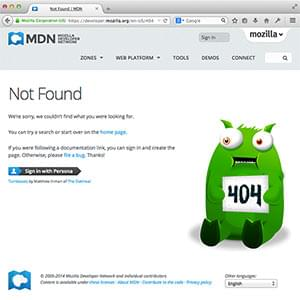

{{QuicklinksWithSubPages("Learn_web_development/Howto")}}

In this article, we explain what web servers are, how web servers work, and why they are important.

<table>
  <tbody>
    <tr>
      <th scope="row">Prerequisites:</th>
      <td>
        You should already know
        <a href="/en-US/docs/Learn_web_development/Howto/Web_mechanics/How_does_the_Internet_work"
          >how the Internet works</a
        >, and
        <a
          href="/en-US/docs/Learn_web_development/Getting_started/Environment_setup/Browsing_the_web"
          >understand the difference between a web page, a website, a web
          server, and a search engine</a
        >.
      </td>
    </tr>
    <tr>
      <th scope="row">Objective:</th>
      <td>
        You will learn what a web server is and gain a general understanding of
        how it works.
      </td>
    </tr>
  </tbody>
</table>

## Summary

The term _web server_ can refer to hardware or software, or both of them working together.

1. On the hardware side, a web server is a computer that stores web server software and a website's component files (for example, HTML documents, images, CSS stylesheets, and JavaScript files). A web server connects to the Internet and supports physical data interchange with other devices connected to the web.
2. On the software side, a web server includes several parts that control how web users access hosted files. At a minimum, this is an _HTTP server_. An HTTP server is software that understands {{Glossary("URL","URLs")}} (web addresses) and {{Glossary("HTTP")}} (the protocol your browser uses to view webpages). An HTTP server can be accessed through the domain names of the websites it stores, and it delivers the content of these hosted websites to the end user's device.

At the most basic level, whenever a browser needs a file that is hosted on a web server, the browser requests the file via HTTP. When the request reaches the correct (hardware) web server, the (software) _HTTP server_ accepts the request, finds the requested document, and sends it back to the browser, also through HTTP. (If the server doesn't find the requested document, it returns a [404](/en-US/docs/Web/HTTP/Status/404) response instead.)

To publish a website, you need either a static or a dynamic web server.

A **static web server**, or stack, consists of a computer (hardware) with an HTTP server (software). We call it "static" because the server sends its hosted files as-is to your browser.

A **dynamic web server** consists of a static web server plus extra software, most commonly an _application server_ and a _database_. We call it "dynamic" because the application server updates the hosted files before sending content to your browser via the HTTP server.

For example, to produce the final webpages you see in the browser, the application server might fill an HTML template with content from a database. Sites like MDN or Wikipedia have thousands of webpages. Typically, these kinds of sites are composed of only a few HTML templates and a giant database, rather than thousands of static HTML documents. This setup makes it easier to maintain and deliver the content.

## Deeper dive

To review: to fetch a webpage, your browser sends a request to the web server, which searches for the requested file in its own storage space. Upon finding the file, the server reads it, processes it as needed, and sends it to the browser. Let's look at those steps in more detail.

### Hosting files

First, a web server has to store the website's files, namely all HTML documents and their related assets, including images, CSS stylesheets, JavaScript files, fonts, and video.

Technically, you could host all those files on your own computer, but it's far more convenient to store files all on a dedicated web server because:

- A dedicated web server is typically more available (up and running).
- Excluding downtime and system troubles, a dedicated web server is always connected to the Internet.
- A dedicated web server can have the same IP address all the time. This is known as a _dedicated IP address_. (Not all {{Glossary("ISP", "ISPs")}} provide a fixed IP address for home lines.)
- A dedicated web server is typically maintained by a third party.

For all these reasons, finding a good hosting provider is a key part of building your website. Examine the various services companies offer. Choose one that fits your needs and budget. (Services range from free to thousands of dollars per month.) You can find more details [in this article](/en-US/docs/Learn_web_development/Howto/Tools_and_setup/How_much_does_it_cost#hosting).

Once you have web hosting service, you must [upload your files to your web server](/en-US/docs/Learn_web_development/Howto/Tools_and_setup/Upload_files_to_a_web_server).

### Communicating through HTTP

Second, a web server provides support for {{Glossary("HTTP")}} (Hypertext Transfer Protocol). As its name implies, HTTP specifies how to transfer hypertext (linked web documents) between two computers.

A {{Glossary("Protocol")}} is a set of rules for communication between two computers. HTTP is a textual, stateless protocol.

- Textual
  - : All commands are plain-text and human-readable.
- Stateless
  - : Neither the server nor the client remember previous communications. For example, relying on HTTP alone, a server can't remember a password you typed or remember your progress on an incomplete transaction. You need an application server for tasks like that. (We'll cover that sort of technology in other articles.)

HTTP provides clear rules for how a client and server communicate.
If you want to learn more, you can read the [HTTP documentation](/en-US/docs/Web/HTTP).
For now, there are a few things to keep in mind:

- _Clients_ make HTTP requests to _servers_. Servers _respond_ to a _client_'s HTTP request.
- When requesting a file via HTTP, clients must provide the file's {{Glossary("URL")}}.
- The web server _must answer_ every HTTP request, at least with an error message.

On a web server, the HTTP server is responsible for processing and answering incoming requests.

1. Upon receiving a request, an HTTP server checks if the requested URL matches an existing file.
2. If so, the web server sends the file content back to the browser. If not, the server will check if it should generate a file dynamically for the request (see [Static vs. dynamic content](#static_vs._dynamic_content)).
3. If neither of these options are possible, the web server returns an error message to the browser, most commonly {{HTTPStatus("404", "404 Not Found")}}.
   The 404 error is so common that some web designers devote considerable time and effort to designing 404 error pages.
   

### Static vs. dynamic content

Roughly speaking, a server can serve either static or dynamic content. Remember that the term _static_ means "served as-is". Static websites are the easiest to set up, so we suggest you make your first site a static site.

The term _dynamic_ means that the server processes the content or even generates it on the fly from a database. This approach provides more flexibility, but the technical stack is more complex, making it dramatically more challenging to build a website.

It is impossible to suggest a single off-the-shelf application server that will be the right solution for every possible use case. Some application servers are designed to host and manage blogs, wikis, or e-commerce solutions, while others are more generic. If you're building a dynamic website, take the time to research your requirements and find the technology that best fits your needs.

Most website developers won't need to create an application server from scratch, because there are so many off-the-shelf solutions, many of which are highly configurable.
But if you do need to create your own server, then you will probably want to use a server framework, leveraging its existing code and libraries, and extending just the parts that you need in order to meet your use case.
Only a relatively small number of developers should need to develop a server completely from scratch: for example, in order to meet tight resource constraints on an embedded system.
If you'd like to experiment with building a server, take a look through the resources in the [Server-side website programming](/en-US/docs/Learn_web_development/Extensions/Server-side) learning pathway.

## Next steps

Now that you are familiar with web servers, you could:

- read up on [how much it costs to do something on the web](/en-US/docs/Learn_web_development/Howto/Tools_and_setup/How_much_does_it_cost)
- learn more about [various software you need to create a website](/en-US/docs/Learn_web_development/Howto/Tools_and_setup/What_software_do_I_need)
- move on to something practical like [how to upload files on a web server](/en-US/docs/Learn_web_development/Howto/Tools_and_setup/Upload_files_to_a_web_server).
