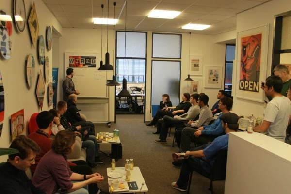
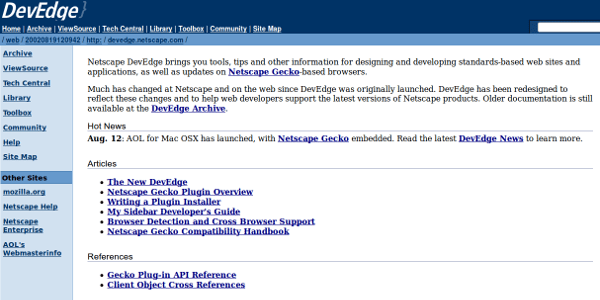
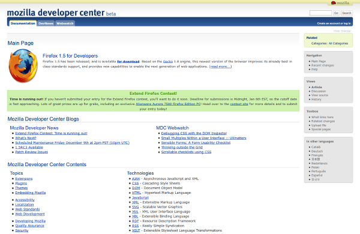
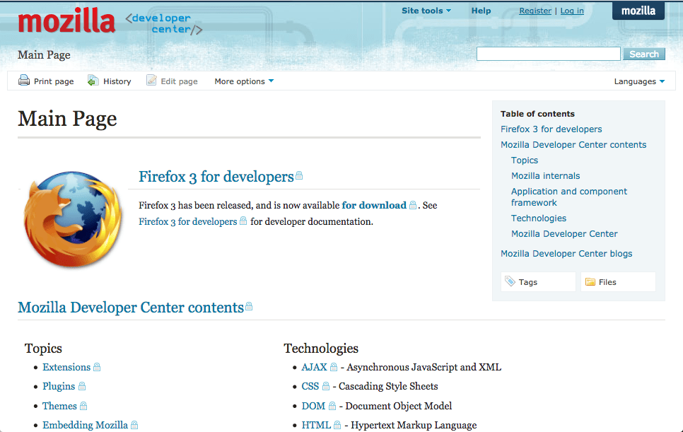
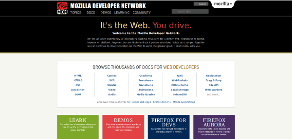
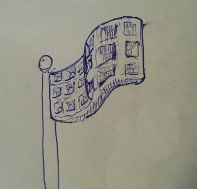
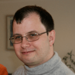
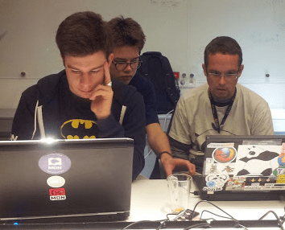

{{MDNSidebar}}

In this talk from 2015, several contributors of the MDN project look at the past ten years of [developer.mozilla.org](/), and at the decade to come. You will hear the story of different wiki software migrations, how a documentation community was built, and many more highlights of the history of the site. The group then also talks about current challenges and projects the MDN community is working on this year.

<pre class="brush: html hidden">&#x3C;audio controls="controls">
  Looks like your browser doesn't have a built-in audio player. Grab the file and play it yourself from here: https://videos.cdn.mozilla.net/uploads/mdn/MDN10/MDN_RoundTable.mp3
  &#x3C;source src="https://videos.cdn.mozilla.net/uploads/mdn/MDN10/MDN_RoundTable.mp3" type="audio/mp3">
&#x3C;/audio>
</pre><pre class="brush: css hidden">body{margin-top:8px;}
</pre>

{{ EmbedLiveSample('audio', '100%', '70px') }}

The [2015 Berlin "Hack on MDN"](https://blog.mozilla.org/community/2015/04/17/a-highly-productive-hack-on-mdn-weekend-in-berlin/), where this talk was recorded.

## Topics

Here's an overview of what was discussed, with timestamps and some additional details:

### What is MDN and who is it for? A place for the Open Web community

Time: _0:00:00 - 0:07:15_

MDN provides useful information for Web technologies, and encourages learning, sharing, and teaching in the open Web community. On MDN, you come together and make things for yourself and for others.

MDN is also a place for Mozilla engineers, such as Gecko or Firefox hackers, add-on developers, and Firefox OS contributors.

### The history of MDN: Pre-wiki era – Netscape DevEdge

Time: _0:07:15 - 0:08:17_

In the early days there was _DevEdge_, the developer documentation from Netscape which formed the basis of some of MDN's documentation. Have a look at the past on [archive.org](https://web.archive.org/web/20020819120942/http://devedge.netscape.com/):

On October 12, 2004, this popular developer website was shut down by AOL, Netscape's parent company. Only a few months later, in February 2005, [Mitchell Baker](https://blog.lizardwrangler.com/) was able [to rescue DevEdge](https://blog.lizardwrangler.com/2005/02/23/devmo-and-devedge-updates/) and reached an agreement with AOL that allowed Mozilla to post, modify, and create new documents based on the former Netscape DevEdge materials. In other words, what happened to the Mozilla source in 1998 finally happened for Netscape's developer documentation as well: **It became open source**.

Deb Richardson joined the Mozilla Foundation as a Technical Editor and lead the new _DevMo_ project for community driven developer documentation.

### MediaWiki The first wiki engine

Time: _0:08:17 - 0:14:55_

With MediaWiki as the new underlying project platform, the Mozilla developer documentation has been made editable for anyone starting in July 2005. A new collaborative element in Mozilla was established and since then anyone is welcome to help making it better and to share knowledge. A new international community began to grow and to translate developer contents into other languages.

### DekiWiki The second wiki engine

Time: _0:14:55 - 0:26:08_

In August 2008, the Mozilla Developer Center switched to [MindTouch DekiWiki](https://sourceforge.net/projects/dekiwiki/), a powerful and new content management system and wiki system for technical documentation. This platform change was quite controversial in the community that was used to MediaWiki from 2005 on and built tools around it. During this phase, we started Doc Sprints to re-engage with the community.

### Kuma The third and current wiki engine

Time: _0:26:08 - 0:31:50_ and _0:43:52 - 0:51:35_

[Kuma](https://github.com/mdn/kuma), forked from [Kitsune](https://github.com/mozilla/kitsune) in early 2011 and launched on August 3, 2012, is a Mozilla-built wiki platform based on Django with its own [KumaScript](https://github.com/mdn/yari/tree/main/docs/kumascript) macro system which uses Node.js.

With the code living on GitHub, the community started to contribute to MDN's CMS as well. From now on, hacking on MDN includes both writing documentation and Kuma coding.

### Redesigning MDN Kuma with the refreshed design

Time: _0:31:50 - 0:32:22_ and _0:51:35 - 0:58:05_

The redesign of MDN was a big project. [Sean Martell](https://twitter.com/mart3ll) designed the new MDN visual identity. It was then an iterative process with a beta user group of 3000 MDNers during several months. The new look was behind a "Waffle flag" (MDN's feature flag system). Major shout-outs also to [David Walsh](https://twitter.com/davidwalshblog/) who was really championing the entire redesign and gave MDN the front-end that it deserves.

### Community around Open Web docs Community-driven, browser-agnostic Open Web documentation

Time: _0:32:22 - 0:36:55_

At some point in 2010, especially when [community members and Technical Writers met in Paris](https://hacks.mozilla.org/2010/10/web-standards-doc-sprint-finis/), it became more obvious that MDN's focus is clearly shifting from "Let's document all things Firefox!" to "Let's document the Web!". Documentation has been cleaned up and restructured over the last few years, so that MDN's open Web documentation is browser-agnostic. This material, useful for anyone developing for the Web, is our most popular and most widely used content.

Different browser vendors have joined every once in a while to help shape this part of MDN. This cross-browser collaboration has been very successful and is appreciated by MDN's readers.

### Localization communities MDN serves a global audience in many languages

Time: _0:36:55 - 0:43:52_

Localization is a big part of the Mozilla community; it is a component of almost every project and product. Using Kuma, MDN is also very localizable and suited for the needs of [our l10n community](/en-US/docs/MDN/Community/Contributing/Translated_content). The W3C specifications and other resources describing the Web's functionality have no direct goals, and have communities that provide specs in multiple languages. Especially for beginners, MDN is the first step to explore web technologies, so it's our aim to be there for everyone. MDN has a broad audience and aims to include not only native English speakers. It is appreciated all around the globe.

### Learning Area

Time: _0:58:05 - 1:02:46_

The MDN [Learning Area](/en-US/docs/Learn) is a new effort to teach basic web skills. Over the last 10 years, MDN added a lot of advanced material, serving experts with valuable information. This project is focused on materials for beginners, and tries to fill in a lot of knowledge gaps.

### The future of MDN What will be different when we celebrate 20 years of MDN?

Time: _1:02:46 - 1:11:39_

Everyone involved with MDN really cares about the web being open and accessible, and that's why we have the localization teams and all of the people contributing. MDN hopes to continue to be a key player in keeping the Web the way we feel it should be.

One big part of this future is going to be learning resources. There will be a lot more Web developers over the next ten years.

Another big part of our job is maintaining and updating the information we already have, so we can always serve relevant content to Web developers.

What is changing and will likely change more in the future, is how information is consumed. Today people searching for information and looking up documentation. In the future, MDN documentation might be delivered directly in code editors, Firefox Developer Tools, and many other developer tools and services.

## Speakers

These are the people who are sharing their memories and thoughts, in the order they appear:

### Justin Crawford Product Manager, MDN

Justin moderates this talk and makes things with code, words, bike parts, and lumber. He is [@hoosteeno](https://twitter.com/hoosteeno) on Twitter.

### Eric "Sheppy" Shepherd Technical Writer, MDN

Sheppy has been here documenting for Mozilla since 2006, and has a lot of history (and crazy ideas) when it comes to MDC and MDN over the years. He is [@sheppy](https://twitter.com/sheppy) on Twitter.

### Jérémie Patonnier Technical Writer, MDN

Jérémie is a long time contributor to the Mozilla Developer Network, and a professional web developer since 2000. He's advocating web standards and write documentation about web technologies with the will to make them accessible to everybody. He is [@JeremiePat](https://twitter.com/JeremiePat) on Twitter.

### Janet Swisher Community Manager, MDN

Janet is a Mozilla Community Manager for Mozilla Developer Network. She joined Mozilla in 2010, and has been involved in open source software since 2004 and in technical communication since the 20th century. She is [@jmswisher](https://twitter.com/jmswisher) on Twitter.

### Stormy Peters

Stormy is [@storming](https://twitter.com/storming) on Twitter.

### Ali Spivak Herder of awesome MDN cats

Ali Spivak manages content & community on the Mozilla Developer Network and spends her time thinking of ways to help make the Web even more awesome. She is passionate about maintaining a free and open Web, and, after jumping into open source when she joined Mozilla in 2012, has focused on building and participating in the developer communities at Mozilla. She is [@alispivak](https://twitter.com/alispivak) on Twitter.

### Jean-Yves Perrier Technical Writer, MDN

Jean-Yves has been a Technical Writer on MDN since 2010 and joined Mozilla full-time at the end of 2011. He is passionate about the open Web, with 15 years of C++ experience. He is Swiss but lives in London, UK. His Erdös number is 5 and he is [@Teoli2003](https://twitter.com/Teoli2003) on Twitter.

### Florian Scholz Technical Writer, MDN

Florian is a Technical Writer at Mozilla focused on open web technologies. He is a wiki gnome, gardening the documentation as if it were flowers, and he likes to work with the community toward the goal of documenting the Web and making it accessible to everyone. Florian is passionate about open source, he is based in Bremen, Germany, and tweets as [@floscholz](https://twitter.com/floscholz) on Twitter.

### David Walsh Web developer, MDN

Mozilla Sr. Web Developer, Front-End Engineer, MooTools Core Developer, JavaScript Fanatic, CSS Tinkerer, PHP Hacker, web and open source lover. David is [@davidwalshblog](https://twitter.com/davidwalshblog) on Twitter.

### Luke Crouch Web developer, MDN

Luke Crouch is a home-brewer, soccer fan and web developer for Mozilla. He's been developing on the web since 1996, using Firefox since 2004, writing open source software since 2006, and joined Mozilla as the first staff MDN web dev in 2010. Luke is [@groovecoder](https://twitter.com/groovecoder) on Twitter.

### Julien (a.k.a. Sphinx) French localization, MDN

Julien spent many nights and weekends over several month, translating JavaScript articles into French. He is not a developer, but has a background in IT and wants to learn more about new technologies. He contributes to MDN instead of watching TV.

### Biraj Karmakar Mozilla Reps Mentor

Biraj is an Open Source Contributor, interested in the FOSS movement and Localizations.

## Our awesome contributors

Many more people have done amazing work on MDN:

- Les Orchard
- John Karahalis
- David Walsh
- Jannis Leidel
- Stephanie Hobson
- James Bennett
- Isac Lagerblad
- Piotrek Koszuliński
- Craig Cook
- Rob Hudson
- John Whitlock
- …
  And many more [Kuma contributors.](https://github.com/mdn/kuma/graphs/contributors)

<!---->

- Chris Mills
- Will Bamberg
- David Bruant
- Thierry Régagnon
- ethertank
- Saurabh Nair
- Deb Richardson
- Sebastian Zartner
- Tooru Fujisawa
- Karen Scarfone
- Niklas Barning
- …
  And hundreds more wiki collaborators.
