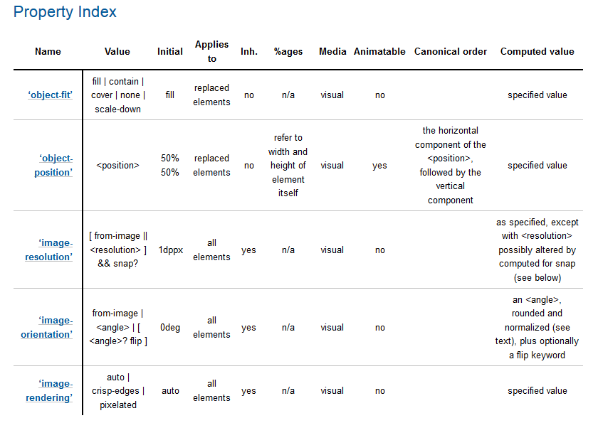
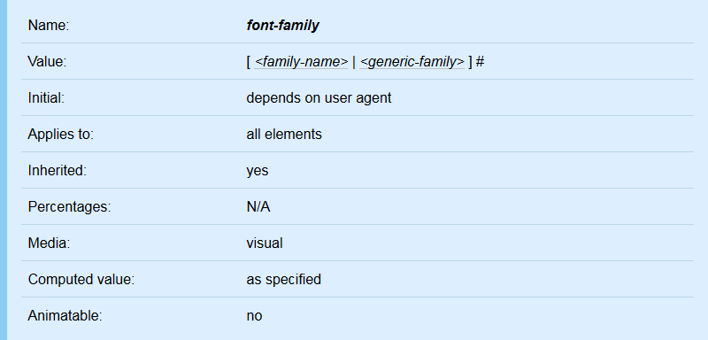

{{MDNSidebar}}

Several characteristics of a CSS property, like its syntax or if it can be animated, are mentioned in multiple pages on MDN and are therefore stored in an ad-hoc "database". This database actually consists of several JSON files containing CSS related information, which are [stored on GitHub](https://github.com/mdn/data/tree/main/css). This article describes how to update this structure.

## Prerequisite resources

To update or check the content of the CSS JSON DB, you will need to gather information from different sources.

1. **Latest spec**
    Whether it is a W3C Recommendation or an early editor's draft, you should refer to the latest available draft of the spec that covers (or specifies that cover) that feature. To find it, you can usually do a web search. The latest version will often be linked to from all versions of the spec, listed under "latest draft" or similar.
2. **Latest web browsers**
    These should be experimental/alpha builds such as [Firefox Nightly](https://www.mozilla.org/en-US/firefox/channel/desktop/)/[Chrome Canary](https://www.google.com/intl/en/chrome/canary/) that are more likely to support the features you are documenting. This is especially pertinent if you are documenting a nascent/experimental feature.
3. **Additional info**
    Find as much info as you can to better understand how the specific feature works. E.g. blog posts or demos are good resources.
4. **Engineering contacts**
    It is really useful to find yourself a friendly engineering contact to ask questions about the spec, someone who is involved in the standardization of the API, or its implementation in a browser. If you have the implementation bug on Bugzilla, the engineer who implemented the feature is a good contact: asking him in the bug, with a needinfo flag is a good way of having an answer about a specific question. Other good places to find knowledgeable people are:

    - Your internal company address book, if you work for a relevant company.
    - A public mailing list that is involved in the discussion of that API, such as Mozilla's [dev-platform](https://groups.google.com/a/mozilla.org/g/dev-platform/) list, or the W3C list [www-style](https://lists.w3.org/Archives/Public/www-style/).
    - The spec itself. For example, the [CSS Animations spec](https://drafts.csswg.org/css-animations/) lists the authors and their contact details at the top.

## Update the CSS information database

The information stored for a CSS property is:

- Name
- Syntax
- Initial value
- To which elements it applies
- Whether it is inherited
- How percentage values are calculated
- Media it belongs to
- Computed value
- Animation type
- Canonical order of values
- Whether it is a shorthand for other properties
- MDN groups it belongs to

A fundamental element is that we document what is in the _specification_. That means the reference page is based on the latest iteration of that specification and later on there are compatibility notes stressing the differences between different specification versions and their different implementations by rendering engines.

### Get information from the specifications

Once you have found the relevant specification, the first thing to do is to look for a property definition in the specification. Look for the summary table (near the bottom), it has most of the values that you are looking for:



In some specifications, especially in older drafts, there isn't such a property index table. In this case you need to look for the property box of the property itself which looks like this:



Note that in some cases the property index table might be more briefly and with less details than the property box.

### Store the information in the JSONs

The information from the specifications is stored in a specific way in the JSON DB. CSS properties are stored within [properties.json](https://github.com/mdn/data/blob/main/css/properties.json). All the JSON keys below are obligatory.

Translated information is stored as key string mapping to a translation in [l10n/css.json](https://github.com/mdn/data/blob/main/l10n/css.json) with language + country codes (according to [ISO 639-1](https://en.wikipedia.org/wiki/List_of_ISO_639-1_codes) and [ISO 3166-1 alpha-2](https://en.wikipedia.org/wiki/ISO_3166-1_alpha-2)) as keys.

You can use the macros [\\{{cssxref}}](https://github.com/mdn/yari/blob/main/kumascript/macros/cssxref.ejs) and [\\{{SVGElement}}](https://github.com/mdn/yari/blob/main/kumascript/macros/SVGElement.ejs) within translations to refer to other parts of MDN.

<table class="standard-table">
  <tbody>
    <tr>
      <th>Spec. name</th>
      <th>JSON key name</th>
      <th>Comment</th>
      <th>Examples</th>
    </tr>
    <tr>
      <td>Value</td>
      <td><code>syntax</code></td>
      <td>As specified within the specification</td>
      <td><pre class="brush:js">"syntax": "visible | hidden"</pre></td>
    </tr>
    <tr>
      <td>Media</td>
      <td><code>media</code></td>
      <td>Either a predefined localization key, a block of localizations</td>
      <td>
        <p>properties.json</p>
        <pre class="brush:js">"media": "visual"</pre>
        <p>l10n/css.json</p>
        <pre class="brush:js">
"visual": {
  "en-US": "visual",
  "de": "visuell",
  "fr": "visuel",
  "ru": "визуальный"
}</pre
        >
      </td>
    </tr>
    <tr>
      <td>Inherited</td>
      <td><code>inherited</code></td>
      <td>Boolean value</td>
      <td><pre class="brush:js">"inherited": true</pre></td>
    </tr>
    <tr>
      <td>Animation type</td>
      <td><code>animatable</code></td>
      <td>
        Either a predefined localization key, a block of localizations, in case
        of a shorthand an array of longhands, or a block with the property
        <code>"as"</code> and an optional <code>"note"</code> property.<br />The
        <code>"as"</code> property holds a space-separated list of translation
        keys for values related to
        <a href="https://drafts.csswg.org/css-transitions/#interpolated-types"
          >interpolation</a
        >.
      </td>
      <td>
        <p>properties.json</p>
        <pre class="brush:js">"animationType": "discrete"</pre>
        <pre class="brush:js">
"animationType": [
  "border-color",
  "border-style",
  "border-width"
]</pre
        >
        <p>l10n/css.json</p>
        <pre class="brush:js">
"discrete": {
  "en-US": "discrete",
  "de": "diskret",
  "fr": "discrète"
}</pre
        >
      </td>
    </tr>
    <tr>
      <td>Percentages</td>
      <td><code>percentages</code></td>
      <td>
        Either a predefined localization key, a block of localizations, or in
        case of a shorthand an array of longhands
      </td>
      <td>
        <p>properties.json</p>
        <pre class="brush:js">
"percentages": "logicalWidthOfContainingBlock"</pre
        >
        <pre class="brush:js">
"percentages": [
  "background-position",
  "background-size"
]</pre
        >
        <p>l10n/css.json</p>
        <pre class="brush:js">
"logicalWidthOfContainingBlock": {
  "en-US": "logical-width of containing block",
  "de": "logische Breite des beinhaltenden Blocks",
  "fr": "largeur logique du bloc englobant",
  "ru": "логическая высота содержащего блока"
}</pre
        >
      </td>
    </tr>
    <tr>
      <td>-</td>
      <td><code>groups</code></td>
      <td>Array of tags to group the information on MDN.</td>
      <td>
        <pre class="brush: js">
"groups": [
  "CSS Flexible Box Layout"
]</pre
        >
      </td>
    </tr>
    <tr>
      <td>Initial</td>
      <td><code>initial</code></td>
      <td>
        If the value is CSS code, it must be enclosed in a
        <code>&#x3C;code></code> tag.
      </td>
      <td>
        <pre class="brush:js">"initial": "&#x3C;code>none&#x3C;\/code>"</pre>
      </td>
    </tr>
    <tr>
      <td>Applies to</td>
      <td><code>appliesto</code></td>
      <td>
        Either a predefined localization key, a block of localizations, or in
        case of a shorthand an array of longhands
      </td>
      <td>
        <p>properties.json</p>
        <pre class="brush:js">"appliesto": "absolutelyPositionedElements"</pre>
        <pre class="brush:js">
"appliesto": [
  "border-image-outset",
  "border-image-repeat",
  "border-image-slice",
  "border-image-source",
  "border-image-width"
]</pre
        >
        <p>l10n/css.json</p>
        <pre class="brush:js">
"absolutelyPositionedElements": {
  "en-US": "absolutely positioned elements",
  "de": "absolut positionierte Elemente",
  "fr": "éléments positionnés de manière absolue",
  "ja": "絶対位置指定された要素",
  "ru": "абсолютно позиционированные элементы"
}</pre
        >
      </td>
    </tr>
    <tr>
      <td>Computed value</td>
      <td><code>computed</code></td>
      <td>
        Either a predefined localization key, a block of localizations, or in
        case of a shorthand an array of longhands
      </td>
      <td>
        <p>properties.json</p>
        <pre class="brush:js">"computed": "normalizedAngle"</pre>
        <pre class="brush:js">
"computed": [
    "border-width",
    "border-style",
    "color"
]</pre
        >
        <p>l10n/css.json</p>
        <pre class="brush:js">
"normalizedAngle": {
  "en-US": "normalized angle",
  "de": "normalisierter Winkel",
  "fr": "angle normalisé",
  "ru": "нормализованный угол"
}</pre
        >
      </td>
    </tr>
    <tr>
      <td>Canonical order</td>
      <td><code>order</code></td>
      <td>Either a predefined localization key or a block of localizations</td>
      <td>
        <p>properties.json</p>
        <pre class="brush: js">"order": "uniqueOrder"</pre>
        <p>l10n/css.json</p>
        <pre class="brush: js">
"uniqueOrder": {
  "en-US": "the unique non-ambiguous order defined by the formal grammar",
  "de": "die eindeutige Reihenfolge definiert durch die formale Grammatik",
  "fr": "l'ordre unique et non-ambigu défini par la grammaire formelle",
  "ja": "形式文法で定義される一意のあいまいでない順序",
  "es": "el orden único no-ambigüo definido por la gramática formal",
  "ru": "уникальный неоднозначный порядок, определённый формальной грамматикой"
}</pre
        >
      </td>
    </tr>
  </tbody>
</table>

It may happen that the syntax contains references to specific values. Such values normally define their own syntaxes. Those syntaxes should be stored [syntaxes.json](https://github.com/mdn/data/blob/main/css/syntaxes.json) with their name as key. E.g. the {{cssxref("font-family")}} property has a syntax of `[ <family-name> | <generic-family> ]#`. The syntaxes for the values `<family-name>` and `<generic-family>` are stored like this:

```json
{
  "syntaxes": {
    "family-name": "<string> | <custom-ident>+",
    "generic-family": "serif | sans-serif | cursive | fantasy | monospace"
  }
}
```

## Example for a CSS longhand property

```json
{
  "backface-visibility": {
    "syntax": "visible | hidden",
    "media": "visual",
    "inherited": false,
    "animatable": "no",
    "percentages": "no",
    "groups": [
      "CSS Transforms"
    ],
    "initial": "<code>visible<\/code>",
    "appliesto": "transformableElements",
    "computed": "asSpecified",
    "order": "uniqueOrder"
  }
}
```

## Example for a CSS shorthand property

For shorthand properties, several entries are a list of the longhand properties associated to it.

```json
{
  "animation": {
    "syntax": "&lt;single-animation-name&gt; || &lt;time&gt; || &lt;timing-function&gt; || &lt;time&gt; || &lt;single-animation-iteration-count&gt; || &lt;single-animation-direction&gt; || &lt;single-animation-fill-mode&gt; || &lt;single-animation-play-state&gt;",
    "media": "visual",
    "inherited": false,
    "animatable": "no",
    "percentages": "no",
    "groups": [
      "CSS Animations"
    ],
    "initial": [
      "animation-name",
      "animation-duration",
      "animation-timing-function",
      "animation-delay",
      "animation-iteration-count",
      "animation-direction",
      "animation-fill-mode",
      "animation-play-state"
    ],
    "appliesto": "allElementsAndPseudos",
    "computed": [
      "animation-name",
      "animation-duration",
      "animation-timing-function",
      "animation-delay",
      "animation-direction",
      "animation-iteration-count",
      "animation-fill-mode",
      "animation-play-state"
      ],
    "order": "orderOfAppearance"
  }
}
```
