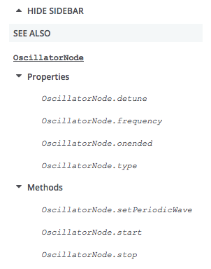

{{MDNSidebar}}

This guide takes you through all you need to know to write an API reference on MDN.

## Getting prepared

Before starting to document an API, there are some things you should prepare and plan in advance of starting to actually write.

### Prerequisite knowledge

It is assumed that before reading this guide you have a reasonable knowledge of:

- Web technologies like HTML, CSS and JavaScript. JavaScript is most important.
- Reading Web technology specs. You'll be looking at these a lot as you document APIs.

Everything else can be learned along the way.

### Prerequisite resources

Before starting to document an API, you should have available:

1. The latest spec:
   Whether it is a W3C Recommendation or an early editor's draft, you should refer to the latest available draft of the spec that covers (or specs that cover) that API.
   To find it, you can usually do a Web search. The latest version will often be linked to from all versions of the spec, listed under "latest draft" or similar.
2. The latest modern web browsers:
   These should be experimental/alpha builds such as [Firefox Nightly](https://www.mozilla.org/en-US/firefox/channel/desktop/)/[Chrome Canary](https://www.google.com/intl/en/chrome/canary/) that are more likely to support the features you are documenting.
   This is especially pertinent if you are documenting a nascent/experimental API.
3. Demos/blog posts/other info: Find as much info as you can.
4. Useful engineering contacts:
   It is really useful to find yourself a friendly engineering contact to ask questions about the spec, someone who is involved in the standardization of the API, or its implementation in a browser.
   Good places to find them are:

   - Your internal company address book, if you work for a relevant company.
   - A public mailing list that is involved in the discussion of that API, such as Mozilla's [dev-platform](https://groups.google.com/a/mozilla.org/g/dev-platform/) or a W3C list like [public-webapps](https://lists.w3.org/Archives/Public/public-webapps/).
   - The spec itself. For example, the [Web Audio API spec](https://webaudio.github.io/web-audio-api/) lists the authors and their contact details at the top.

### Take some time to play with the API

You will return to build demos many times through the course of documenting an API, but it is useful to start by spending time familiarizing yourself with how the API works — learn what the main interfaces/properties/methods are, what the primary use cases are, and how to write simple functionality with it.

When an API has changed, you need to be careful that existing demos you refer to or learn from are not out of date. Check the main constructs that are used in the demo to see if they match up to the latest spec. They may also not work in up-to-date browsers, but this is not a very reliable test, as often the old features continue to be supported for backwards compatibility.

> [!NOTE]
> If the spec has been recently updated so that, say, a method is now defined differently, but the old method still works in browsers, you will often have to document both in the same place, so that the old and new methods are covered.
> If you need help, refer to demos you have found, or ask an engineering contact.

### Create the list of documents you need to write or update

An API reference will generally contain the following pages.
You can find more details of what each page contains, examples, and templates, in our [Page types](/en-US/docs/MDN/Writing_guidelines/Page_structures/Page_types) article.
Before you start you should write down a list of all the pages you should create.

1. Overview page
2. Interface pages
3. Constructor pages
4. Method pages
5. Property pages
6. Event pages
7. Concept/guide pages
8. Examples

> [!NOTE]
> We'll be referring to the [Web Audio API](/en-US/docs/Web/API/Web_Audio_API) for examples in this article.

#### Overview pages

A single API overview page is used to describe the role of the API, its top-level interfaces, related features contained in other interfaces, and other high-level details.
Its name and slug should be the name of the API plus "API" on the end. It is placed at the top level of the API reference, as a child of [https://developer.mozilla.org/en-US/docs/Web/API](/en-US/docs/Web/API).

Example:

- Title: _Web Audio API_
- Slug: _Web_Audio_API_
- URL: [https://developer.mozilla.org/en-US/docs/Web/API/Web_Audio_API](/en-US/docs/Web/API/Web_Audio_API)

#### Interface pages

Each interface will have its own page too, describing the purpose of the interface, listing any members (constructors, methods, properties, etc. it contains), and showing what browsers it is compatible with.
A page's name and slug should be the name of the interface, exactly as written in the spec.
Each page is placed at the top level of the API reference, as a child of [https://developer.mozilla.org/en-US/docs/Web/API](/en-US/docs/Web/API).

Examples:

- Title: _AudioContext_
- Slug: _AudioContext_
- URL: [https://developer.mozilla.org/en-US/docs/Web/API/AudioContext](/en-US/docs/Web/API/AudioContext)

<!---->

- Title: _AudioNode_
- Slug: _AudioNode_
- URL: [https://developer.mozilla.org/en-US/docs/Web/API/AudioNode](/en-US/docs/Web/API/AudioNode)

> [!NOTE]
> We document every member appearing in the interface. You should bear the following rules in mind:

- We document methods defined on the prototype of an object implementing this interface (instance methods), and methods defined on the actual class itself (static methods).
  On the rare occasions that they both exist on the same interface, you should list them in separate sections on the page (Static methods/Instance methods).
  Usually only instance methods exist, in which case you can put these under the title "Methods".
- We do not document inherited properties and methods of the interface: they are listed on the respective parent interface. We do hint at their existence though.
- We do document properties and methods defined in mixins. Please see the [contribution guide for mixins](/en-US/docs/MDN/Writing_guidelines/Howto/Write_an_api_reference/Information_contained_in_a_WebIDL_file#mixins) for more details.
- Special methods like the stringifier (`toString()`) and the jsonifier (`toJSON()`) are also listed if they do exist.
- Named constructors (like `Image()` for {{domxref("HTMLImageElement")}}) are also listed, if relevant.

#### Constructor pages

Each interface has zero or one constructors, documented on a subpage of the interface's page. It describes the purpose of the constructor and shows what its syntax looks like, usage examples, browser compatibility information, etc. Its slug is the name of the constructor, which is exactly the same as the interface name, and the title is interface name, dot, constructor name, then parentheses on the end.

Example:

- Title: _AudioContext.AudioContext()_
- Slug: _AudioContext_
- URL: [https://developer.mozilla.org/en-US/docs/Web/API/AudioContext/AudioContext](/en-US/docs/Web/API/AudioContext/AudioContext)

#### Property pages

Each interface has zero or more properties, documented on subpages of the interface's page. Each page describes the purpose of the property and shows what its syntax looks like, usage examples, browser compatibility information, etc. Its slug is the name of the property, and the title is interface name, dot, then property name.

Examples:

- Title: _AudioContext.state_
- Slug: _state_
- URL: [https://developer.mozilla.org/en-US/docs/Web/API/AudioContext/state](/en-US/docs/Web/API/BaseAudioContext/state)

<!---->

#### Method pages

Each interface has zero or more methods, documented on subpages of the interface's page. Each page describes the purpose of the method and shows what its syntax looks like, usage examples, browser compatibility information, etc. Its slug is the name of the method, and the title is interface name, dot, method name, then parentheses.

Examples:

- Title: _AudioContext.close()_
- Slug: _close_
- URL: [https://developer.mozilla.org/en-US/docs/Web/API/AudioContext/close](/en-US/docs/Web/API/AudioContext/close)

<!---->

- Title: _AudioContext.createGain()_
- Slug: _createGain_
- URL: [https://developer.mozilla.org/en-US/docs/Web/API/AudioContext/createGain](/en-US/docs/Web/API/BaseAudioContext/createGain)

#### Event pages

Document events as subpages of their target interfaces and use the slug _eventname_\_event with the title set to `Interface: eventName event`.

Don't create pages for `on` event handler properties. Mention both ways to access the event on the `eventName_event` page.

Example:

- Title: XRSession: end event
- Slug: end_event
- URL: [https://developer.mozilla.org/en-US/docs/Web/XRSession/end_event](/en-US/docs/Web/API/XRSession/end_event)

#### Concept/guide pages

Most API references have at least one guide and sometimes also a concept page to accompany it. At minimum, an API reference should contain a guide called "Using the _name-of-api_", which will provide a basic guide to how to use the API. More complex APIs may require multiple usage guides to explain how to use different aspects of the API.

If required, you can also include a concepts article called "_name-of-api_ concepts", which will provide explanation of the theory behind any concepts related to the API that developers should understand to effectively use it.

These articles should all be created as subpages of the API overview page. For example, the Web Audio has four guides and a concept article:

- [https://developer.mozilla.org/en-US/docs/Web/API/Web_Audio_API/Using_Web_Audio_API](/en-US/docs/Web/API/Web_Audio_API/Using_Web_Audio_API)
- [https://developer.mozilla.org/en-US/docs/Web/API/Web_Audio_API/Visualizations_with_Web_Audio_API](/en-US/docs/Web/API/Web_Audio_API/Visualizations_with_Web_Audio_API)
- [https://developer.mozilla.org/en-US/docs/Web/API/Web_Audio_API/Web_audio_spatialization_basics](/en-US/docs/Web/API/Web_Audio_API/Web_audio_spatialization_basics)
- [https://developer.mozilla.org/en-US/docs/Web/API/Web_Audio_API/Basic_concepts_behind_Web_Audio_API](/en-US/docs/Web/API/Web_Audio_API/Basic_concepts_behind_Web_Audio_API)

#### Examples

You should create some examples that demonstrate at least the most common use cases of the API. You can put these anywhere that is appropriate, although the recommended place is the [MDN GitHub repo](https://github.com/mdn/).

#### Listing them all

Creating a list of all these subpages is a good way to track them. For example:

- Web_Audio_API
- AudioContext

  - AudioContext.currentTime
  - AudioContext.destination
  - AudioContext.listener
  - …
  - AudioContext.createBuffer()
  - AudioContext.createBufferSource()
  - …

- AudioNode

  - AudioNode.context
  - AudioNode.numberOfInputs
  - AudioNode.numberOfOutputs
  - …
  - AudioNode.connect(Param)
  - …

- AudioParam
- Events (update list)

  - start
  - end
  - …

Each interface in the list has a separate page created for it as a subpage of `https://developer.mozilla.org/en-US/docs/Web/API`; for example, the document for {{domxref("AudioContext")}} would be located at `https://developer.mozilla.org/en-US/docs/Web/API/AudioContext`. Each [interface page](#interface_pages) explains what that interface does and provides a list of the methods and properties that comprise the interface. Then each method and property is documented on its own page, which is created as a subpage of the interface it's a member of. For instance, {{domxref("BaseAudioContext/currentTime")}} is documented at `https://developer.mozilla.org/en-US/docs/Web/API/AudioContext/currentTime`.

## Create the pages

Now create the pages you need, according to the structures below. Our [MDN content README](https://github.com/mdn/content#adding-a-new-document) contains instructions on creating a new document, and our [Page types](/en-US/docs/MDN/Writing_guidelines/Page_structures/Page_types) guide contains further examples and page templates that might be useful.

### Structure of an overview page

API landing pages will differ greatly in length, depending on how big the API is, but they will all have basically the same features. See [https://developer.mozilla.org/en-US/docs/Web/API/Web_Audio_API](/en-US/docs/Web/API/Web_Audio_API) for an example of a big landing page.

The features of a landing page are outlined below:

1. **Description**: the first paragraph of the landing page should provide a short, concise description of the API's overarching purpose.
2. **Concepts and usage section**: The next section should be titled "\[name of API] concepts and usage", and provide an overview of all the main functionality that the API provides, what problems it solves, and how it works — all at a high level. This section should be fairly short, and not go into code or specific implementation details.
3. **List of interfaces**: This section should be titled "\[name of API] interfaces", and provide links to the reference page for each interface that makes up the API, along with a short description of what each one does. See the "Referencing other API features with the \\{{domxref}} macro" section for a quicker way to create new pages.
4. **Examples**: This section should show a use case or two for the API.
5. **Specifications table**: At this point you need to include a specifications table — see the "Creating a spec reference table" section for more details.
6. **Browser compatibility**: Now you need to include a browser compatibility table. See [Compatibility tables](/en-US/docs/MDN/Writing_guidelines/Page_structures/Compatibility_tables) for details.
7. **See also**: The "See also" section is a good place to include further links that may be useful when learning about this technology, including MDN (and external) tutorials, examples, libraries, etc.

### Structure of an interface page

Now you should be ready to start writing your interface pages. Each interface reference page should observe the following structure:

1. **\\{{APIRef}}**: Include the \\{{APIRef}} macro in the first line of each interface page, including the name of the API as an argument, so for example \\{{APIRef("Web Audio API")}}. This macro serves to construct a reference menu on the left-hand side of the interface page, including properties and methods, and other quick links as defined in the [GroupData](https://github.com/mdn/content/blob/main/files/jsondata/GroupData.json) macro (ask someone to add your API to an existing GroupData entry, or to create a new one, if it isn't already listed there). The menu will look something like the below screenshot.
   
2. **Feature status**: A [banner indicating the feature status](/en-US/docs/MDN/Writing_guidelines/Page_structures/Feature_status#feature_status_page_banners) (such as deprecated, non standard, or experimental) is added automatically, if needed. For that you need to [update the status in the browser-compat-data repository](/en-US/docs/MDN/Writing_guidelines/Page_structures/Feature_status#how_to_add_or_update_feature_statuses).
3. **Description**: the first paragraph of the interface page should provide a short concise description of the interface's overarching purpose. You may also want to include a couple more paragraphs if any additional description is required. If the interface is actually a dictionary, you should use that term instead of "interface".
4. **Inheritance diagram:** Use the [`\{{InheritanceDiagram}}`](https://github.com/mdn/yari/blob/main/kumascript/macros/InheritanceDiagram.ejs) macro to embed an SVG inheritance diagram for the interface.
5. **List of properties, List of methods**: These sections should be titled "Properties" and "Methods", and provide links (using the \\{{domxref}} macro) to a reference page for each property/method of that interface, along with a description of what each one does. These should be marked up using [description/definition lists](/en-US/docs/MDN/Writing_guidelines/Howto/Markdown_in_MDN#definition_lists). Each description should be short and concise — one sentence if possible. See the "Referencing other API features with the \\{{domxref}} macro" section for a quicker way to create links to other pages.

   At the beginning of both sections, before the beginning of the list of properties/methods, indicate inheritance using the appropriate sentence, in italics:

   - _This interface doesn't implement any specific properties, but inherits properties from \\{{domxref("XYZ")}}, and \\{{domxref("XYZ2")}}._
   - _This interface also inherits properties from \\{{domxref("XYZ")}}, and \\{{domxref("XYZ2")}}._
   - _This interface doesn't implement any specific methods, but inherits methods from \\{{domxref("XYZ")}}, and \\{{domxref("XYZ2")}}._
   - _This interface also inherits methods from \\{{domxref("XYZ")}}, and \\{{domxref("XYZ2")}}._

   > [!NOTE]
   > Properties that are read-only should have the \\{{ReadOnlyInline}} macro, which creates a nifty little "Read only" badge, included on the same line as their \\{{domxref}} links (after the use of the \\{{experimentalInline}}, \\{{non-standard_Inline}} and \\{{deprecatedInline}} macros, if some of these are needed.

6. **Examples**: Include a code listing to show typical usage of a major feature of the API. Rather than listing ALL the code, you should list an interesting subset of it. For a complete code listing, you could reference a [GitHub](https://github.com/) repo containing the full example, and you could also link to a live example created using the [GitHub gh-pages](https://docs.github.com/en/pages/getting-started-with-github-pages/creating-a-github-pages-site) feature (so long as it uses only client-side code of course.) If the example is visual, you could also use the MDN [Live Sample](/en-US/docs/MDN/Writing_guidelines/Page_structures/Live_samples) feature to make it live and playable in the page.
7. **Specifications table**: At this point you need to include a specifications table — see the "Creating a spec reference table" section for more details.
8. **Browser compatibility**: Now you need to include a browser compatibility table. See [Compatibility tables](/en-US/docs/MDN/Writing_guidelines/Page_structures/Compatibility_tables) for details.
9. **Polyfill**: If appropriate, include this section, providing code for a polyfill that enables the API to be used even on browsers that don't implement it. If no polyfill exists or is needed, leave this section out entirely.
10. **See also**: The "See also" section is a good place to include further links that may be useful when learning about this technology, including MDN (and external) tutorials, examples, libraries, etc. We have a liberal policy for linking to external sources, but pay attention:

    - Do not include pages with the same information as another page in the MDN; link to that page instead.
    - Do not put author names — we are a writer-neutral documentation site. Link to the document; the author name will be displayed there.
    - Pay special attention to blog posts: they tend to become outdated (old syntax, wrong compat information). Link to them only if they have a clear added value that can't be found in a maintained document.
    - Do not use action verb like "See … for more information" or "Click to…", you don't know if your reader is able to see, or to click on the link (like on a paper version of the document).

#### Interface page examples

The following are exemplary examples of Interface pages:

- {{domxref("Request")}} from the [Fetch API](/en-US/docs/Web/API/Fetch_API).
- {{domxref("SpeechSynthesis")}} from the [Web Speech API](/en-US/docs/Web/API/Web_Speech_API).

### Structure of a property page

Create your property pages as subpages of the interface they are implemented on. Copy the structure of another property page to act as the basis for your new page.

Edit the property page name to follow the `Interface.property_name` convention.

Property pages must have the following sections:

1. **Title**: the title of the page must be **InterfaceName.propertyName**. The interface name must start with a capital letter. Although an interface is implemented in JavaScript on the prototype of objects, we don't include `.prototype.` in the title, like we do in the [JavaScript reference](/en-US/docs/Web/JavaScript/Reference).
2. **\\{{APIRef}}**: Include the \\{{APIRef}} macro in the first line of each property page, including the name of the API as an argument, so for example \\{{APIRef("Web Audio API")}}. This macro serves to construct a reference menu on the left-hand side of the interface page, including properties and methods, and other quick links as defined in the [GroupData](https://github.com/mdn/content/blob/main/files/jsondata/GroupData.json) macro (ask someone to add your API to an existing GroupData entry, or to create a new one, if it isn't already listed there). The menu will look something like the below screenshot.
   
3. **Feature status**: A [banner indicating the feature status](/en-US/docs/MDN/Writing_guidelines/Page_structures/Feature_status#feature_status_page_banners) (such as deprecated, non standard, or experimental) is added automatically, if needed. For that you need to [update the status in the browser-compat-data repository](/en-US/docs/MDN/Writing_guidelines/Page_structures/Feature_status#how_to_add_or_update_feature_statuses).

4. **Description**: the first paragraph of the property page should provide a short, concise description of the property's overarching purpose. You may also want to include a couple more paragraphs if any additional description is required. Obvious extra information to include is its default/initial value, and whether it's read-only or not. The structure of the first sentence must be:

   - For read-only properties
     - : The **`InterfaceName.property`** read-only property returns a \\{{domxref("type")}} that…
   - For other properties
     - : The **`InterfaceName.property`** property is a \\{{domxref("type")}} that…

   > **Note:** `InterfaceName.property` should be in `<code>`, and should additionally be in bold (`<strong>`) the first time it's used.

5. **Value**: The Value section will contain a description of the property's value. This should contain the data type of the property, and what it represents. For an example, see {{domxref("SpeechRecognition.grammars")}}

6. **Examples**: Include a code listing to show typical usage of the property in question. You should start with a simple example that shows how an object of the type is created and how to access the property. More complex examples can be added after such an example. In these additional examples, rather than listing ALL the code, you should list an interesting subset of it. For a complete code listing, you can reference a [GitHub](https://github.com/) repo containing the full example, and you could also link to a live example created using the [GitHub gh-pages feature](https://docs.github.com/en/pages/getting-started-with-github-pages/creating-a-github-pages-site) (so long as it uses only client-side code of course.) If the example is visual, you could also use the MDN [Live Sample](/en-US/docs/MDN/Writing_guidelines/Page_structures/Live_samples) feature to make it live and playable in the page.
7. **Specifications table**: At this point you need to include a specifications table — see the "Creating a spec reference table" section for more details.
8. **Browser compatibility**: Now you need to include a browser compatibility table. See [Compatibility tables](/en-US/docs/MDN/Writing_guidelines/Page_structures/Compatibility_tables) for details.
9. **See also**: The "See also" section is a good place to include further links that may be useful when using this technology: like methods and properties affected by a change of this property or events thrown in relation to it. More links useful when learning about this technology, including MDN (and external) tutorials, examples, libraries,… can be added, though it may be useful to consider adding them on the interface reference page instead.

#### Property page examples

The following are exemplary examples of property pages:

- {{domxref("Request.method")}} from the [Fetch API](/en-US/docs/Web/API/Fetch_API).
- {{domxref("SpeechSynthesis.speaking")}} from the [Web Speech API](/en-US/docs/Web/API/Web_Speech_API).

### Structure of a method page

Create your method pages as subpages of the interface they are implemented on. Copy the structure of another method page to act as the basis for your new page.

Method pages need the following sections:

1. **Title**: the title of the page must be **InterfaceName.method()** (with the two terminal parentheses), but the slug (the end of the page URL) must not include the parentheses. Also the interface name must start with a capital. Although an interface is implemented in JavaScript on the prototype of objects, we don't put `.prototype.` in the title, like we do in the [JavaScript reference](/en-US/docs/Web/JavaScript/Reference).
2. **\\{{APIRef}}**: Include the \\{{APIRef}} macro in the first line of each method page, including the name of the API as an argument, so for example \\{{APIRef("Web Audio API")}}. This macro serves to construct a reference menu on the left-hand side of the interface page, including properties and methods, and other quick links as defined in the [GroupData](https://github.com/mdn/content/blob/main/files/jsondata/GroupData.json) macro (ask someone to add your API to an existing GroupData entry, or to create a new one, if it isn't already listed there). The menu will look something like the below screenshot.
   
3. **Feature status**: A [banner indicating the feature status](/en-US/docs/MDN/Writing_guidelines/Page_structures/Feature_status#feature_status_page_banners) (such as deprecated, non standard, or experimental) is added automatically, if needed. For that you need to [update the status in the browser-compat-data repository](/en-US/docs/MDN/Writing_guidelines/Page_structures/Feature_status#how_to_add_or_update_feature_statuses).

4. **Description**: The first paragraph of the method page should provide a short concise description of the method's overarching purpose. You may also want to include a couple more paragraphs if any additional description is required. Obvious extra information to include is its default parameter values, any theory that the method relies on, and what the parameter values do.

   - The beginning of the first sentence must follow the following structure:
     - : The **`InterfaceName.method()`** method interface …

   > **Note:** `InterfaceName.method()` should be in `<code>`, and should also be in bold (`<strong>`) the first time it's used.

5. **Syntax**: The syntax section should include a 2–3 line example — usually just construction of the interface, then calling of the interface method.

   - The syntax should be of the form:
     - : method(param1, param2, …)

   The syntax section should include three subsections (see {{domxref("SubtleCrypto.sign()")}} for an example):

   - "Parameters": This should contain a definition list (or unordered list) that names and describes the different parameters the method takes. You should include the {{optional_inline}} macro next to the parameter name, in the case of optional parameters. If there are no parameters, this section should be omitted.
   - "Return value": This should say what return value the method has, be it a simple value like a double or boolean, or a more complex value like another interface object, in which case you can use \\{{domxref}} macro to link to the MDN API page covering that interface (if it exists.) A method might return nothing, in which case the return value should be written as "\\{{jsxref('undefined')}}" (which will look like this in the rendered page: {{jsxref("undefined")}}).
   - "Exceptions": This should list the different exceptions that can be raised when invoking the method, and what circumstances cause them. If there are no exceptions, this section should be omitted.

6. **Examples**: Include a code listing to show typical usage of the method in question. Rather than listing ALL the code, you should list an interesting subset of it. For a complete code listing, you should reference a [GitHub](https://github.com/) repo containing the full example, and you could also link to a live example created using the [GitHub gh-pages feature](https://docs.github.com/en/pages/getting-started-with-github-pages/creating-a-github-pages-site) (so long as it uses only client-side code of course.) If the example is visual, you could also use the MDN [Live Sample](/en-US/docs/MDN/Writing_guidelines/Page_structures/Live_samples) feature to make it live and playable in the page.
7. **Specifications table**: At this point you need to include a specifications table — see the "Creating a spec reference table" section for more details.
8. **Browser compatibility**: Now you need to include a browser compatibility table. See [Compatibility tables](/en-US/docs/MDN/Writing_guidelines/Page_structures/Compatibility_tables) for details.

#### Method page examples

The following are exemplary examples of method pages:

- {{domxref("Document.getAnimations")}} from the [Web Animations API](/en-US/docs/Web/API/Web_Animations_API).
- {{domxref("Window/fetch", "fetch()")}} from the [Fetch API](/en-US/docs/Web/API/Fetch_API).

## Sidebars

Once you've created your API reference pages, you'll want to insert the correct sidebars on them to associate the pages together. Our [API reference sidebars](/en-US/docs/MDN/Writing_guidelines/Howto/Write_an_api_reference/Sidebars) guide explains how.
