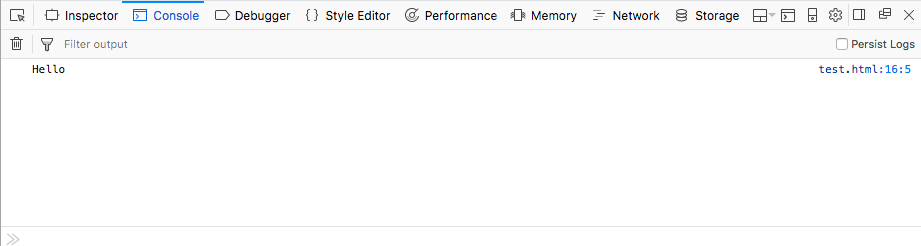

{{MDNSidebar}}

On MDN, you'll see numerous code examples inserted throughout the pages to demonstrate usage of web platform features. This article discusses the different mechanisms available for adding code examples to pages, along with which ones you should use and when.

> **Note:** If you want advice on the styling and linting of code as it appears on an MDN article, rather than the different ways of including code, see our [Code style guide](/en-US/docs/MDN/Writing_guidelines/Writing_style_guide/Code_style_guide).

## What types of code example are available?

There are four types of code examples available on MDN:

- Static examples — plain code blocks, possibly with a screenshot to statically show the result of such code if it were to be run.
- Interactive examples — Our system for creating [live interactive examples](https://github.com/mdn/interactive-examples) that show the code running live but also allow you to change code on the fly to see what the effect is and easily copy the results.
- Traditional MDN "live samples" — A macro that takes plain code blocks, dynamically puts them into a document inside an {{htmlelement("iframe")}} element, and embeds it into the page to show the code running live.
- GitHub "live samples" — A macro that takes a document in a GitHub repo inside the [MDN organization](https://github.com/mdn/), puts it inside an {{htmlelement("iframe")}} element, and embeds it into the page to show the code running live.

We'll discuss each one in later sections.

## When should you use each one?

Each type of code example has its own use cases. When should you use each one?

- Static examples are useful if you just need to show some code, and it isn't super important to show what the live result is. Some people just want something to copy and paste. Maybe you are just showing an intermediate step, or the source code is enough. (For example, the article is for an advanced audience, and they just need to see the code.) Also, you might be demonstrating an API feature that doesn't work well as an embedded example, which might need its own separate page to link to.
- The interactive examples are great as readers can modify values on the fly — this is very valuable for learning. However, they are more complex to set up than the other forms, with more limitations, and are intended for specific purposes.
- Traditional live samples are useful if you want to show source code on a page, then show it running, and you're not that bothered about it being accessible as a standalone example. This approach also has the advantage that if you are showing source code and live examples side by side, you only need to update the code once to update both. They can however be awkward to edit and get working.
- GitHub live samples are useful when you've got an existing example you want to embed, don't want to show the source code for, and/or you want to make sure the example is available in standalone form. They have a better contribution workflow, but it does require you to know GitHub. Also because on-page code and source code are in two different places, it is easier for them to get out of sync.

## General guidelines

Aside from the specific system for presenting the live samples, there are style and content considerations to keep in mind when adding or updating samples on MDN.

- When placing samples on a page, try to ensure that all of the features or options of the API or concept you're writing about are covered. At a minimum, at least the most-common options or properties should be included in examples.
- Precede each example with an explanation of what the example does and why it's interesting or useful.
- Follow each piece of code with an explanation of what it does.
- When possible, break large examples into smaller pieces. For instance, the "live sample" system will automatically concatenate all your code together into one piece before running the example, so you can actually break your JavaScript, HTML, and/or CSS into smaller pieces with descriptive text after each piece if you choose to do so. This is a great way to help explain long or complicated stretches of code more clearly.
- Go beyond just demonstrating how each piece of the API or technology works. Consider possible real-world use cases you might try to demonstrate.

## Static examples

By static examples, we are talking about static code blocks that show how a feature might be used in code. These are put on a page using Markdown "code fences", as described in [Example code blocks](/en-US/docs/MDN/Writing_guidelines/Howto/Markdown_in_MDN#example_code_blocks). An example result might look like this:

```js
// This is a JS example
const test = "Hello";
console.log(test);
```

Optionally, you might want to show a static image of the code's resulting output. For example:



## Interactive examples

Interactive examples are intended to be used at the top of MDN reference pages — we are aiming to provide these to improve their value to beginners and other readers who want to just grab and play with an example quickly before seeing all the details of whatever they are looking up. There are a few important limitations to note about the interactive examples:

- They are specialized for a particular technology — the UI for JavaScript is different from the UI for CSS, and they only illustrate one technology in isolation. They are not appropriate if you want to show, for example, how to combine a particular HTML/CSS/JS structure.
- The interactive live examples are currently only set up to show CSS and JavaScript. For other technologies, you'll just have to wait.
- The UI is more performance-intensive than other code examples; you shouldn't put more than one on each MDN article you apply them to.
- They are not intended for large code examples — the UI supports a range of fixed sizes, which only really work for short (say, 10–15 line) examples.

If you want to submit an example, you can find out how at the [interactive examples repo Contribution guide](https://github.com/mdn/interactive-examples/blob/main/CONTRIBUTING.md).

If you find a page that doesn't have an associated interactive example, you are welcome to contribute one!

### Interactive example demo

The [`EmbedInteractiveExample`](https://github.com/mdn/yari/blob/main/kumascript/macros/EmbedInteractiveExample.ejs) macro is used to embed finished examples into MDN pages. For example, the macro call \\{{EmbedInteractiveExample("pages/js/array-push.html")}} displays the following code example:

{{EmbedInteractiveExample("pages/js/array-push.html")}}Try adjusting the code to see what happens, and playing with the controls.

## Traditional live samples

Traditional live samples are inserted into the page using the [`EmbedLiveSample`](https://github.com/mdn/yari/blob/main/kumascript/macros/EmbedLiveSample.ejs) macro. An \\{{EmbedLiveSample}} call dynamically grabs the code blocks in the same document section as itself and puts them into a document, which it then inserts into the page inside an {{htmlelement("iframe")}}. See our [Live samples guide](/en-US/docs/MDN/Writing_guidelines/Page_structures/Live_samples) for more information.

### Formatting live samples

If you write a live sample in the "Examples" section, provide a descriptive H3 heading (`###`) for this live sample example. Ideally, write a short description of the example explaining the scenario and what you are hoping to demonstrate. Then add subsections with following H4 headings (`####`), in the order listed:

- HTML
- CSS
- JavaScript
- Result
Write the code blocks in the respective subsections listed above.
In the **Result** subsection, add the call to the [`EmbedLiveSample` macro](/en-US/docs/MDN/Writing_guidelines/Page_structures/Live_samples#live_sample_macros). Preferably, include some more prose in this subsection to describe the result.
If you're not using a particular language type (for example, if you are not using JavaScript) or if you are hiding it, then you should omit the corresponding heading.

For example:

````
## Examples

### Styling a paragraph

In this example, we're using CSS to style paragraphs that have the `fancy` class set.

#### HTML

```html
<p>I'm not fancy.</p>

<p class="fancy">But I am!</p>
```

#### CSS

```css
p.fancy {
  color: red;
}
```

#### Result

\{{EmbedLiveSample("Styling a paragraph")}}

Only the `<p>` element with `class="fancy"` will get styled `red`.
````

### Hidden code

Sometimes you just want to display the static code block that is pertinent to the example rendered within a page. However you still need HTML, CSS and JavaScript to render such an example.

To achieve this you can hide any code blocks which are note relevant with the `hidden` class.

Using the example above but hiding the HTML code would look like this:

````
## Examples

### Styling a paragraph

In this example, we're using CSS to style paragraphs that have the `fancy` class set.

#### HTML

```html hidden
<p>I'm not fancy.</p>

<p class="fancy">But I am!</p>
```

#### CSS

```css
p.fancy {
  color: red;
}
```

#### Result

\{{EmbedLiveSample("Styling a paragraph")}}

Only the `<p>` element with `class="fancy"` will get styled `red`.
````

## GitHub live samples

GitHub live samples are inserted into the page using the [`EmbedGHLiveSample`](https://github.com/mdn/yari/blob/main/kumascript/macros/EmbedGHLiveSample.ejs) macro. An \\{{EmbedGHLiveSample}} call dynamically grabs the document at a specified URL (which has to be inside the **mdn** GitHub organization), and inserts into the page inside an {{htmlelement("iframe")}}.

These work in a very similar way to Traditional live samples, but they are a lot simpler:

You don't have to worry about placement of code blocks on the page — it grabs an HTML document in a GitHub repo, and puts it in the `<iframe>`.

The macro only has three parameters:

1. The URL of the document to embed — this is relative to the MDN organization, the top level directory of which is at `https://mdn.github.io/`. So this parameter needs to contain the part of the URL after that, e.g. `my-subdirectory/example.html`. You can omit the filename if it is called `index.html`.
2. The width of the `<iframe>`, which can be expressed as a percentage or in pixels.
3. The height of the `<iframe>`, which can be expressed as a percentage or in pixels.

Let's look at an example. Say we wanted to embed the code at <https://mdn.github.io/learning-area/css/styling-boxes/backgrounds/>. We could use the following call:

\\{{EmbedGHLiveSample("learning-area/css/styling-boxes/backgrounds/", '100%', 100)}}

This looks like so when rendered:

{{EmbedGHLiveSample("learning-area/css/styling-boxes/backgrounds/", '100%', 100)}}

### Tips for using GitHub live samples

- You obviously need to get a suitable code sample onto the [MDN GitHub organization](https://github.com/mdn/) first. This needs to be done using Git. If you are not familiar with Git, check out our [How do I use GitHub Pages?](/en-US/docs/Learn/Common_questions/Using_Github_pages) article, and [Preparing to add the data](/en-US/docs/MDN/Writing_guidelines/Page_structures/Compatibility_tables#preparing_to_add_the_data) for more advanced uses.
- Your code sample needs to be suitable to show what you are trying to demonstrate — it should contain one simple example that does one thing well, should have no offensive content in it, and should follow the MDN [Code sample guidelines](/en-US/docs/MDN/Writing_guidelines/Writing_style_guide/Code_style_guide).
