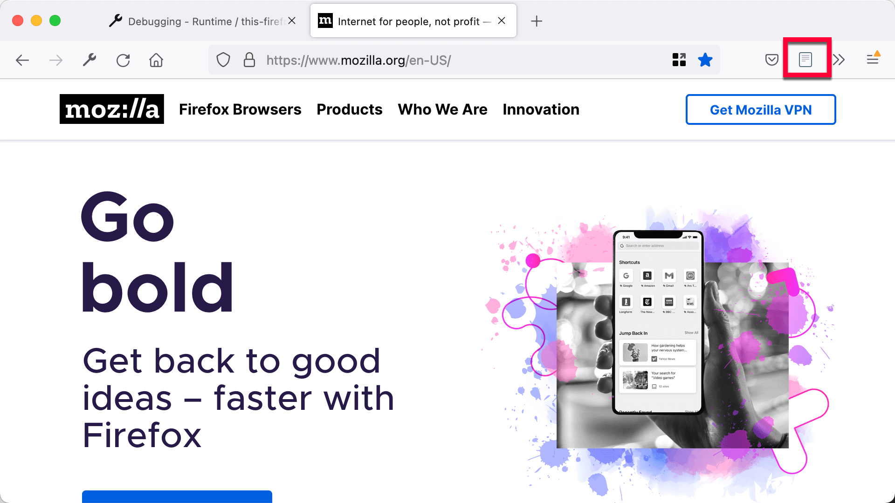
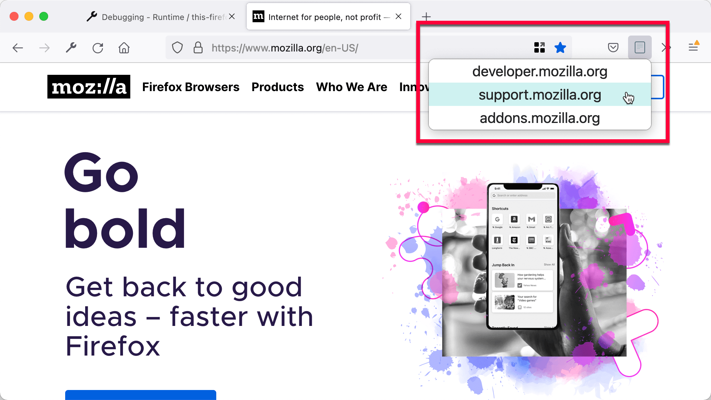

{{AddonSidebar}}

Toolbar buttons are one of the main UI components available to extensions. Toolbar buttons live in the main browser toolbar and contain an icon. When the user clicks the icon, one of two things can happen:

- If you have specified a popup for the icon, the popup is shown. Popups are transient dialogs specified using HTML, CSS, and JavaScript.
- If you have not specified a popup, a click event is generated, which you can listen for in your code and perform some other kind of action in response to.

With WebExtension APIs, these kinds of buttons are called "browser actions", and are set up like so:

- The manifest.json key [`browser_action`](/en-US/docs/Mozilla/Add-ons/WebExtensions/manifest.json/browser_action) is used to define the button.
- The JavaScript API [`browserAction`](/en-US/docs/Mozilla/Add-ons/WebExtensions/API/browserAction) is used to listen for clicks and change the button or perform actions via your code.

## A simple button

In this section we'll create an extension that adds a button to the toolbar. When the user clicks the button, we'll open <https://developer.mozilla.org> in a new tab.

First, create a new directory, "button", and create a file called "manifest.json" inside it with the following contents:

```json
{
  "description": "Demonstrating toolbar buttons",
  "manifest_version": 2,
  "name": "button-demo",
  "version": "1.0",

  "background": {
    "scripts": ["background.js"]
  },

  "browser_action": {
    "default_icon": {
      "16": "icons/page-16.png",
      "32": "icons/page-32.png"
    }
  }
}
```

This specifies that we'll have a [background script](/en-US/docs/Mozilla/Add-ons/WebExtensions/Anatomy_of_a_WebExtension#background_scripts) named "background.js", and a browser action (button) whose icons will live in the "icons" directory.

Next, create the "icons" directory inside the "buttons" directory, and save the two icons shown below inside it:

**"page-16.png":**


**"page-32.png":**


> **Note:** These icons are from the [bitsies!](https://www.iconfinder.com/iconsets/bitsies) iconset created by Recep Kütük.

We have two icons so we can use the bigger one in high-density displays. The browser will take care of selecting the best icon for the current display.

Next, create "background.js" in the extension's root directory, and give it the following contents:

```js
function openPage() {
  browser.tabs.create({
    url: "https://developer.mozilla.org",
  });
}

browser.browserAction.onClicked.addListener(openPage);
```

This listens for the browser action's click event; when the event fires, the `openPage()` function is run, which opens the specified page using the [`tabs`](/en-US/docs/Mozilla/Add-ons/WebExtensions/API/tabs) API.

At this point the complete extension should look like this:

```plain
button/
    icons/
        page-16.png
        page-32.png
    background.js
    manifest.json
```

Now [install the extension](https://extensionworkshop.com/documentation/develop/temporary-installation-in-firefox/) and click the button:



## Adding a popup

Let's try adding a popup to the button. Replace manifest.json with this:

```json
{
  "description": "Demonstrating toolbar buttons",
  "manifest_version": 2,
  "name": "button-demo",
  "version": "1.0",

  "browser_action": {
    "default_popup": "popup/choose_page.html",
    "default_icon": {
      "16": "icons/page-16.png",
      "32": "icons/page-32.png"
    }
  }
}
```

We've made two changes from the original:

- removed the reference to "background.js", because now we're going to handle the extension's logic in the popup's script (you are allowed background.js as well as a popup, it's just that we don't need it in this case).
- added `"default_popup": "popup/choose_page.html"`, which is telling the browser that this browser action is now going to display a popup when clicked, the document for which can be found at "popup/choose_page.html".

So now we need to create that popup. Create a directory called "popup" then create a file called "choose_page.html" inside it. Give it the following contents:

```html
<!doctype html>
<html lang="en">
  <head>
    <meta charset="utf-8" />
    <link rel="stylesheet" href="choose_page.css" />
  </head>
  <body>
    <div class="page-choice">developer.mozilla.org</div>
    <div class="page-choice">support.mozilla.org</div>
    <div class="page-choice">addons.mozilla.org</div>
    <script src="choose_page.js"></script>
  </body>
</html>
```

You can see that this is a normal HTML page containing three {{htmlelement("div")}} elements, each with the name of a Mozilla site inside. It also includes a CSS file and a JavaScript file, which we'll add next.

Create a file called "choose_page.css" inside the "popup" directory, and give it these contents:

```css
html,
body {
  width: 300px;
}

.page-choice {
  width: 100%;
  padding: 4px;
  font-size: 1.5em;
  text-align: center;
  cursor: pointer;
}

.page-choice:hover {
  background-color: #cff2f2;
}
```

This is just a bit of styling for our popup.

Next, create a "choose_page.js" file inside the "popup" directory, and give it these contents:

```js
document.addEventListener("click", (event) => {
  if (!event.target.classList.contains("page-choice")) {
    return;
  }

  const chosenPage = `https://${event.target.textContent}`;
  browser.tabs.create({
    url: chosenPage,
  });
});
```

In our JavaScript, we listen for clicks on the popup choices. We first check to see if the click landed on one of the page-choices; if not, we don't do anything else. If the click did land on a page-choice, we construct a URL from it, and open a new tab containing the corresponding page. Note that we can use WebExtension APIs in popup scripts, just as we can in background scripts.

The extension's final structure should look like this:

```plain
button/
    icons/
        page-16.png
        page-32.png
    popup/
        choose_page.css
        choose_page.html
        choose_page.js
    manifest.json
```

Now [reload the extension](https://extensionworkshop.com/documentation/develop/temporary-installation-in-firefox/#reloading-a-temporary-extension), click the button again, and try clicking on the choices in the popup:



## Page actions

[Page actions](/en-US/docs/Mozilla/Add-ons/WebExtensions/user_interface/Page_actions) are just like browser actions, except that they are for actions which are relevant only for particular pages, rather than the browser as a whole.

While browser actions are always shown, page actions are only shown in tabs where they are relevant. Page action buttons are displayed in the URL bar, rather than the browser toolbar.

## Learn more

- [`browser_action`](/en-US/docs/Mozilla/Add-ons/WebExtensions/manifest.json/browser_action) manifest key
- [`browserAction`](/en-US/docs/Mozilla/Add-ons/WebExtensions/API/browserAction) API
- Browser action examples:

  - [beastify](https://github.com/mdn/webextensions-examples/tree/main/beastify)
  - [Bookmark it!](https://github.com/mdn/webextensions-examples/tree/main/bookmark-it)
  - [favourite-colour](https://github.com/mdn/webextensions-examples/tree/main/favourite-colour)
  - [open-my-page-button](https://github.com/mdn/webextensions-examples/tree/main/open-my-page-button)

- [`page_action`](/en-US/docs/Mozilla/Add-ons/WebExtensions/manifest.json/page_action) manifest key
- [`pageAction`](/en-US/docs/Mozilla/Add-ons/WebExtensions/API/pageAction) API
- Page action examples:

  - [chill-out](https://github.com/mdn/webextensions-examples/tree/main/chill-out)
