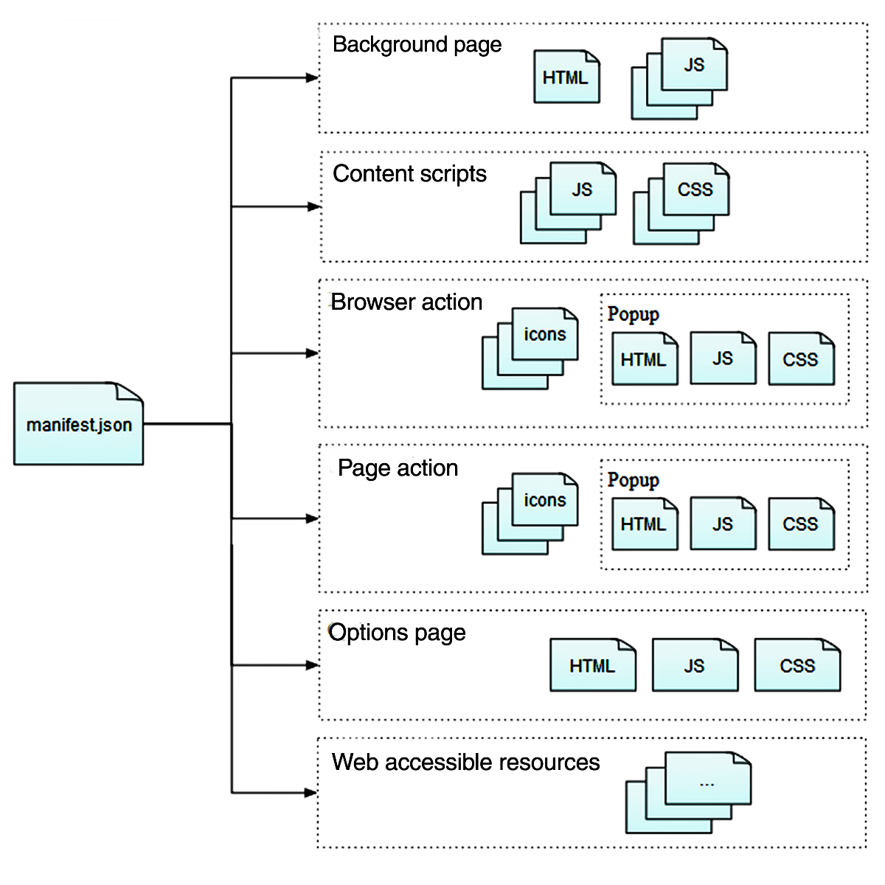

{{AddonSidebar}}

An extension consists of a collection of files, packaged for distribution and installation. In this article, we will quickly go through the files that might be present in an extension.

## manifest.json

This is the only file that must be present in every extension. It contains basic metadata such as its name, version, and the permissions it requires. It also provides pointers to other files in the extension.

The manifest can also contain pointers to several other types of files:

- [Background scripts](#background_scripts_2)
  - : Scripts that respond to browser events.
- Icons
  - : For the extension and any buttons it might define.
- [Sidebars, popups, and options pages](#sidebars_popups_and_options_pages)
  - : HTML documents that provide content for various user interface components.
- [Content scripts](#content_scripts)
  - : JavaScript included with your extension, that you will inject into web pages.
- [Web-accessible resources](#web_accessible_resources)
  - : Make packaged content accessible to web pages and content scripts.

See the [`manifest.json`](/en-US/docs/Mozilla/Add-ons/WebExtensions/manifest.json) reference page for all the details.

Along with those already listed in the manifest, an extension may also include additional [Extension pages](/en-US/docs/Mozilla/Add-ons/WebExtensions/user_interface/Extension_pages) and supporting files.

## Background scripts

Extensions often need to respond to events that occur in the browser independently of the lifetime of any particular web page or browser window. That is what background scripts are for.

Background scripts can be persistent or non-persistent. Persistent background scripts load as soon as the extension loads and stay loaded until the extension is disabled or uninstalled. This background script behavior is only available in Manifest V2. Non-persistent background scripts load when needed to respond to an event and unload when they become idle. This background script behavior is an option in Manifest V2 and the only background script behavior available in Manifest V3.

You can use any of the [WebExtension APIs](/en-US/docs/Mozilla/Add-ons/WebExtensions/API) in the script, if you have requested the necessary [permissions](/en-US/docs/Mozilla/Add-ons/WebExtensions/manifest.json/permissions).

See the [background scripts](/en-US/docs/Mozilla/Add-ons/WebExtensions/Background_scripts) article to learn more.

## Sidebars, popups, and options pages

Your extension can include various user interface components whose content is defined using an HTML document:

- [Sidebar](/en-US/docs/Mozilla/Add-ons/WebExtensions/user_interface/Sidebars)
  - : A pane that is displayed at the left-hand side of the browser window, next to the web page.
- [Popup](/en-US/docs/Mozilla/Add-ons/WebExtensions/user_interface/Popups)
  - : A dialog that you can display when the user clicks on a [toolbar button](/en-US/docs/Mozilla/Add-ons/WebExtensions/user_interface/Browser_action) or [address bar button](/en-US/docs/Mozilla/Add-ons/WebExtensions/user_interface/Page_actions)
- [Options](/en-US/docs/Mozilla/Add-ons/WebExtensions/user_interface/Options_pages)
  - : A page that's shown when the user accesses your add-on's preferences in the browser's native add-ons manager.

For each of these components, you create an HTML file and point to it using a specific property in [`manifest.json`](/en-US/docs/Mozilla/Add-ons/WebExtensions/manifest.json). The HTML file can include CSS and JavaScript files, just like a normal web page.

All of these are a type of [Extension pages](/en-US/docs/Mozilla/Add-ons/WebExtensions/user_interface/Extension_pages). Unlike a normal web page, your JavaScript can use all the same privileged WebExtension APIs as your background script.

## Extension pages

You can also include HTML documents in your extension which are not attached to some predefined user interface component. Unlike the documents you might provide for sidebars, popups, or options pages, these don't have an entry in `manifest.json`. However, they do also get access to all the same privileged WebExtension APIs as your background script.

You'd typically load a page like this using {{WebExtAPIRef("windows.create()")}} or {{WebExtAPIRef("tabs.create()")}}.

See [Extension pages](/en-US/docs/Mozilla/Add-ons/WebExtensions/user_interface/Extension_pages) to learn more.

## Content scripts

Use content scripts to access and manipulate web pages. Content scripts are loaded into web pages and run in the context of that particular page.

Content scripts are extension-provided scripts which run in the context of a web page; this differs from scripts which are loaded by the page itself, including those which are provided in {{HTMLElement("script")}} elements within the page.

Content scripts can see and manipulate the page's DOM, just like normal scripts loaded by the page.

Unlike normal page scripts, content scripts can:

- Make cross-domain XHR requests.
- Use a small subset of the [WebExtension APIs](/en-US/docs/Mozilla/Add-ons/WebExtensions/API).
- [Exchange messages with their background scripts](/en-US/docs/Mozilla/Add-ons/WebExtensions/Content_scripts#communicating_with_background_scripts) and can in this way indirectly access all the WebExtension APIs.

Content scripts cannot directly access normal page scripts but can exchange messages with them using the standard [`window.postMessage()`](/en-US/docs/Web/API/Window/postMessage) API.

Usually, when we talk about content scripts, we are referring to JavaScript, but you can inject CSS into web pages using the same mechanism.

See the [content scripts](/en-US/docs/Mozilla/Add-ons/WebExtensions/Content_scripts) article to learn more.

## Web accessible resources

Web accessible resources are resources—such as images, HTML, CSS, and JavaScript—that you include in the extension and want to make accessible to content scripts and page scripts. Resources which are made web-accessible can be referenced by page scripts and content scripts using a special URI scheme.

For example, if a content script wants to insert some images into web pages, you could include them in the extension and make them web accessible. Then the content script could create and append [`img`](/en-US/docs/Web/HTML/Element/img) tags which reference the images via the `src` attribute.

To learn more, see the documentation for the [`"web_accessible_resources"`](/en-US/docs/Mozilla/Add-ons/WebExtensions/manifest.json/web_accessible_resources) `manifest.json` key.
