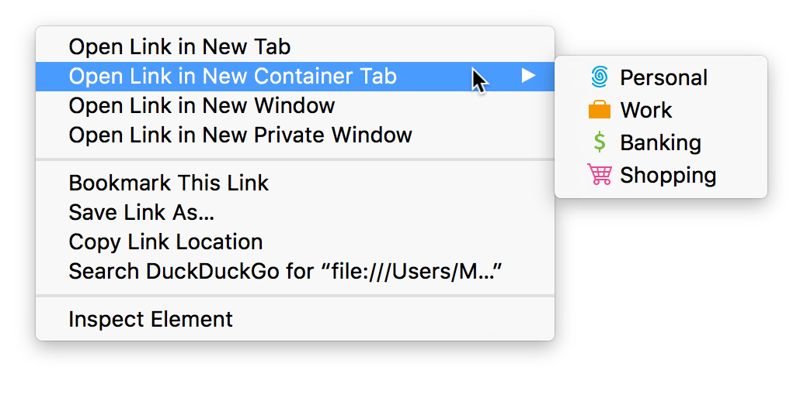

{{AddonSidebar}}

Work with contextual identities: list, create, remove, and update contextual identities.

"Contextual identities", also known as "containers", are a browser feature which addresses the idea that users assume multiple identities when browsing the web, and wish to maintain some separation between these identities. For example, a user might consider their "work identity" separate from their "personal identity", and not want to share cookies between these two contexts.

With the contextual identities feature, each contextual identity has a name, a color, and an icon. New tabs can be assigned to an identity, and the name, icon, and color will appear in the address bar. Internally, each identity gets its own cookie store which is not shared with other tabs.

Contextual identities are an experimental feature in Firefox and are only enabled by default in Firefox Nightly. To enable them in other versions of Firefox, set the `privacy.userContext.enabled` preference to `true`. Note that although contextual identities are available in Firefox for Android, there's no UI to work with them in this version of the browser.

Before Firefox 57, the `contextualIdentities` API is only available if the contextual identities feature is itself enabled. If an extension tried to use the `contextualIdentities` API without the feature being enabled, then method calls would resolve their promises with `false`.

From Firefox 57 onwards, if an extension that uses the `contextualIdentities` API is installed, then the contextual identities feature will be enabled automatically. Note though that it's still possible for the user to disable the feature using the "privacy.userContext.enabled" preference. If this happens, then `contextualIdentities` method calls will reject their promises with an error message.

For more information about contextual identities in Firefox, see [this guide](https://wiki.mozilla.org/Security/Contextual_Identity_Project/Containers).

Contextual identities are not currently supported in any other browsers.

To use this API you need to include the "contextualIdentities" and "cookies" [permissions](/en-US/docs/Mozilla/Add-ons/WebExtensions/manifest.json/permissions) in your [manifest.json](/en-US/docs/Mozilla/Add-ons/WebExtensions/manifest.json) file.

## Types

- {{WebExtAPIRef("contextualIdentities.ContextualIdentity")}}
  - : Contains information about a contextual identity.

## Functions

- {{WebExtAPIRef("contextualIdentities.create()")}}
  - : Creates a new contextual identity.
- {{WebExtAPIRef("contextualIdentities.get()")}}
  - : Retrieves a single contextual identity, given its cookie store ID.
- {{WebExtAPIRef("contextualIdentities.query()")}}
  - : Retrieves all contextual identities, or all contextual identities with a particular name.
- {{WebExtAPIRef("contextualIdentities.update()")}}
  - : Updates properties of an existing contextual identity.
- {{WebExtAPIRef("contextualIdentities.remove()")}}
  - : Deletes a contextual identity.

## Events

- {{WebExtAPIRef("contextualIdentities.onCreated")}}
  - : Fired when a contextual identity is created.
- {{WebExtAPIRef("contextualIdentities.onRemoved")}}
  - : Fired when a contextual identity is removed.
- {{WebExtAPIRef("contextualIdentities.onUpdated")}}
  - : Fired when one or more properties of a contextual identity is updated.

## Browser compatibility

{{Compat}}

{{WebExtExamples("h2")}}
