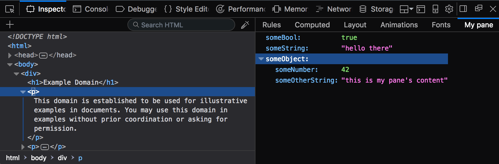

{{AddonSidebar}}

Adds a new pane to the sidebar in the HTML/CSS inspector.

The HTML/CSS inspector, called the [Page Inspector](https://firefox-source-docs.mozilla.org/devtools-user/page_inspector/index.html) in Firefox and the [Elements panel](https://developer.chrome.com/docs/devtools/css/) in Chrome, displays the page DOM in the main part of its window, and has a sidebar that displays various other aspects of the page HTML/CSS in a tabbed interface. For example, in Firefox, the sidebar can display the CSS rules for the selected element, or its fonts, or its box model.

The `createSidebarPane()` function adds a new pane to the sidebar. For example, the screenshot below shows a new pane titled "My pane", that displays a JSON object:



This function takes one argument, which is a string representing the pane's title. It returns a [`Promise`](/en-US/docs/Web/JavaScript/Reference/Global_Objects/Promise) that resolves to an [`ExtensionSidebarPane`](/en-US/docs/Mozilla/Add-ons/WebExtensions/API/devtools/panels/ExtensionSidebarPane) object representing the new pane. You can use that object to define the pane's content and behavior.

## Syntax

```js-nolint
let creating = browser.devtools.panels.elements.createSidebarPane(
  title       // string
)
```

### Parameters

- `title`
  - : `string`. The pane's title. This will appear in the row of tabs along the top of the sidebar, and is the main way the user will be able to identify your pane.

### Return value

A [`Promise`](/en-US/docs/Web/JavaScript/Reference/Global_Objects/Promise) that will be fulfilled with an [`ExtensionSidebarPane`](/en-US/docs/Mozilla/Add-ons/WebExtensions/API/devtools/panels/ExtensionSidebarPane) object representing the new pane.

## Browser compatibility

{{Compat}}

## Examples

Create a new pane, and populate it with a JSON object. You could run this code in a script loaded by your extension's [devtools page](/en-US/docs/Mozilla/Add-ons/WebExtensions/manifest.json/devtools_page).

```js
function onCreated(sidebarPane) {
  sidebarPane.setObject({
    someBool: true,
    someString: "hello there",
    someObject: {
      someNumber: 42,
      someOtherString: "this is my pane's content",
    },
  });
}

browser.devtools.panels.elements.createSidebarPane("My pane").then(onCreated);
```

{{WebExtExamples}}

> [!NOTE]
> This API is based on Chromium's [`chrome.devtools.panels`](https://developer.chrome.com/docs/extensions/reference/api/devtools/panels) API.

<!--
// Copyright 2015 The Chromium Authors. All rights reserved.
//
// Redistribution and use in source and binary forms, with or without
// modification, are permitted provided that the following conditions are
// met:
//
//    * Redistributions of source code must retain the above copyright
// notice, this list of conditions and the following disclaimer.
//    * Redistributions in binary form must reproduce the above
// copyright notice, this list of conditions and the following disclaimer
// in the documentation and/or other materials provided with the
// distribution.
//    * Neither the name of Google Inc. nor the names of its
// contributors may be used to endorse or promote products derived from
// this software without specific prior written permission.
//
// THIS SOFTWARE IS PROVIDED BY THE COPYRIGHT HOLDERS AND CONTRIBUTORS
// "AS IS" AND ANY EXPRESS OR IMPLIED WARRANTIES, INCLUDING, BUT NOT
// LIMITED TO, THE IMPLIED WARRANTIES OF MERCHANTABILITY AND FITNESS FOR
// A PARTICULAR PURPOSE ARE DISCLAIMED. IN NO EVENT SHALL THE COPYRIGHT
// OWNER OR CONTRIBUTORS BE LIABLE FOR ANY DIRECT, INDIRECT, INCIDENTAL,
// SPECIAL, EXEMPLARY, OR CONSEQUENTIAL DAMAGES (INCLUDING, BUT NOT
// LIMITED TO, PROCUREMENT OF SUBSTITUTE GOODS OR SERVICES; LOSS OF USE,
// DATA, OR PROFITS; OR BUSINESS INTERRUPTION) HOWEVER CAUSED AND ON ANY
// THEORY OF LIABILITY, WHETHER IN CONTRACT, STRICT LIABILITY, OR TORT
// (INCLUDING NEGLIGENCE OR OTHERWISE) ARISING IN ANY WAY OUT OF THE USE
// OF THIS SOFTWARE, EVEN IF ADVISED OF THE POSSIBILITY OF SUCH DAMAGE.
-->
