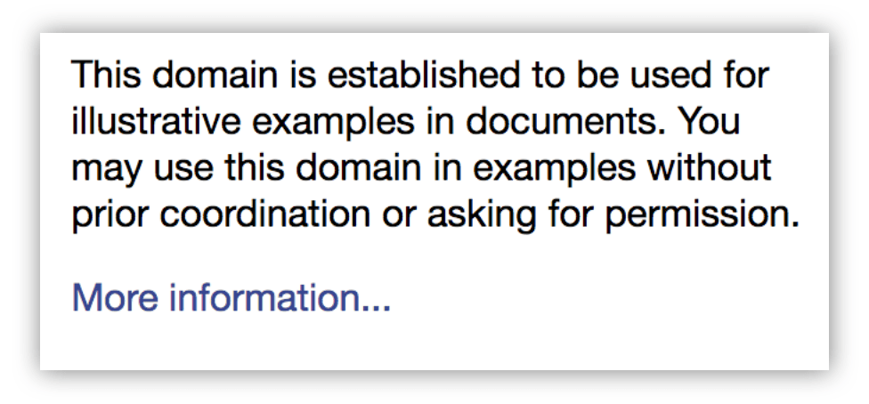
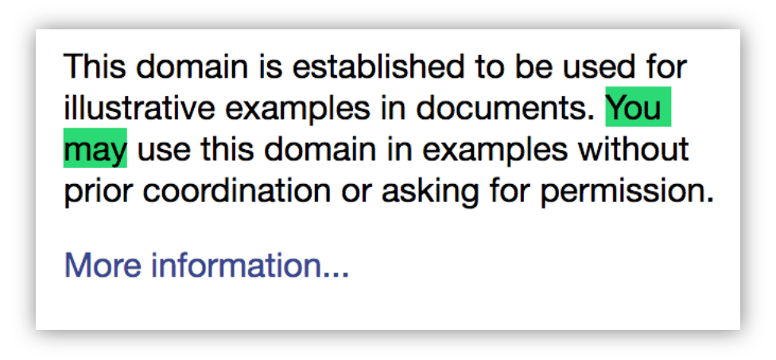
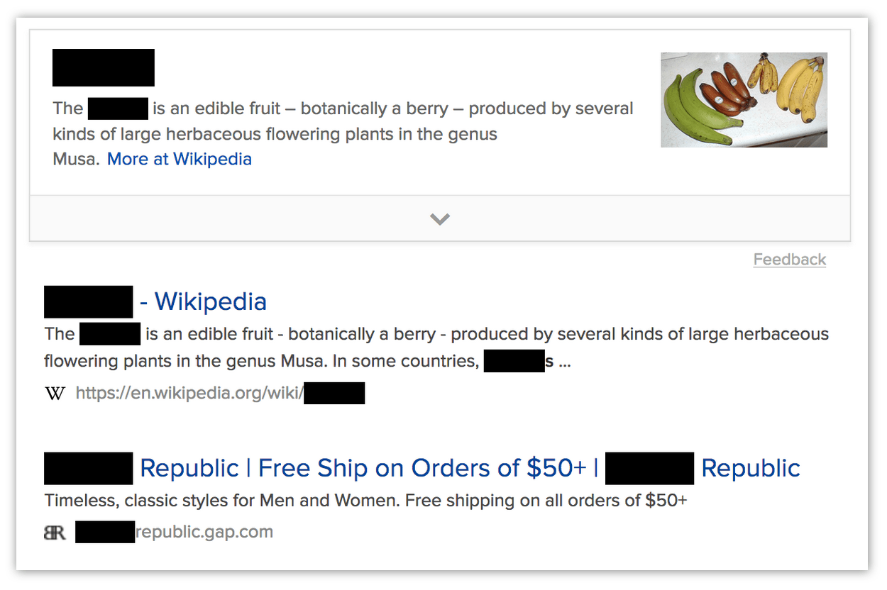

{{AddonSidebar}}

Searches for text in a tab.

You can use this function to search normal HTTP(S) web pages. It searches a single tab: you can specify the ID of a particular tab to search, or it will search the active tab by default. It searches all frames in the tab.

You can make the search case-sensitive and make it match whole words only.

By default, the function just returns the number of matches found. By passing in the `includeRangeData` and `includeRectData` options, you can get more information about the location of the matches in the target tab.

This function stores the results internally, so the next time any extension calls {{WebExtAPIRef("find.highlightResults()")}}, then the results of this find call will be highlighted, until the next time someone calls `find()`.

This is an asynchronous function that returns a [`Promise`](/en-US/docs/Web/JavaScript/Reference/Global_Objects/Promise).

## Syntax

```js-nolint
browser.find.find(
  queryPhrase,       // string
  options            // optional object
)
```

### Parameters

- `options` {{optional_inline}}

  - : `object`. An object specifying additional options. It may take any of the following properties, all optional:

    - `caseSensitive`
      - : `boolean`. If `true` the, the search is case-sensitive. Defaults to `false`.
    - `entireWord`
      - : `boolean`. Match only entire words: so "Tok" will not be matched inside "Tokyo". Defaults to `false`.
    - `includeRangeData`
      - : `boolean`. Include range data in the response, which describe where in the page DOM the match was found. Defaults to `false`.
    - `includeRectData`
      - : `boolean`. Include rectangle data in the response, which describes where in the rendered page the match was found. Defaults to `false`
    - `matchDiacritics`
      - : `boolean`. If `true`, the search distinguishes between accented letters and their base letters. For example, when set to `true`, searching for "résumé" does not find a match for "resume". Defaults to `false`.
    - `tabId`
      - : `integer`. ID of the tab to search. Defaults to the active tab.

- `queryPhrase`
  - : `string`. The text to search for.

### Return value

A [`Promise`](/en-US/docs/Web/JavaScript/Reference/Global_Objects/Promise) that will be fulfilled with an object containing up to three properties:

- `count`
  - : `integer`. The number of results found.
- `rangeData` {{optional_inline}}

  - : `array`. If `includeRangeData` was given in the `options` parameter, then this property will be included. It is provided as an array of `RangeData` objects, one for each match. Each `RangeData` object describes where in the DOM tree the match was found. This would enable, for example, an extension to get the text surrounding each match, so as to display context for the matches.

    The items correspond to the items given in `rectData`, so `rangeData[i]` describes the same match as `rectData[i]`.

    Each `RangeData` contains the following properties:

    - `endOffset`
      - : The ordinal position of the end of the match within its text node.
    - `endTextNodePos`
      - : The ordinal position of the text node in which the match ended.
    - `framePos`
      - : The index of the frame containing the match. 0 corresponds to the parent window. Note that the order of objects in the `rangeData` array will sequentially line up with the order of frame indexes: for example, `framePos` for the first sequence of `rangeData` objects will be 0, `framePos` for the next sequence will be 1, and so on.
    - `startOffset`
      - : The ordinal position of the start of the match within its text node.
    - `startTextNodePos`
      - : The ordinal position of the text node in which the match started.

- `rectData` {{optional_inline}}

  - : `array`. If `includeRectData` was given in the `options` parameter, then this property will be included. It is an array of `RectData` objects. It contains client rectangles for all the text matched in the search, relative to the top-left of the viewport. Extensions can use this to provide custom highlighting of the results.

    Each `RectData` object contains rectangle data for a single match. It has two properties:

    - `rectsAndTexts`

      - : An object containing two properties, both arrays:

        - `rectList`: an array of objects which each have four integer properties: `top`, `left`, `bottom`, `right`. These describe a rectangle relative to the top-left of the viewport.
        - `textList`: an array of strings, corresponding to the `rectList` array. The entry at `textList[i]` contains the part of the match bounded by the rectangle at `rectList[i]`.

        For example, consider part of a web page that looks like this:

        

        If you search for "You may", the match needs to be described by two rectangles:

        

        In this case, in the `RectData` that describes this match, `rectsAndTexts.rectList` and `rectsAndTexts.textList` will each have 2 items.

        - `textList[0]` will contain "You ", and `rectList[0]` will contain its bounding rectangle.
        - `textList[1]` will contain "may", and `rectList[1]` will contain _its_ bounding rectangle.

    - `text`
      - : The complete text of the match, "You may" in the example above.

## Browser compatibility

{{Compat}}

## Examples

### Basic examples

Search the active tab for "banana", log the number of matches, and highlight them:

```js
function found(results) {
  console.log(`There were: ${results.count} matches.`);
  if (results.count > 0) {
    browser.find.highlightResults();
  }
}

browser.find.find("banana").then(found);
```

Search for "banana" across all tabs (note that this requires the "tabs" [permission](/en-US/docs/Mozilla/Add-ons/WebExtensions/manifest.json/permissions) or matching [host permissions](/en-US/docs/Mozilla/Add-ons/WebExtensions/manifest.json/permissions#host_permissions), because it accesses `tab.url`):

```js
async function findInAllTabs(allTabs) {
  for (const tab of allTabs) {
    const results = await browser.find.find("banana", { tabId: tab.id });
    console.log(`In page "${tab.url}": ${results.count} matches.`);
  }
}

browser.tabs.query({}).then(findInAllTabs);
```

### Using rangeData

In this example the extension uses `rangeData` to get the context in which the match was found. The context is the complete `textContent` of the node in which the match was found. If the match spanned nodes, the context is the concatenation of the `textContent` of all spanned nodes.

Note that for simplicity, this example doesn't handle pages that contain frames. To support this you'd need to split `rangeData` into groups, one per frame, and execute the script in each frame.

The background script:

```js
// background.js

async function getContexts(matches) {
  // get the active tab ID
  const activeTabArray = await browser.tabs.query({
    active: true,
    currentWindow: true,
  });
  const tabId = activeTabArray[0].id;

  // execute the content script in the active tab
  await browser.tabs.executeScript(tabId, { file: "get-context.js" });
  // ask the content script to get the contexts for us
  const contexts = await browser.tabs.sendMessage(tabId, {
    ranges: matches.rangeData,
  });
  for (const context of contexts) {
    console.log(context);
  }
}

browser.browserAction.onClicked.addListener((tab) => {
  browser.find.find("example", { includeRangeData: true }).then(getContexts);
});
```

The content script:

```js
/**
 * Get all the text nodes into a single array
 */
function getNodes() {
  const walker = document.createTreeWalker(
    document,
    window.NodeFilter.SHOW_TEXT,
    null,
    false,
  );
  const nodes = [];
  while ((node = walker.nextNode())) {
    nodes.push(node);
  }

  return nodes;
}

/**
 * Gets all text nodes in the document, then for each match, return the
 * complete text content of nodes that contained the match.
 * If a match spanned more than one node, concatenate the textContent
 * of each node.
 */
function getContexts(ranges) {
  const contexts = [];
  const nodes = getNodes();

  for (const range of ranges) {
    let context = nodes[range.startTextNodePos].textContent;
    let pos = range.startTextNodePos;
    while (pos < range.endTextNodePos) {
      pos++;
      context += nodes[pos].textContent;
    }
    contexts.push(context);
  }
  return contexts;
}

browser.runtime.onMessage.addListener((message, sender, sendResponse) => {
  sendResponse(getContexts(message.ranges));
});
```

### Using rectData

In this example the extension uses `rectData` to "redact" the matches, by adding black DIVs over the top of their bounding rectangles:



Note that in many ways this is a poor way to redact pages.

The background script:

```js
// background.js

async function redact(matches) {
  // get the active tab ID
  const activeTabArray = await browser.tabs.query({
    active: true,
    currentWindow: true,
  });
  const tabId = activeTabArray[0].id;

  // execute the content script in the active tab
  await browser.tabs.executeScript(tabId, { file: "redact.js" });
  // ask the content script to redact matches for us
  await browser.tabs.sendMessage(tabId, { rects: matches.rectData });
}

browser.browserAction.onClicked.addListener((tab) => {
  browser.find.find("banana", { includeRectData: true }).then(redact);
});
```

The content script:

```js
// redact.js

/**
 * Add a black DIV where the rect is.
 */
function redactRect(rect) {
  const redaction = document.createElement("div");
  redaction.style.backgroundColor = "black";
  redaction.style.position = "absolute";
  redaction.style.top = `${rect.top}px`;
  redaction.style.left = `${rect.left}px`;
  redaction.style.width = `${rect.right - rect.left}px`;
  redaction.style.height = `${rect.bottom - rect.top}px`;
  document.body.appendChild(redaction);
}

/**
 * Go through every rect, redacting them.
 */
function redactAll(rectData) {
  for (const match of rectData) {
    for (const rect of match.rectsAndTexts.rectList) {
      redactRect(rect);
    }
  }
}

browser.runtime.onMessage.addListener((message) => {
  redactAll(message.rects);
});
```

{{WebExtExamples}}
