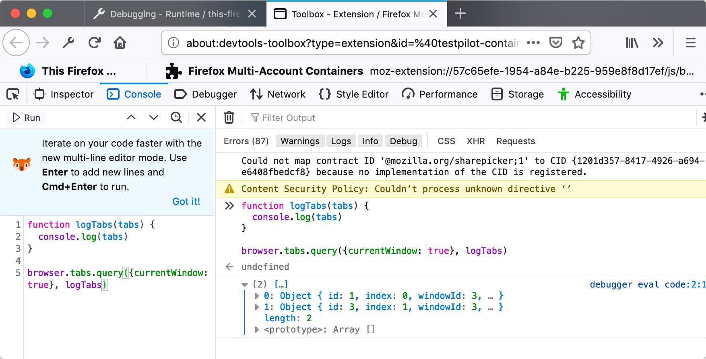

JavaScript APIs for WebExtensions can be used inside the extension's [background scripts](/en-US/docs/Mozilla/Add-ons/WebExtensions/Anatomy_of_a_WebExtension#background_scripts) and in any other documents bundled with the extension, including [browser action](/en-US/docs/Mozilla/Add-ons/WebExtensions/user_interface/Toolbar_button) or [page action](/en-US/docs/Mozilla/Add-ons/WebExtensions/user_interface/Page_actions) popups, [sidebars](/en-US/docs/Mozilla/Add-ons/WebExtensions/user_interface/Sidebars), [options pages](/en-US/docs/Mozilla/Add-ons/WebExtensions/user_interface/Options_pages), or [new tab pages](/en-US/docs/Mozilla/Add-ons/WebExtensions/manifest.json/chrome_url_overrides). A few of these APIs can also be accessed by an extension's [content scripts](/en-US/docs/Mozilla/Add-ons/WebExtensions/Anatomy_of_a_WebExtension#content_scripts). (See the [list in the content script guide](/en-US/docs/Mozilla/Add-ons/WebExtensions/Content_scripts#webextension_apis).)

To use the more powerful APIs, you need to [request permission](/en-US/docs/Mozilla/Add-ons/WebExtensions/manifest.json/permissions) in your extension's `manifest.json`.

You can access the APIs using the `browser` namespace:

```js
function logTabs(tabs) {
  console.log(tabs);
}

browser.tabs.query({ currentWindow: true }, logTabs);
```

Many of the APIs are asynchronous, returning a {{JSxRef("Promise")}}:

```js
function logCookie(c) {
  console.log(c);
}

function logError(e) {
  console.error(e);
}

let setCookie = browser.cookies.set({ url: "https://developer.mozilla.org/" });
setCookie.then(logCookie, logError);
```

## Browser API differences

Starting with browsers based on Chromium 148, the `browser` namespace is supported, except for extensions with a DevTools page (see [Transition to browser namespace](https://developer.chrome.com/docs/extensions/develop/concepts/browser-namespace)). This change means that all the major browsers support the `browser` namespace.

Before Chromium 148, Chrome used the `chrome` namespace, which relied on callbacks rather than promises for asynchronous functions. As a porting aid, the Firefox implementation of WebExtensions APIs supports `chrome` using callbacks (as well as `browser` and promises). This Firefox feature allows code written for Chrome to run largely unchanged in Firefox for the APIs documented here. Mozilla has also written a polyfill that enables code that uses `browser` and promises to work unchanged in older versions of Chrome: <https://github.com/mozilla/webextension-polyfill>.

Not all browsers support all the APIs: for the details, see [Browser support for JavaScript APIs](/en-US/docs/Mozilla/Add-ons/WebExtensions/Browser_support_for_JavaScript_APIs) and [Chrome incompatibilities](/en-US/docs/Mozilla/Add-ons/WebExtensions/Chrome_incompatibilities).

## Examples

Throughout the JavaScript API listings, short code examples illustrate how the API is used. You can experiment with most of these examples using the console in the [Toolbox](https://extensionworkshop.com/documentation/develop/debugging/#developer-tools-toolbox). However, you need Toolbox running in the context of a web extension. To do this, open `about:debugging` then **This Firefox**, click **Inspect** against any installed or temporary extension, and open **Console**. You can then paste and run the example code in the console.

For example, here is the first code example on this page running in the Toolbox console in Firefox Developer Edition:



## JavaScript API listing

See below for a complete list of JavaScript APIs:

{{SubpagesWithSummaries}}
