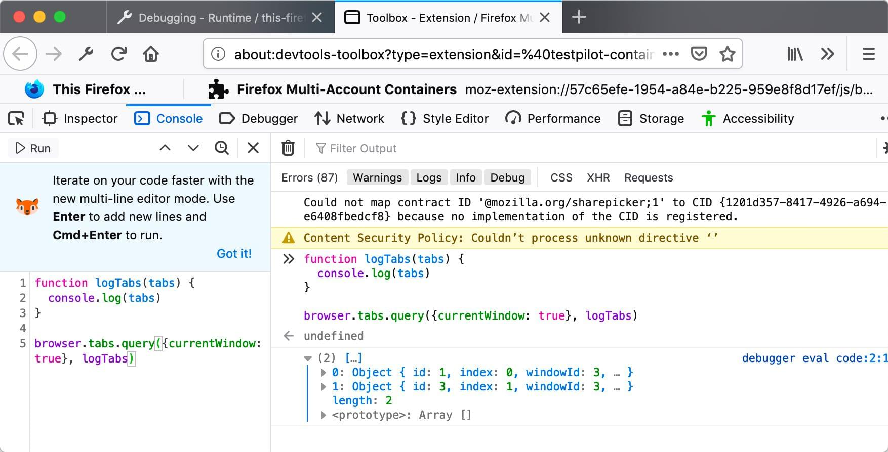

JavaScript APIs for WebExtensions can be used inside the extension's [background scripts](/en-US/docs/Mozilla/Add-ons/WebExtensions/Anatomy_of_a_WebExtension#background_scripts) and in any other documents bundled with the extension, including [browser action](/en-US/docs/Mozilla/Add-ons/WebExtensions/user_interface/Toolbar_button) or [page action](/en-US/docs/Mozilla/Add-ons/WebExtensions/user_interface/Page_actions) popups, [sidebars](/en-US/docs/Mozilla/Add-ons/WebExtensions/user_interface/Sidebars), [options pages](/en-US/docs/Mozilla/Add-ons/WebExtensions/user_interface/Options_pages), or [new tab pages](/en-US/docs/Mozilla/Add-ons/WebExtensions/manifest.json/chrome_url_overrides). A few of these APIs can also be accessed by an extension's [content scripts](/en-US/docs/Mozilla/Add-ons/WebExtensions/Anatomy_of_a_WebExtension#content_scripts). (See the [list in the content script guide](/en-US/docs/Mozilla/Add-ons/WebExtensions/Content_scripts#webextension_apis).)

To use the more powerful APIs, you need to [request permission](/en-US/docs/Mozilla/Add-ons/WebExtensions/manifest.json/permissions) in your extension's `manifest.json`.

You can access the APIs using the `browser` namespace:

```js
function logTabs(tabs) {
  console.log(tabs);
}

browser.tabs.query({ currentWindow: true }, logTabs);
```

Many of the APIs are asynchronous, returning a {{JSxRef("Promise")}}:

```js
function logCookie(c) {
  console.log(c);
}

function logError(e) {
  console.error(e);
}

let setCookie = browser.cookies.set({ url: "https://developer.mozilla.org/" });
setCookie.then(logCookie, logError);
```

## Browser namespace differences

Firefox and Safari have always used the `browser` namespace (with promises). Originally, Chromium-based browsers (such as Chrome, Opera, and Microsoft Edge) used the `chrome` namespace (with callbacks).

Starting with Chrome 148, Chrome also supports the `browser` namespace, except in extensions that include a DevTools page. This limitation was removed in Chrome 152 (see [Chrome bug 500769389](https://crbug.com/500769389)), and the `browser` namespace became available to all Chrome extensions. Also, Chrome began providing promises for asynchronous methods with the introduction of Manifest V3, with complete coverage delivered in Chrome 152.

This means that all major browsers use the `browser` namespace and return promises for asynchronous functions.

Before Chrome 148, Chrome uses the `chrome` namespace. As a porting aid, the Firefox implementation of WebExtensions APIs supports `chrome` and callbacks as well as `browser` and Promises. This allows code written for Chrome to run largely unchanged in Firefox for the APIs documented here. A [polyfill](https://github.com/mozilla/webextension-polyfill) that enables code that uses `browser` and promises to work unchanged in Chrome is also available. This polyfill is a no-op in Chrome 148 and later.

Not all browsers support all the APIs: for the details, see [Browser support for JavaScript APIs](/en-US/docs/Mozilla/Add-ons/WebExtensions/Browser_support_for_JavaScript_APIs) and [Chrome incompatibilities](/en-US/docs/Mozilla/Add-ons/WebExtensions/Chrome_incompatibilities).

## Examples

Throughout the JavaScript API listings, short code examples illustrate how the API is used. You can experiment with most of these examples using the console in the [Toolbox](https://extensionworkshop.com/documentation/develop/debugging/#developer-tools-toolbox). However, you need Toolbox running in the context of a web extension. To do this, open `about:debugging` then **This Firefox**, click **Inspect** against any installed or temporary extension, and open **Console**. You can then paste and run the example code in the console.

For example, here is the first code example on this page running in the Toolbox console in Firefox Developer Edition:



## JavaScript API listing

See below for a complete list of JavaScript APIs:

{{SubpagesWithSummaries}}
