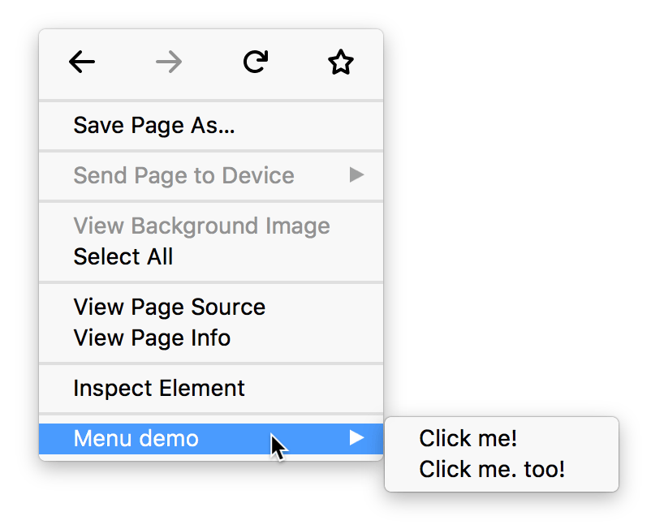
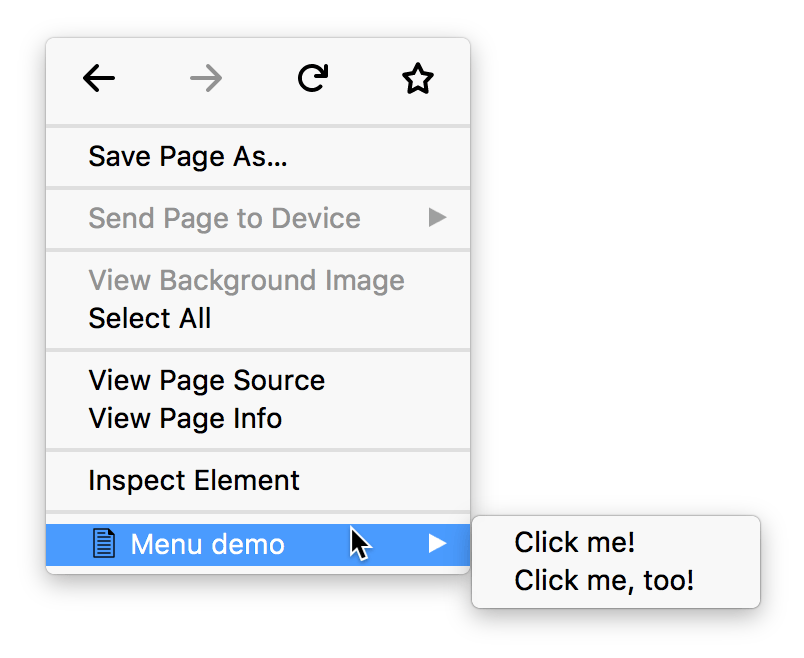
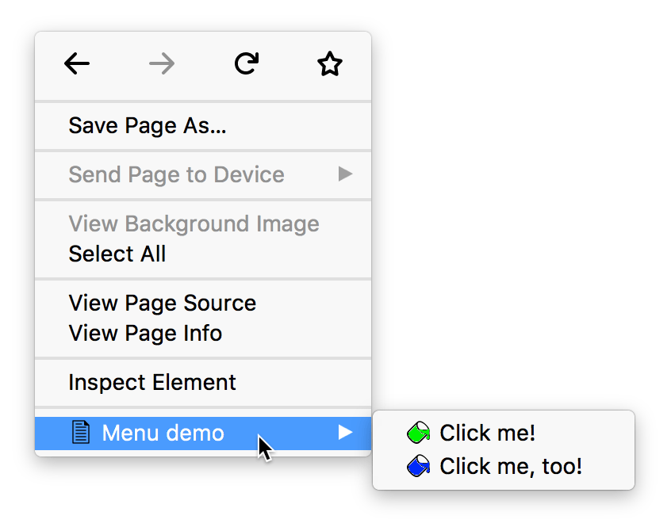
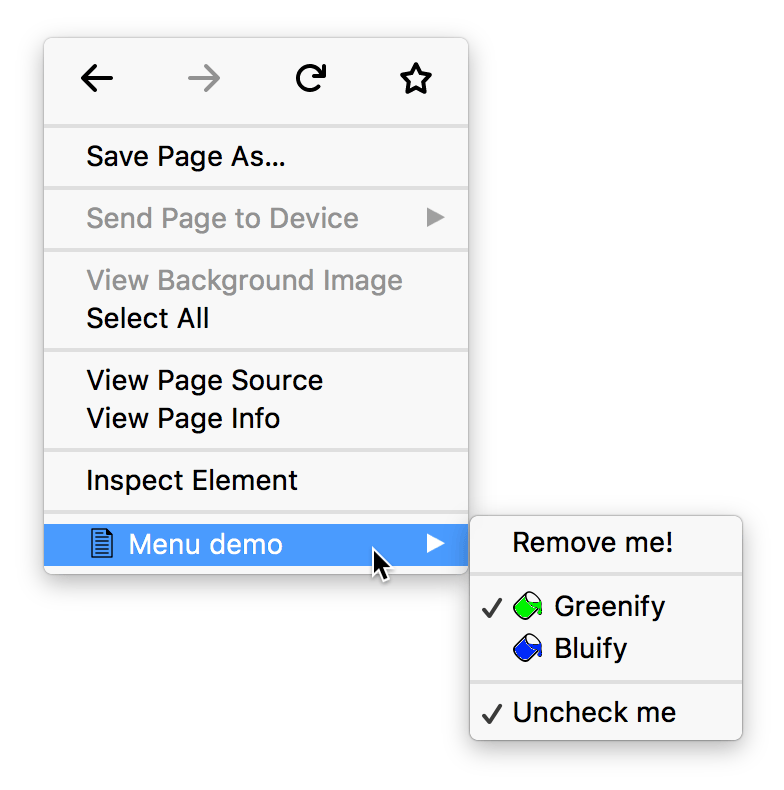

{{AddonSidebar}}

Add items to the browser's menu system.

This API is modeled on Chrome's ["contextMenus"](https://developer.chrome.com/docs/extensions/reference/contextMenus/) API, which enables Chrome extensions to add items to the browser's context menu. The `browser.menus` API adds a few features to Chrome's API.

Before Firefox 55 this API was also originally named `contextMenus`, and that name has been retained as an alias, so you can use `contextMenus` to write code that works in Firefox and also in other browsers.

To use this API you need to have the `menus`  [permission](/en-US/docs/Mozilla/Add-ons/WebExtensions/manifest.json/permissions). You may also use the `contextMenus` alias instead of `menus`, but if you do, the APIs must be accessed as `browser.contextMenus` instead.

Except for [`menus.getTargetElement()`](/en-US/docs/Mozilla/Add-ons/WebExtensions/API/menus/getTargetElement), this API cannot be used from content scripts.

## Creating menu items

To create a menu item call the {{WebExtAPIRef("menus.create()")}} method. You pass this method an object containing options for the item, including the item ID, item type, and the contexts in which it should be shown.

Listen for clicks on your menu item by adding a listener to the {{WebExtAPIRef("menus.onClicked")}} event. This listener will be passed a {{WebExtAPIRef("menus.OnClickData")}} object containing the event's details.

You can create four different types of menu item, based on the value of the `type` property you supply in the options to `create()`:

- "normal": a menu item that just displays a label
- "checkbox": a menu item that represents a binary state. It displays a checkmark next to the label. Clicking the item toggles the checkmark. The click listener will be passed two extra properties: "checked", indicating whether the item is checked now, and "wasChecked", indicating whether the item was checked before the click event.
- "radio": a menu item that represents one of a group of choices. Just like a checkbox, this also displays a checkmark next to the label, and its click listener is passed "checked" and "wasChecked". However, if you create more than one radio item, then the items function as a group of radio items: only one item in the group can be checked, and clicking an item makes it the checked item.
- "separator": a line separating a group of items.

If you have created more than one context menu item or more than one tools menu item, then the items will be placed in a submenu. The submenu's parent will be labeled with the name of the extension. For example, here's an extension called "Menu demo" that's added two context menu items:



## Icons

If you've specified icons for your extension using the ["icons" manifest key](/en-US/docs/Mozilla/Add-ons/WebExtensions/manifest.json/icons), your menu item will display the specified icon next to its label. The browser will try to choose a 16x16 pixel icon for a normal display or a 32x32 pixel icon for a high-density display:



Only for items in a submenu, you can specify custom icons by passing the `icons` option to {{WebExtAPIRef("menus.create()")}}:



## Example

Here's a context menu containing 4 items: a normal item, two radio items with separators on each side, and a checkbox. The radio items are given custom icons.

You could create a submenu like this using code like:

```js
browser.menus.create({
  id: "remove-me",
  title: browser.i18n.getMessage("menuItemRemoveMe"),
  contexts: ["all"]
}, onCreated);

browser.menus.create({
  id: "separator-1",
  type: "separator",
  contexts: ["all"]
}, onCreated);

browser.menus.create({
  id: "greenify",
  type: "radio",
  title: browser.i18n.getMessage("menuItemGreenify"),
  contexts: ["all"],
  checked: true,
  icons: {
    "16": "icons/paint-green-16.png",
    "32": "icons/paint-green-32.png"
  }
}, onCreated);

browser.menus.create({
  id: "bluify",
  type: "radio",
  title: browser.i18n.getMessage("menuItemBluify"),
  contexts: ["all"],
  checked: false,
  icons: {
    "16": "icons/paint-blue-16.png",
    "32": "icons/paint-blue-32.png"
  }
}, onCreated);

browser.menus.create({
  id: "separator-2",
  type: "separator",
  contexts: ["all"]
}, onCreated);

let checkedState = true;

browser.menus.create({
  id: "check-uncheck",
  type: "checkbox",
  title: browser.i18n.getMessage("menuItemUncheckMe"),
  contexts: ["all"],
  checked: checkedState
}, onCreated);
```

## Types

- {{WebExtAPIRef("menus.ContextType")}}
  - : The different contexts a menu can appear in.
- {{WebExtAPIRef("menus.ItemType")}}
  - : The type of menu item: "normal", "checkbox", "radio", "separator".
- {{WebExtAPIRef("menus.OnClickData")}}
  - : Information sent when a menu item is clicked.

## Properties

- {{WebExtAPIRef("menus.ACTION_MENU_TOP_LEVEL_LIMIT")}}
  - : The maximum number of top level extension items that can be added to a menu item whose ContextType is "browser_action" or "page_action".

## Functions

- {{WebExtAPIRef("menus.create()")}}
  - : Creates a new menu item.
- {{WebExtApiRef("menus.getTargetElement()")}}
  - : Returns the element for a given `info.targetElementId`.
- {{WebExtApiRef("menus.overrideContext()")}}
  - : Hide all default Firefox menu items in favor of providing a custom context menu UI.
- {{WebExtAPIRef("menus.refresh()")}}
  - : Update a menu that's currently being displayed.
- {{WebExtAPIRef("menus.remove()")}}
  - : Removes a menu item.
- {{WebExtAPIRef("menus.removeAll()")}}
  - : Removes all menu items added by this extension.
- {{WebExtAPIRef("menus.update()")}}
  - : Updates a previously created menu item.

## Events

- {{WebExtAPIRef("menus.onClicked")}}
  - : Fired when a menu item is clicked.
- {{WebExtAPIRef("menus.onHidden")}}
  - : Fired when the browser hides a menu.
- {{WebExtAPIRef("menus.onShown")}}
  - : Fired when the browser shows a menu.

## Browser compatibility

{{WebExtExamples("h2")}}

{{Compat}}

> **Note:**
>
> This API is based on Chromium's [`chrome.contextMenus`](https://developer.chrome.com/docs/extensions/reference/contextMenus/) API. This documentation is derived from [`context_menus.json`](https://chromium.googlesource.com/chromium/src/+/master/chrome/common/extensions/api/context_menus.json) in the Chromium code.

<!--
// Copyright 2015 The Chromium Authors. All rights reserved.
//
// Redistribution and use in source and binary forms, with or without
// modification, are permitted provided that the following conditions are
// met:
//
//    * Redistributions of source code must retain the above copyright
// notice, this list of conditions and the following disclaimer.
//    * Redistributions in binary form must reproduce the above
// copyright notice, this list of conditions and the following disclaimer
// in the documentation and/or other materials provided with the
// distribution.
//    * Neither the name of Google Inc. nor the names of its
// contributors may be used to endorse or promote products derived from
// this software without specific prior written permission.
//
// THIS SOFTWARE IS PROVIDED BY THE COPYRIGHT HOLDERS AND CONTRIBUTORS
// "AS IS" AND ANY EXPRESS OR IMPLIED WARRANTIES, INCLUDING, BUT NOT
// LIMITED TO, THE IMPLIED WARRANTIES OF MERCHANTABILITY AND FITNESS FOR
// A PARTICULAR PURPOSE ARE DISCLAIMED. IN NO EVENT SHALL THE COPYRIGHT
// OWNER OR CONTRIBUTORS BE LIABLE FOR ANY DIRECT, INDIRECT, INCIDENTAL,
// SPECIAL, EXEMPLARY, OR CONSEQUENTIAL DAMAGES (INCLUDING, BUT NOT
// LIMITED TO, PROCUREMENT OF SUBSTITUTE GOODS OR SERVICES; LOSS OF USE,
// DATA, OR PROFITS; OR BUSINESS INTERRUPTION) HOWEVER CAUSED AND ON ANY
// THEORY OF LIABILITY, WHETHER IN CONTRACT, STRICT LIABILITY, OR TORT
// (INCLUDING NEGLIGENCE OR OTHERWISE) ARISING IN ANY WAY OUT OF THE USE
// OF THIS SOFTWARE, EVEN IF ADVISED OF THE POSSIBILITY OF SUCH DAMAGE.
-->
