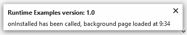

{{AddonSidebar}}

Display notifications to the user, using the underlying operating system's notification mechanism. Because this API uses the operating system's notification mechanism, the details of how notifications appear and behave may differ according to the operating system and the user's settings.

To use this API you need to have the "notifications" [permission](/en-US/docs/Mozilla/Add-ons/WebExtensions/manifest.json/permissions).

The notification looks the same on all desktop operating systems. Something like:

## Types

- {{WebExtAPIRef("notifications.NotificationOptions")}}
  - : Defines the content of a notification.
- {{WebExtAPIRef("notifications.TemplateType")}}
  - : The type of notification. For example, this defines whether the notification can contain an image.

## Functions

- {{WebExtAPIRef("notifications.clear()")}}
  - : Clear a specific notification, given its ID.
- {{WebExtAPIRef("notifications.create()")}}
  - : Create and display a new notification.
- {{WebExtAPIRef("notifications.getAll()")}}
  - : Get all notifications.
- {{WebExtAPIRef("notifications.update()")}}
  - : Update a notification.

## Events

- {{WebExtAPIRef("notifications.onButtonClicked")}}
  - : Fired when the user clicked a button in the notification.
- {{WebExtAPIRef("notifications.onClicked")}}
  - : Fired when the user clicked the notification, but not on a button.
- {{WebExtAPIRef("notifications.onClosed")}}
  - : Fired when a notification closed, either by the system or because the user dismissed it.
- {{WebExtAPIRef("notifications.onShown")}}
  - : Fired immediately after a notification has been shown.

## Browser compatibility

{{Compat}}

{{WebExtExamples("h2")}}

> **Note:** This API is based on Chromium's [`chrome.notifications`](https://developer.chrome.com/docs/extensions/reference/notifications/) API.
