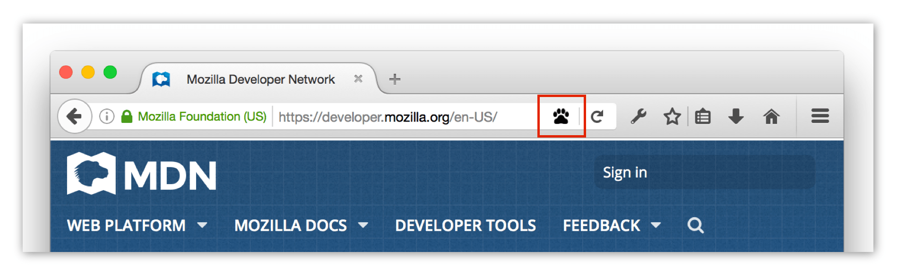

{{AddonSidebar}}

Read and modify attributes of and listen to clicks on the address bar button defined with the [`page_action`](/en-US/docs/Mozilla/Add-ons/WebExtensions/manifest.json/page_action) manifest key.

An [address bar button](/en-US/docs/Mozilla/Add-ons/WebExtensions/user_interface/Page_actions) is a button added to the browser address bar.

You can listen for clicks on the icon in a background script, or specify a [popup](/en-US/docs/Mozilla/Add-ons/WebExtensions/user_interface/Popups) that opens when the icon is clicked.

If you specify a popup, you define its contents and behavior using HTML, CSS, and JavaScript. JavaScript running in the popup gets access to all the same WebExtension APIs as your background scripts. Despite being named `pageAction`, the action code doesn't get access to web page content. To access web page DOM, you need to add a [content script](/en-US/docs/Mozilla/Add-ons/WebExtensions/Content_scripts) and interact with it.

The button also has a context menu, and you can add items to this menu with the {{WebExtAPIRef("menus")}} API using the `page_action` {{WebExtAPIRef("menus.ContextType")}}.

Page actions are for actions that are only relevant to particular pages (such as "bookmark the current tab"). If they are relevant to the browser as a whole (such as "show all bookmarks"), use a [browser action](/en-US/docs/Mozilla/Add-ons/WebExtensions/user_interface/Toolbar_button) instead.

## Types

- {{WebExtAPIRef("pageAction.ImageDataType")}}
  - : Pixel data for an image.

## Functions

- {{WebExtAPIRef("pageAction.show()")}}
  - : Shows the page action for a given tab.
- {{WebExtAPIRef("pageAction.hide()")}}
  - : Hides the page action for a given tab.
- {{WebExtAPIRef("pageAction.isShown()")}}
  - : Checks whether the page action is shown or not.
- {{WebExtAPIRef("pageAction.setTitle()")}}
  - : Sets the page action's title. This is displayed in a tooltip over the page action.
- {{WebExtAPIRef("pageAction.getTitle()")}}
  - : Gets the page action's title.
- {{WebExtAPIRef("pageAction.setIcon()")}}
  - : Sets the page action's icon.
- {{WebExtAPIRef("pageAction.setPopup()")}}
  - : Sets the URL for the page action's popup.
- {{WebExtAPIRef("pageAction.getPopup()")}}
  - : Gets the URL for the page action's popup.
- {{WebExtAPIRef("pageAction.openPopup()")}}
  - : Opens the page action's popup.

## Events

- {{WebExtAPIRef("pageAction.onClicked")}}
  - : Fired when a page action icon is clicked. This event will not fire if the page action has a popup.

## Browser compatibility

{{Compat}}

{{WebExtExamples("h2")}}

> [!NOTE]
> This API is based on Chromium's [`chrome.pageAction`](https://developer.chrome.com/docs/extensions/mv2/reference/pageAction) API. This documentation is derived from [`page_action.json`](https://chromium.googlesource.com/chromium/src/+/master/chrome/common/extensions/api/page_action.json) in the Chromium code.

<!--
// Copyright 2015 The Chromium Authors. All rights reserved.
//
// Redistribution and use in source and binary forms, with or without
// modification, are permitted provided that the following conditions are
// met:
//
//    * Redistributions of source code must retain the above copyright
// notice, this list of conditions and the following disclaimer.
//    * Redistributions in binary form must reproduce the above
// copyright notice, this list of conditions and the following disclaimer
// in the documentation and/or other materials provided with the
// distribution.
//    * Neither the name of Google Inc. nor the names of its
// contributors may be used to endorse or promote products derived from
// this software without specific prior written permission.
//
// THIS SOFTWARE IS PROVIDED BY THE COPYRIGHT HOLDERS AND CONTRIBUTORS
// "AS IS" AND ANY EXPRESS OR IMPLIED WARRANTIES, INCLUDING, BUT NOT
// LIMITED TO, THE IMPLIED WARRANTIES OF MERCHANTABILITY AND FITNESS FOR
// A PARTICULAR PURPOSE ARE DISCLAIMED. IN NO EVENT SHALL THE COPYRIGHT
// OWNER OR CONTRIBUTORS BE LIABLE FOR ANY DIRECT, INDIRECT, INCIDENTAL,
// SPECIAL, EXEMPLARY, OR CONSEQUENTIAL DAMAGES (INCLUDING, BUT NOT
// LIMITED TO, PROCUREMENT OF SUBSTITUTE GOODS OR SERVICES; LOSS OF USE,
// DATA, OR PROFITS; OR BUSINESS INTERRUPTION) HOWEVER CAUSED AND ON ANY
// THEORY OF LIABILITY, WHETHER IN CONTRACT, STRICT LIABILITY, OR TORT
// (INCLUDING NEGLIGENCE OR OTHERWISE) ARISING IN ANY WAY OUT OF THE USE
// OF THIS SOFTWARE, EVEN IF ADVISED OF THE POSSIBILITY OF SUCH DAMAGE.
-->
