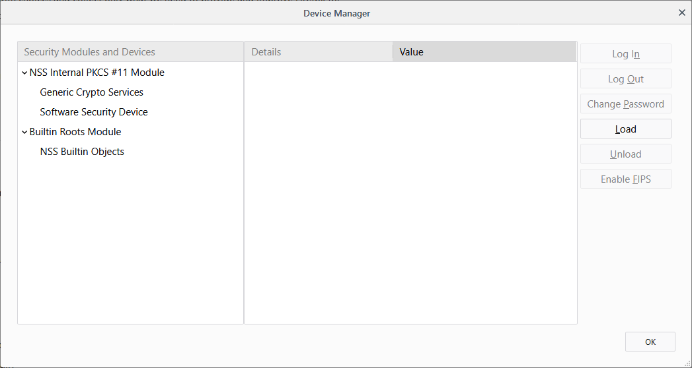
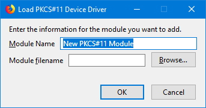

{{AddonSidebar}}

The `pkcs11` API enables an extension to enumerate [PKCS #11](https://en.wikipedia.org/wiki/PKCS_11) security modules and to make them accessible to the browser as sources of keys and certificates.

To use this API you need to have the "pkcs11" [permission](/en-US/docs/Mozilla/Add-ons/WebExtensions/manifest.json/permissions).

## Using the Firefox Preferences Dialog to Install PKCS #11 Modules

Perform the following steps:

1. Save the PKCS #11 module to a permanent location on your local computer
2. Select **Tools > Options** or select the **Firefox menu** and then **Options**
3. Once the Options page opens, select **Privacy & Security**
4. Scroll down to the bottom of the page and under **Certificates** click or tap on **Security Devices…**
   
5. Click or tap the **Load** button
   
6. Enter a name for the security module, such as "_My Client Database_"

   > **Warning:** Be careful about using international characters as there is currently a bug in Firefox where international characters may cause problems.

7. Choose **Browse…** to find the location of the PKCS #11 module on your local computer, and then click or tap **OK** to confirm.

## Provisioning PKCS #11 modules

> **Note:** Starting with Firefox 58, extensions can use this API to enumerate PKCS #11 modules and make them accessible to the browser as sources of keys and certificates.

There are two environmental prerequisites for using this **API**:

- One or more `PKCS #11` modules must be installed on the user's computer
- For each installed `PKCS #11` module, there must be a [native manifest](/en-US/docs/Mozilla/Add-ons/WebExtensions/Native_manifests) file that enables the browser to locate the module.

Most probably, the user or device administrator would install the `PKCS #11` module, and its installer would install the native manifest file at the same time.

However, the module and manifest can't be installed as part of the extension's own installation process.

For details about the manifest file's contents and location, see [Native manifests](/en-US/docs/Mozilla/Add-ons/WebExtensions/Native_manifests).

## Functions

- {{WebExtAPIRef("pkcs11.getModuleSlots()")}}
  - : For each slot in a module, get its name and whether it contains a token.
- {{WebExtAPIRef("pkcs11.installModule()")}}
  - : Installs the named PKCS #11 module.
- {{WebExtAPIRef("pkcs11.isModuleInstalled()")}}
  - : Checks whether the named PKCS #11 module is installed.
- {{WebExtAPIRef("pkcs11.uninstallModule()")}}
  - : Uninstalls the named PKCS #11 module.

## Browser compatibility

{{WebExtExamples("h2")}}

{{Compat}}
