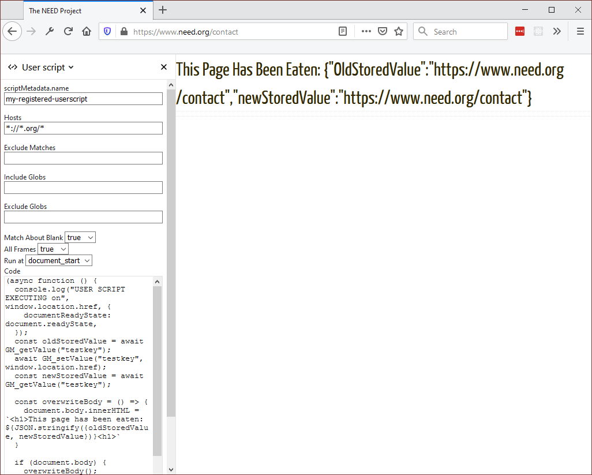

{{AddonSidebar}}

By implementing userScripts, extension developers can modify how sites look and/or work to better meet user needs.

Implement userScripts in your extension using the following steps:

1. Define the script in the extension's manifest using the `"user_scripts"` key.
2. Register the userScript
3. Implement the userScript functions

Let's step through the processes using a small sample web extension that illustrates the process. The example is available in the [webextensions-examples](https://github.com/mdn/webextensions-examples) repository on GitHub.

## userScripts Manifest

A user script is identified by the contents of the [user_scripts](/en-US/docs/Mozilla/Add-ons/WebExtensions/manifest.json/user_scripts) key of the extension's manifest. The minimum information for the `user_scripts` key would be:

```json
  "user_scripts": {
    "api_script": "customUserScriptAPIs.js"
  }
```

The "api_script" property indicates the path to the JavaScript file that contains the code for the `userScript`.

## Load the example extension

Once you have downloaded the example:

Navigate to about:debugging, click on **Load Temporary Add-on…** and double-click on the extension's manifest.

The default code included with the example allows you to load a `userScript` which will "eat" the content of pages matching the Hosts entry. Make any changes you want to make before clicking the **Register script** button at the bottom of the panel.

In the following image, the extension will "eat" the content of pages whose domain name ends in .org. This is the default behavior for this extension.


Nothing will happen until you click the **Register script** button. The button implements the user script according to the settings on this dialog. That means that you can experiment with the behavior of the script without having to implement an extensions yourself.

## Register the userScript

Before a userScript can be executed, it must be registered using the `userScripts.register()` method. Here is the code to register the example extension:

```js
async function registerScript() {
  const params = {
    hosts: stringToArray(hostsInput.value),
    code: codeInput.value,
    excludeMatches: stringToArray(excludeMatchesInput.value),
    includeGlobs: stringToArray(includeGlobsInput.value),
    excludeGlobs: stringToArray(excludeGlobsInput.value),
    runAt: runAtInput.value,
    matchAboutBlank: stringToBool(matchAboutBlankInput.value),
    allFrames: stringToBool(allFramesInput.value),
    scriptMetadata: {name: scriptNameInput.value || null},
  };

  // Store the last submitted values to the extension storage
  // (so that they can be restored when the popup is opened
  // the next time).
  await browser.storage.local.set({
    lastSetValues: params,
  });

  try {
    // Clear the last userScripts.register result.
    lastResultEl.textContent = "";

    await browser.runtime.sendMessage(params);
    lastResultEl.textContent = "UserScript successfully registered";
    // Clear the last userScripts.register error.
    lastErrorEl.textContent = "";

    // Clear the last error stored.
    await browser.storage.local.remove("lastError");
  } catch (e) {
    // There was an error on registering the userScript,
    // let's show the error message in the popup and store
    // the last error into the extension storage.

    const lastError = `${e}`;
    // Show the last userScripts.register error.
    lastErrorEl.textContent = lastError;

    // Store the last error.
    await browser.storage.local.set({lastError});
  }
}
```

This code first initializes the params object to pass values to the [userScripts.register](/en-US/docs/Mozilla/Add-ons/WebExtensions/API/userScripts/register) method.

## Implement the userScript functions

Once the script has been registered, navigate to a page whose domain name ends in .org, and you will see something like this:



## See also

- {{WebExtAPIRef("userScripts")}}
- {{WebExtAPIRef("userScripts.register()", "userScripts.register()")}}
- {{WebExtAPIRef("userScripts.onBeforeScript")}}
