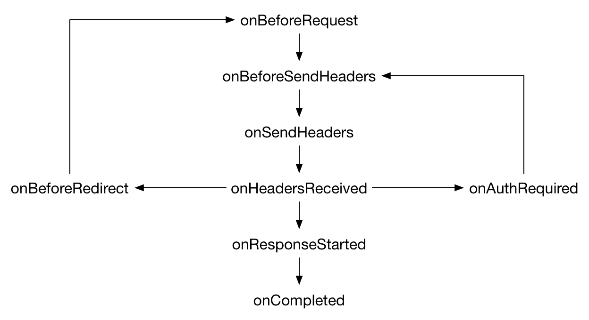

{{AddonSidebar}}

Add event listeners for the various stages of making an HTTP request, which includes websocket requests on `ws://` and `wss://`. The event listener receives detailed information about the request and can modify or cancel the request.

Each event is fired at a particular stage of the request. The typical sequence of events is like this:

{{WebExtAPIRef("webRequest.onErrorOccurred", "onErrorOccurred")}} can fire at any time during the request. Also, note that sometimes the sequence of events may differ from this. For example, in Firefox, on an [HSTS](/en-US/docs/Web/HTTP/Headers/Strict-Transport-Security) upgrade, the `onBeforeRedirect` event is triggered immediately after `onBeforeRequest`. `onErrorOccurred` is also fired if [Firefox Tracking Protection](https://support.mozilla.org/en-US/kb/enhanced-tracking-protection-firefox-desktop) blocks a request.

All events – _except_ `onErrorOccurred` – can take three arguments to `addListener()`:

- the listener itself
- a {{WebExtAPIRef("webRequest.RequestFilter", "filter")}} object, so you can only be notified for requests made to particular URLs or for particular types of resource
- an optional `extraInfoSpec` object. You can use this to pass additional event-specific instructions.

The listener function is passed a `details` object containing information about the request. This includes a request ID, which is provided to enable an add-on to correlate events associated with a single request. It is unique within a browser session and the add-on's context. It stays the same throughout a request, even across redirections and authentication exchanges.

To use the `webRequest` API for a given host, an extension must have the `"webRequest"` [API permission](/en-US/docs/Mozilla/Add-ons/WebExtensions/manifest.json/permissions#api_permissions) and the [host permission](/en-US/docs/Mozilla/Add-ons/WebExtensions/manifest.json/permissions#host_permissions) for that host. To use the `"blocking"` feature, the extension must also have the `"webRequestBlocking"` API permission.

To intercept resources loaded by a page (such as images, scripts, or stylesheets), the extension must have the host permission for the resource as well as for the main page requesting the resource. For example, if a page at `https://developer.mozilla.org` loads an image from `https://mdn.mozillademos.org`, then an extension must have both host permissions if it is to intercept the image request.

## Modifying requests

On some of these events, you can modify the request. Specifically, you can:

- cancel the request in:

  - {{WebExtAPIRef("webRequest.onBeforeRequest", "onBeforeRequest")}}
  - {{WebExtAPIRef("webRequest.onBeforeSendHeaders", "onBeforeSendHeaders")}}
  - {{WebExtAPIRef("webRequest.onAuthRequired", "onAuthRequired")}}

- redirect the request in:

  - {{WebExtAPIRef("webRequest.onBeforeRequest", "onBeforeRequest")}}
  - {{WebExtAPIRef("webRequest.onHeadersReceived", "onHeadersReceived")}}

- modify request headers in:

  - {{WebExtAPIRef("webRequest.onBeforeSendHeaders", "onBeforeSendHeaders")}}

- modify response headers in:

  - {{WebExtAPIRef("webRequest.onHeadersReceived", "onHeadersReceived")}}

- supply authentication credentials in:

  - {{WebExtAPIRef("webRequest.onAuthRequired", "onAuthRequired")}}

To do this, you need to pass an option with the value `"blocking"` in the `extraInfoSpec` argument to the event's `addListener()`. This makes the listener synchronous.

In the listener, you can then return a {{WebExtAPIRef("webRequest.BlockingResponse", "BlockingResponse")}} object, which indicates the modification you need to make: for example, the modified request header you want to send.

## Requests at browser startup

When a listener is registered with the `"blocking"` option and is registered during the extension startup, if a request is made during the browser startup that matches the listener the extension starts early. This enables the extension to observe the request at browser startup. If you don't take these steps, requests made at startup could be missed.

## Speculative requests

The browser can make speculative connections, where it determines that a request to a URI may be coming soon. This type of connection does not provide valid tab information, so request details such as `tabId`, `frameId`, `parentFrameId`, etc. are inaccurate. These connections have a {{WebExtAPIRef("webRequest.ResourceType")}} of `speculative`.

## Accessing security information

In the {{WebExtAPIRef("webRequest.onHeadersReceived", "onHeadersReceived")}} listener you can access the [TLS](/en-US/docs/Glossary/TLS) properties of a request by calling {{WebExtAPIRef("webRequest.getSecurityInfo()", "getSecurityInfo()")}}. To do this you must also pass "blocking" in the `extraInfoSpec` argument to the event's `addListener()`.

You can read details of the TLS handshake, but can't modify them or override the browser's trust decisions.

## Modifying responses

To modify the HTTP response bodies for a request, call {{WebExtAPIRef("webRequest.filterResponseData")}}, passing it the ID of the request. This returns a {{WebExtAPIRef("webRequest.StreamFilter")}} object that you can use to examine and modify the data as it is received by the browser.

To do this, you must have the `"webRequestBlocking"` API permission as well as the `"webRequest"` [API permission](/en-US/docs/Mozilla/Add-ons/WebExtensions/manifest.json/permissions#api_permissions) and the [host permission](/en-US/docs/Mozilla/Add-ons/WebExtensions/manifest.json/permissions#host_permissions) for the relevant host.

## Types

- {{WebExtAPIRef("webRequest.BlockingResponse")}}
  - : An object of this type is returned by event listeners that have set `"blocking"` in their `extraInfoSpec` argument. By setting particular properties in `BlockingResponse`, the listener can modify network requests.
- {{WebExtAPIRef("webRequest.CertificateInfo")}}
  - : An object describing a single X.509 certificate.
- {{WebExtAPIRef("webRequest.HttpHeaders")}}
  - : An array of HTTP headers. Each header is represented as an object with two properties: `name` and either `value` or `binaryValue`.
- {{WebExtAPIRef("webRequest.RequestFilter")}}
  - : An object describing filters to apply to `webRequest` events.
- {{WebExtAPIRef("webRequest.ResourceType")}}
  - : Represents a particular kind of resource fetched in a web request.
- {{WebExtAPIRef("webRequest.SecurityInfo")}}
  - : An object describing the security properties of a particular web request.
- {{WebExtAPIRef("webRequest.StreamFilter")}}
  - : An object that can be used to monitor and modify HTTP responses while they are being received.
- {{WebExtAPIRef("webRequest.UploadData")}}
  - : Contains data uploaded in a URL request.

## Properties

- {{WebExtAPIRef("webRequest.MAX_HANDLER_BEHAVIOR_CHANGED_CALLS_PER_10_MINUTES", "webRequest.MAX_HANDLER_BEHAVIOR_CHANGED_CALLS_PER_10_MINUTES")}}
  - : The maximum number of times that {{WebExtAPIRef("WebRequest.handlerBehaviorChanged", "handlerBehaviorChanged()")}} can be called in a 10 minute period.

## Methods

- {{WebExtAPIRef("webRequest.handlerBehaviorChanged()")}}
  - : This method can be used to ensure that event listeners are applied correctly when pages are in the browser's in-memory cache.
- {{WebExtAPIRef("webRequest.filterResponseData()")}}
  - : Returns a {{WebExtAPIRef("webRequest.StreamFilter")}} object for a given request.
- {{WebExtAPIRef("webRequest.getSecurityInfo()")}}
  - : Gets detailed information about the [TLS](/en-US/docs/Glossary/TLS) connection associated with a given request.

## Events

- {{WebExtAPIRef("webRequest.onBeforeRequest")}}
  - : Fired when a request is about to be made, and before headers are available. This is a good place to listen if you want to cancel or redirect the request.
- {{WebExtAPIRef("webRequest.onBeforeSendHeaders")}}
  - : Fired before sending any HTTP data, but after HTTP headers are available. This is a good place to listen if you want to modify HTTP request headers.
- {{WebExtAPIRef("webRequest.onSendHeaders")}}
  - : Fired just before sending headers. If your add-on or some other add-on modified headers in `{{WebExtAPIRef("webRequest.onBeforeSendHeaders", "onBeforeSendHeaders")}}`, you'll see the modified version here.
- {{WebExtAPIRef("webRequest.onHeadersReceived")}}
  - : Fired when the HTTP response headers associated with a request have been received. You can use this event to modify HTTP response headers.
- {{WebExtAPIRef("webRequest.onAuthRequired")}}
  - : Fired when the server asks the client to provide authentication credentials. The listener can do nothing, cancel the request, or supply authentication credentials.
- {{WebExtAPIRef("webRequest.onResponseStarted")}}
  - : Fired when the first byte of the response body is received. For HTTP requests, this means that the status line and response headers are available.
- {{WebExtAPIRef("webRequest.onBeforeRedirect")}}
  - : Fired when a server-initiated redirect is about to occur.
- {{WebExtAPIRef("webRequest.onCompleted")}}
  - : Fired when a request is completed.
- {{WebExtAPIRef("webRequest.onErrorOccurred")}}
  - : Fired when an error occurs.

## Browser compatibility

{{Compat}}

[Additional notes on Chrome incompatibilities](/en-US/docs/Mozilla/Add-ons/WebExtensions/Chrome_incompatibilities#webrequest_api).

{{WebExtExamples("h2")}}

> **Note:** This API is based on Chromium's [`chrome.webRequest`](https://developer.chrome.com/docs/extensions/reference/webRequest/) API. This documentation is derived from [`web_request.json`](https://chromium.googlesource.com/chromium/src/+/master/extensions/common/api/web_request.json) in the Chromium code.
>
> Microsoft Edge compatibility data is supplied by Microsoft Corporation and is included here under the Creative Commons Attribution 3.0 United States License.

<!--
// Copyright 2015 The Chromium Authors. All rights reserved.
//
// Redistribution and use in source and binary forms, with or without
// modification, are permitted provided that the following conditions are
// met:
//
//    * Redistributions of source code must retain the above copyright
// notice, this list of conditions and the following disclaimer.
//    * Redistributions in binary form must reproduce the above
// copyright notice, this list of conditions and the following disclaimer
// in the documentation and/or other materials provided with the
// distribution.
//    * Neither the name of Google Inc. nor the names of its
// contributors may be used to endorse or promote products derived from
// this software without specific prior written permission.
//
// THIS SOFTWARE IS PROVIDED BY THE COPYRIGHT HOLDERS AND CONTRIBUTORS
// "AS IS" AND ANY EXPRESS OR IMPLIED WARRANTIES, INCLUDING, BUT NOT
// LIMITED TO, THE IMPLIED WARRANTIES OF MERCHANTABILITY AND FITNESS FOR
// A PARTICULAR PURPOSE ARE DISCLAIMED. IN NO EVENT SHALL THE COPYRIGHT
// OWNER OR CONTRIBUTORS BE LIABLE FOR ANY DIRECT, INDIRECT, INCIDENTAL,
// SPECIAL, EXEMPLARY, OR CONSEQUENTIAL DAMAGES (INCLUDING, BUT NOT
// LIMITED TO, PROCUREMENT OF SUBSTITUTE GOODS OR SERVICES; LOSS OF USE,
// DATA, OR PROFITS; OR BUSINESS INTERRUPTION) HOWEVER CAUSED AND ON ANY
// THEORY OF LIABILITY, WHETHER IN CONTRACT, STRICT LIABILITY, OR TORT
// (INCLUDING NEGLIGENCE OR OTHERWISE) ARISING IN ANY WAY OUT OF THE USE
// OF THIS SOFTWARE, EVEN IF ADVISED OF THE POSSIBILITY OF SUCH DAMAGE.
-->
