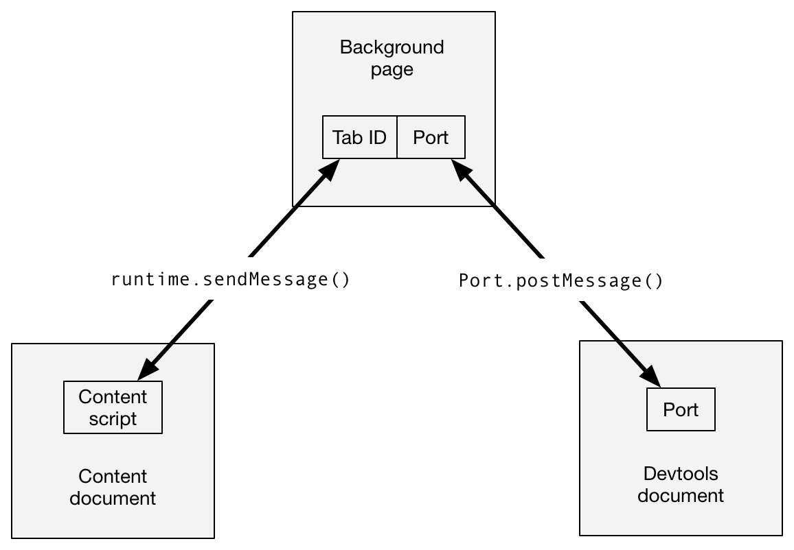

{{AddonSidebar}}

> [!NOTE]
> This page describes the devtools APIs in Firefox 55. Although the APIs are based on the [Chrome devtools APIs](https://developer.chrome.com/docs/extensions/how-to/devtools/extend-devtools), Firefox does not implement all those features; therefore, not all features are documented here. To see which features are missing, refer to [Limitations of the devtools APIs](#limitations_of_the_devtools_apis).

You can use WebExtensions APIs to extend the browser's built-in developer tools. To create a devtools extension, include the "[devtools_page](/en-US/docs/Mozilla/Add-ons/WebExtensions/manifest.json/devtools_page)" key in your [manifest.json](/en-US/docs/Mozilla/Add-ons/WebExtensions/manifest.json) file:

```json
"devtools_page": "devtools/devtools-page.html"
```

The value of this key is a URL pointing to an HTML file bundled with your extension, a special extension page called the devtools page. The URL must be relative to the manifest.json file.

This manifest key implicitly sets the `"devtools"` permission, which triggers [an install-time permission warning about devtools](https://support.mozilla.org/en-US/kb/permission-request-messages-firefox-extensions#w_extend-developer-tools-to-access-your-data-in-open-tabs). To avoid this warning, mark the feature as optional by listing the `"devtools"` permission in the [`optional_permissions`](/en-US/docs/Mozilla/Add-ons/WebExtensions/manifest.json/optional_permissions) manifest key. Setting the optional permission can be particularly helpful when introducing devtools features in an update, as it prevents the extension from being disabled (in Chrome) or blocked from updating (in Firefox).

## The devtools page

The devtools page is loaded when the browser devtools are opened, and unloaded when it is closed. Note that because the devtools window is associated with a single tab, it's quite possible for more than one devtools window - hence more than one devtools page - to exist at the same time.

The devtools page doesn't have any visible DOM, but can include JavaScript sources using [`<script>`](/en-US/docs/Web/HTML/Element/script) tags. The sources must be bundled with the extension itself. The sources get access to:

- The normal DOM APIs accessible through the global [`window`](/en-US/docs/Web/API/Window) object
- The same [WebExtension APIs as in Content Scripts](/en-US/docs/Mozilla/Add-ons/WebExtensions/Content_scripts#webextension_apis)
- The devtools APIs:

  - [`devtools.inspectedWindow`](/en-US/docs/Mozilla/Add-ons/WebExtensions/API/devtools/inspectedWindow)
  - [`devtools.network`](/en-US/docs/Mozilla/Add-ons/WebExtensions/API/devtools/network)
  - [`devtools.panels`](/en-US/docs/Mozilla/Add-ons/WebExtensions/API/devtools/panels)

Note that the devtools page does not get access to any other WebExtension APIs, and the background page doesn't get access to the devtools APIs. Instead, the devtools page and the background page must communicate using the `runtime` messaging APIs. Here's an example:

```html
<!doctype html>
<html lang="en-US">
  <head>
    <meta charset="utf-8" />
    <title>DevTools Extension</title>
  </head>
  <body>
    <script src="devtools.js"></script>
  </body>
</html>
```

The `devtools.js` file will hold the actual code creating your dev tools extensions.

## Creating panels

The devtools window hosts a number of separate tools - the JavaScript Debugger, Network Monitor, and so on. A row of tabs across the top lets the user switch between the different tools. The window hosting each tool's user interface is called a "panel".

Using the `devtools.panels.create()` API, you can create your own panel in the devtools window:

```js
browser.devtools.panels
  .create(
    "My Panel", // title
    "/icons/star.png", // icon
    "/devtools/panel/panel.html", // content
  )
  .then((newPanel) => {
    newPanel.onShown.addListener(initialisePanel);
    newPanel.onHidden.addListener(unInitialisePanel);
  });
```

This takes three mandatory arguments: the panel's title, icon, and content. It returns a [`Promise`](/en-US/docs/Web/JavaScript/Reference/Global_Objects/Promise) which resolves to a `devtools.panels.ExtensionPanel` object representing the new panel.

## Interacting with the target window

The developer tools are always attached to a particular browser tab. This is referred to as the "target" for the developer tools, or the "inspected window". You can interact with the inspected window using the [`devtools.inspectedWindow`](/en-US/docs/Mozilla/Add-ons/WebExtensions/API/devtools/inspectedWindow) API.

### Running code in the target window

The [`devtools.inspectedWindow.eval()`](/en-US/docs/Mozilla/Add-ons/WebExtensions/API/devtools/inspectedWindow/eval) provides one way to run code in the inspected window.

This is somewhat like using {{WebExtAPIRef("tabs.executeScript()")}} to inject a content script, but with one important difference:

- unlike content scripts, scripts loaded using `devtools.inspectedWindow.eval()` **do not** get [a "clean view of the DOM"](/en-US/docs/Mozilla/Add-ons/WebExtensions/Content_scripts#dom_access): that is, they can see changes to the page made by page scripts.

> [!NOTE]
> A clean view of the DOM is a security feature, intended to help prevent hostile pages from tricking extensions by redefining the behavior of native DOM functions. This means you need to be very careful using eval(), and should use a normal content script if you can.

Scripts loaded using `devtools.inspectedWindow.eval()` also don't see any JavaScript variables defined by content scripts.

### Working with content scripts

A devtools document doesn't have direct access to {{WebExtAPIRef("tabs.executeScript()")}}, so if you need to inject a content script, the devtools document must send a message to the background script asking it to inject the script. The [`devtools.inspectedWindow.tabId`](/en-US/docs/Mozilla/Add-ons/WebExtensions/API/devtools/inspectedWindow/tabId) provides the ID of the target tab: the devtools document can pass this to the background script, and the background script can in turn pass it into {{WebExtAPIRef("tabs.executeScript()")}}:

```js
// devtools-panel.js

const scriptToAttach = "document.body.innerHTML = 'Hi from the devtools';";

window.addEventListener("click", () => {
  browser.runtime.sendMessage({
    tabId: browser.devtools.inspectedWindow.tabId,
    script: scriptToAttach,
  });
});
```

```js
// background.js

function handleMessage(request, sender, sendResponse) {
  browser.tabs.executeScript(request.tabId, {
    code: request.script,
  });
}

browser.runtime.onMessage.addListener(handleMessage);
```

If you need to exchange messages between the content scripts running in the target window and a devtools document, it's a good idea to use the {{WebExtAPIRef("runtime.connect()")}} and {{WebExtAPIRef("runtime.onConnect")}} to set up a connection between the background page and the devtools document. The background page can then maintain a mapping between tab IDs and {{WebExtAPIRef("runtime.Port")}} objects, and use this to route messages between the two scopes.



## Limitations of the devtools APIs

These APIs are based on the Chrome devtools APIs, but many features are still missing, compared with Chrome. This section lists the features that are still not implemented, as of Firefox 54. Note that the devtools APIs are under active development and we expect to add support for most of them in future releases.

### devtools.inspectedWindow

The following are not supported:

- `inspectedWindow.getResources()`
- `inspectedWindow.onResourceAdded`
- `inspectedWindow.onResourceContentCommitted`

None of the options to `inspectedWindow.eval()` are supported.

Scripts injected using `inspectedWindow.eval()` can't use all the Console's command-line helper functions, but `$0` and `inspect()` are both supported (starting from Firefox 55).

### devtools.panels

The following are not supported:

- `panels.elements`
- `panels.sources`
- `panels.setOpenResourceHandler()`
- `panels.openResource()`
- `panels.ExtensionPanel.createStatusBarButton()`
- `panels.Button`
- `panels.ElementsPanel`
- `panels.SourcesPanel`

## Examples

The [webextensions-examples](https://github.com/mdn/webextensions-examples) repo on GitHub, contains several examples of extensions that use devtools panels:

- [devtools-panels](https://github.com/mdn/webextensions-examples/tree/main/devtools-panels) use devtools panels:
