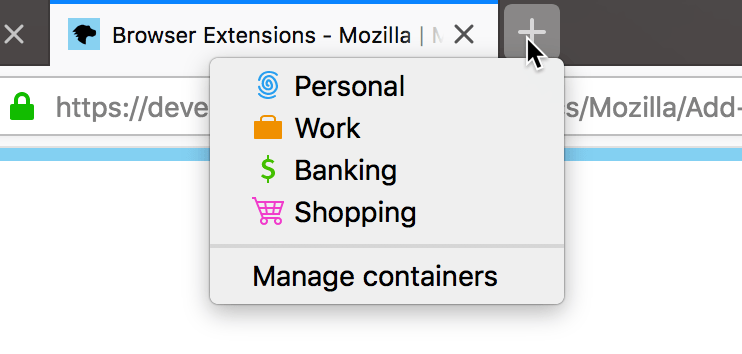
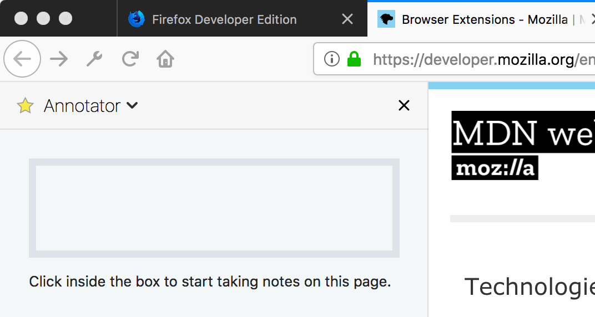
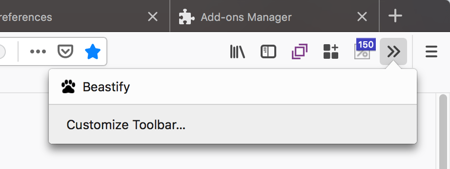
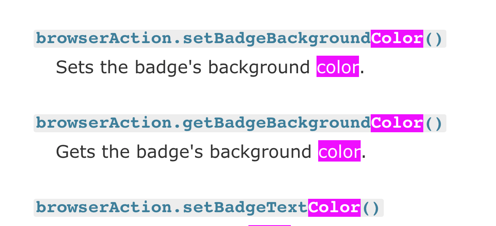
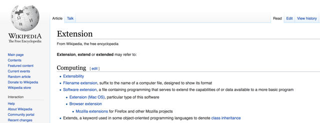
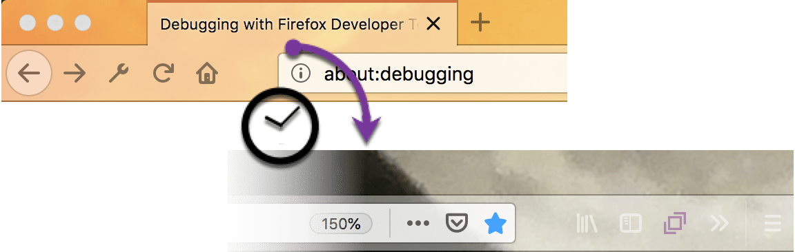
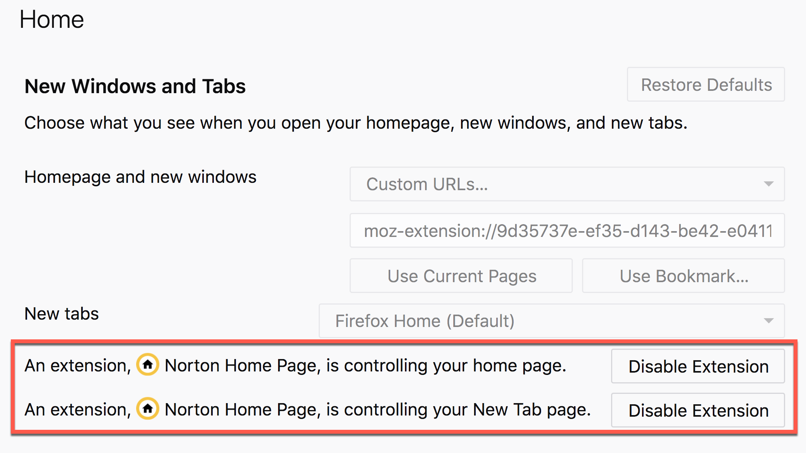
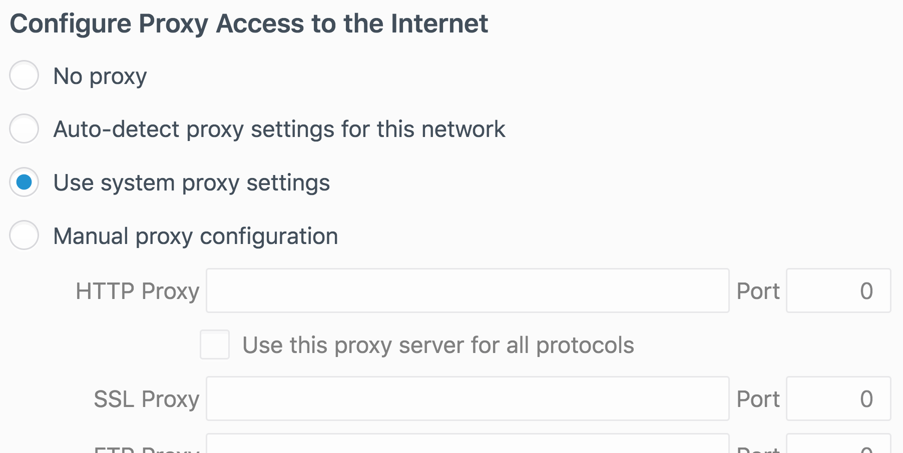

{{AddonSidebar}}

Firefox is a great place to begin your browser extension development. To start, you get the highest compliance with the proposed browser extension API including use of the `browser.*` namespace and promises for handling asynchronous events. Then, there is a highly supportive community of extension developers, ready to assist you.

Firefox also offers some unique features that you can use to build more secure, easy to use, and more visually appealing extensions. Just take a look at what's available:

<table class="standard-table">
  <tbody>
    <tr>
      <td>
        

          Help users separate their browser activities with
          <a
            href="/en-US/docs/Mozilla/Add-ons/WebExtensions/API/contextualIdentities"
            >Contextual Identities</a
          >
          a.k.a. Containers. Give groups of tabs their own local browser
          storage: cookie store and local data in localStorage and indexedDB.
          This keeps details such as site preferences, signed in sessions, and
          ad tracking data private to the tabs.
        

      </td>
      <td>
        
      </td>
    </tr>
    <tr>
      <td>
        

          Record and display additional or complementary information about a web
          page with the
          <a
            href="/en-US/docs/Mozilla/Add-ons/WebExtensions/user_interface/Sidebars"
            >Sidebar</a
          >
          UI component, a panel that sits alongside web pages.
        

      </td>
      <td>
        
      </td>
    </tr>
    <tr>
      <td>
        

          Better integrate your extension with the browser using the ability to
          pick up the browser style in page and browser actions as well as the
          sidebar UI. Define, in the <code>manifest.json</code> file, the URLs
          where a page action is shown or hidden, and choose where to place the
          browser action icon.
        

      </td>
      <td>
        
      </td>
    </tr>
    <tr>
      <td>
        

          Help users locate content of interest in a web page, with the ability
          to
          <a href="/en-US/docs/Mozilla/Add-ons/WebExtensions/API/find"
            >find and highlight text in a webpage</a
          >.
        

      </td>
      <td>
        
      </td>
    </tr>
    <tr>
      <td>
        

          Perform searches directly from your extension, with features to
          <a href="/en-US/docs/Mozilla/Add-ons/WebExtensions/API/search"
            >get details of search engines and perform a search</a
          >.
        

      </td>
      <td>
        
      </td>
    </tr>
    <tr>
      <td>
        

          Add an extra dimension to your themes by
          <a href="/en-US/docs/Mozilla/Add-ons/WebExtensions/API/theme"
            >updating the browser theme at runtime</a
          >. With this feature you can alternate themes by time of day, apply a
          different theme when users browse your website, reflect user actions
          in your extension, and more.
        

      </td>
      <td>
        
      </td>
    </tr>
    <tr>
      <td>
        

          Provide users with control over their browsing experience from your
          extension with the ability to
          <a
            href="/en-US/docs/Mozilla/Add-ons/WebExtensions/API/browserSettings"
            >modify (some) global browser settings</a
          >.
        

      </td>
      <td>
        
      </td>
    </tr>
    <tr>
      <td>
        

          Enable users to reliably add your extension's features to new pages
          and sites, with the ability to
          <a href="/en-US/docs/Mozilla/Add-ons/WebExtensions/API/contentScripts"
            >register and unregister content scripts at runtime</a
          >.
        

      </td>
      <td>
        
      </td>
    </tr>
    <tr>
      <td>
        

          Take advantage of external services to handle protocols or content
          types by registering
          <a
            href="/en-US/docs/Mozilla/Add-ons/WebExtensions/manifest.json/protocol_handlers"
            >protocol handlers</a
          >
          in the <code>manifest.json</code>.
        

      </td>
      <td>
        
      </td>
    </tr>
    <tr>
      <td>
        

          Perform additional web tasks such as
          <a href="/en-US/docs/Mozilla/Add-ons/WebExtensions/API/dns"
            >resolving domain names</a
          >
          and
          <a href="/en-US/docs/Mozilla/Add-ons/WebExtensions/API/proxy"
            >proxying web requests</a
          >.
        

      </td>
      <td>
        
      </td>
    </tr>
    <tr>
      <td>
        

          Add advanced security capabilities
          <a href="/en-US/docs/Mozilla/Add-ons/WebExtensions/API/pkcs11"
            >using PKCS #11 security modules to source keys and certificates</a
          >.
        

      </td>
      <td>
        
      </td>
    </tr>
  </tbody>
</table>

Icons from [icon8](https://icons8.com/)
