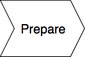
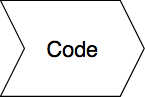
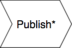
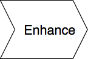
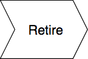

{{AddonSidebar}}

<table>
  <tbody>
    <tr>
      <td>
        
      </td>
      <td>
        
      </td>
      <td>
        
      </td>
      <td>
        
      </td>
      <td>
        
      </td>
    </tr>
    <tr>
      <td>
        <ul>
          <li>Choose a Firefox version for web extension development</li>
          <li>Choose your IDE or code editor</li>
          <li>
            <a
              href="https://extensionworkshop.com/documentation/develop/getting-started-with-web-ext/"
              >Install web-ext</a
            >
          </li>
          <li>
            Get familiar with the
            <a href="/en-US/docs/Mozilla/Add-ons/AMO/Policy"
              >add-on policies and developer agreement</a
            >
          </li>
        </ul>
      </td>
      <td>
        <ul>
          <li>
            <a
              href="/en-US/docs/Mozilla/Add-ons/WebExtensions/Your_first_WebExtension"
              >Code your extension</a
            >
          </li>
          <li>
            Run your extension with<a
              href="https://extensionworkshop.com/documentation/develop/getting-started-with-web-ext/#testing_out_an_extension"
            >
              web-ext run</a
            >
            or
            <a
              href="https://extensionworkshop.com/documentation/develop/temporary-installation-in-firefox/"
              >about: debugging</a
            >)
          </li>
          <li>
            <a
              href="https://extensionworkshop.com/documentation/develop/testing-persistent-and-restart-features/"
              >Test persistent and restart features</a
            >
          </li>
          <li>
            Debug with the<a href="/en-US/docs/Tools/Browser_Toolbox">
              Addon Debugging Window</a
            >
          </li>
        </ul>
      </td>
      <td>
        <ul>
          <li>
            Package your extension with<a
              href="https://extensionworkshop.com/documentation/develop/getting-started-with-web-ext/#packaging_your_extension"
            >
              web-ext build</a
            >
          </li>
          <li>
            Create an
            <a href="https://addons.mozilla.org">addons.mozilla.org</a> account
          </li>
          <li>
            <a
              href="https://extensionworkshop.com/documentation/publish/submitting-an-add-on/"
              >Submit your extension</a
            >
          </li>
          <li>
            <a
              href="https://extensionworkshop.com/documentation/publish/source-code-submission/"
              >Submit your source code</a
            >
            (if required)
          </li>
          <li>
            <a
              href="https://extensionworkshop.com/documentation/develop/create-an-appealing-listing/"
              >Create an appealing listing</a
            >
          </li>
        </ul>
      </td>
      <td>
        <ul>
          <li>Responded to Mozilla extension review</li>
          <li>Promote your extension</li>
          <li>
            <a
              href="https://extensionworkshop.com/documentation/publish/recommended-extensions/"
              >Nominate your extension to be featured</a
            >
          </li>
          <li>Update and improve your extension</li>
        </ul>
      </td>
      <td>
        <ul>
          <li>
            <a
              href="https://extensionworkshop.com/documentation/manage/retiring-your-extension/"
              >Retire your extension</a
            >
          </li>
        </ul>
      </td>
    </tr>
  </tbody>
</table>

\* Or distribute your extension for [sideloading](https://extensionworkshop.com/documentation/publish/distribute-sideloading/), [desktop apps](https://extensionworkshop.com/documentation/publish/distribute-for-desktop-apps/), or [in an enterprise](https://extensionworkshop.com/documentation/enterprise/).

**Have an extension you want to bring to Firefox?** We provide advice, guidelines, and tools to help making make porting straightforward. To get started, visit [Porting a Google Chrome extension](https://extensionworkshop.com/documentation/develop/porting-a-google-chrome-extension/).
