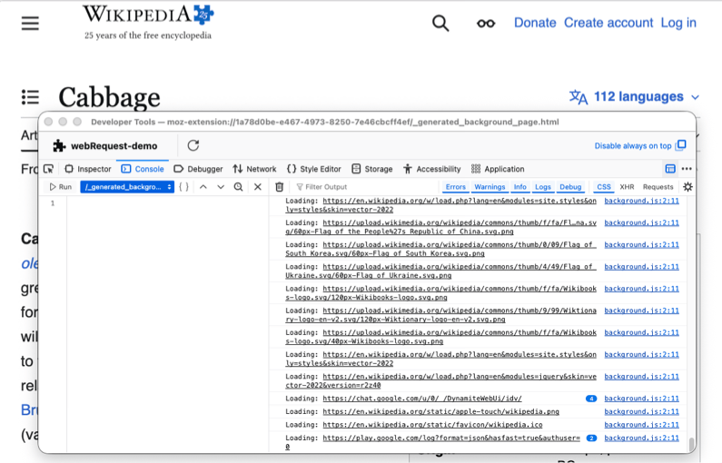
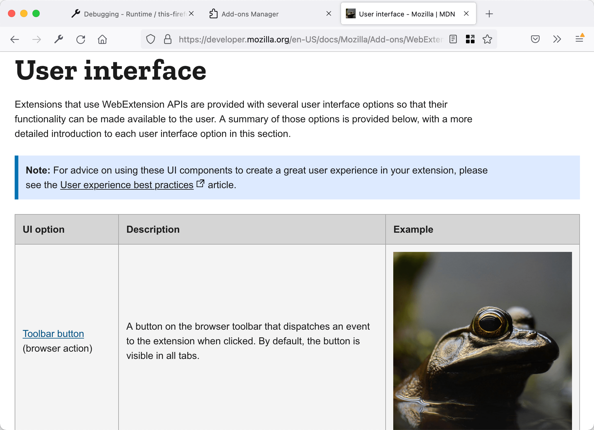
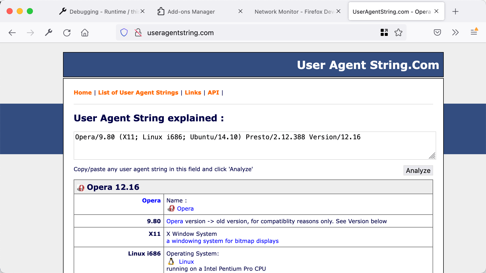

Two APIs are available for intercepting HTTP requests: {{WebExtAPIRef("webRequest")}} and {{WebExtAPIRef("declarativeNetRequest")}}.

The {{WebExtAPIRef("webRequest")}} API intercepts requests by adding event listeners to the various stages of an HTTP request. The extension's listeners can inspect and modify requests programmatically: getting access to request and response headers and bodies, canceling requests, and redirecting them. Use `webRequest` when your extension needs to handle requests in ways that you can't determine in advance, such as when the logic depends on the content of a prior request or on dynamic extension state.

The {{WebExtAPIRef("declarativeNetRequest")}} API intercepts requests using declarative rules that specify conditions and actions. The browser evaluates these rules and handles requests directly, without notifying the extension about individual requests. This behavior makes `declarativeNetRequest` more performant and privacy-preserving than `webRequest`, as extensions don't have access to the content of individual requests. `declarativeNetRequest` also doesn't require a background page and can block or upgrade requests without [host permissions](/en-US/docs/Mozilla/Add-ons/WebExtensions/manifest.json/permissions#host_permissions). Use `declarativeNetRequest` when your extension's request-handling logic can be expressed as a fixed set of rules, for example, in content blockers.

This article looks at examples of using both APIs.

## Using the webRequest API

This section includes examples that use the `webRequest` API to:

- Log request URLs.
- Redirect requests.
- Modify request headers.

### Logging request URLs

To see how you can use `webRequest` to log requests, create a new directory called "requests".
In that directory, create a file called "manifest.json" and add:

```json
{
  "description": "Demonstrating webRequests",
  "manifest_version": 3,
  "name": "webRequest-demo",
  "version": "1.0",

  "permissions": ["webRequest"],
  "host_permissions": ["<all_urls>"],

  "background": {
    "scripts": ["background.js"]
  }
}
```

Next, create a file called "background.js" and add:

```js
function logURL(requestDetails) {
  console.log(`Loading: ${requestDetails.url}`);
}

browser.webRequest.onBeforeRequest.addListener(logURL, {
  urls: ["<all_urls>"],
});
```

You use {{WebExtAPIRef("webRequest.onBeforeRequest", "onBeforeRequest")}} to call the `logURL()` function just before starting the request. The `logURL()` function grabs the URL of the request from the event object and logs it to the browser console.
The `{urls: ["<all_urls>"]}` [pattern](/en-US/docs/Mozilla/Add-ons/WebExtensions/Match_patterns) means you intercept HTTP requests to all URLs.

To test it:

- [Install the extension](https://extensionworkshop.com/documentation/develop/temporary-installation-in-firefox/)
- In `about:debugging`, **This Firefox** (or **This Nightly**), click **Inspect** next to the extension.
- Open some web pages.

In the Developer Tools console, you see the URLs for any resources the browser requests.
For example, this screenshot shows the URLs from loading a Wikipedia page:



### Redirecting requests

Now use `webRequest` to redirect HTTP requests. First, replace "manifest.json" with this:

```json
{
  "description": "Demonstrating webRequests",
  "manifest_version": 3,
  "name": "webRequest-demo",
  "version": "1.0",

  "permissions": ["webRequest", "webRequestBlocking"],
  "host_permissions": ["https://developer.mozilla.org/"],

  "background": {
    "scripts": ["background.js"]
  }
}
```

The changes here:

- Add the `webRequestBlocking` [`permission`](/en-US/docs/Mozilla/Add-ons/WebExtensions/manifest.json/permissions).
  This extra permission is needed when an extension wants to modify a request.
- Replace the `<all_urls>` permission with individual [host permissions](/en-US/docs/Mozilla/Add-ons/WebExtensions/manifest.json/permissions#host_permissions), as this is good practice to minimize the number of requested permissions.

Next, replace "background.js" with this:

```js
let pattern = "https://developer.mozilla.org/*";
const targetUrl =
  "https://developer.mozilla.org/en-US/docs/Mozilla/Add-ons/WebExtensions/Your_second_WebExtension/frog.jpg";

function redirect(requestDetails) {
  console.log(`Redirecting: ${requestDetails.url}`);
  if (requestDetails.url === targetUrl) {
    return;
  }
  return {
    redirectUrl: targetUrl,
  };
}

browser.webRequest.onBeforeRequest.addListener(
  redirect,
  { urls: [pattern], types: ["image"] },
  ["blocking"],
);
```

Again, you use the {{WebExtAPIRef("webRequest.onBeforeRequest", "onBeforeRequest")}} event listener to run a function just before each request is made.
This function replaces the `redirectUrl` with the target URL specified in the function. In this case, the frog image from the [your second extension tutorial](/en-US/docs/Mozilla/Add-ons/WebExtensions/Your_second_WebExtension).

This time you are not intercepting every request: the `{urls:[pattern], types:["image"]}` option specifies that you only intercept requests (1) to URLs residing under "https\://developer.mozilla.org/" and (2) for image resources.
See {{WebExtAPIRef("webRequest.RequestFilter")}} for more on this.

Also, note that you're passing an option called `"blocking"`: you must pass this whenever you want to modify the request.
It makes the listener function block the network request, so the browser waits for the listener to return before continuing.
See the {{WebExtAPIRef("webRequest.onBeforeRequest")}} documentation for more on `"blocking"`.

To test it out, open a page on MDN that contains images (for example, [the page listing extension user interface components](/en-US/docs/Mozilla/Add-ons/WebExtensions/user_interface)), [reload the extension](https://extensionworkshop.com/documentation/develop/temporary-installation-in-firefox/#reloading_a_temporary_add-on), and then reload the MDN page. You see something like this:



### Modifying request headers

Finally, use `webRequest` to modify request headers.
In this example, you change the "User-Agent" header so the browser identifies itself as Opera 12.16, but only when visiting pages under "https\://useragentstring.com/".

Update the "manifest.json" to include `https://useragentstring.com/` like this:

```json
{
  "description": "Demonstrating webRequests",
  "manifest_version": 3,
  "name": "webRequest-demo",
  "version": "1.0",

  "permissions": ["webRequest", "webRequestBlocking"],
  "host_permissions": ["https://useragentstring.com/"],

  "background": {
    "scripts": ["background.js"]
  }
}
```

Replace "background.js" with code like this:

```js
let targetPage = "https://useragentstring.com/*";

let ua =
  "Opera/9.80 (X11; Linux i686; Ubuntu/14.10) Presto/2.12.388 Version/12.16";

function rewriteUserAgentHeader(e) {
  e.requestHeaders.forEach((header) => {
    if (header.name.toLowerCase() === "user-agent") {
      header.value = ua;
    }
  });
  return { requestHeaders: e.requestHeaders };
}

browser.webRequest.onBeforeSendHeaders.addListener(
  rewriteUserAgentHeader,
  { urls: [targetPage] },
  ["blocking", "requestHeaders"],
);
```

You use the {{WebExtAPIRef("webRequest.onBeforeSendHeaders", "onBeforeSendHeaders")}} event listener to run a function just before the request headers are sent.

The listener function is called only for requests to URLs matching the `targetPage` [pattern](/en-US/docs/Mozilla/Add-ons/WebExtensions/Match_patterns).
Also, note that you again pass `"blocking"` as an option. You also pass `"requestHeaders"`, meaning the listener is passed an array containing the request headers you expect to send.
See {{WebExtAPIRef("webRequest.onBeforeSendHeaders")}} for more information on these options.

The listener function looks for the "User-Agent" header in the array of request headers, replaces its value with the value of the `ua` variable, and returns the modified array.
This modified array is sent to the server.

To test it out, open [useragentstring.com](https://useragentstring.com/) and check that it identifies the browser as Firefox.
Then reload the extension, reload [useragentstring.com](https://useragentstring.com/), and see that Firefox is now identified as Opera.



## Using the declarativeNetRequest API

To illustrate the use of the `declarativeNetRequest` API, this section includes examples showing how to redirect requests and modify request headers using declarative rules.

Unlike `webRequest`, `declarativeNetRequest` doesn't notify the extension about individual network requests, so there is no equivalent to the [logging example](#logging_request_urls).

### Redirecting requests

Use `declarativeNetRequest` to redirect HTTP requests. Create a directory called "requests". In that directory, create a file called "manifest.json" and add:

```json
{
  "description": "Demonstrating declarativeNetRequest",
  "manifest_version": 3,
  "name": "declarativeNetRequest-demo",
  "version": "1.0",

  "permissions": ["declarativeNetRequest"],
  "host_permissions": ["https://developer.mozilla.org/"],

  "declarative_net_request": {
    "rule_resources": [
      {
        "id": "ruleset_1",
        "enabled": true,
        "path": "rules.json"
      }
    ]
  }
}
```

The `"declarativeNetRequest"` permission enables the API. The `"host_permissions"` entry is required because the rules redirect requests. The `"declarative_net_request"` manifest key registers the ruleset file, which defines how to handle requests.

Next, create a file called "rules.json" and add:

```json
[
  {
    "id": 1,
    "priority": 1,
    "action": {
      "type": "redirect",
      "redirect": {
        "url": "https://developer.mozilla.org/en-US/docs/Mozilla/Add-ons/WebExtensions/Your_second_WebExtension/frog.jpg"
      }
    },
    "condition": {
      "urlFilter": "||developer.mozilla.org",
      "resourceTypes": ["image"]
    }
  },
  {
    "id": 2,
    "priority": 2,
    "action": { "type": "allow" },
    "condition": {
      "urlFilter": "frog.jpg",
      "resourceTypes": ["image"]
    }
  }
]
```

This ruleset has two rules:

- Rule 1 redirects all image requests to URLs under `https://developer.mozilla.org/` to the frog image from the [your second extension tutorial](/en-US/docs/Mozilla/Add-ons/WebExtensions/Your_second_WebExtension).
- Rule 2 uses the "allow" action with a higher priority to prevent the frog image itself from being redirected, which would otherwise cause an infinite redirect loop.

See {{WebExtAPIRef("declarativeNetRequest.RuleCondition")}} and {{WebExtAPIRef("declarativeNetRequest.RuleAction")}} for more on conditions and actions, and [Matching precedence](/en-US/docs/Mozilla/Add-ons/WebExtensions/API/declarativeNetRequest#matching_precedence) for details on how rule priority works.

Unlike the `webRequest` version of this example, the extension doesn't need a background script. The browser evaluates the rules directly.

To test it out, open a page on MDN that contains images (for example, [the page listing extension user interface components](/en-US/docs/Mozilla/Add-ons/WebExtensions/user_interface)), [install the extension](https://extensionworkshop.com/documentation/develop/temporary-installation-in-firefox/), and then load the MDN page. You see something like this:


### Modifying request headers

Use `declarativeNetRequest` to modify request headers. In this example, you change the "User-Agent" header so the browser identifies itself as Opera 12.16, but only for requests to "https\://useragentstring.com/".

Replace "manifest.json" with this:

```json
{
  "description": "Demonstrating declarativeNetRequest",
  "manifest_version": 3,
  "name": "declarativeNetRequest-demo",
  "version": "1.0",

  "permissions": ["declarativeNetRequest"],
  "host_permissions": ["https://useragentstring.com/"],

  "declarative_net_request": {
    "rule_resources": [
      {
        "id": "ruleset_1",
        "enabled": true,
        "path": "rules.json"
      }
    ]
  }
}
```

Replace "rules.json" with this:

```json
[
  {
    "id": 1,
    "priority": 1,
    "action": {
      "type": "modifyHeaders",
      "requestHeaders": [
        {
          "header": "User-Agent",
          "operation": "set",
          "value": "Opera/9.80 (X11; Linux i686; Ubuntu/14.10) Presto/2.12.388 Version/12.16"
        }
      ]
    },
    "condition": {
      "urlFilter": "||useragentstring.com",
      "resourceTypes": ["main_frame"]
    }
  }
]
```

The rule's `condition` matches `main_frame` requests to `useragentstring.com`. The `action` uses `"modifyHeaders"` with an `"operation"` of `"set"` to replace the value of the `User-Agent` header. See {{WebExtAPIRef("declarativeNetRequest.ModifyHeaderInfo")}} for the full set of header modification options.

Host permissions for `useragentstring.com` are required to modify headers on requests to that domain.

To test it out, [reload the extension](https://extensionworkshop.com/documentation/develop/temporary-installation-in-firefox/#reloading_a_temporary_add-on), open [useragentstring.com](https://useragentstring.com/) and check that it identifies the browser as Firefox. Then reload [useragentstring.com](https://useragentstring.com/), and see that the site now identifies the browser as Opera.


## Learn more

To learn more about these APIs, see the {{WebExtAPIRef("webRequest")}} and {{WebExtAPIRef("declarativeNetRequest")}} reference documentation.

For `webRequest` examples, see:

- [http-response](https://github.com/mdn/webextensions-examples/tree/main/http-response)
- [root-cert-stats](https://github.com/mdn/webextensions-examples/tree/main/root-cert-stats)
- [stored-credentials](https://github.com/mdn/webextensions-examples/tree/main/stored-credentials)
- [user-agent-rewriter](https://github.com/mdn/webextensions-examples/tree/main/user-agent-rewriter)

For `declarativeNetRequest` examples, see:

- [dnr-block-only](https://github.com/mdn/webextensions-examples/tree/main/dnr-block-only)
- [dnr-dynamic-with-options](https://github.com/mdn/webextensions-examples/tree/main/dnr-dynamic-with-options)
- [dnr-redirect-url](https://github.com/mdn/webextensions-examples/tree/main/dnr-redirect-url)
