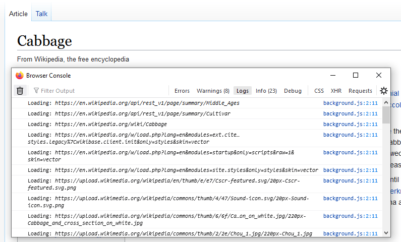

{{AddonSidebar}}

To intercept HTTP requests, use the {{WebExtAPIRef("webRequest")}} API.
This API enables you to add listeners for various stages of making an HTTP request.
In the listeners, you can:

- Get access to request headers and bodies and response headers.
- Cancel and redirect requests.
- Modify request and response headers.

This article looks at three different uses for the `webRequest` module:

- Logging request URLs as they are made.
- Redirecting requests.
- Modifying request headers.

## Logging request URLs

To see how you can use `webRequest` to log requests, create a new directory called "requests".
In that directory, create a file called "manifest.json" and add:

```json
{
  "description": "Demonstrating webRequests",
  "manifest_version": 2,
  "name": "webRequest-demo",
  "version": "1.0",

  "permissions": [
    "webRequest",
    "<all_urls>"
  ],

  "background": {
    "scripts": ["background.js"]
  }
}
```

Next, create a file called "background.js" and add:

```js
function logURL(requestDetails) {
  console.log(`Loading: ${requestDetails.url}`);
}

browser.webRequest.onBeforeRequest.addListener(
  logURL,
  {urls: ["<all_urls>"]}
);
```

You use {{WebExtAPIRef("webRequest.onBeforeRequest", "onBeforeRequest")}} to call the `logURL()` function just before starting the request. The `logURL()` function grabs the URL of the request from the event object and logs it to the browser console.
The `{urls: ["<all_urls>"]}` [pattern](/en-US/docs/Mozilla/Add-ons/WebExtensions/Match_patterns) means you intercept HTTP requests to all URLs.

To test it:

- [Install the extension](https://extensionworkshop.com/documentation/develop/temporary-installation-in-firefox/)
- Open the [Browser Console](https://firefox-source-docs.mozilla.org/devtools-user/browser_console/) (use <kbd>Ctrl + Shift + J</kbd>)
- Enable _Show Content Messages_ in the menu:

  
- Open some web pages.

In the Browser Console, you should see the URLs for any resources the browser requests.
For example, this screenshot shows the URLs from loading a Wikipedia page:



<!-- {{EmbedYouTube("X3rMgkRkB1Q")}} -->

## Redirecting requests

Now use `webRequest` to redirect HTTP requests. First, replace "manifest.json" with this:

```json
{

  "description": "Demonstrating webRequests",
  "manifest_version": 2,
  "name": "webRequest-demo",
  "version": "1.0",

  "permissions": [
    "webRequest",
    "webRequestBlocking",
    "https://developer.mozilla.org/"
  ],

  "background": {
    "scripts": ["background.js"]
  }

}
```

The changes here:

- Add the `webRequestBlocking` [`permission`](/en-US/docs/Mozilla/Add-ons/WebExtensions/manifest.json/permissions).
  This extra permission is needed when an extension wants to modify a request.
- Replace the `<all_urls>` permission with individual [host permissions](/en-US/docs/Mozilla/Add-ons/WebExtensions/manifest.json/permissions#host_permissions), as this is good practice to minimize the number of requested permissions.

Next, replace "background.js" with this:

```js
let pattern = "https://developer.mozilla.org/*";
const targetUrl = "https://developer.mozilla.org/en-US/docs/Mozilla/Add-ons/WebExtensions/Your_second_WebExtension/frog.jpg";

function redirect(requestDetails) {
  console.log(`Redirecting: ${requestDetails.url}`);
  if (requestDetails.url === targetUrl) {
    return;
  }
  return {
    redirectUrl: targetUrl
  };
}

browser.webRequest.onBeforeRequest.addListener(
  redirect,
  {urls:[pattern], types:["image"]},
  ["blocking"]
);
```

Again, you use the {{WebExtAPIRef("webRequest.onBeforeRequest", "onBeforeRequest")}} event listener to run a function just before each request is made.
This function replaces the `redirectUrl` with the target URL specified in the function. In this case, the frog image from the [your second extension tutorial](/en-US/docs/Mozilla/Add-ons/WebExtensions/Your_second_WebExtension).

This time you are not intercepting every request: the `{urls:[pattern], types:["image"]}` option specifies that you only intercept requests (1) to URLs residing under "https\://developer.mozilla.org/" and (2) for image resources.
See {{WebExtAPIRef("webRequest.RequestFilter")}} for more on this.

Also, note that you're passing an option called `"blocking"`: you must pass this whenever you want to modify the request.
It makes the listener function block the network request, so the browser waits for the listener to return before continuing.
See the {{WebExtAPIRef("webRequest.onBeforeRequest")}} documentation for more on `"blocking"`.

To test it out, open a page on MDN that contains images (for example, [the page listing extension user interface components](/en-US/docs/Mozilla/Add-ons/WebExtensions/user_interface)), [reload the extension](https://extensionworkshop.com/documentation/develop/temporary-installation-in-firefox/#reloading_a_temporary_add-on), and then reload the MDN page. You see something like this:


## Modifying request headers

Finally, use `webRequest` to modify request headers.
In this example, you change the "User-Agent" header so the browser identifies itself as Opera 12.16, but only when visiting pages under "http\://useragentstring.com/".

Update the "manifest.json" to include `http://useragentstring.com/` like this:

```json
{
  "description": "Demonstrating webRequests",
  "manifest_version": 2,
  "name": "webRequest-demo",
  "version": "1.0",

  "permissions": [
    "webRequest",
    "webRequestBlocking",
    "http://useragentstring.com/"
  ],

  "background": {
    "scripts": ["background.js"]
  }
}
```

Replace "background.js" with code like this:

```js
let targetPage = "http://useragentstring.com/*";

let ua = "Opera/9.80 (X11; Linux i686; Ubuntu/14.10) Presto/2.12.388 Version/12.16";

function rewriteUserAgentHeader(e) {
  e.requestHeaders.forEach((header) => {
    if (header.name.toLowerCase() === "user-agent") {
      header.value = ua;
    }
  });
  return {requestHeaders: e.requestHeaders};
}

browser.webRequest.onBeforeSendHeaders.addListener(
  rewriteUserAgentHeader,
  {urls: [targetPage]},
  ["blocking", "requestHeaders"]
);
```

You use the {{WebExtAPIRef("webRequest.onBeforeSendHeaders", "onBeforeSendHeaders")}} event listener to run a function just before the request headers are sent.

The listener function is called only for requests to URLs matching the `targetPage` [pattern](/en-US/docs/Mozilla/Add-ons/WebExtensions/Match_patterns).
Also, note that you again pass `"blocking"` as an option. You also pass `"requestHeaders"`, meaning the listener is passed an array containing the request headers you expect to send.
See {{WebExtAPIRef("webRequest.onBeforeSendHeaders")}} for more information on these options.

The listener function looks for the "User-Agent" header in the array of request headers, replaces its value with the value of the `ua` variable, and returns the modified array.
This modified array is sent to the server.

To test it out, open [useragentstring.com](http://useragentstring.com/) and check that it identifies the browser as Firefox.
Then reload the extension, reload [useragentstring.com](http://useragentstring.com/), and see that Firefox is now identified as Opera.


## Learn more

To learn about all the things you can do with the `webRequest` API, see its [reference documentation](/en-US/docs/Mozilla/Add-ons/WebExtensions/API/webRequest).
