{{AddonSidebar}}

<table class="fullwidth-table standard-table">
  <tbody>
    <tr>
      <th scope="row">Type</th>
      <td><code>Object</code></td>
    </tr>
    <tr>
      <th scope="row">Mandatory</th>
      <td>No</td>
    </tr>
    <tr>
      <th scope="row">Manifest version</th>
      <td>2 or higher</td>
    </tr>
    <tr>
      <th scope="row">Example</th>
      <td>
        <pre class="brush: json">
"theme": {
  "images": {
    "theme_frame": "images/sun.jpg"
  },
  "colors": {
    "frame": "#CF723F",
    "tab_background_text": "#000"
  }
}</pre
        >
      </td>
    </tr>
  </tbody>
</table>

Use the theme key to define a static theme to apply to Firefox.

> **Note:** If you want to include a theme with an extension, please see the {{WebExtAPIRef("theme")}} API.

> **Note:** Since May 2019, themes need to be signed to be installed ({{bug(1545109)}}).  See [Signing and distributing your add-on](https://extensionworkshop.com/documentation/publish/signing-and-distribution-overview/#distributing-your-addon) for more details.

> **Note:** A new version of Firefox for Android, based on GeckoView, is under development. A [pre-release version](https://play.google.com/store/apps/details?id=org.mozilla.fenix) is available. The pre-release version does not support themes.

## Image formats

The following image formats are supported in all theme image properties:

- JPEG
- PNG
- APNG
- SVG (animated SVG is supported from Firefox 59)
- GIF (animated GIF isn't supported)

## Syntax

The theme key is an object that takes the following properties:

<table class="fullwidth-table standard-table">
  <thead>
    <tr>
      <th scope="col">Name</th>
      <th scope="col">Type</th>
      <th scope="col">Description</th>
    </tr>
  </thead>
  <tbody>
    <tr>
      <td><code>images</code></td>
      <td><code>Object</code></td>
      <td>
        <p>Optional as of Firefox 60. Mandatory before Firefox 60.</p>
        <p>
          A JSON object whose properties represent the images to display in
          various parts of the browser. See
          <code><a href="#images">images</a></code> for details on the
          properties that this object can contain.
        </p>
      </td>
    </tr>
    <tr>
      <td><code>colors</code></td>
      <td><code>Object</code></td>
      <td>
        <p>Mandatory.</p>
        <p>
          A JSON object whose properties represent the colors of various parts
          of the browser. See <code><a href="#colors">colors</a></code> for
          details on the properties that this object can contain.
        </p>
      </td>
    </tr>
    <tr>
      <td><code>properties</code></td>
      <td><code>Object</code></td>
      <td>
        <p>Optional</p>
        <p>
          This object has properties that affect how the
          <code>"additional_backgrounds"</code> images are displayed and color schemes are applied. See
          <code><a href="#properties">properties</a></code> for details on the properties that this object can contain.
        </p>
      </td>
    </tr>
  </tbody>
</table>

### images

All URLs are relative to the manifest.json file and cannot reference an external URL.

Images should be 200 pixels high to ensure they always fill the header space vertically.

<table class="fullwidth-table standard-table">
  <thead>
    <tr>
      <th scope="col">Name</th>
      <th scope="col">Type</th>
      <th scope="col">Description</th>
    </tr>
  </thead>
  <tbody>
    <tr>
      <td><code>headerURL </code>{{Deprecated_Inline}}</td>
      <td><code>String</code></td>
      <td>
        <div class="notecard warning">
          <p>
            <strong>Warning:</strong> <code>headerURL</code> has been removed in
            Firefox 70. You will begin to get warnings in Firefox 65 and later
            if you load a theme that uses this property. Use
            <code>theme_frame</code> instead.
          </p>
        </div>
        <p>
          The URL of a foreground image to be added to the header area and
          anchored to the upper right corner of the header area.
        </p>
        <p>
          Optional in desktop Firefox from Firefox 60 onwards. One of
          <code>theme_frame</code> or <code>headerURL</code> had to be specified
          before Firefox 60. Note also that in Firefox 60 onwards, any
          {{cssxref("text-shadow")}} applied to the header text is
          removed if no <code>headerURL</code> is specified (see
          {{bug(1404688)}}).
        </p>
        <p>
          In Firefox for Android, <code>headerURL</code> or
          <code>theme_frame</code>  must be specified.
        </p>
      </td>
    </tr>
    <tr>
      <td><code>theme_frame</code></td>
      <td><code>String</code></td>
      <td>
        <p>
          The URL of a foreground image to be added to the header area and
          anchored to the upper right corner of the header area.
        </p>
        <div class="notecard note">
          <p>
            <strong>Note:</strong> Chrome anchors the image to the top left of
            the header and if the image doesn't fill the header area tile the
            image.
          </p>
        </div>
        <p>
          Optional in desktop Firefox 60 onwards. One of
          <code>theme_frame</code> or <code>headerURL</code> had to be specified
          before Firefox 60.
        </p>
        <p>
          In Firefox for Android, <code>headerURL</code> or
          <code>theme_frame</code>  must be specified.
        </p>
      </td>
    </tr>
    <tr>
      <td><code>additional_backgrounds</code></td>
      <td><code>Array </code>of <code>String</code></td>
      <td>
        <div class="warning">
          <p>
            <strong>Warning:</strong> The
            <code>additional_backgrounds</code> property is experimental. It is
            currently accepted in release versions of Firefox, but its behavior
            is subject to change. It is not supported in Firefox for Android.
          </p>
        </div>
        <p>
          An array of URLs for additional background images to be added to the
          header area and displayed behind the
          <code>"theme_frame":</code> image. These images layer the first image
          in the array on top, the last image in the array at the bottom.
        </p>
        <p>Optional.</p>
        <p>
          By default all images are anchored to the upper right corner of the
          header area, but their alignment and repeat behavior can be controlled
          by properties of <code>"properties":</code>.
        </p>
      </td>
    </tr>
  </tbody>
</table>

### colors

These properties define the colors used for different parts of the browser. They are all optional (but note that `"accentcolor"` and `"textcolor"` were mandatory in Firefox before version 63).  How these properties affect the Firefox UI is shown here:

<table class="fullwidth-table standard-table">
  <tbody>
    <tr>
      <td>
        <p>
          
        </p>
      </td>
    </tr>
  </tbody>
</table>

> **Note:** Where a component is affected by multiple color properties, the properties are listed in order of precedence.

All these properties can be specified as either a string containing any valid [CSS color string](/en-US/docs/Web/CSS/color_value) (including hexadecimal), or an RGB array, such as `"tab_background_text": [ 107 , 99 , 23 ]`.

> **Note:** [In Chrome, colors may only be specified as RGB arrays](#chrome_compatibility).
>
> In Firefox for Android colors can be specified using:
>
> - full hexadecimal notation, that is #RRGGBB only. _alpha_ and shortened syntax, as in #RGB\[A], are not supported.
> - [Functional notation](/en-US/docs/Web/CSS/color_value#syntax_2) (RGB arrays) for themes targeting Firefox 68.2 or later.
>
> Colors for Firefox for Android themes cannot be specified using color names.

<table class="fullwidth-table standard-table">
  <thead>
    <tr>
      <th scope="col">Name</th>
      <th scope="col">Description</th>
    </tr>
  </thead>
  <tbody>
    <tr>
      <td>
        <p><code>accentcolor</code> {{Deprecated_Inline}}</p>
      </td>
      <td>
        <div class="notecard warning">
          <p>
            <strong>Warning:</strong> <code>accentcolor</code> has been removed
            in Firefox 70. You will begin to get warnings in Firefox 65 and
            later if you load a theme that uses this property. Use the
            <code>frame</code> property instead.
          </p>
        </div>
        <p>
          The color of the header area background, displayed in the part of the
          header not covered or visible through the images specified in
          <code>"headerURL"</code> and <code>"additional_backgrounds"</code>.
        </p>
        <details open>
          <summary>See example</summary>
          <pre class="brush: json">
"theme": {
  "colors": {
     "accentcolor": "red",
     "tab_background_text": "white"
  }
}</pre
          >
        </details>
        <p></p>
      </td>
    </tr>
    <tr>
      <td><code>bookmark_text</code></td>
      <td>
        <p>
          The color of text and icons in the bookmark and find bars. Also, if
          <code>tab_text</code> isn't defined it sets the color of the active
          tab text and if <code>icons</code> isn't defined the color of the
          toolbar icons. Provided as Chrome compatible alias for
          <code>toolbar_text</code>.
        </p>
        <div class="notecard note">
          <p>
            <strong>Note:</strong> Ensure any color used contrasts well with
            those used in <code>frame</code> and <code>frame_inactive</code> or
            <code>toolbar</code> if you're using that property.
          </p>
          <p>
            Where <code>icons</code> isn't defined, also ensure good contrast
            with<code> button_background_active</code> and
            <code>button_background_hover</code>.
          </p>
        </div>
        <details open>
          <summary>See example</summary>
          <pre class="brush: json">
"theme": {
  "colors": {
    "frame": "black",
    "tab_background_text": "white",
    "tab_text": "white",
    "toolbar": "black",
    "bookmark_text": "red"
  }
}</pre
          >
        </details>
        <p>
          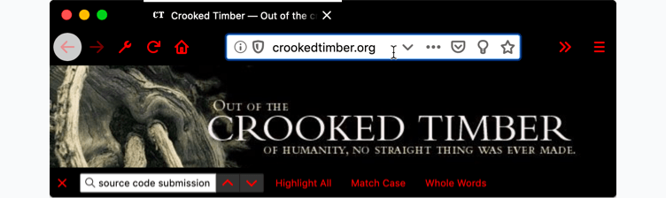
        </p>
      </td>
    </tr>
    <tr>
      <td><code>button_background_active</code></td>
      <td>
        <p>The color of the background of the pressed toolbar buttons.</p>
        <details open>
          <summary>See example</summary>
          <pre class="brush: json">
"theme": {
  "colors": {
     "frame": "black",
     "tab_background_text": "white",
     "button_background_active": "red"
  }
}</pre
          >
        </details>
        <p>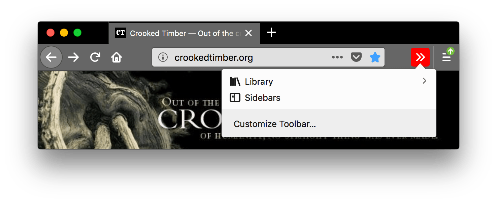</p>
      </td>
    </tr>
    <tr>
      <td><code>button_background_hover</code></td>
      <td>
        <p>The color of the background of the toolbar buttons on hover.</p>
        <details open>
          <summary>See example</summary>
          <pre class="brush: json">
"theme": {
  "colors": {
     "frame": "black",
     "tab_background_text": "white",
     "button_background_hover": "red"
  }
}</pre
          >
        </details>
        <p>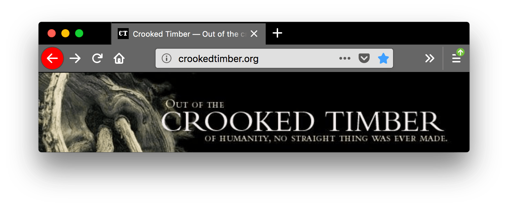</p>
      </td>
    </tr>
    <tr>
      <td><code>icons</code></td>
      <td>
        <p>The color of toolbar icons, excluding those in the find toolbar.</p>
        <div class="notecard note">
          <p>
            <strong>Note:</strong> Ensure the color used contrasts well with
            those used in <code>frame</code>,  <code>frame_inactive</code>,
            <code>button_background_active</code>, and
            <code>button_background_hover</code>.
          </p>
        </div>
        <details open>
          <summary>See example</summary>
          <pre class="brush: json">
"theme": {
  "colors": {
     "frame": "black",
     "tab_background_text": "white",
     "icons": "red"
  }
}</pre
          >
        </details>
        <p></p>
      </td>
    </tr>
    <tr>
      <td><code>icons_attention</code></td>
      <td>
        <p>
          The color of toolbar icons in attention state such as the starred
          bookmark icon or finished download icon.
        </p>
        <div class="notecard note">
          <p>
            <strong>Note:</strong> Ensure the color used contrasts well with
            those used in <code>frame</code>,  <code>frame_inactive</code>,
            <code>button_background_active</code>, and
            <code>button_background_hover</code>.
          </p>
        </div>
        <details open>
          <summary>See example</summary>
          <pre class="brush: json">
"theme": {
  "colors": {
     "frame": "black",
     "tab_background_text": "white",
     "icons_attention": "red"
  }
}</pre
          >
        </details>
        <p>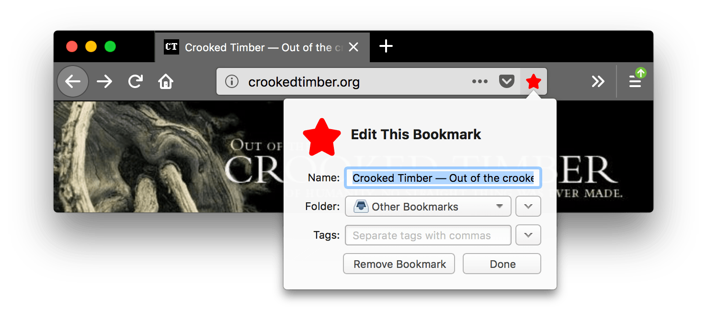</p>
      </td>
    </tr>
    <tr>
      <td><code>frame</code></td>
      <td>
        <p>
          The color of the header area background, displayed in the part of the
          header not covered or visible through the images specified in
          <code>"theme_frame"</code> and <code>"additional_backgrounds"</code>.
        </p>
        <details open>
          <summary>See example</summary>
          <pre class="brush: json">
"theme": {
  "colors": {
     "frame": "red",
     "tab_background_text": "white"
  }
}</pre
          >
        </details>
        <p></p>
      </td>
    </tr>
    <tr>
      <td><code>frame_inactive</code></td>
      <td>
        <p>
          The color of the header area background when the browser window is
          inactive, displayed in the part of the header not covered or visible
          through the images specified in <code>"theme_frame"</code> and
          <code>"additional_backgrounds"</code>.
        </p>
        <details open>
          <summary>See example</summary>
          <pre class="brush: json">
"theme": {
  "colors": {
     "frame": "red",
     "frame_inactive": "gray",
     "tab_text": "white"
  }
}</pre
          >
        </details>
        <p>
          
        </p>
      </td>
    </tr>
    <tr>
      <td><code>ntp_background</code></td>
      <td>
        <p>The new tab page background color.</p>
        <details open>
          <summary>See example</summary>
          <pre class="brush: json">
"theme": {
  "colors": {
     "ntp_background": "red",
     "ntp_text": "white"
  }
}</pre
          >
        </details>
        <p></p>
      </td>
    </tr>
    <tr>
      <td><code>ntp_text</code></td>
      <td>
        <p>The new tab page text color.</p>
        <div class="notecard note">
          <p>
            <strong>Note:</strong> Ensure the color used contrasts well with
            that used in <code>ntp_background</code>.
          </p>
        </div>
        <details open>
          <summary>See example</summary>
          <pre class="brush: json">
"theme": {
  "colors": {
     "ntp_background": "red",
     "ntp_text": "white"
  }
}</pre
          >
        </details>
        <p></p>
      </td>
    </tr>
    <tr>
      <td><code>popup</code></td>
      <td>
        <p>
          The background color of popups (such as the URL bar dropdown and the
          arrow panels).
        </p>
        <details open>
          <summary>See example</summary>
          <pre class="brush: json">
"theme": {
  "colors": {
     "frame": "black",
     "tab_background_text": "white",
     "popup": "red"
  }
}</pre
          >
        </details>
        <p>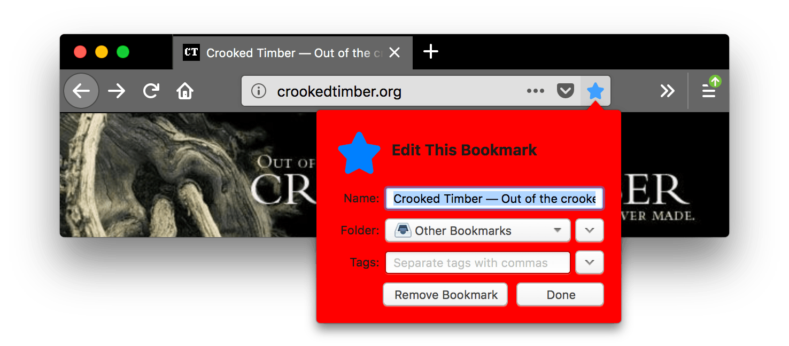</p>
      </td>
    </tr>
    <tr>
      <td><code>popup_border</code></td>
      <td>
        <p>The border color of popups.</p>
        <details open>
          <summary>See example</summary>
          <pre class="brush: json">
"theme": {
  "colors": {
     "frame": "black",
     "tab_background_text": "white",
     "popup": "black",
     "popup_text": "white",
     "popup_border": "red"
  }
}</pre
          >
        </details>
        <p>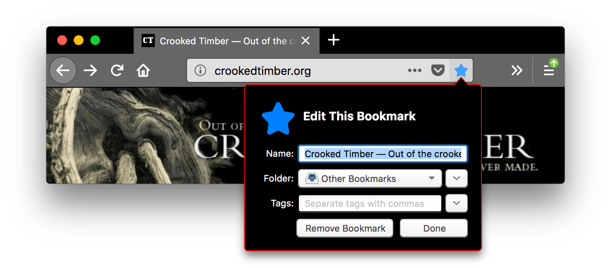</p>
      </td>
    </tr>
    <tr>
      <td><code>popup_highlight</code></td>
      <td>
        <p>
          The background color of items highlighted using the keyboard inside
          popups (such as the selected URL bar dropdown item).
        </p>
        <div class="notecard note">
          <p>
            <strong>Note:</strong> It's recommended to define
            <code>popup_highlight_text</code> to override the browser default
            text color on various platforms.
          </p>
        </div>
        <details open>
          <summary>See example</summary>
          <pre class="brush: json">
"theme": {
  "colors": {
     "frame": "black",
     "tab_background_text": "white",
     "popup_highlight": "red",
     "popup_highlight_text": "white"
  }
}</pre
          >
        </details>
        <p></p>
      </td>
    </tr>
    <tr>
      <td><code>popup_highlight_text</code></td>
      <td>
        <p>The text color of items highlighted inside popups.</p>
        <div class="notecard note">
          <p>
            <strong>Note:</strong> Ensure the color used contrasts well with
            that used in <code>popup_highlight</code>.
          </p>
        </div>
        <details open>
          <summary>See example</summary>
          <pre class="brush: json">
"theme": {
  "colors": {
     "frame": "black",
     "tab_background_text": "white",
     "popup_highlight": "black",
     "popup_highlight_text": "red"
  }
}</pre
          >
        </details>
        <p>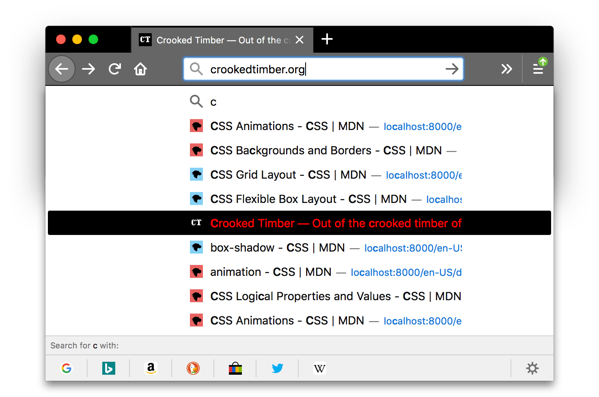</p>
      </td>
    </tr>
    <tr>
      <td><code>popup_text</code></td>
      <td>
        <p>The text color of popups.</p>
        <div class="notecard note">
          <p>
            <strong>Note:</strong> Ensure the color used contrasts well with
            that used in <code>popup</code>.
          </p>
        </div>
        <details open>
          <summary>See example</summary>
          <pre class="brush: json">
"theme": {
  "colors": {
     "frame": "black",
     "tab_background_text": "white",
     "popup": "black",
     "popup_text": "red"
  }
}</pre
          >
        </details>
        <p>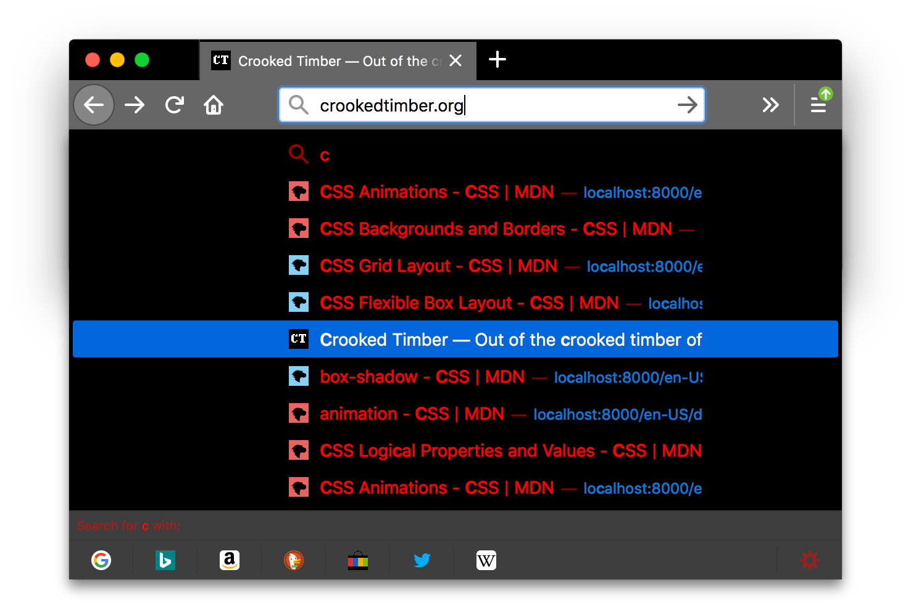</p>
      </td>
    </tr>
    <tr>
      <td><code>sidebar</code></td>
      <td>
        <p>The background color of the sidebar.</p>
        <details open>
          <summary>See example</summary>
          <pre class="brush: json">
"theme": {
  "colors": {
     "sidebar": "red",
     "sidebar_highlight": "white",
     "sidebar_highlight_text": "green",
     "sidebar_text": "white"
  }
}</pre
          >
        </details>
        <p>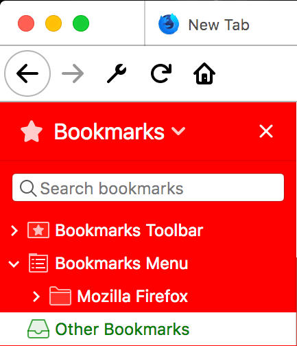</p>
      </td>
    </tr>
    <tr>
      <td><code>sidebar_border</code></td>
      <td>
        <p>The border and splitter color of the browser sidebar</p>
        <details open>
          <summary>See example</summary>
          <pre class="brush: json">
"theme": {
  "colors": {
     "sidebar_border": "red"
  }
}</pre
          >
        </details>
        <p>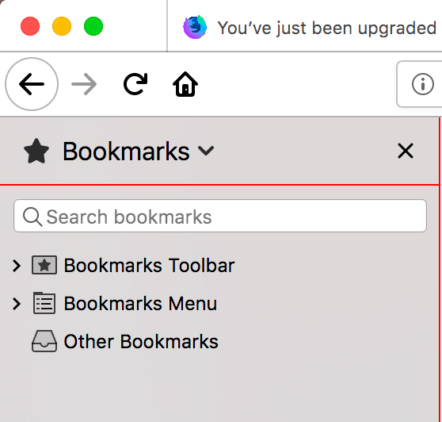</p>
      </td>
    </tr>
    <tr>
      <td><code>sidebar_highlight</code></td>
      <td>
        <p>The background color of highlighted rows in built-in sidebars</p>
        <details open>
          <summary>See example</summary>
          <pre class="brush: json">
"theme": {
  "colors": {
     "sidebar_highlight": "red",
     "sidebar_highlight_text": "white"
  }
}</pre
          >
        </details>
        <p></p>
      </td>
    </tr>
    <tr>
      <td><code>sidebar_highlight_text</code></td>
      <td>
        <p>The text color of highlighted rows in sidebars.</p>
        <div class="notecard note">
          <p>
            <strong>Note:</strong> Ensure the color used contrasts well with
            that used in <code>sidebar_highlight</code>.
          </p>
        </div>
        <details open>
          <summary>See example</summary>
          <pre class="brush: json">
"theme": {
  "colors": {
    "sidebar_highlight": "pink",
    "sidebar_highlight_text": "red",
  }
}</pre
          >
        </details>
        <p></p>
      </td>
    </tr>
    <tr>
      <td><code>sidebar_text</code></td>
      <td>
        <p>The text color of sidebars.</p>
        <div class="notecard note">
          <p>
            <strong>Note:</strong> Ensure the color used contrasts well with
            that used in <code>sidebar</code>.
          </p>
        </div>
        <details open>
          <summary>See example</summary>
          <pre class="brush: json">
"theme": {
  "colors": {
     "sidebar": "red",
     "sidebar_highlight": "white",
     "sidebar_highlight_text": "green",
     "sidebar_text": "white"
  }
}</pre
          >
        </details>
        <p></p>
      </td>
    </tr>
    <tr>
      <td>
        <code>tab_background_separator</code> {{Deprecated_Inline}}
      </td>
      <td>
        <div class="notecard warning">
          <p>
            <strong>Warning:</strong> <code>tab_background_separator</code> is
            not supported starting with Firefox 89.
          </p>
        </div>
        <p>The color of the vertical separator of the background tabs.</p>
        <details open>
          <summary>See example</summary>
          <pre class="brush: json">
"theme": {
  "colors": {
     "frame": "black",
     "tab_background_text": "white",
     "tab_background_separator": "red"
  }
}</pre
          >
        </details>
        <p>
          
        </p>
      </td>
    </tr>
    <tr>
      <td><code>tab_background_text</code></td>
      <td>
        <p>
          The color of the text displayed in the inactive page tabs. If
          <code>tab_text</code> or <code>bookmark_text</code> isn't specified,
          applies to the active tab text.
        </p>
        <div class="notecard note">
          <p>
            <strong>Note:</strong> Ensure the color used contrasts well with
            those used in <code>tab_selected</code> or <code>frame</code> and
            <code>frame_inactive</code>.
          </p>
        </div>
        <details open>
          <summary>See example</summary>
          <pre class="brush: json">
"theme": {
  "colors": {
    "frame": "black",
    "toolbar": "white",
    "tab_background_text": "red"
  }
}</pre
          >
        </details>
        <p></p>
      </td>
    </tr>
    <tr>
      <td><code>tab_line</code></td>
      <td>
        <p>The color of the selected tab line.</p>
        <details open>
          <summary>See example</summary>
          <pre class="brush: json">
"theme": {
  "colors": {
     "frame": "black",
     "tab_background_text": "white",
     "tab_line": "red"
  }
}</pre
          >
        </details>
        <p>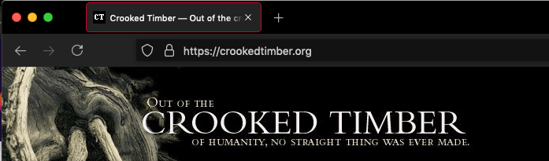</p>
      </td>
    </tr>
    <tr>
      <td><code>tab_loading</code></td>
      <td>
        <p>The color of the tab loading indicator and the tab loading burst.</p>
        <details open>
          <summary>See example</summary>
          <pre class="brush: json">
"theme": {
  "colors": {
     "frame": "black",
     "tab_background_text": "white",
     "tab_loading": "red"
  }
}</pre
          >
        </details>
        <p></p>
      </td>
    </tr>
    <tr>
      <td><code>tab_selected</code></td>
      <td>
        <p>
          The background color of the selected tab. When not in use selected tab
          color is set by <code>frame</code> and the
          <code>frame_inactive</code>.
        </p>
        <details open>
          <summary>See example</summary>
          <pre class="brush: json">
"theme": {
  "images": {
  "theme_frame": "weta.png"
},
  "colors": {
     "frame": "black",
     "tab_background_text": "white",
     "tab_selected": "red"
  }
}</pre
          >
        </details>
        <p></p>
      </td>
    </tr>
    <tr>
      <td><code>tab_text</code></td>
      <td>
        <p>
          From Firefox 59, it represents the text color for the selected tab. If
          <code>tab_line</code> isn't specified, it also defines the color of
          the selected tab line.
        </p>
        <div class="notecard note">
          <p>
            <strong>Note:</strong> Ensure the color used contrasts well with
            those used in <code>tab_selected</code> or <code>frame</code> and
            <code>frame_inactive</code>.
          </p>
        </div>
        <p>
          From Firefox 55 to 58, it is incorrectly implemented as alias for
          <code>"textcolor"</code>
        </p>
        <details open>
          <summary>See example</summary>
          <pre class="brush: json">
"theme": {
  "images": {
  "theme_frame": "weta.png"
},
  "colors": {
     "frame": "black",
     "tab_background_text": "white",
     "tab_selected": "white",
     "tab_text": "red"
  }
}</pre
          >
        </details>
        <p></p>
      </td>
    </tr>
    <tr>
      <td><code>textcolor</code> {{Deprecated_Inline}}</td>
      <td>
        <div class="notecard warning">
          <p>
            <strong>Warning:</strong> <code>textcolor</code> has been removed in
            Firefox 70. You will begin to get warnings in Firefox 65 and later
            if you load a theme that uses this property. Use
            <code>tab_background_text</code> instead.
          </p>
        </div>
        <p>The color of the text displayed in the header area.</p>
        <details open>
          <summary>See example</summary>
          <pre class="brush: json">
"theme": {
  "colors": {
    "frame": "black",
    "toolbar": "white",
    "textcolor": "red"
  }
}</pre
          >
        </details>
        <p></p>
      </td>
    </tr>
    <tr>
      <td><code>toolbar</code></td>
      <td>
        <p>
          The background color for the navigation bar, the bookmarks bar, and
          the selected tab.
        </p>
        <p>This also sets the background color of the "Find" bar.</p>
        <details open>
          <summary>See example</summary>
          <pre class="brush: json">
"theme": {
  "colors": {
    "frame": "black",
    "toolbar": "red",
    "tab_background_text": "white"
  }
}</pre
          >
        </details>
        <p>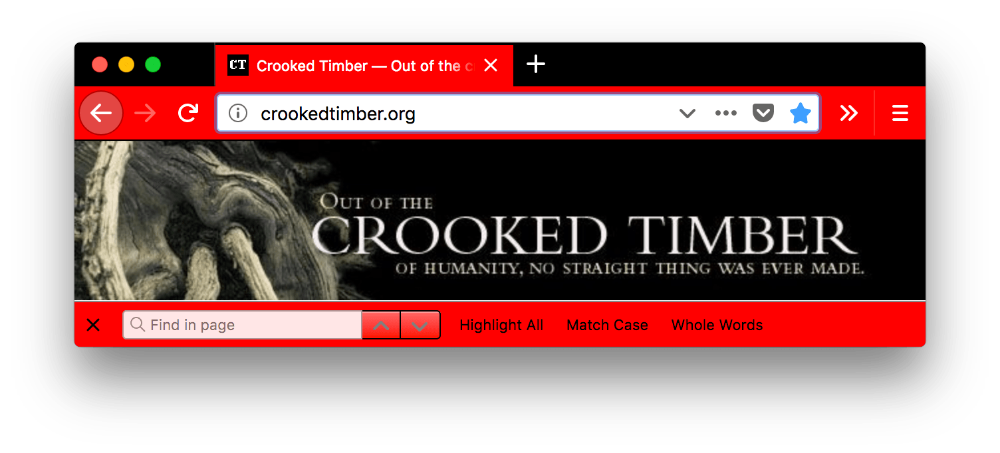</p>
      </td>
    </tr>
    <tr>
      <td><code>toolbar_bottom_separator</code></td>
      <td>
        <p>
          The color of the line separating the bottom of the toolbar from the
          region below.
        </p>
        <details open>
          <summary>See example</summary>
          <pre class="brush: json">
"theme": {
  "colors": {
    "frame": "black",
    "tab_background_text": "white",
    "toolbar_bottom_separator": "red"
  }
}</pre
          >
        </details>
        <p>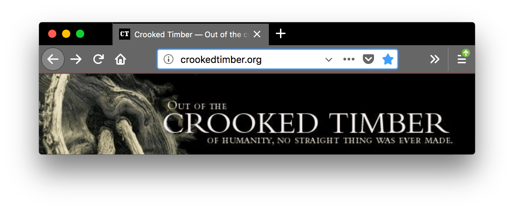</p>
      </td>
    </tr>
    <tr>
      <td><code>toolbar_field</code></td>
      <td>
        <p>
          The background color for fields in the toolbar, such as the URL bar.
        </p>
        <p>
          This also sets the background color of the
          <strong>Find in page</strong> field.
        </p>
        <details open>
          <summary>See example</summary>
          <pre class="brush: json">
"theme": {
  "colors": {
    "frame": "black",
    "tab_background_text": "white",
    "toolbar_field": "red"
  }
}</pre
          >
        </details>
        <p>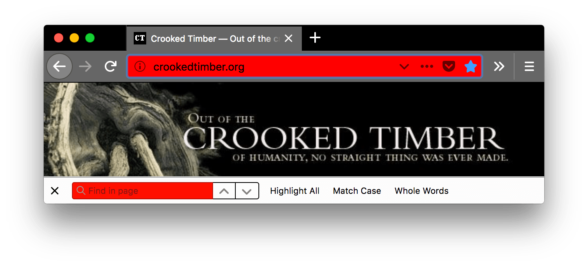</p>
      </td>
    </tr>
    <tr>
      <td><code>toolbar_field_border</code></td>
      <td>
        <p>The border color for fields in the toolbar.</p>
        <p>
          This also sets the border color of the
          <strong>Find in page</strong> field.
        </p>
        <details open>
          <summary>See example</summary>
          <pre class="brush: json">
"theme": {
  "colors": {
    "frame": "black",
    "toolbar": "black",
    "tab_background_text": "white",
    "toolbar_field": "black",
    "toolbar_field_text": "white",
    "toolbar_field_border": "red"
  }
}</pre
          >
        </details>
        <p></p>
      </td>
    </tr>
    <tr>
      <td><code>toolbar_field_border_focus</code></td>
      <td>
        <p>The focused border color for fields in the toolbar.</p>
        <details open>
          <summary>See example</summary>
          <pre class="brush: json">
"theme": {
  "colors": {
    "frame": "black",
    "toolbar": "black",
    "tab_background_text": "white",
    "toolbar_field": "black",
    "toolbar_field_text": "white",
    "toolbar_field_border_focus": "red"
  }
}</pre
          >
        </details>
        <p>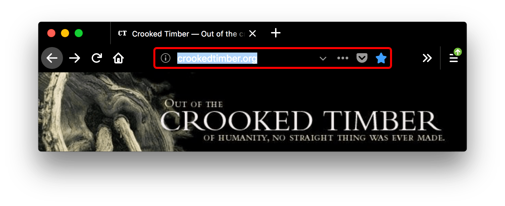</p>
      </td>
    </tr>
    <tr>
      <td><code>toolbar_field_focus</code></td>
      <td>
        <p>
          The focused background color for fields in the toolbar, such as the
          URL bar.
        </p>
        <details open>
          <summary>See example</summary>
          <pre class="brush: json">
"theme": {
  "colors": {
    "frame": "black",
    "toolbar": "black",
    "tab_background_text": "white",
    "toolbar_field": "black",
    "toolbar_field_text": "white",
    "toolbar_field_focus": "red"
  }
}</pre
          >
        </details>
        <p></p>
      </td>
    </tr>
    <tr>
      <td><code>toolbar_field_highlight</code></td>
      <td>
        The background color used to indicate the current selection of text in
        the URL bar (and the search bar, if it's configured to be separate).
        <details open>
          <summary>See example</summary>
          <pre class="brush: json">
"theme": {
  "colors": {
    "toolbar_field": "rgba(255, 255, 255, 0.91)",
    "toolbar_field_text": "rgb(0, 100, 0)",
    "toolbar_field_highlight": "rgb(180, 240, 180, 0.9)",
    "toolbar_field_highlight_text": "rgb(0, 80, 0)"
  }
}</pre
          >
        </details>
        <p>
          
        </p>
        <p>
          Here, the <code>toolbar_field_highlight</code> field specifies that
          the highlight color is a light green, while the text is set to a
          dark-to-medium green using <code>toolbar_field_highlight_text</code>.
        </p>
      </td>
    </tr>
    <tr>
      <td><code>toolbar_field_highlight_text</code></td>
      <td>
        <p>
          The color used to draw text that's currently selected in the URL bar
          (and the search bar, if it's configured to be separate box).
        </p>
        <div class="notecard note">
          <p>
            <strong>Note:</strong> Ensure the color used contrasts well with
            those used in <code>toolbar_field_highlight</code>.
          </p>
        </div>
        <details open>
          <summary>See example</summary>
          <pre class="brush: json">
"theme": {
  "colors": {
    "toolbar_field": "rgba(255, 255, 255, 0.91)",
    "toolbar_field_text": "rgb(0, 100, 0)",
    "toolbar_field_highlight": "rgb(180, 240, 180, 0.9)",
    "toolbar_field_highlight_text": "rgb(0, 80, 0)"
  }
}</pre
          >
        </details>
        <p>
          
        </p>
        <p>
          Here, the <code>toolbar_field_highlight_text</code> field is used to
          set the text color to a dark medium-dark green, while the highlight
          color is a light green.
        </p>
      </td>
    </tr>
    <tr>
      <td><code>toolbar_field_separator</code> {{Deprecated_Inline}}</td>
      <td>
        <div class="notecard warning">
          <p>
            <strong>Warning:</strong> <code>toolbar_field_separator</code> is
            not supported starting with Firefox 89.
          </p>
        </div>
        <p>
          The color of separators inside the URL bar. In Firefox 58 this was
          implemented as <code>toolbar_vertical_separator</code>.
        </p>
        <details open>
          <summary>See example</summary>
          <pre class="brush: json">
"theme": {
  "colors": {
    "frame": "black",
    "toolbar": "black",
    "tab_background_text": "white",
    "toolbar_field_separator": "red"
  }
}</pre
          >
        </details>
        <p></p>
        <p>
          In this screenshot, <code>"toolbar_vertical_separator"</code> is the
          red vertical line in the URL bar dividing the Reader Mode icon from
          the other icons.
        </p>
      </td>
    </tr>
    <tr>
      <td><code>toolbar_field_text</code></td>
      <td>
        <p>
          The color of text in fields in the toolbar, such as the URL bar. This
          also sets the color of text in the
          <strong>Find in page</strong> field.
        </p>
        <div class="notecard note">
          <p>
            <strong>Note:</strong> Ensure the color used contrasts well with
            those used in <code>toolbar_field</code>.
          </p>
        </div>
        <details open>
          <summary>See example</summary>
          <pre class="brush: json">
"theme": {
  "colors": {
    "frame": "black",
    "toolbar": "black",
    "tab_background_text": "white",
    "toolbar_field": "black",
    "toolbar_field_text": "red"
  }
}</pre
          >
        </details>
        <p></p>
      </td>
    </tr>
    <tr>
      <td><code>toolbar_field_text_focus</code></td>
      <td>
        <p>
          The color of text in focused fields in the toolbar, such as the URL
          bar.
        </p>
        <div class="notecard note">
          <p>
            <strong>Note:</strong> Ensure the color used contrasts well with
            those used in <code>toolbar_field_focus</code>.
          </p>
        </div>
        <details open>
          <summary>See example</summary>
          <pre class="brush: json">
"theme": {
  "colors": {
    "frame": "black",
    "toolbar": "black",
    "tab_background_text": "white",
    "toolbar_field": "black",
    "toolbar_field_text": "white",
    "toolbar_field_text_focus": "red"
  }
}</pre
          >
        </details>
        <p></p>
      </td>
    </tr>
    <tr>
      <td><code>toolbar_text</code></td>
      <td>
        <p>
          The color of toolbar text. This also sets the color of text in the
          "Find" bar.
        </p>
        <div class="notecard note">
          <p>
            <strong>Note:</strong> For compatibility with Chrome, use the alias
            <code>bookmark_text</code>.
          </p>
        </div>
        <details open>
          <summary>See example</summary>
          <pre class="brush: json">
"theme": {
  "colors": {
    "frame": "black",
    "tab_background_text": "white",
    "toolbar": "black",
    "toolbar_text": "red"
  }
}</pre
          >
        </details>
        <p></p>
      </td>
    </tr>
    <tr>
      <td><code>toolbar_top_separator</code></td>
      <td>
        <p>
          The color of the line separating the top of the toolbar from the
          region above.
        </p>
        <details open>
          <summary>See example</summary>
          <pre class="brush: json">
"theme": {
  "colors": {
    "frame": "black",
    "tab_background_text": "white",
    "toolbar": "black",
    "toolbar_top_separator": "red"
  }
}</pre
          >
        </details>
        <p></p>
      </td>
    </tr>
    <tr>
      <td><code>toolbar_vertical_separator</code></td>
      <td>
        <p>
          The color of the separator in the bookmarks toolbar. In Firefox 58, it
          corresponds to the color of separators inside the URL bar.
        </p>
        <details open>
          <summary>See example</summary>
          <pre class="brush: json">
"theme": {
  "colors": {
    "frame": "black",
    "tab_background_text": "white",
    "toolbar": "black",
    "toolbar_vertical_separator": "red"
  }
}</pre
          >
        </details>
        <p>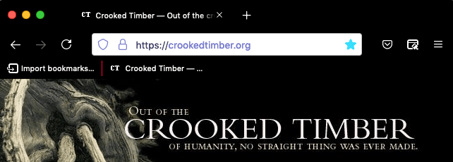</p>
      </td>
    </tr>
  </tbody>
</table>

#### Aliases

Additionally, this key accepts various properties that are aliases for one of the properties above. These are provided for compatibility with Chrome. If an alias is given, and the non-alias version is also given, then the value will be taken from the non-alias version.

> **Warning:** Beginning Firefox 70, the following properties are removed: `accentcolor` and `textcolor`. Use `frame` and `tab_background_text` instead. Using these values in themes loaded into Firefox 65 or later will raise warnings.

<table class="fullwidth-table standard-table">
  <thead>
    <tr>
      <th scope="col">Name</th>
      <th scope="col">Alias for</th>
    </tr>
  </thead>
  <tbody>
    <tr>
      <td><code>bookmark_text</code></td>
      <td><code>toolbar_text</code></td>
    </tr>
    <tr>
      <td><code>frame</code></td>
      <td><code>accentcolor</code> {{Deprecated_Inline}}</td>
    </tr>
    <tr>
      <td><code>frame_inactive</code></td>
      <td><code>accentcolor</code> {{Deprecated_Inline}}</td>
    </tr>
    <tr>
      <td><code>tab_background_text</code></td>
      <td><code>textcolor</code> {{Deprecated_Inline}}</td>
    </tr>
  </tbody>
</table>

### properties

<table class="fullwidth-table standard-table">
  <thead>
    <tr>
      <th scope="col">Name</th>
      <th scope="col">Type</th>
      <th scope="col">Description</th>
    </tr>
  </thead>
  <tbody>
    <tr>
      <td><code>additional_backgrounds_alignment</code></td>
      <td>
        <p><code>Array</code> of <code>String</code></p>
      </td>
      <td>
        <p>Optional</p>
        <p>
          An array of enumeration values defining the alignment of the
          corresponding <code>"additional_backgrounds":</code> array item.<br />The
          alignment options include:
        </p>
        <ul>
          <li><code>"bottom"</code></li>
          <li><code>"center"</code></li>
          <li><code>"left"</code></li>
          <li><code>"right"</code></li>
          <li><code>"top"</code></li>
          <li><code>"center bottom"</code></li>
          <li><code>"center center"</code></li>
          <li><code>"center top"</code></li>
          <li><code>"left bottom"</code></li>
          <li><code>"left center"</code></li>
          <li><code>"left top"</code></li>
          <li><code>"right bottom"</code></li>
          <li><code>"right center"</code></li>
          <li><code>"right top"</code>.</li>
        </ul>
        <p>If not specified, defaults to <code>"right top"</code>.</p>
      </td>
    </tr>
    <tr>
      <td><code>additional_backgrounds_tiling</code></td>
      <td>
        <p><code>Array</code> of <code>String</code></p>
      </td>
      <td>
        <p>Optional</p>
        <p>
          An array of enumeration values defining how the corresponding
          <code>"additional_backgrounds":</code> array item repeats. Options
          include:
        </p>
        <ul>
          <li><code>"no-repeat"</code></li>
          <li><code>"repeat"</code></li>
          <li><code>"repeat-x"</code></li>
          <li><code>"repeat-y"</code></li>
        </ul>
        <p>If not specified, defaults to <code>"no-repeat"</code>.</p>
      </td>
    </tr>
    <tr>
      <td><code>color_scheme</code></td>
      <td>
        <p><code>String</code></p>
      </td>
      <td>
        <p>Optional</p>
        <p>
          Determines which color scheme is applied to the chrome (for example, context menus)
          and content (for example, built-in pages and the preferred color scheme for web pages).
          Options include:
        </p>
        <ul>
          <li><code>"auto"</code> – a light or dark scheme based automatically on the theme.</li>
          <li><code>"light"</code> – a light scheme.</li>
          <li><code>"dark"</code> – a dark scheme.</li>
          <li><code>"system"</code> – uses the system scheme.</li>
        </ul>
        <p>If not specified, defaults to <code>"auto"</code>.</p>
      </td>
    </tr>
    <tr>
      <td><code>content_color_scheme</code></td>
      <td>
        <p><code>String</code></p>
      </td>
      <td>
        <p>Optional</p>
        <p>
          Determines which color scheme is applied to the content (for example, built-in pages and
          preferred color scheme for web pages). Overrides <code>color_scheme</code>. Options
          include:
        </p>
        <ul>
          <li><code>"auto"</code> – a light or dark scheme based automatically on the theme.</li>
          <li><code>"light"</code> – a light scheme.</li>
          <li><code>"dark"</code> – a dark scheme.</li>
          <li><code>"system"</code> – the system scheme.</li>
        </ul>
        <p>If not specified, defaults to <code>"auto"</code>.</p>
      </td>
    </tr>
  </tbody>
</table>

## Examples

A basic theme must define an image to add to the header, the accent color to use in the header, and the color of text used in the header:

```json
 "theme": {
   "images": {
     "theme_frame": "images/sun.jpg"
   },
   "colors": {
     "frame": "#CF723F",
     "tab_background_text": "#000"
   }
 }
```

Multiple images can be used to fill the header. Before Firefox version 60, use a blank or transparent header image to gain control over the placement of each additional image:

```json
 "theme": {
   "images": {
     "additional_backgrounds": [ "images/left.png" , "images/middle.png", "images/right.png"]
   },
   "properties": {
     "additional_backgrounds_alignment": [ "left top" , "top", "right top"]
   },
   "colors": {
     "frame": "blue",
     "tab_background_text": "#ffffff"
   }
 }
```

You can also fill the header with a repeated image, or images, in this case a single image anchored in the middle top of the header and repeated across the rest of the header:

```json
 "theme": {
   "images": {
     "additional_backgrounds": [ "images/logo.png"]
   },
   "properties": {
     "additional_backgrounds_alignment": [ "top" ],
     "additional_backgrounds_tiling": [ "repeat"  ]
   },
   "colors": {
     "frame": "green",
     "tab_background_text": "#000"
   }
 }
```

The following example uses most of the different values for `theme.colors`:

```json
  "theme": {
    "images": {
      "theme_frame": "weta.png"
    },

    "colors": {
       "frame": "darkgreen",
       "tab_background_text": "white",
       "toolbar": "blue",
       "bookmark_text": "cyan",
       "toolbar_field": "orange",
       "toolbar_field_border": "white",
       "toolbar_field_text": "green",
       "toolbar_top_separator": "red",
       "toolbar_bottom_separator": "white",
       "toolbar_vertical_separator": "white"
    }
  }
```

It will give you a browser that looks like this:


In this screenshot, `"toolbar_vertical_separator"` is the white vertical line in the URL bar dividing the Reader Mode icon from the other icons.

## Browser compatibility

{{Compat}}

### Chrome compatibility

In Chrome:

- `colors/toolbar_text` is not used, use `colors/bookmark_text` instead.
- `images/theme_frame` anchors the image to the top left of the header and if the image doesn't fill the header area tile the image.
- all colors must be specified as an array of RGB values, like this:

  ```json
  "theme": {
    "colors": {
       "frame": [255, 0, 0],
       "tab_background_text": [0, 255, 0],
       "bookmark_text": [0, 0, 255]
    }
  }
  ```

  From Firefox 59 onward, both the array form and the CSS color form are accepted for all properties. Before that, `colors/frame` and `colors/tab_background_text` required the array form, while other properties required the CSS color form.
