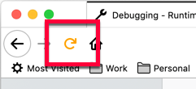

{{AddonSidebar}}

<table class="fullwidth-table standard-table">
  <tbody>
    <tr>
      <th scope="row">Type</th>
      <td><code>Object</code></td>
    </tr>
    <tr>
      <th scope="row">Mandatory</th>
      <td>No</td>
    </tr>
    <tr>
      <th scope="row">Manifest version</th>
      <td>2 or higher</td>
    </tr>
    <tr>
      <th scope="row">Example</th>
      <td>
        <pre class="brush: json">
"theme_experiment": {
  "stylesheet": "style.css",
  "colors": {
    "popup_affordance": "--arrowpanel-dimmed"
  },
  "images": {
    "theme_toolbar": "--toolbar-bgimage"
  },
  "properties": {
    "toolbar_image_alignment":
    "--toolbar-bgalignment"
  }
}</pre
        >
      </td>
    </tr>
  </tbody>
</table>

This key enables the definition of experimental [`theme`](/en-US/docs/Mozilla/Add-ons/WebExtensions/manifest.json/theme) key properties for the Firefox interface. These experiments are a precursor to proposing new theme features for inclusion in Firefox. Experimentation is done by:

- creating a stylesheet that defines mappings between internal CSS selectors for Firefox UI elements and arbitrary CSS variables. The CSS variables are then mapped in the `colors`, `images`, and `properties` objects to new `theme` key properties.
- (without a stylesheet) using `colors`, `images`, and `properties` to map internal Firefox CSS selectors, such as `--arrowpanel-dimmed` to new `theme` key properties. This option limits experimentation to UI components that are associated with an inbuilt CSS variable.

To discover the CSS selectors for Firefox UI elements or internal Firefox CSS variables use the [browser toolbox](https://firefox-source-docs.mozilla.org/devtools-user/browser_toolbox/index.html).

> **Note:** This key is only available for use in Firefox Developer Edition and Firefox Nightly channels and requires the `extensions.experiments.enabled` preference to be enabled. In Firefox 73 and earlier, the `extensions.legacy.enabled` had to be used instead.

> **Warning:** This feature is experimental and could be subject to change.

## Syntax

The theme_experiment key is an object that takes the following properties:

<table class="fullwidth-table standard-table">
  <thead>
    <tr>
      <th scope="col">Name</th>
      <th scope="col">Type</th>
      <th scope="col">Description</th>
    </tr>
  </thead>
  <tbody>
    <tr>
      <td><code>stylesheet</code></td>
      <td><code>String</code></td>
      <td>
        <p>Optional</p>
        <p>
          Name of a stylesheet providing mapping of Firefox UI element CSS
          selectors to CSS variables.
        </p>
      </td>
    </tr>
    <tr>
      <td><code>images</code></td>
      <td><code>Object</code></td>
      <td>
        <p>Optional</p>
        <p>
          Mappings of CSS variables (as defined in Firefox or by the stylesheet
          defined in <code>stylesheet</code>) to <code>images</code> property
          names for use in the
          <code
            ><a
              href="/en-US/docs/Mozilla/Add-ons/WebExtensions/manifest.json/theme"
              >theme</a
            ></code
          >
          key.
        </p>
      </td>
    </tr>
    <tr>
      <td><code>colors</code></td>
      <td><code>Object</code></td>
      <td>
        <p>Optional</p>
        <p>
          Mappings of CSS variables (as defined in Firefox or by the stylesheet
          defined in <code>stylesheet</code>) to <code>colors</code> property
          names for use in the
          <code
            ><a
              href="/en-US/docs/Mozilla/Add-ons/WebExtensions/manifest.json/theme"
              >theme</a
            ></code
          >
          key.
        </p>
      </td>
    </tr>
    <tr>
      <td><code>properties</code></td>
      <td><code>Object</code></td>
      <td>
        <p>Optional</p>
        <p>
          Mappings of CSS variables (as defined in Firefox or by the stylesheet
          defined in <code>stylesheet</code>) to
          <code>properties</code> property names for use in the
          <code
            ><a
              href="/en-US/docs/Mozilla/Add-ons/WebExtensions/manifest.json/theme"
              >theme</a
            ></code
          >
          key.
        </p>
      </td>
    </tr>
  </tbody>
</table>

## Examples

This example uses a stylesheet named `style.css` to provide the ability to set a color for the browser reload button in the [`theme`](/en-US/docs/Mozilla/Add-ons/WebExtensions/manifest.json/theme) key.

The stylesheet defines:

```css
#reload-button {
  fill: var(--reload-button-color);
}
```

where `#reload-button` is the Firefox internal CSS selector for the reload button and `--reload-button-color` is an arbitrary name.

In the `manifest.json` file, `--reload-button-color` is then mapped to the name to be used in the `colors` property of `theme`:

```json
"theme_experiment": {
  "stylesheet": "style.css",
  "colors": {
    "reload_button": "--reload-button-color"
  }
}
```

The argument `reload_button` is used in the same way as any other `theme` property:

```json
"theme": {
  "colors": {
    "reload_button": "orange"
  }
}
```

This has the effect of making the reload icon orange.



This property can also be used in `browser.theme.update()`. `images` and `properties` work in a similar way to `colors`.

## Browser compatibility

{{Compat}}
