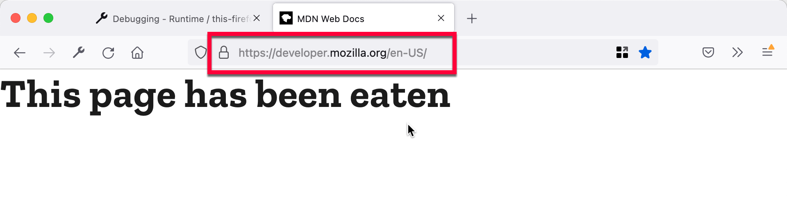
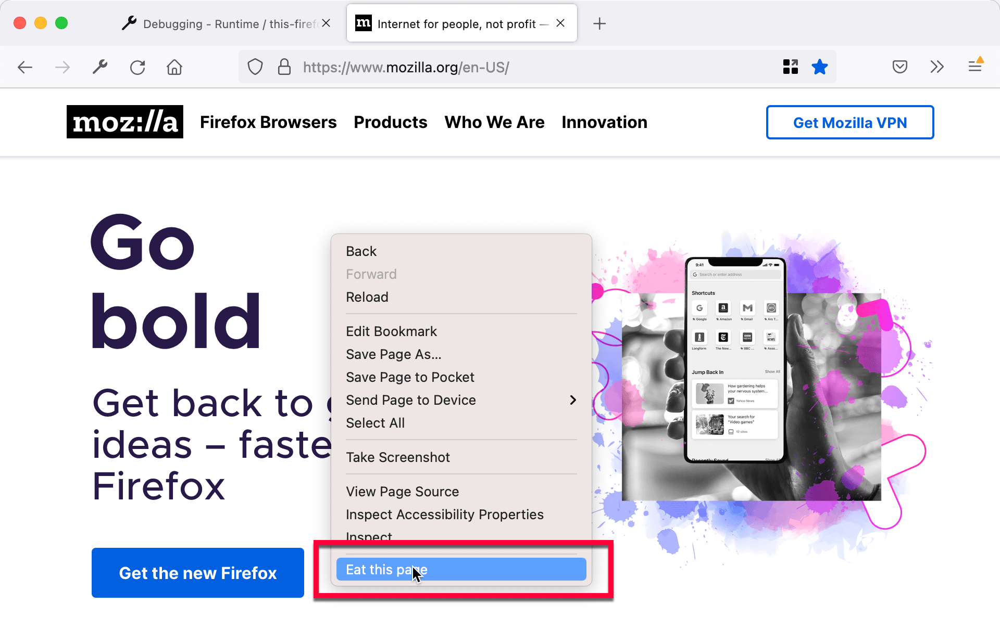

{{AddonSidebar}}

One of the most common use cases for an extension is to modify a web page. For example, an extension might want to change the style applied to a page, hide particular DOM nodes, or inject extra DOM nodes into the page.

There are two ways to do this with WebExtensions APIs:

- **Declaratively**: Define a pattern that matches a set of URLs, and load a set of scripts into pages whose URL matches that pattern.
- **Programmatically**: Using a JavaScript API, load a script into the page hosted by a particular tab.

Either way, these scripts are called _content scripts_, and are different from the other scripts that make up an extension:

- They only get access to a small subset of the WebExtension APIs.
- They get direct access to the web page in which they are loaded.
- They communicate with the rest of the extension using a messaging API.

In this article we'll look at both methods of loading a script.

## Modifying pages that match a URL pattern

First of all, create a new directory called "modify-page". In that directory, create a file called "manifest.json", with the following contents:

```json
{

  "manifest_version": 2,
  "name": "modify-page",
  "version": "1.0",

  "content_scripts": [
    {
      "matches": ["https://developer.mozilla.org/*"],
      "js": ["page-eater.js"]
    }
  ]

}
```

The [`content_scripts`](/en-US/docs/Mozilla/Add-ons/WebExtensions/manifest.json/content_scripts) key is how you load scripts into pages that match URL patterns. In this case, `content_scripts` instructs the browser to load a script called "page-eater.js" into all pages under [https://developer.mozilla.org/](/).

> **Note:** Since the `"js"` property of `content_scripts` is an array, you can use it to inject more than one script into matching pages. If you do this the pages share the same scope, just like multiple scripts loaded by a page, and they are loaded in the order that they are listed in the array.

> **Note:** The `content_scripts` key also has a `"css"` property that you can use to inject CSS stylesheets.

Next, create a file called "page-eater.js" inside the "modify-page" directory, and give it the following contents:

```js
document.body.textContent = "";

let header = document.createElement('h1');
header.textContent = "This page has been eaten";
document.body.appendChild(header);
```

Now [install the extension](https://extensionworkshop.com/documentation/develop/temporary-installation-in-firefox/), and visit [https://developer.mozilla.org/](/). The page should look like this:



## Modifying pages programmatically

What if you still want to eat pages, but only when the user asks you to? Let's update this example so we inject the content script when the user clicks a context menu item.

First, update "manifest.json" so it has the following contents:

```json
{

  "manifest_version": 2,
  "name": "modify-page",
  "version": "1.0",

  "permissions": [
    "activeTab",
    "contextMenus"
  ],

  "background": {
    "scripts": ["background.js"]
  }

}
```

Here, we've removed the `content_scripts` key, and added two new keys:

- [`permissions`](/en-US/docs/Mozilla/Add-ons/WebExtensions/manifest.json/permissions): To inject scripts into pages we need permissions for the page we're modifying. The [`activeTab` permission](/en-US/docs/Mozilla/Add-ons/WebExtensions/manifest.json/permissions#activetab_permission) is a way to get this temporarily for the currently active tab. We also need the `contextMenus` permission to be able to add context menu items.
- [`background`](/en-US/docs/Mozilla/Add-ons/WebExtensions/manifest.json/background): We're using this to load a persistent ["background script"](/en-US/docs/Mozilla/Add-ons/WebExtensions/Anatomy_of_a_WebExtension#background_scripts) called `background.js`, in which we'll set up the context menu and inject the content script.

Let's create this file. Create a new file called `background.js` in the `modify-page` directory, and give it the following contents:

```js
browser.contextMenus.create({
  id: "eat-page",
  title: "Eat this page"
});

browser.contextMenus.onClicked.addListener((info, tab) => {
  if (info.menuItemId === "eat-page") {
    browser.tabs.executeScript({
      file: "page-eater.js"
    });
  }
});
```

In this script we're creating a [context menu item](/en-US/docs/Mozilla/Add-ons/WebExtensions/API/menus/create), giving it a specific id and title (the text to be displayed in the context menu). Then we set up an event listener so that when the user clicks a context menu item, we check to see if it is our `eat-page` item. If it is, we inject "page-eater.js" into the current tab using the [`tabs.executeScript()`](/en-US/docs/Mozilla/Add-ons/WebExtensions/API/tabs/executeScript) API. This API optionally takes a tab ID as an argument: we've omitted the tab ID, which means that the script is injected into the currently active tab.

At this point the extension should look like this:

```plain
modify-page/
    background.js
    manifest.json
    page-eater.js
```

Now [reload the extension](https://extensionworkshop.com/documentation/develop/temporary-installation-in-firefox/#reloading_a_temporary_add-on), open a page (any page, this time) activate the context menu, and select "Eat this page":



## Messaging

Content scripts and background scripts can't directly access each other's state. However, they can communicate by sending messages. One end sets up a message listener, and the other end can then send it a message. The following table summarizes the APIs involved on each side:

<table class="fullwidth-table standard-table">
  <thead>
    <tr>
      <th scope="row"></th>
      <th scope="col">In content script</th>
      <th scope="col">In background script</th>
    </tr>
    <tr>
      <th scope="row">Send a message</th>
      <td>
        <code
          ><a
            href="/en-US/docs/Mozilla/Add-ons/WebExtensions/API/runtime#sendmessage()"
            >browser.runtime.sendMessage()</a
          ></code
        >
      </td>
      <td>
        <code
          ><a
            href="/en-US/docs/Mozilla/Add-ons/WebExtensions/API/tabs/sendMessage"
            >browser.tabs.sendMessage()</a
          ></code
        >
      </td>
    </tr>
    <tr>
      <th scope="row">Receive a message</th>
      <td>
        <code
          ><a
            href="/en-US/docs/Mozilla/Add-ons/WebExtensions/API/runtime/onMessage"
            >browser.runtime.onMessage</a
          ></code
        >
      </td>
      <td>
        <code
          ><a
            href="/en-US/docs/Mozilla/Add-ons/WebExtensions/API/runtime#onmessage"
            >browser.runtime.onMessage</a
          ></code
        >
      </td>
    </tr>
  </thead>
</table>

> **Note:** In addition to this method of communication, which sends one-off messages, you can also use a [connection-based approach to exchange messages](/en-US/docs/Mozilla/Add-ons/WebExtensions/Content_scripts#connection-based_messaging). For advice on choosing between the options, see [Choosing between one-off messages and connection-based messaging](/en-US/docs/Mozilla/Add-ons/WebExtensions/Content_scripts#choosing_between_one-off_messages_and_connection-based_messaging).

Let's update our example to show how to send a message from the background script.

First, edit `background.js` so that it has these contents:

```js
browser.contextMenus.create({
  id: "eat-page",
  title: "Eat this page"
});

function messageTab(tabs) {
  browser.tabs.sendMessage(tabs[0].id, {
    replacement: "Message from the extension!"
  });
}

function onExecuted(result) {
    let querying = browser.tabs.query({
        active: true,
        currentWindow: true
    });
    querying.then(messageTab);
}

browser.contextMenus.onClicked.addListener((info, tab) => {
  if (info.menuItemId === "eat-page") {
    let executing = browser.tabs.executeScript({
      file: "page-eater.js"
    });
    executing.then(onExecuted);
  }
});
```

Now, after injecting `page-eater.js`, we use [`tabs.query()`](/en-US/docs/Mozilla/Add-ons/WebExtensions/API/tabs/query) to get the currently active tab, and then use [`tabs.sendMessage()`](/en-US/docs/Mozilla/Add-ons/WebExtensions/API/tabs/sendMessage) to send a message to the content scripts loaded into that tab. The message has the payload `{replacement: "Message from the extension!"}`.

Next, update `page-eater.js` like this:

```js
function eatPageReceiver(request, sender, sendResponse) {
  document.body.textContent = "";
  let header = document.createElement('h1');
  header.textContent = request.replacement;
  document.body.appendChild(header);
}
browser.runtime.onMessage.addListener(eatPageReceiver);
```

Now, instead of just eating the page right away, the content script listens for a message using [`runtime.onMessage`](/en-US/docs/Mozilla/Add-ons/WebExtensions/API/runtime/onMessage). When a message arrives, the content script runs essentially the same code as before, except that the replacement text is taken from `request.replacement`.

Since [`tabs.executeScript()`](/en-US/docs/Mozilla/Add-ons/WebExtensions/API/tabs/executeScript) is an asynchronous function, and to ensure we send message only after listener has been added in `page-eater.js`, we use `onExecuted()` which will be called after `page-eater.js` executed.

> **Note:** Press <kbd>Ctrl</kbd>+<kbd>Shift</kbd>+<kbd>J</kbd> (or <kbd>Cmd</kbd>+<kbd>Shift</kbd>+<kbd>J</kbd> on macOS) OR `web-ext run --bc` to open [Browser Console](https://firefox-source-docs.mozilla.org/devtools-user/browser_console/index.html) to view `console.log` in background script.
>
> Alternatively, use [Add-on Debugger](/en-US/docs/Mozilla/Add-ons/Add-on_Debugger) which allows you set breakpoint. There is currently no way to [start Add-on Debugger directly from web-ext](https://github.com/mozilla/web-ext/issues/759).

If we want send messages back from the content script to the background page,  we would use [`runtime.sendMessage()`](/en-US/docs/Mozilla/Add-ons/WebExtensions/API/runtime/sendMessage) instead of [`tabs.sendMessage()`](/en-US/docs/Mozilla/Add-ons/WebExtensions/API/tabs/sendMessage), e.g.:

```js
browser.runtime.sendMessage({
    title: "from page-eater.js"
});
```

> **Note:** These examples all inject JavaScript; you can also inject CSS programmatically using the [`tabs.insertCSS()`](/en-US/docs/Mozilla/Add-ons/WebExtensions/API/tabs/insertCSS) function.

## Learn more

- [Content scripts](/en-US/docs/Mozilla/Add-ons/WebExtensions/Content_scripts) guide
- [`content_scripts`](/en-US/docs/Mozilla/Add-ons/WebExtensions/manifest.json/content_scripts) manifest key
- [`permissions`](/en-US/docs/Mozilla/Add-ons/WebExtensions/manifest.json/permissions) manifest key
- [`tabs.executeScript()`](/en-US/docs/Mozilla/Add-ons/WebExtensions/API/tabs/executeScript)
- [`tabs.insertCSS()`](/en-US/docs/Mozilla/Add-ons/WebExtensions/API/tabs/insertCSS)
- [`tabs.sendMessage()`](/en-US/docs/Mozilla/Add-ons/WebExtensions/API/tabs/sendMessage)
- [`runtime.sendMessage()`](/en-US/docs/Mozilla/Add-ons/WebExtensions/API/runtime/sendMessage)
- [`runtime.onMessage`](/en-US/docs/Mozilla/Add-ons/WebExtensions/API/runtime/onMessage)
- Examples using `content_scripts`:

  - [borderify](https://github.com/mdn/webextensions-examples/tree/master/borderify)
  - [emoji-substitution](https://github.com/mdn/webextensions-examples/tree/master/emoji-substitution)
  - [notify-link-clicks-i18n](https://github.com/mdn/webextensions-examples/tree/master/notify-link-clicks-i18n)
  - [page-to-extension-messaging](https://github.com/mdn/webextensions-examples/tree/master/page-to-extension-messaging)

- Examples using `tabs.executeScript()`:

  - [beastify](https://github.com/mdn/webextensions-examples/tree/master/beastify)
  - [context-menu-copy-link-with-types](https://github.com/mdn/webextensions-examples/tree/master/context-menu-copy-link-with-types)
