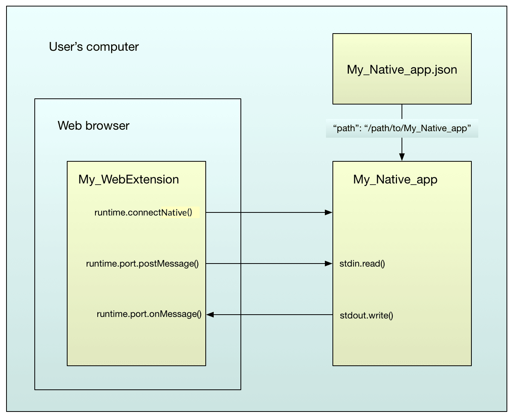

{{AddonSidebar}}

**Native messaging** enables an extension to exchange messages with a native application, installed on the user's computer. The native messaging serves the extensions without additional accesses over the web.

Password managers: The native application manages, stores, and encrypts passwords. Then the native application communicates with the extension to populate web forms.

Native messaging also enables extensions to access resources that are not accessible through WebExtension APIs (e.g., particular hardware).

The native application is not installed or managed by the browser. The native application is installed, using the underlying operating system's installation machinery. Create a JSON file called the "host manifest" or "app manifest". Install the JSON file in a defined location. The app manifest file will describe how the browser can connect to the native application.

The extension must request the `"nativeMessaging"` [permission](/en-US/docs/Mozilla/Add-ons/WebExtensions/manifest.json/permissions) or [optional permission](/en-US/docs/Mozilla/Add-ons/WebExtensions/manifest.json/optional_permissions) in the `manifest.json` file. Also, the native application must grant permission for the extension by including the ID in the `"allowed_extensions"` field of the app manifest.

After installing, the extension can exchange JSON messages with the native application. Use a set of functions in the {{WebExtAPIRef("runtime")}} API. On the native app side, messages are received using standard input (`stdin`) and sent using standard output (`stdout`).



Support for native messaging in extensions is mostly compatible with Chrome, with two main differences:

- The app manifest lists `allowed_extensions` as an array of app IDs, while Chrome lists `allowed_origins`, as an array of `"chrome-extension"` URLs.
- The app manifest is stored in a different location [compared to Chrome](https://developer.chrome.com/docs/apps/nativeMessaging/#native-messaging-host-location).

There's a complete example in the ["`native-messaging`" directory](https://github.com/mdn/webextensions-examples/tree/main/native-messaging) of the `"webextensions-examples"` repository on GitHub. Most example code in this article is taken from that example.

## Setup

### Extension manifest

Extension communicating with a native application:

- Set the `"nativeMessaging"` [permission](/en-US/docs/Mozilla/Add-ons/WebExtensions/manifest.json/permissions) or [optional permission](/en-US/docs/Mozilla/Add-ons/WebExtensions/manifest.json/optional_permissions) in the [`manifest.json`](/en-US/docs/Mozilla/Add-ons/WebExtensions/manifest.json) file.
- Specify your add-on ID explicitly. Use the [`browser_specific_settings`](/en-US/docs/Mozilla/Add-ons/WebExtensions/manifest.json/browser_specific_settings) manifest key. (The app's manifest will identify the set of extensions that allow connecting to the IDs).

Example `manifest.json` file:

```json
{
  "description": "Native messaging example add-on",
  "manifest_version": 2,
  "name": "Native messaging example",
  "version": "1.0",
  "icons": {
    "48": "icons/message.svg"
  },

  "browser_specific_settings": {
    "gecko": {
      "id": "ping_pong@example.org",
      "strict_min_version": "50.0"
    }
  },

  "background": {
    "scripts": ["background.js"]
  },

  "browser_action": {
    "default_icon": "icons/message.svg"
  },

  "permissions": ["nativeMessaging"]
}
```

> **Note:** Chrome does not support the [browser_specific_settings](/en-US/docs/Mozilla/Add-ons/WebExtensions/manifest.json/browser_specific_settings) key. You will need to use another manifest without this key to install an equivalent WebExtension on Chrome. See [Chrome incompatibilities below](#chrome_incompatibilities).

> **Note:** When using optional permission, check that permission has been granted and, where necessary, request permission from the user with the {{WebExtAPIRef("permissions")}} API before communicating with the native application.

### App manifest

The app manifest describes to the browser how it can connect to the native application.

The app manifest file must be installed along with the native application. The browser reads and validates app manifest files, but it does not install or manage them. The security model for when and how these files are installed and updated is much more like that for native applications than that for extensions using WebExtension APIs.

For details of native app manifest syntax and location, see [Native manifests](/en-US/docs/Mozilla/Add-ons/WebExtensions/Native_manifests).

For example, here's a manifest for the `"ping_pong"` native application:

```json
{
  "name": "ping_pong",
  "description": "Example host for native messaging",
  "path": "/path/to/native-messaging/app/ping_pong.py",
  "type": "stdio",
  "allowed_extensions": ["ping_pong@example.org"]
}
```

This allows the extension whose ID is `"ping_pong@example.org"` to connect, by passing the name `"ping_pong"` into the relevant {{WebExtAPIRef("runtime")}} API function. The application itself is at `"/path/to/native-messaging/app/ping_pong.py"`.

> **Note:** Chrome identifies allowed extensions with another key: `allowed_origins`, using the ID of the WebExtension. Refer to [Chrome documentation for more details](https://developer.chrome.com/docs/apps/nativeMessaging/#native-messaging-host) and see [Chrome incompatibilities below](#chrome_incompatibilities).

### Windows setup

As an example, you can also refer to [the readme on the native messaging extension on GitHub](https://github.com/SphinxKnight/webextensions-examples/tree/master/native-messaging#windows-setup). If you want to check your local setup after having forked this repository on a Windows machine, you may run `check_config_win.py` to troubleshoot some issues.

#### App manifest

In the example above, the native application is a Python script. It can be difficult to get Windows to run Python scripts reliably in this way, so an alternative is to provide a `.bat` file, and link to that from the application's manifest:

```json
{
  "name": "ping_pong",
  "description": "Example host for native messaging",
  "path": "c:\\path\\to\\native-messaging\\app\\ping_pong_win.bat",
  "type": "stdio",
  "allowed_extensions": ["ping_pong@example.org"]
}
```

(See note above about [Chrome compatibility](#chrome_incompatibilities) regarding the `allowed_extensions` key and its counterpart in Chrome).

The batch file then invokes the Python script:

```bash
@echo off

python -u "c:\\path\\to\\native-messaging\\app\\ping_pong.py"
```

#### Registry

The browser finds the extension based on registry keys which are located in a specific location. You need to add them either programmatically with your final application or manually if you are using the example from GitHub. For more details, refer to [Manifest location](/en-US/docs/Mozilla/Add-ons/WebExtensions/Native_manifests#manifest_location).

Following with the `ping_pong` example, if using Firefox (see [this page for Chrome](https://developer.chrome.com/docs/apps/nativeMessaging/#native-messaging-host-location)), one of the two registry entries should be created for the messaging to work:

- `HKEY_CURRENT_USER\Software\Mozilla\NativeMessagingHosts\ping_pong`
- `HKEY_LOCAL_MACHINE\Software\Mozilla\NativeMessagingHosts\ping_pong`

The default value for the key should be the path to the _application_ manifest: ex. `C:\Users\<myusername>\webextensions-examples\native-messaging\app\ping_pong.json`.

> **Note:** If you base your work on the example located on GitHub, please read [this part of the readme](https://github.com/SphinxKnight/webextensions-examples/tree/master/native-messaging#windows-setup) and check the output of `check_config_win.py` before installing the WebExtension on your browser.

## Exchanging messages

Given the above setup, an extension can exchange JSON messages with a native application.

### Extension side

Native messaging cannot directly be used in content scripts. You must [do it indirectly via background scripts](/en-US/docs/Mozilla/Add-ons/WebExtensions/Content_scripts#communicating_with_background_scripts).

There are two patterns to use here: **connection-based messaging** and **connectionless messaging**.

#### Connection-based messaging

With this pattern you call {{WebExtAPIRef("runtime.connectNative()")}}, passing the name of the application (the value of the `"name"` property in the app's manifest). This launches the application if it is not already running and returns a {{WebExtAPIRef("runtime.Port")}} object to the extension.

Two arguments are passed to the native app when it starts:

- The complete path to the app manifest.
- (new in Firefox 55) the ID (as given in the [browser_specific_settings](/en-US/docs/Mozilla/Add-ons/WebExtensions/manifest.json/browser_specific_settings) `manifest.json` key) of the add-on that started it.

> **Note:** Chrome handles the passed arguments differently:
>
> - On Linux and Mac, Chrome passes _one_ argument: the origin of the extension that started it (in the form `chrome-extension://[extensionID]`). This enables the app to identify the extension.
> - On Windows, Chrome passes _two_ arguments: the first is the origin of the extension, and the second is a handle to the Chrome native window that started the app.

The application stays running until the extension calls `Port.disconnect()` or the page that connected to it is closed.

To send messages using `Port`, call its `postMessage()` function, passing the JSON message to send. To listen for messages using `Port`, add the listener using its `onMessage.addListener()` function.

Here's an example background script that establishes a connection with the `"ping_pong"` app, listens for messages from it, then sends it a `"ping"` message whenever the user clicks the browser action:

```js
/*
On startup, connect to the "ping_pong" app.
*/
let port = browser.runtime.connectNative("ping_pong");

/*
Listen for messages from the app.
*/
port.onMessage.addListener((response) => {
  console.log(`Received: ${response}`);
});

/*
On a click on the browser action, send the app a message.
*/
browser.browserAction.onClicked.addListener(() => {
  console.log("Sending:  ping");
  port.postMessage("ping");
});
```

#### Connectionless messaging

With this pattern you call {{WebExtAPIRef("runtime.sendNativeMessage()")}}, passing it:

- the name of the application
- the JSON message to send
- optionally, a callback.

A new instance of the app is created for each message. The app passes two arguments when starting:

- the complete path to the app manifest
- (new in Firefox 55) the ID (as given in the [browser_specific_settings](/en-US/docs/Mozilla/Add-ons/WebExtensions/manifest.json/browser_specific_settings) manifest.json key) of the add-on that started it.

The first message sent by the app is treated as a response to the `sendNativeMessage()` call, and will be passed into the callback.

Here's the example above, rewritten to use `runtime.sendNativeMessage()`:

```js
function onResponse(response) {
  console.log(`Received ${response}`);
}

function onError(error) {
  console.log(`Error: ${error}`);
}

/*
On a click on the browser action, send the app a message.
*/
browser.browserAction.onClicked.addListener(() => {
  console.log("Sending:  ping");
  let sending = browser.runtime.sendNativeMessage("ping_pong", "ping");
  sending.then(onResponse, onError);
});
```

### App side

On the application side, you use standard input to receive messages and standard output to send them.

Each message is serialized using JSON, UTF-8 encoded and is preceded with an unsigned 32-bit value containing the message length in native byte order.

The maximum size of a single message from the application is 1 MB. The maximum size of a message sent to the application is 4 GB.

You can quickly get started sending and receiving messages with this NodeJS code, `nm_nodejs.mjs`:

```js
#!/usr/bin/env -S /full/path/to/node

import fs from "node:fs/promises";

async function getMessage() {
  const header = new Uint32Array(1);
  await readFullAsync(1, header);
  const message = await readFullAsync(header[0]);
  return message;
}

async function readFullAsync(length, buffer = new Uint8Array(65536)) {
  const data = [];
  while (data.length < length) {
    const input = await fs.open("/dev/stdin");
    const { bytesRead } = await input.read({ buffer });
    await input.close();
    if (bytesRead === 0) {
      break;
    }
    data.push(...buffer.subarray(0, bytesRead));
  }
  return new Uint8Array(data);
}

async function sendMessage(message) {
  const header = new Uint32Array([message.length]);
  const stdout = await fs.open(`/proc/${process.pid}/fd/1`, "w");
  await stdout.write(header);
  await stdout.write(message);
  await stdout.close();
}

while (true) {
  try {
    const message = await getMessage();
    await sendMessage(message);
  } catch (e) {
    console.error(e);
    process.exit(1);
  }
}
```

Here's another example written in Python. It listens for messages from the extension. Note that the file has to be executable on Linux. If the message is `"ping"`, then it responds with a message `"pong"`.

This is the Python 2 version:

```python
#!/usr/bin/env -S python2 -u

# Note that running python with the `-u` flag is required on Windows,
# in order to ensure that stdin and stdout are opened in binary, rather
# than text, mode.

import json
import sys
import struct

# Read a message from stdin and decode it.
def get_message():
    raw_length = sys.stdin.read(4)
    if not raw_length:
        sys.exit(0)
    message_length = struct.unpack('=I', raw_length)[0]
    message = sys.stdin.read(message_length)
    return json.loads(message)

# Encode a message for transmission, given its content.
def encode_message(message_content):
    # https://docs.python.org/3/library/json.html#basic-usage
    # To get the most compact JSON representation, you should specify
    # (',', ':') to eliminate whitespace.
    # We want the most compact representation because the browser rejects
    # messages that exceed 1 MB.
    encoded_content = json.dumps(message_content, separators=(',', ':'))
    encoded_length = struct.pack('=I', len(encoded_content))
    return {'length': encoded_length, 'content': encoded_content}

# Send an encoded message to stdout.
def send_message(encoded_message):
    sys.stdout.write(encoded_message['length'])
    sys.stdout.write(encoded_message['content'])
    sys.stdout.flush()

while True:
    message = get_message()
    if message == "ping":
        send_message(encode_message("pong"))
```

In Python 3, the received binary data must be decoded into a string. The content to be sent back to the addon must be encoded into binary data using a struct:

```python
#!/usr/bin/env -S python3 -u

# Note that running python with the `-u` flag is required on Windows,
# in order to ensure that stdin and stdout are opened in binary, rather
# than text, mode.

import sys
import json
import struct

# Read a message from stdin and decode it.
def getMessage():
    rawLength = sys.stdin.buffer.read(4)
    if len(rawLength) == 0:
        sys.exit(0)
    messageLength = struct.unpack('@I', rawLength)[0]
    message = sys.stdin.buffer.read(messageLength).decode('utf-8')
    return json.loads(message)

# Encode a message for transmission,
# given its content.
def encodeMessage(messageContent):
    # https://docs.python.org/3/library/json.html#basic-usage
    # To get the most compact JSON representation, you should specify
    # (',', ':') to eliminate whitespace.
    # We want the most compact representation because the browser rejects # messages that exceed 1 MB.
    encodedContent = json.dumps(messageContent, separators=(',', ':')).encode('utf-8')
    encodedLength = struct.pack('@I', len(encodedContent))
    return {'length': encodedLength, 'content': encodedContent}

# Send an encoded message to stdout
def sendMessage(encodedMessage):
    sys.stdout.buffer.write(encodedMessage['length'])
    sys.stdout.buffer.write(encodedMessage['content'])
    sys.stdout.buffer.flush()

while True:
    receivedMessage = getMessage()
    if receivedMessage == "ping":
        sendMessage(encodeMessage("pong"))
```

## Closing the native app

If you connected to the native application using `runtime.connectNative()`, then it stays running until the extension calls `Port.disconnect()` or the page that connected to it is closed. If you started the native application by sending `runtime.sendNativeMessage()`, then it is closed after it has received the message and sent a response.

To close the native application:

- On \*nix systems like macOS and Linux, the browser sends `SIGTERM` to the native application, then `SIGKILL` after the application has had a chance to exit gracefully. These signals propagate to any subprocesses unless they break away into a new process group.
- On Windows, the browser puts the native application's process into a [Job object](<https://msdn.microsoft.com/library/windows/desktop/ms684161(v=vs.85).aspx>) and kills the job. If the native application launches additional processes and wants them to remain open after the native application is killed, then the native application must launch the additional process with the [`CREATE_BREAKAWAY_FROM_JOB`](<https://msdn.microsoft.com/library/windows/desktop/ms684863(v=vs.85).aspx>) flag, such as by using `CreateProcess`.

## Troubleshooting

If something goes wrong, check the [browser console](https://extensionworkshop.com/documentation/develop/debugging/#viewing_log_output). If the native application sends any output to stderr, the browser will redirect it to the browser console. So if you've got as far as launching the native application, you will see any error messages it emits.

If you haven't managed to run the application, you should see an error message giving you a clue about the problem.

```plain
"No such native application <name>"
```

- Check that the name passed to `runtime.connectNative()` matches the name in the app manifest
- macOS/Linux: check that name of the app manifest is `<name>.json`.
- macOS/Linux: check the native application's manifest file location as mentioned [here](/en-US/docs/Mozilla/Add-ons/WebExtensions/Native_manifests#mac_os_x).
- Windows: check that the registry key is in the correct place, and that its name matches the name in the app manifest.
- Windows: check that the path given in the registry key points to the app manifest.

  ```plain
  "Error: Invalid application <name>"
  ```

- Check that the application's name contains no invalid characters.

  ```plain
  "'python' is not recognized as an internal or external command, ..."
  ```

- Windows: if your application is a Python script, check that you have Python installed and have your path set up for it.

  ```plain
  "File at path <path> does not exist, or is not executable"
  ```

- If you see this, then the app manifest has been found successfully.
- Check that the "path" in the app's manifest is correct.
- Windows: check that you've escaped the path separators (`"c:\\path\\to\\file"`).
- Check that the app is at the location pointed to by the `"path"` property in the app's manifest.
- Check that the app is executable.

  ```plain
  "This extension does not have permission to use native application <name>"
  ```

- Check that the `"allowed_extensions"` key in the app manifest contains the add-on's ID.

  ```plain
      "TypeError: browser.runtime.connectNative is not a function"
  ```

- Check that the extension has the `"nativeMessaging"` permission.

  ```plain
  "[object Object]       NativeMessaging.jsm:218"
  ```

- There was a problem starting the application.

## Chrome incompatibilities

There are a number of differences between browsers that affect native messaging in web extensions, including the arguments passed to the native app, location of the manifest file, etc.
These differences are discussed in [Chrome incompatibilities > Native messaging](/en-US/docs/Mozilla/Add-ons/WebExtensions/Chrome_incompatibilities#native_messaging).
