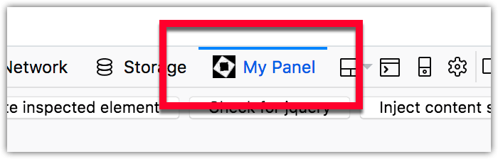

{{AddonSidebar}}

> **Note:** This feature is available since Firefox 54.

When an extension provides tools that are of use to developers, it's possible to add a UI for them to the browser's developer tools as a new panel.



## Specifying a developer tools panel

A developer tools panel is added using the [`devtools.panels`](/en-US/docs/Mozilla/Add-ons/WebExtensions/API/devtools/panels) API, which in turn needs to be run from a special devtools page.

Add the devtools page by including the [`devtools_page`](/en-US/docs/Mozilla/Add-ons/WebExtensions/manifest.json/devtools_page) key in extension's [manifest.json](/en-US/docs/Mozilla/Add-ons/WebExtensions/manifest.json) and provide the location of the page's HTML file in the extension:

```json
"devtools_page": "devtools-page.html"
```

From the devtools page, call a script that will add the devtools panel:

```html
<body>
  <script src="devtools.js"></script>
</body>
```

In the script, create the devtools panel by specifying the panel's title, icon, and HTML file that provides the panel's content:

```js
function handleShown() {
  console.log("panel is being shown");
}

function handleHidden() {
  console.log("panel is being hidden");
}

browser.devtools.panels
  .create(
    "My Panel", // title
    "icons/star.png", // icon
    "devtools/panel/panel.html", // content
  )
  .then((newPanel) => {
    newPanel.onShown.addListener(handleShown);
    newPanel.onHidden.addListener(handleHidden);
  });
```

The extension can now run code in the inspected window using [`devtools.inspectedWindow.eval()`](/en-US/docs/Mozilla/Add-ons/WebExtensions/API/devtools/inspectedWindow/eval) or by injecting a content script via the background script by passing a message. You can find more details on how to do this in [Extending the developer tools.](/en-US/docs/Mozilla/Add-ons/WebExtensions/Extending_the_developer_tools)

## Developer panel design

For details on how to design your developer panel's web page to match the style of Firefox, see the [Acorn Design System](https://acorn.firefox.com/latest/acorn.html) documentation.

## Icons

For details on how to create icons to use with your developer tools panel, see [Iconography](https://acorn.firefox.com/latest/styles/iconography.html) in the [Acorn Design System](https://acorn.firefox.com/latest/acorn.html) documentation.

## Examples

The [webextensions-examples](https://github.com/mdn/webextensions-examples) repository on GitHub includes the [devtools-panels](https://github.com/mdn/webextensions-examples/tree/main/devtools-panels) example which implements a devtools panel.
