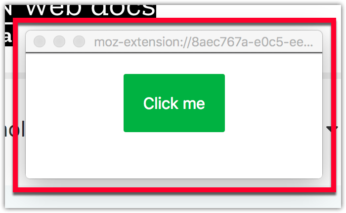

{{AddonSidebar}}

You can include HTML pages in your extension to provide forms, help, or any other content your extension needs.



These pages also get access to the same privileged JavaScript APIs that are available to your extension's background scripts. However, they are in their own tab, with their own JavaScript event queue, their own globals, etc.

Think of the background page as a "hidden extension page".

## Specifying extension pages

You can include HTML files—and associated CSS or JavaScript files—in your extension. The files can be included in the root or organized within meaningful sub-folders.

```plain
/my-extension
    /manifest.json
    /my-page.html
    /my-page.js
```

## Displaying extension pages

There are two options for displaying extension pages: {{WebExtAPIRef("windows.create()")}} and {{WebExtAPIRef("tabs.create()")}}.

Using `windows.create()`, for example, you can open an HTML page into a detached panel (a window without the normal browser UI of address bar, bookmark bar, and alike) to create a dialog-like user experience:

```js
let createData = {
  type: "detached_panel",
  url: "my-page.html",
  width: 250,
  height: 100,
};
let creating = browser.windows.create(createData);
```

When the window is no longer needed, it can be closed programmatically.

For example, after the user clicks a button, you may pass the current window's id to {{WebExtAPIRef("windows.remove()")}}:

```js
document.getElementById("close-me").addEventListener("click", () => {
  let winId = browser.windows.WINDOW_ID_CURRENT;
  let removing = browser.windows.remove(winId);
});
```

## Extension pages and history

By default, pages you open in this way will be stored in the user's history, just like normal web pages. If you don't want to have this behavior, use {{WebExtAPIRef("history.deleteUrl()")}} to remove the browser's record:

```js
function onVisited(historyItem) {
  if (historyItem.url === browser.extension.getURL(myPage)) {
    browser.history.deleteUrl({ url: historyItem.url });
  }
}

browser.history.onVisited.addListener(onVisited);
```

To use the history API, you must request the "`history`" [permission](/en-US/docs/Mozilla/Add-ons/WebExtensions/manifest.json/permissions) in your [`manifest.json`](/en-US/docs/Mozilla/Add-ons/WebExtensions/manifest.json) file.

## Web page design

For details on how to design your web page's to match the style of Firefox, see the [Acorn Design System](https://acorn.firefox.com/latest).

## Examples

The [webextensions-examples](https://github.com/mdn/webextensions-examples) repository on GitHub includes the [window-manipulator](https://github.com/mdn/webextensions-examples/tree/main/window-manipulator) example, which implements several of the options for creating windows.
