{{AddonSidebar}}

Extensions that use WebExtension APIs are provided with several user interface options so that their functionality can be made available to the user. A summary of those options is provided below, with a more detailed introduction to each user interface option in this section.

> [!NOTE]
> For advice on using these UI components to create a great user experience in your extension, please see the [User experience best practices](https://extensionworkshop.com/documentation/develop/user-experience-best-practices/) article.

<table class="standard-table">
  <thead>
    <tr>
      <th scope="col">UI option</th>
      <th scope="col">Description</th>
      <th scope="col">Example</th>
    </tr>
  </thead>
  <tbody>
    <tr>
      <td>
        <a
          href="/en-US/docs/Mozilla/Add-ons/WebExtensions/user_interface/Toolbar_button"
          >Toolbar button</a
        >
        (browser action)
      </td>
      <td>
        A button on the browser toolbar that dispatches an event to the
        extension when clicked. By default, the button is visible in all tabs.
      </td>
      <td>
        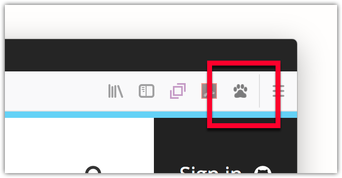
      </td>
    </tr>
    <tr>
      <td>
        Toolbar button with a
        <a
          href="/en-US/docs/Mozilla/Add-ons/WebExtensions/user_interface/Popups"
          >popup</a
        >
      </td>
      <td>
        A popup on a button in the browser toolbar that opens when the button is
        clicked. The popup is defined in an HTML document that handles the user
        interaction.
      </td>
      <td>
        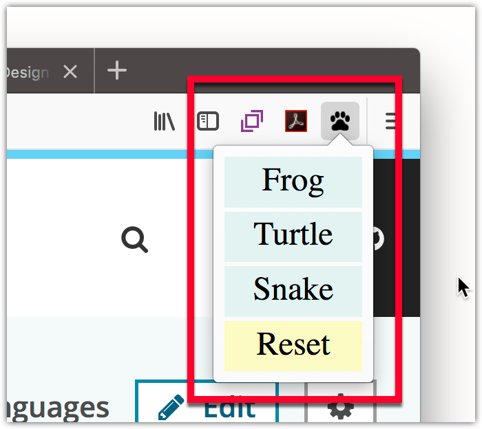
      </td>
    </tr>
    <tr>
      <td>
        <a
          href="/en-US/docs/Mozilla/Add-ons/WebExtensions/user_interface/Page_actions"
          >Address bar button</a
        >
        (page action)
      </td>
      <td>
        A button on the browser address bar that dispatches an event to the
        extension when clicked. By default, the button is hidden in all tabs.
      </td>
      <td>
        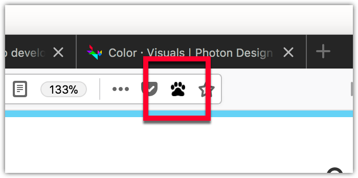
      </td>
    </tr>
    <tr>
      <td>
        Address bar button with a
        <a
          href="/en-US/docs/Mozilla/Add-ons/WebExtensions/user_interface/Popups"
          >popup</a
        >
      </td>
      <td>
        A popup on a button in the browser address bar that opens when the
        button is clicked. The popup is defined in an HTML document that handles
        the user interaction.
      </td>
      <td>
        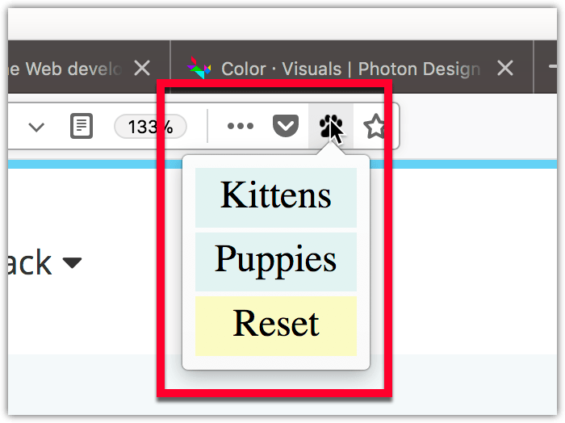
      </td>
    </tr>
    <tr>
      <td>
        <a
          href="/en-US/docs/Mozilla/Add-ons/WebExtensions/user_interface/Context_menu_items"
          >Context menu item</a
        >
      </td>
      <td>
        Menu items, checkboxes, and radio buttons on one or more of the
        browser's context menus. Also, menus can be structured by adding
        separators. When menu items are clicked, an event is dispatched to the
        extension.
      </td>
      <td>
        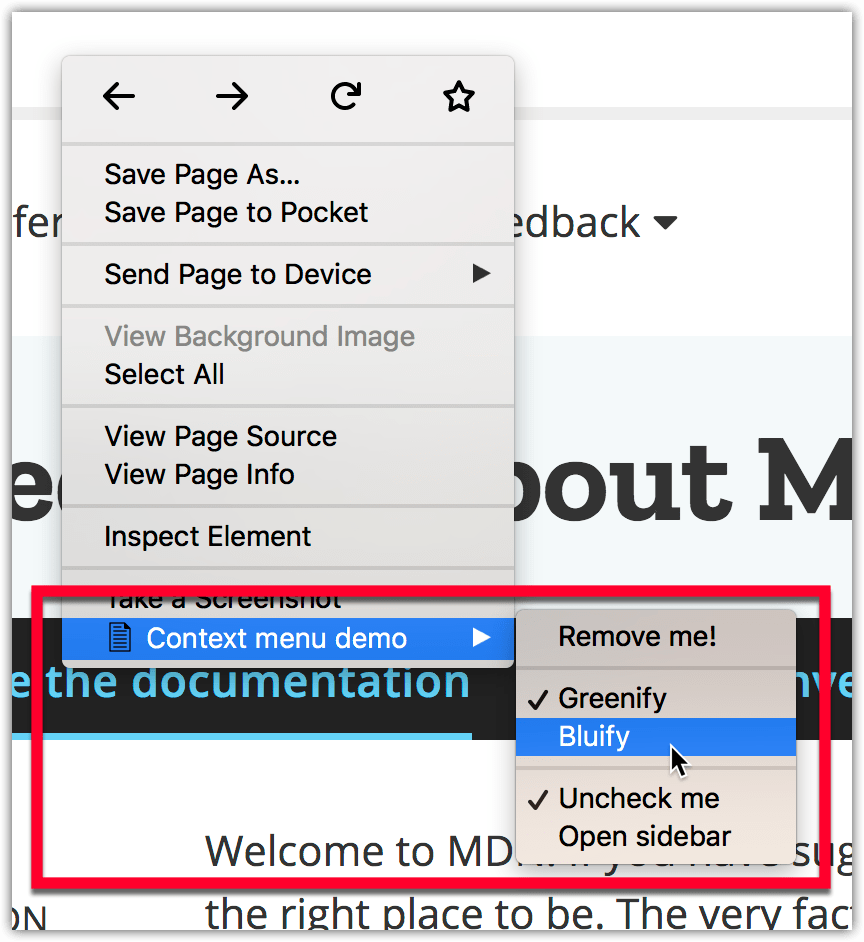
      </td>
    </tr>
    <tr>
      <td>
        <a
          href="/en-US/docs/Mozilla/Add-ons/WebExtensions/user_interface/Sidebars"
          >Sidebar</a
        >
      </td>
      <td>
        

          An HTML document displayed next to a web page, with the option for
          unique content per page. The sidebar is opened when the extension is
          installed, then obeys the user's sidebar visibility selection. User
          interaction within the sidebar is handled by its HTML document.
        

      </td>
      <td>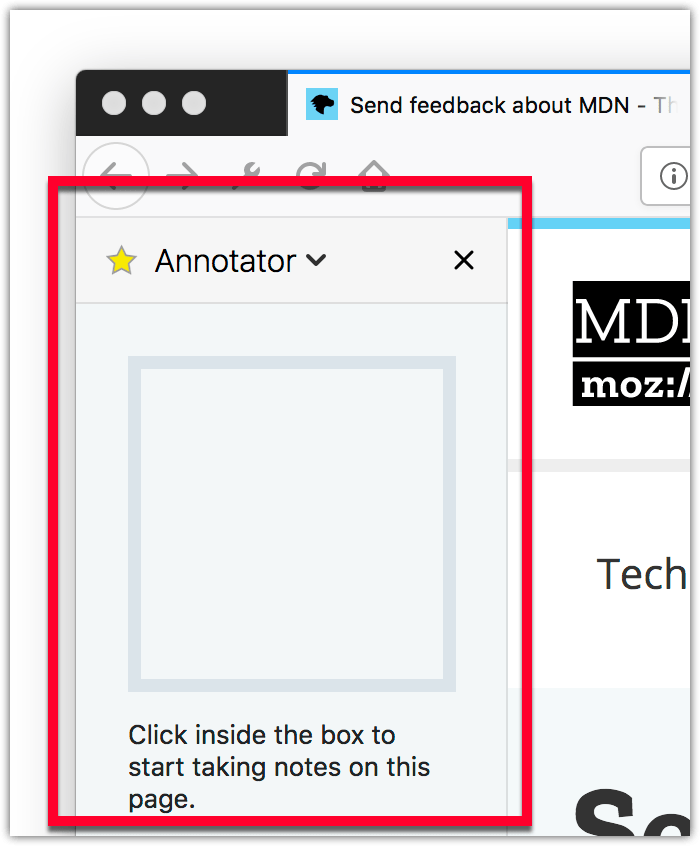</td>
    </tr>
    <tr>
      <td>
        <a
          href="/en-US/docs/Mozilla/Add-ons/WebExtensions/user_interface/Options_pages"
          >Options page</a
        >
      </td>
      <td>
        A page that enables you to define preferences for your extension that
        your users can change. The user can access this page from the browser's
        add-ons manager.
      </td>
      <td>
        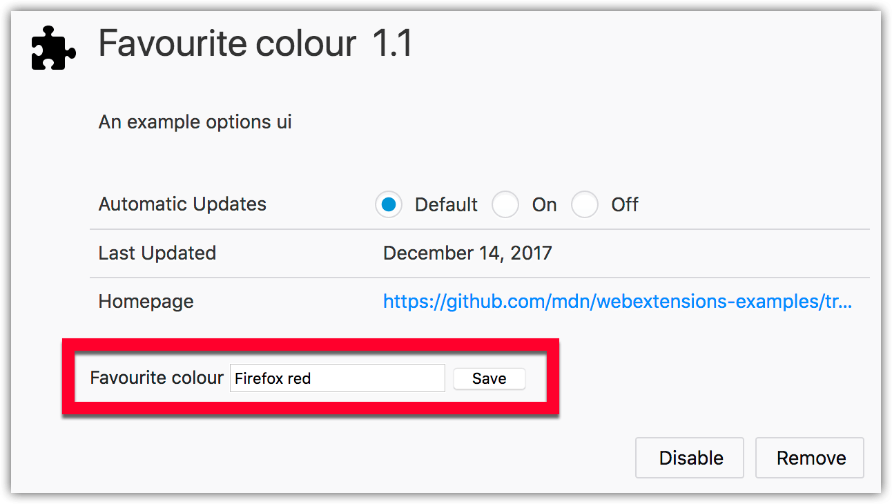
      </td>
    </tr>
    <tr>
      <td>
        <a
          href="/en-US/docs/Mozilla/Add-ons/WebExtensions/user_interface/Extension_pages"
          >Extension page</a
        >
      </td>
      <td>
        Use web pages included in your extension to provide forms, help, or any
        other content required, within windows or tabs.
      </td>
      <td>
        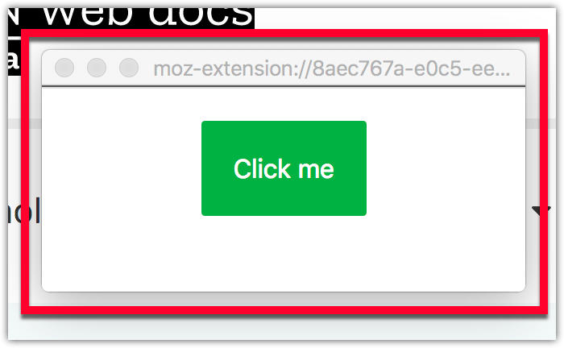
      </td>
    </tr>
    <tr>
      <td>
        <a
          href="/en-US/docs/Mozilla/Add-ons/WebExtensions/user_interface/Notifications"
          >Notification</a
        >
      </td>
      <td>
        Transient notifications displayed to the user through the underlying
        operating system's notifications mechanism. Dispatches an event to the
        extension when the user clicks a notification, or when a notification
        closes (either automatically or at the user's request).
      </td>
      <td>
        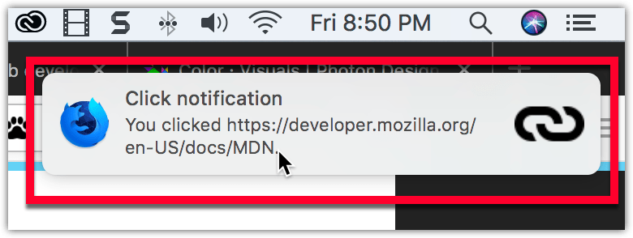
      </td>
    </tr>
    <tr>
      <td>
        <a
          href="/en-US/docs/Mozilla/Add-ons/WebExtensions/user_interface/Omnibox"
          >Address bar suggestion</a
        >
      </td>
      <td>
        Offer custom address bar suggestions when the user enters a keyword.
      </td>
      <td>
        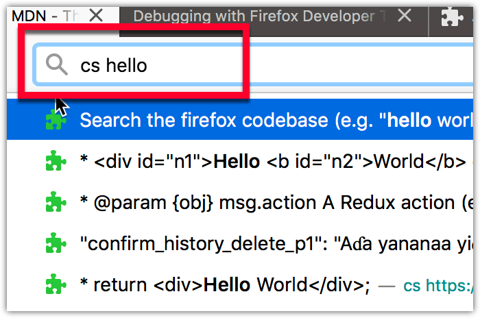
      </td>
    </tr>
    <tr>
      <td>
        <a
          href="/en-US/docs/Mozilla/Add-ons/WebExtensions/user_interface/devtools_panels"
          >Developer tools panel</a
        >
      </td>
      <td>
        A tab with an associated HTML document that displays in the browser's
        developer tools.
      </td>
      <td>
        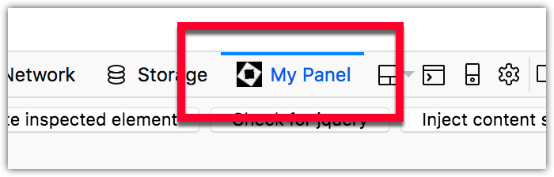
      </td>
    </tr>
  </tbody>
</table>

The following how-to guides provide step-by-step guidance to creating some of these user interface options:

- [Accessibility guidelines](https://extensionworkshop.com/documentation/develop/build-an-accessible-extension/)
- [Add a button to the toolbar](/en-US/docs/Mozilla/Add-ons/WebExtensions/Add_a_button_to_the_toolbar)
- [Browser styles](/en-US/docs/Mozilla/Add-ons/WebExtensions/user_interface/Browser_styles)
- [Extending the developer tools](/en-US/docs/Mozilla/Add-ons/WebExtensions/Extending_the_developer_tools)
- [Implement a settings page](/en-US/docs/Mozilla/Add-ons/WebExtensions/Implement_a_settings_page)
