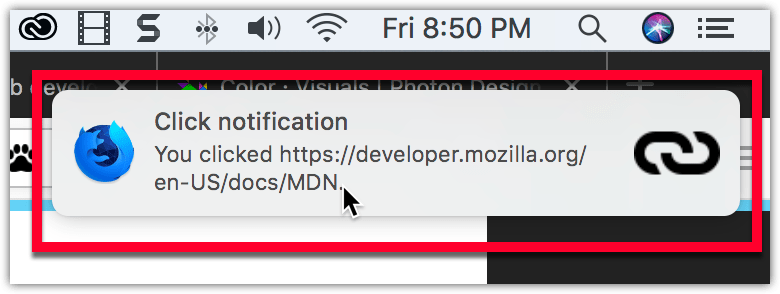

{{AddonSidebar}}

Notifications allow you to communicate information about your extension or its content using the underlying operating system's notification service.



Notifications can include a call to action for the user, and your add-on can listen for the user clicking the notification or the notification closing.

## Specifying notifications

You manage notifications programmatically, using the {{WebExtAPIRef("notifications")}} API. To use this API you must request the `notifications` permission in your manifest.json:

```json
"permissions": ["notifications"]
```

You then use {{WebExtAPIRef("notifications.create")}} to create your notifications, as in this example from [notify-link-clicks-i18n:](https://github.com/mdn/webextensions-examples/tree/master/notify-link-clicks-i18n)

```js
const title = browser.i18n.getMessage("notificationTitle");
const content = browser.i18n.getMessage("notificationContent", message.url);
browser.notifications.create({
  type: "basic",
  iconUrl: browser.extension.getURL("icons/link-48.png"),
  title,
  message: content,
});
```

This code creates a notification with an icon, title, and message.

If the notification includes a call to action, you can listen for the user clicking the notification to call the function to handle the action:

```js
browser.notifications.onClicked.addListener(handleClick);
```

If you are issuing calls to action through notifications, you will also want to define the optional notification `id`, so you can figure out which call to action the user has selected.

## Icons

For details on how to create icons to use with your notification, see [Iconography](https://design.firefox.com/photon/visuals/iconography.html) in the [Photon Design System](https://design.firefox.com/photon/index.html) documentation.

## Examples

The [webextensions-examples](https://github.com/mdn/webextensions-examples) repository on GitHub includes the [notify-link-clicks-i18n](https://github.com/mdn/webextensions-examples/tree/master/notify-link-clicks-i18n) example which implements notifications.
