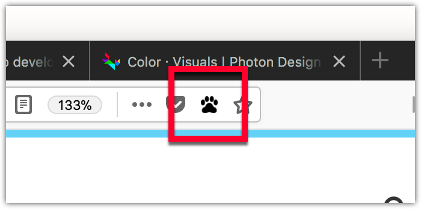

{{AddonSidebar}}

Commonly referred to as a [page action](/en-US/docs/Mozilla/Add-ons/WebExtensions/API/pageAction) button, this user interface option is a button added to the browser address bar. Users click the button to interact with extensions.



## Page actions and browser actions

The address bar button (or page action) is similar to the toolbar button (or browser action).

The differences are:

- **The button's location:**

  - The page action is displayed inside the browser address bar.
  - The browser action is displayed outside the address bar, in the browser toolbar.

- **The button's visibility:**

  - The page action is hidden by default (although this default can be changed via the `show_matches` and `hide_matches` [manifest key](/en-US/docs/Mozilla/Add-ons/WebExtensions/manifest.json/page_action) properties), and you call [`pageAction.show()`](/en-US/docs/Mozilla/Add-ons/WebExtensions/API/pageAction/show) and [`pageAction.hide()`](/en-US/docs/Mozilla/Add-ons/WebExtensions/API/pageAction/hide) to show or hide it in specific tabs.
  - The browser action is always displayed.

Use a page action when the action relates to the current page. Use a browser action when the action relates to the browser as a whole or to many pages. For example:

<table class="fullwidth-table standard-table">
  <thead>
    <tr>
      <th scope="row">Type</th>
      <th scope="col">Bookmarks action</th>
      <th scope="col">Content action</th>
      <th scope="col">Tabs operation</th>
    </tr>
  </thead>
  <tbody>
    <tr>
      <th scope="row">page action</th>
      <td>Bookmark this page</td>
      <td>Reddit enhancement</td>
      <td>Send tab</td>
    </tr>
    <tr>
      <th scope="row">browser action</th>
      <td>Show all bookmarks</td>
      <td>Enable ad-blocking</td>
      <td>Sync all open tabs</td>
    </tr>
  </tbody>
</table>

## Specifying the page action

You define the page action's properties using the [`page_action`](/en-US/docs/Mozilla/Add-ons/WebExtensions/manifest.json/page_action) key in manifest.json:

```json
"page_action": {
  "default_icon": {
    "19": "button/geo-19.png",
    "38": "button/geo-38.png"
  },
  "default_title": "Whereami?"
}
```

The only mandatory key is `default_icon`.

There are two ways to specify a page action: with or without a [popup](/en-US/docs/Mozilla/Add-ons/WebExtensions/user_interface/Popups).

- **Without a popup:** When the user clicks the button, an event is dispatched to the extension, which the extension listens for using [`pageAction.onClicked`](/en-US/docs/Mozilla/Add-ons/WebExtensions/API/pageAction/onClicked):

  ```js
  browser.pageAction.onClicked.addListener(handleClick);
  ```

- **With a popup:** the `click` event is not dispatched. Instead, the popup appears when the user clicks the button. The user then interacts with the popup. When the user clicks outside of the popup, it closes automatically. See the [Popup](/en-US/docs/Mozilla/Add-ons/WebExtensions/user_interface/Popups) article for more details on creating and managing popups.

Note that your extension can have just one page action.

You can change any of the page action properties programmatically using the [`pageAction`](/en-US/docs/Mozilla/Add-ons/WebExtensions/API/pageAction) API.

## Icons

For details on how to create icons to use with your page action, see [Iconography](https://acorn.firefox.com/latest/styles/iconography.html) in the [Acorn Design System](https://acorn.firefox.com/latest/acorn.html) documentation.

## Examples

The [webextensions-examples](https://github.com/mdn/webextensions-examples) repository on GitHub includes the [chill-out](https://github.com/mdn/webextensions-examples/tree/main/chill-out) example which implements a page action without a popup.
