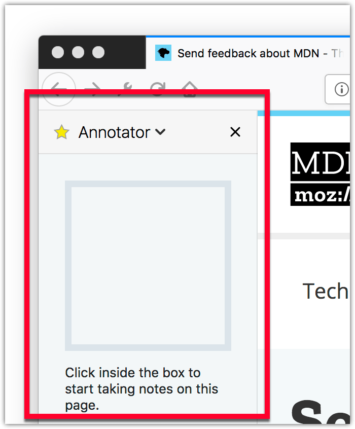

{{AddonSidebar}}

A sidebar is a pane that is displayed at the side of the browser window, next to the web page. This page describes sidebars, specifying them, designing them, and examples of use.

The browser provides a UI that enables the user to select a sidebar to display. For example, Firefox has the "View" > "Sidebar" menu. Each browser window can display its own sidebar, which is displayed on every tab in the window.

The browser may include a number of built-in sidebars. For example, Firefox includes a sidebar for interacting with bookmarks:



Using the [`sidebar_action`](/en-US/docs/Mozilla/Add-ons/WebExtensions/manifest.json/sidebar_action) manifest.json key, an extension can add its own sidebar to the browser. It will be listed alongside the built-in sidebars, and the user will be able to open it using the same mechanism as for the built-in sidebars.

Like a browser action popup, the sidebar's contents are specified as an HTML document. When the user opens the sidebar, the sidebar's document is loaded into every open browser window. Each window gets its own instance of the document. When new windows are opened, they get their own sidebar documents as well.

A document for a particular tab can be set using the {{WebExtAPIRef("sidebarAction.setPanel()")}} function. A sidebar can figure out which window it belongs to using the {{WebExtAPIRef("windows.getCurrent()")}} API:

```js
// sidebar.js
browser.windows.getCurrent({ populate: true }).then((windowInfo) => {
  myWindowId = windowInfo.id;
});
```

This is useful if a sidebar wants to display different content for different windows. For an example of this, see the ["annotate-page" example](https://github.com/mdn/webextensions-examples/tree/main/annotate-page).

Sidebar documents get access to the same set of privileged JavaScript APIs that the extension's background and popup scripts get. They can get direct access to the background page (unless the sidebar belongs to an incognito mode window) using {{WebExtAPIRef("runtime.getBackgroundPage()")}}, and can interact with content scripts or native applications using messaging APIs like {{WebExtAPIRef("tabs.sendMessage()")}} and {{WebExtAPIRef("runtime.sendNativeMessage()")}}.

Sidebar documents are unloaded when their browser window is closed or when the user closes the sidebar. This means that unlike background pages, sidebar documents don't stay loaded all the time, but unlike browser action popups, they stay loaded while the user interacts with web pages.

When an extension that defines a sidebar is first installed, its sidebar will be opened automatically. This is intended to help the user understand that the extension includes a sidebar. Note that it's not possible for an extension to open sidebars programmatically: sidebars can only be opened by the user.

## Specifying sidebars

To specify a sidebar, define the default document with the [`sidebar_action`](/en-US/docs/Mozilla/Add-ons/WebExtensions/manifest.json/sidebar_action) manifest.json key, alongside a default title and icon:

```json
"sidebar_action": {
  "default_title": "My sidebar",
  "default_panel": "sidebar.html",
  "default_icon": "sidebar_icon.png"
}
```

The title, panel, and icon can be changed programmatically using the {{WebExtAPIRef("sidebarAction")}} API.

Title and icon are shown to the user in any UI provided by the browser to list sidebars, such as the "View > Sidebar" menu in Firefox.

## Sidebar design

For details on how to design a sidebar's web page to match the style of Firefox, see the [Acorn Design System](https://acorn.firefox.com/latest) documentation.

## Example

The [webextensions-examples](https://github.com/mdn/webextensions-examples) repository on GitHub includes the [annotate-page](https://github.com/mdn/webextensions-examples/tree/main/annotate-page) example which implements a sidebar.
