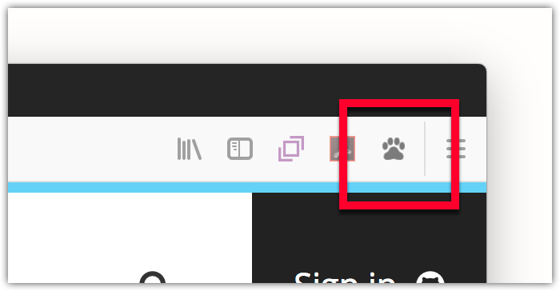

{{AddonSidebar}}

Commonly referred to as a [browser action](/en-US/docs/Mozilla/Add-ons/WebExtensions/API/browserAction), this user interface option is a button added to the browser toolbar. Users click the button to interact with your extension.


The toolbar button (browser action) is very like the address bar button (page action). For the differences, and guidance on when to use what, see [Page actions and browser actions](/en-US/docs/Mozilla/Add-ons/WebExtensions/user_interface/Page_actions#page_actions_and_browser_actions).

## Specifying the browser action

You define the browser action's properties using the [`browser_action`](/en-US/docs/Mozilla/Add-ons/WebExtensions/manifest.json/browser_action) key in manifest.json:

```json
"browser_action": {
  "default_icon": {
    "19": "button/geo-19.png",
    "38": "button/geo-38.png"
  },
  "default_title": "Whereami?"
}
```

The only mandatory key is `default_icon`.

There are two ways to specify a browser action: with or without a [popup](/en-US/docs/Mozilla/Add-ons/WebExtensions/user_interface/Popups). If you don't specify a popup, when the user clicks the button an event is dispatched to the extension, which the extension listens for using [`browserAction.onClicked`](/en-US/docs/Mozilla/Add-ons/WebExtensions/API/browserAction/onClicked):

```js
browser.browserAction.onClicked.addListener(handleClick);
```

If you specify a popup, the click event is not dispatched: instead, the popup is shown when the user clicks the button. The user is able to interact with the popup and it closes automatically when the user clicks outside it. See the [Popup](/en-US/docs/Mozilla/Add-ons/WebExtensions/user_interface/Popups) article for more details on creating and managing popups.

Note that your extension can have only one browser action.

You can change many of the browser action properties programmatically using the [`browserAction`](/en-US/docs/Mozilla/Add-ons/WebExtensions/API/browserAction) API.

## Icons

For details on how to create icons to use with your browser action, see [Iconography](https://acorn.firefox.com/latest/styles/iconography-q7JqGl5H) in the [Acorn Design System](https://acorn.firefox.com/latest/) documentation.

## Examples

The [`webextensions-examples`](https://github.com/mdn/webextensions-examples) repository on GitHub contains two examples of extensions that implement browser actions:

- [bookmark-it](https://github.com/mdn/webextensions-examples/tree/main/bookmark-it) uses a browser action without a popup
- [beastify](https://github.com/mdn/webextensions-examples/tree/main/beastify) uses a browser action with a popup
