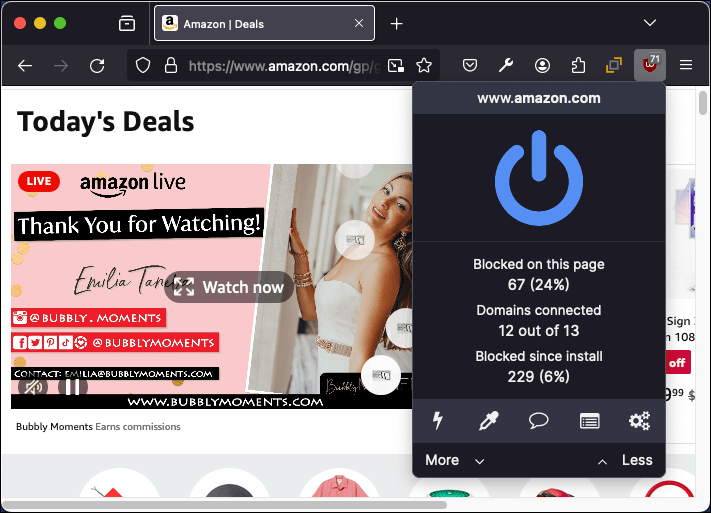

{{AddonSidebar}}

> [!NOTE]
> If you are already familiar with the basic concepts of browser extensions, skip this section to [see how extension files are put together](/en-US/docs/Mozilla/Add-ons/WebExtensions/Anatomy_of_a_WebExtension). Then, use the [reference documentation](/en-US/docs/Mozilla/Add-ons/WebExtensions#reference) to start building your extension. Visit [Firefox Extension Workshop](https://extensionworkshop.com/?utm_source=developer.mozilla.org&utm_medium=documentation&utm_campaign=your-first-extension) to learn more about the workflow for testing, publishing, and extensions for Firefox.

An extension adds features and functions to a browser. It's created using familiar web-based technologies — HTML, CSS, and JavaScript. It can take advantage of the same web APIs as JavaScript on a web page, but an extension also has access to its own set of JavaScript APIs. This means that you can do a lot more in an extension than you can with code in a web page. Here are just a few examples of the things you can do:

**Enhance or complement a website**: Use an add-on to deliver additional in-browser features or information from your website. Allow users to collect details from pages they visit to enhance the service you offer.

Examples: [Grammarly for Firefox](https://addons.mozilla.org/en-US/firefox/addon/grammarly-1/), [Enhancer for YouTube](https://addons.mozilla.org/en-US/firefox/addon/enhancer-for-youtube/), and [Control Panel for Twitter](https://addons.mozilla.org/en-US/firefox/addon/control-panel-for-twitter/).

**Let users show their personality**: Browser extensions can manipulate the content of web pages; for example, letting users add their favorite logo or picture as a background to every page they visit. Extensions may also enable users to update the look of the Firefox UI, the same way standalone [theme add-ons](https://extensionworkshop.com/documentation/themes/) do.

Examples: [Tabliss](https://addons.mozilla.org/en-US/firefox/addon/tabliss/), [Stylus](https://addons.mozilla.org/en-US/firefox/addon/styl-us/), and [Emoji](https://addons.mozilla.org/en-US/firefox/addon/emoji-sav/).

**Add or remove content from web pages**: You might want to help users block intrusive ads from web pages, provide access to a travel guide whenever a country or city is mentioned in a web page, or reformat page content to offer a consistent reading experience. With the ability to access and update both a page's HTML and CSS, extensions can help users see the web the way they want to.

Examples: [uBlock Origin](https://addons.mozilla.org/en-US/firefox/addon/ublock-origin/), [Return YouTube Dislike](https://addons.mozilla.org/en-US/firefox/addon/return-youtube-dislikes/), and [LeechBlock NG](https://addons.mozilla.org/en-US/firefox/addon/leechblock-ng/).

**Add tools and new browsing features**: Add new features to a taskboard, or generate QR code images from URLs, hyperlinks, or page text. With flexible UI options and the power of the [WebExtensions APIs](/en-US/docs/Mozilla/Add-ons/WebExtensions) you can easily add new features to a browser. And, you can enhance almost any website's features or functionality, it doesn't have to be your website.

Examples: [Worldwide Radio](https://addons.mozilla.org/en-US/firefox/addon/worldwide-radio/), [Flagfox](https://addons.mozilla.org/en-US/firefox/addon/flagfox/), and [Tomato Clock](https://addons.mozilla.org/en-US/firefox/addon/tomato-clock/).

**Games**: Offer traditional computer games with offline play features or explore new game possibilities, such as incorporating gameplay into everyday browsing.

Examples: [RPG Game - Dedalium by Loycom Games](https://addons.mozilla.org/en-US/firefox/addon/rpg-game-online-dedalium/), [Solitaire Card Game](https://addons.mozilla.org/en-US/firefox/addon/solitaire-spider-freecell/), and [2048 Prime](https://addons.mozilla.org/en-US/firefox/addon/2048-prime/).

**Add development tools**: You may provide web development tools as your business or have developed a useful technique or approach to web development that you want to share. Either way, you can enhance the built-in Firefox developer tools by adding a new tab to the developer toolbar.

Examples: [aXe Developer Tools](https://addons.mozilla.org/en-US/firefox/addon/axe-devtools/), [Web Developer](https://addons.mozilla.org/en-US/firefox/addon/web-developer/), and [Web React Developer Tools](https://addons.mozilla.org/en-US/firefox/addon/react-devtools/).

Extensions for Firefox are built using the [WebExtensions APIs](/en-US/docs/Mozilla/Add-ons/WebExtensions), a cross-browser system for developing extensions. To a large extent, the API is compatible with the [extension API](https://developer.chrome.com/docs/extensions/reference/) supported by Google Chrome and Opera. Extensions written for these browsers will in most cases run in Firefox or Microsoft Edge with just a few [changes](https://extensionworkshop.com/documentation/develop/porting-a-google-chrome-extension/).

If you have ideas or questions, you can reach us on the [Add-ons Discourse](https://discourse.mozilla.org/c/add-ons/35) or in the [Add-ons room](https://chat.mozilla.org/#/room/#addons:mozilla.org) on [Matrix](https://wiki.mozilla.org/Matrix).

## What's next?

- Walk through the development of an extension in [Your first extension](/en-US/docs/Mozilla/Add-ons/WebExtensions/Your_first_WebExtension).
- Learn about the structure of an extension in [Anatomy of an extension](/en-US/docs/Mozilla/Add-ons/WebExtensions/Anatomy_of_a_WebExtension).
- Try out some example extensions in [Example extensions](/en-US/docs/Mozilla/Add-ons/WebExtensions/Examples).
