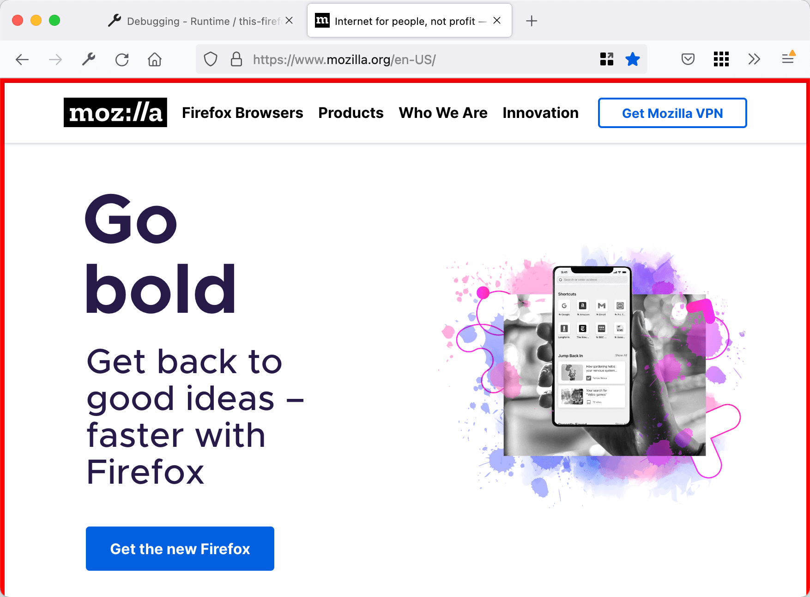

{{AddonSidebar}}

> [!NOTE]
> If you're familiar with the basic concepts of browser extensions, skip this section to [see how extension files are put together](/en-US/docs/Mozilla/Add-ons/WebExtensions/Anatomy_of_a_WebExtension). Then, use the [reference documentation](/en-US/docs/Mozilla/Add-ons/WebExtensions#reference) to start building your extension. Visit [Firefox Extension Workshop](https://extensionworkshop.com/?utm_source=developer.mozilla.org&utm_medium=documentation&utm_campaign=your-first-extension) to learn more about the workflow for testing, publishing, and extensions for Firefox.

This article walks through creating an extension for Firefox, from start to finish. The extension adds a red border to any pages loaded from "`mozilla.org`" or any of its subdomains.

The source code for this example is on GitHub: <https://github.com/mdn/webextensions-examples/tree/main/borderify>.

## Writing the extension

In a suitable location, such as in the `Documents` directory, create a new directory called `borderify` and navigate to it. You can do this using your computer's file explorer or [command line terminal](/en-US/docs/Learn_web_development/Getting_started/Environment_setup/Command_line). Understanding how to use the command line terminal is a handy skill, as it helps with your more advanced extension development. Using the terminal, you create the directory like this:

```bash
mkdir borderify
cd borderify
```

### manifest.json

Using a suitable [text editor](/en-US/docs/Learn_web_development/Howto/Tools_and_setup/Available_text_editors), create a new file called "manifest.json" directly under the "borderify" directory. Give it the following contents:

```json
{
  "manifest_version": 2,
  "name": "Borderify",
  "version": "1.0",

  "description": "Adds a red border to all webpages matching mozilla.org.",

  "icons": {
    "48": "icons/border-48.png"
  },

  "content_scripts": [
    {
      "matches": ["*://*.mozilla.org/*"],
      "js": ["borderify.js"]
    }
  ]
}
```

- The first three keys: [`manifest_version`](/en-US/docs/Mozilla/Add-ons/WebExtensions/manifest.json/manifest_version), [`name`](/en-US/docs/Mozilla/Add-ons/WebExtensions/manifest.json/name), and [`version`](/en-US/docs/Mozilla/Add-ons/WebExtensions/manifest.json/version), are mandatory and contain basic metadata for the extension.
- [`description`](/en-US/docs/Mozilla/Add-ons/WebExtensions/manifest.json/description) is optional, but recommended: it's displayed in the Add-ons Manager.
- [`icons`](/en-US/docs/Mozilla/Add-ons/WebExtensions/manifest.json/icons) is optional, but recommended: it allows you to specify an icon for the extension, that will be shown in the Add-ons Manager.

The most interesting key here is [`content_scripts`](/en-US/docs/Mozilla/Add-ons/WebExtensions/manifest.json/content_scripts), which tells Firefox to load a script into Web pages whose URL matches a specific pattern. In this case, we're asking Firefox to load a script called "borderify.js" into all HTTP or HTTPS pages served from "mozilla.org" or any of its subdomains.

- [Learn more about content scripts.](/en-US/docs/Mozilla/Add-ons/WebExtensions/Content_scripts)
- [Learn more about match patterns](/en-US/docs/Mozilla/Add-ons/WebExtensions/Match_patterns).

> **Warning:** [In some situations you need to specify an ID for your extension](https://extensionworkshop.com/documentation/develop/extensions-and-the-add-on-id/#when_do_you_need_an_add-on_id). If you do need to specify an add-on ID, include the [`browser_specific_settings`](/en-US/docs/Mozilla/Add-ons/WebExtensions/manifest.json/browser_specific_settings) key in `manifest.json` and set its `gecko.id` property:
>
> ```json
> "browser_specific_settings": {
>   "gecko": {
>     "id": "borderify@example.com"
>   }
> }
> ```

### icons/border-48.png

The extension should have an icon. This will be shown next to the extension's listing in the Add-ons Manager. Our manifest.json promised that we would have an icon at "icons/border-48.png".

Create the "icons" directory directly under the "borderify" directory. Save an icon there named "border-48.png". You could use [the one from our example](https://raw.githubusercontent.com/mdn/webextensions-examples/main/borderify/icons/border-48.png), which is taken from the Google Material Design iconset, and is used under the terms of the [Creative Commons Attribution-ShareAlike](https://creativecommons.org/licenses/by-sa/3.0/) license.

If you choose to supply your own icon, It should be 48x48 pixels. You could also supply a 96x96 pixel icon, for high-resolution displays, and if you do this it will be specified as the `96` property of the `icons` object in manifest.json:

```json
"icons": {
  "48": "icons/border-48.png",
  "96": "icons/border-96.png"
}
```

Alternatively, you could supply an SVG file here, and it will be scaled correctly. (Though: if you're using SVG and your icon includes text, you may want to use your SVG editor's "convert to path" tool to flatten the text, so that it scales with a consistent size/position.)

- [Learn more about specifying icons.](/en-US/docs/Mozilla/Add-ons/WebExtensions/manifest.json/icons)

### borderify.js

Finally, create a file called "borderify.js" directly under the "borderify" directory. Give it this content:

```js
document.body.style.border = "5px solid red";
```

This script will be loaded into the pages that match the pattern given in the `content_scripts` manifest.json key. The script has direct access to the document, just like scripts loaded by the page itself.

- [Learn more about content scripts.](/en-US/docs/Mozilla/Add-ons/WebExtensions/Content_scripts)

## Trying it out

First, double check that you have the right files in the right places:

```plain
borderify/
    icons/
        border-48.png
    borderify.js
    manifest.json
```

### Installing

In Firefox: Open the [about:debugging](https://firefox-source-docs.mozilla.org/devtools-user/about_colon_debugging/index.html) page, click the This Firefox option, click the Load Temporary Add-on button, then select any file in your extension's directory.

The extension now installs, and remains installed until you restart Firefox.

Alternatively, you can run the extension from the command line using the [web-ext](https://extensionworkshop.com/documentation/develop/getting-started-with-web-ext/) tool.

### Testing

> [!NOTE]
> By default [extensions don't work in private browsing](https://support.mozilla.org/en-US/kb/extensions-private-browsing). If you want to test this extension in private browsing open "`about:addons`", click on the extension, and select the Allow radio button for Run in Private Windows.

Now visit a page under "`https://www.mozilla.org/en-US/`", and you should see the red border round the page.



> [!NOTE]
> Don't try it on "`addons.mozilla.org`", though! Content scripts are currently blocked on that domain.

Try experimenting a bit. Edit the content script to change the color of the border, or do something else to the page content. Save the content script, then reload the extension's files by clicking the Reload button in "`about:debugging`". You can see the changes right away.

- [Learn more about loading extensions](https://extensionworkshop.com/documentation/develop/temporary-installation-in-firefox/)

## Packaging and publishing

For other people to use your extension, you need to package it and submit it to Mozilla for signing. To learn more about that, see ["Publishing your extension"](https://extensionworkshop.com/documentation/publish/package-your-extension/).

## What's next?

Now you've had an introduction to the process of developing a WebExtension for Firefox:

- [write a more complex extension](/en-US/docs/Mozilla/Add-ons/WebExtensions/Your_second_WebExtension)
- [read more about the anatomy of an extension](/en-US/docs/Mozilla/Add-ons/WebExtensions/Anatomy_of_a_WebExtension)
- [explore the extension examples](/en-US/docs/Mozilla/Add-ons/WebExtensions/Examples)
- [find out what you need to develop, test, and publish your extension](/en-US/docs/Mozilla/Add-ons/WebExtensions/What_next)
- [take your learning further](/en-US/docs/Mozilla/Add-ons/WebExtensions/What_next#continue_your_learning_experience).
