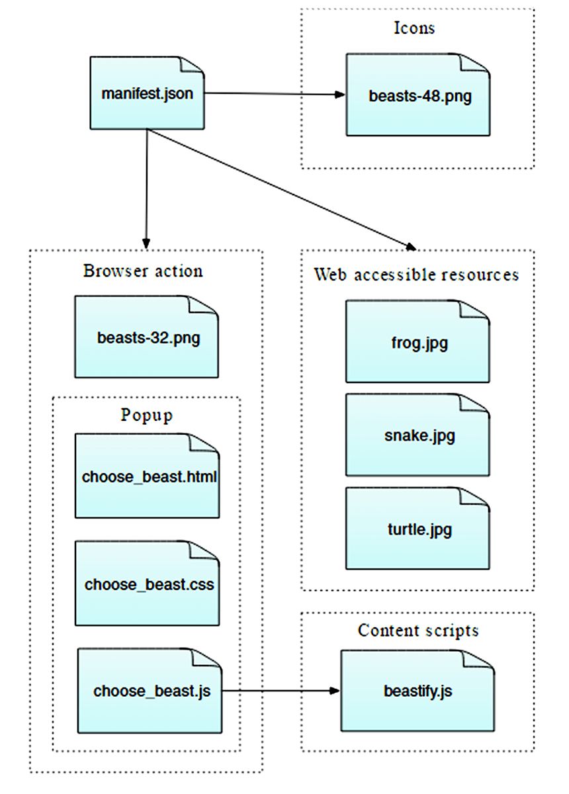
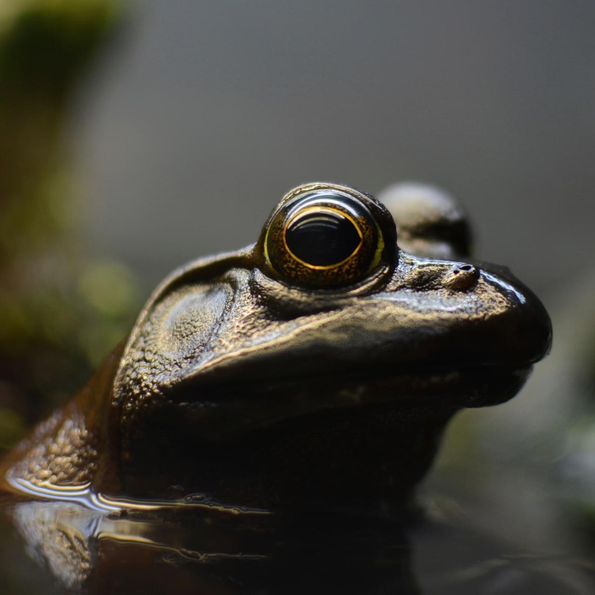
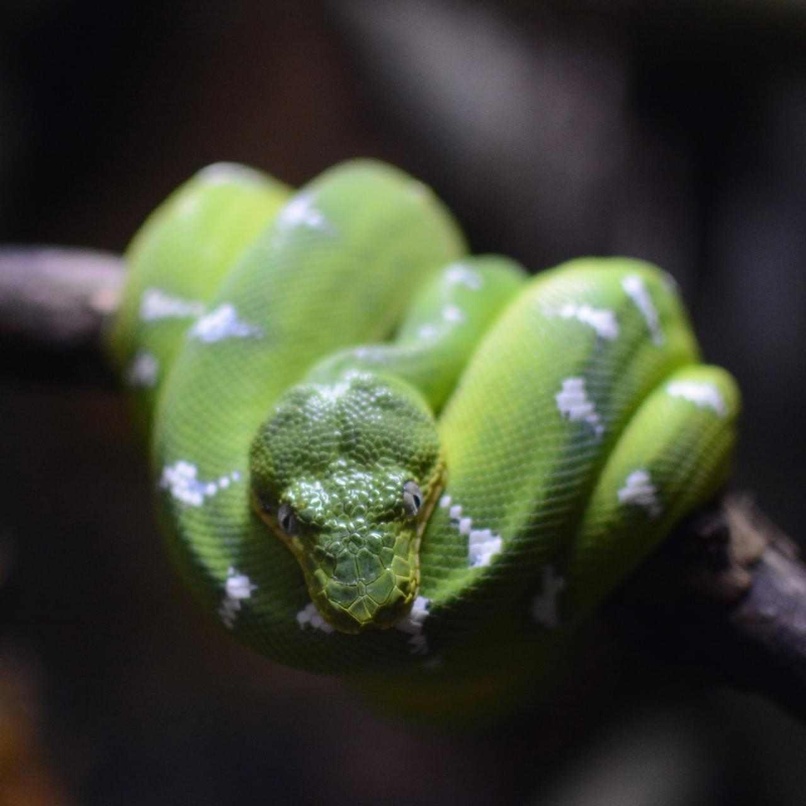
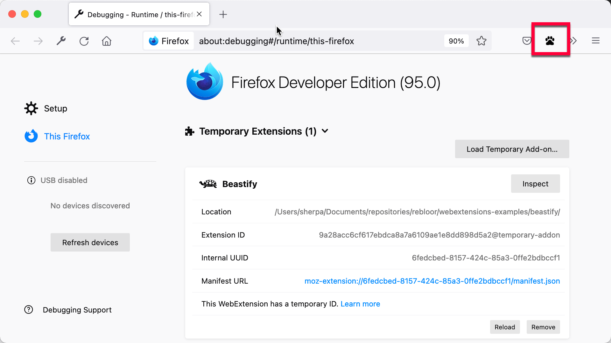
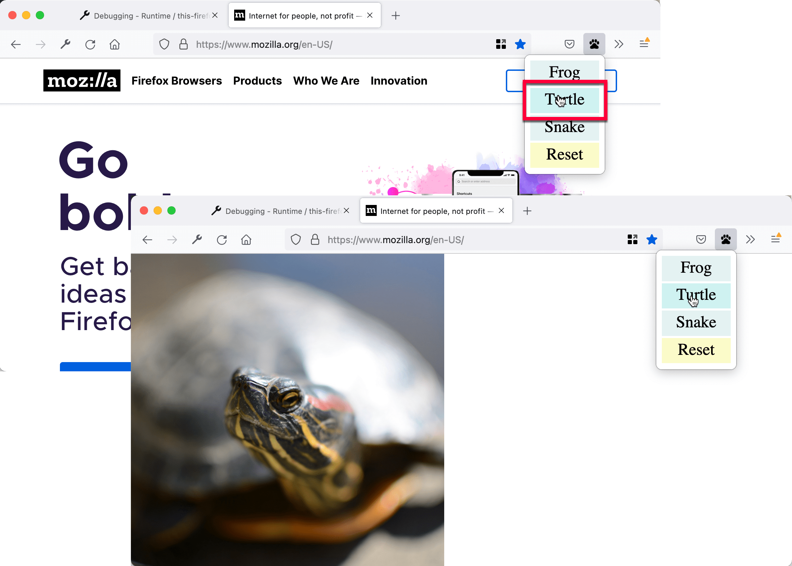

{{AddonSidebar}}

If you've been through the [Your first extension](/en-US/docs/Mozilla/Add-ons/WebExtensions/Your_first_WebExtension) article, you've already got an idea of how to write an extension. In this article, you'll write a slightly more complex extension that demonstrates a few more of the APIs.

The extension adds a new button to the Firefox toolbar. When the user clicks the button, we display a popup enabling them to choose an animal. Once they choose an animal, we'll replace the current page's content with a picture of the chosen animal.

To implement this, we will:

- **define a [browser action](/en-US/docs/Mozilla/Add-ons/WebExtensions/user_interface/Browser_action), which is a button attached to the Firefox toolbar**.
  For the button we'll supply:

  - an icon, called "beasts-32.png"
  - a popup to open when the button is pressed. The popup will include HTML, CSS, and JavaScript.

- **define an icon for the extension**, called "beasts-48.png". This will be shown in the Add-ons Manager.
- **write a content script, "beastify.js" that will be injected into web pages**.
  This is the code that will actually modify the pages.
- **package some images of the animals, to replace images in the web page**.
  We'll make the images "web accessible resources" so the web page can refer to them.

You could visualize the overall structure of the extension like this:



It's a simple extension, but shows many of the basic concepts of the WebExtensions API:

- adding a button to the toolbar
- defining a popup panel using HTML, CSS, and JavaScript
- injecting content scripts into web pages
- communicating between content scripts and the rest of the extension
- packaging resources with your extension that can be used by web pages

You can find [complete source code for the extension on GitHub](https://github.com/mdn/webextensions-examples/tree/master/beastify).

## Writing the extension

Create a new directory and navigate to it:

```bash
mkdir beastify
cd beastify
```

### manifest.json

Now create a new file called "manifest.json", and give it the following contents:

```json
{
  "manifest_version": 2,
  "name": "Beastify",
  "version": "1.0",

  "description": "Adds a browser action icon to the toolbar. Click the button to choose a beast. The active tab's body content is then replaced with a picture of the chosen beast. See https://developer.mozilla.org/en-US/Add-ons/WebExtensions/Examples#beastify",
  "homepage_url": "https://github.com/mdn/webextensions-examples/tree/master/beastify",
  "icons": {
    "48": "icons/beasts-48.png"
  },

  "permissions": [
    "activeTab"
  ],

  "browser_action": {
    "default_icon": "icons/beasts-32.png",
    "default_title": "Beastify",
    "default_popup": "popup/choose_beast.html"
  },

  "web_accessible_resources": [
    "beasts/frog.jpg",
    "beasts/turtle.jpg",
    "beasts/snake.jpg"
  ]
}
```

- The first three keys: [`manifest_version`](/en-US/docs/Mozilla/Add-ons/WebExtensions/manifest.json/manifest_version), [`name`](/en-US/docs/Mozilla/Add-ons/WebExtensions/manifest.json/name), and [`version`](/en-US/docs/Mozilla/Add-ons/WebExtensions/manifest.json/version), are mandatory and contain basic metadata for the extension.
- [`description`](/en-US/docs/Mozilla/Add-ons/WebExtensions/manifest.json/description) and [`homepage_url`](/en-US/docs/Mozilla/Add-ons/WebExtensions/manifest.json/homepage_url) are optional, but recommended: they provide useful information about the extension.
- [`icons`](/en-US/docs/Mozilla/Add-ons/WebExtensions/manifest.json/icons) is optional, but recommended: it allows you to specify an icon for the extension, that will be shown in the Add-ons Manager.
- [`permissions`](/en-US/docs/Mozilla/Add-ons/WebExtensions/manifest.json/permissions) lists permissions the extension needs. We're just asking for the [`activeTab` permission](/en-US/docs/Mozilla/Add-ons/WebExtensions/manifest.json/permissions#activetab_permission) here.
- [`browser_action`](/en-US/docs/Mozilla/Add-ons/WebExtensions/manifest.json/browser_action) specifies the toolbar button. We're supplying three pieces of information here:

  - `default_icon` is mandatory, and points to the icon for the button
  - `default_title` is optional, and will be shown in a tooltip
  - `default_popup` is used if you want a popup to be shown when the user clicks the button. We do, so we've included this key and made it point to an HTML file included with the extension.

- [`web_accessible_resources`](/en-US/docs/Mozilla/Add-ons/WebExtensions/manifest.json/web_accessible_resources) lists files that we want to make accessible to web pages. Since the extension replaces the content in the page with images we've packaged with the extension, we need to make these images accessible to the page.

Note that all paths given are relative to manifest.json itself.

### The icon

The extension should have an icon. This will be shown next to the extension's listing in the Add-ons Manager (you can open this by visiting the URL "about:addons"). Our manifest.json promised that we would have an icon for the toolbar at "icons/beasts-48.png".

Create the "icons" directory and save an icon there named "beasts-48.png". You could use [the one from our example](https://raw.githubusercontent.com/mdn/webextensions-examples/master/beastify/icons/beasts-48.png), which is taken from the [Aha-Soft's Free Retina iconset](http://www.aha-soft.com/free-icons/free-retina-icon-set/), and used under the terms of its license.

If you choose to supply your own icon, It should be 48x48 pixels. You could also supply a 96x96 pixel icon, for high-resolution displays, and if you do this it will be specified as the `96` property of the `icons` object in manifest.json:

```json
"icons": {
  "48": "icons/beasts-48.png",
  "96": "icons/beasts-96.png"
}
```

### The toolbar button

The toolbar button also needs an icon, and our manifest.json promised that we would have an icon for the toolbar at "icons/beasts-32.png".

Save an icon named "beasts-32.png" in the "icons" directory. You could use [the one from our example](https://raw.githubusercontent.com/mdn/webextensions-examples/master/beastify/icons/beasts-32.png), which is taken from the [IconBeast Lite icon set](http://www.iconbeast.com/free/) and used under the terms of its [license](http://www.iconbeast.com/faq/).

If you don't supply a popup, then a click event is dispatched to your extension when the user clicks the button. If you do supply a popup, the click event is not dispatched, but instead, the popup is opened. We want a popup, so let's create that next.

### The popup

The function of the popup is to enable the user to choose one of three beasts.

Create a new directory called "popup" under the extension root. This is where we'll keep the code for the popup. The popup will consist of three files:

- **`choose_beast.html`** defines the content of the panel
- **`choose_beast.css`** styles the content
- **`choose_beast.js`** handles the user's choice by running a content script in the active tab

```bash
mkdir popup
cd popup
touch choose_beast.html choose_beast.css choose_beast.js
```

#### choose_beast.html

The HTML file looks like this:

```html
<!DOCTYPE html>
<html>
  <head>
    <meta charset="utf-8">
    <link rel="stylesheet" href="choose_beast.css" />
  </head>

  <body>
    <div id="popup-content">
      <div class="button beast">Frog</div>
      <div class="button beast">Turtle</div>
      <div class="button beast">Snake</div>
      <div class="button reset">Reset</div>
    </div>
    <div id="error-content" class="hidden">
      <p>Can't beastify this web page.</p>
      <p>Try a different page.</p>
    </div>
    <script src="choose_beast.js"></script>
  </body>
</html>
```

We have a [`<div>`](/en-US/docs/Web/HTML/Element/div) element with an ID of `"popup-content"` that contains an element for each animal choice. We have another `<div>` with an ID of `"error-content"` and a class `"hidden"`. We'll use that in case there's a problem initializing the popup.

Note that we include the CSS and JS files from this file, just like a web page.

#### choose_beast.css

The CSS fixes the size of the popup, ensures that the three choices fill the space, and gives them some basic styling. It also hides elements with `class="hidden"`: this means that our `"error-content"` `<div>` will be hidden by default.

```css
html,
body {
  width: 100px;
}

.hidden {
  display: none;
}

.button {
  margin: 3% auto;
  padding: 4px;
  text-align: center;
  font-size: 1.5em;
  cursor: pointer;
}

.beast:hover {
  background-color: #CFF2F2;
}

.beast {
  background-color: #E5F2F2;
}

.reset {
  background-color: #FBFBC9;
}

.reset:hover {
  background-color: #EAEA9D;
}
```

#### choose_beast.js

Here's the JavaScript for the popup:

```js
/**
 * CSS to hide everything on the page,
 * except for elements that have the "beastify-image" class.
 */
const hidePage = `body > :not(.beastify-image) {
                    display: none;
                  }`;

/**
 * Listen for clicks on the buttons, and send the appropriate message to
 * the content script in the page.
 */
function listenForClicks() {
  document.addEventListener("click", (e) => {
    /**
     * Given the name of a beast, get the URL to the corresponding image.
     */
    function beastNameToURL(beastName) {
      switch (beastName) {
        case "Frog":
          return browser.runtime.getURL("beasts/frog.jpg");
        case "Snake":
          return browser.runtime.getURL("beasts/snake.jpg");
        case "Turtle":
          return browser.runtime.getURL("beasts/turtle.jpg");
      }
    }

    /**
     * Insert the page-hiding CSS into the active tab,
     * then get the beast URL and
     * send a "beastify" message to the content script in the active tab.
     */
    function beastify(tabs) {
      browser.tabs.insertCSS({ code: hidePage }).then(() => {
        let url = beastNameToURL(e.target.textContent);
        browser.tabs.sendMessage(tabs[0].id, {
          command: "beastify",
          beastURL: url
        });
      });
    }

    /**
     * Remove the page-hiding CSS from the active tab,
     * send a "reset" message to the content script in the active tab.
     */
    function reset(tabs) {
      browser.tabs.removeCSS({ code: hidePage }).then(() => {
        browser.tabs.sendMessage(tabs[0].id, {
          command: "reset",
        });
      });
    }

    /**
     * Just log the error to the console.
     */
    function reportError(error) {
      console.error(`Could not beastify: ${error}`);
    }

    /**
     * Get the active tab,
     * then call "beastify()" or "reset()" as appropriate.
     */
    if (e.target.classList.contains("beast")) {
      browser.tabs
        .query({ active: true, currentWindow: true })
        .then(beastify)
        .catch(reportError);
    } else if (e.target.classList.contains("reset")) {
      browser.tabs
        .query({ active: true, currentWindow: true })
        .then(reset)
        .catch(reportError);
    }
  });
}

/**
 * There was an error executing the script.
 * Display the popup's error message, and hide the normal UI.
 */
function reportExecuteScriptError(error) {
  document.querySelector("#popup-content").classList.add("hidden");
  document.querySelector("#error-content").classList.remove("hidden");
  console.error(`Failed to execute beastify content script: ${error.message}`);
}

/**
 * When the popup loads, inject a content script into the active tab,
 * and add a click handler.
 * If we couldn't inject the script, handle the error.
 */
browser.tabs
  .executeScript({ file: "/content_scripts/beastify.js" })
  .then(listenForClicks)
  .catch(reportExecuteScriptError);
```

The place to start here is line 96. The popup script executes a content script in the active tab as soon as the popup is loaded, using the [`browser.tabs.executeScript()`](/en-US/docs/Mozilla/Add-ons/WebExtensions/API/tabs/executeScript) API. If executing the content script is successful, then the content script will stay loaded in the page until the tab is closed or the user navigates to a different page.

A common reason the `browser.tabs.executeScript()` call might fail is that you can't execute content scripts in all pages. For example, you can't execute them in privileged browser pages like about:debugging, and you can't execute them on pages in the [addons.mozilla.org](https://addons.mozilla.org/) domain. If it does fail, `reportExecuteScriptError()` will hide the `"popup-content"` `<div>`, show the `"error-content"` `<div>`, and log an error to the [console](https://extensionworkshop.com/documentation/develop/debugging/).

If executing the content script is successful, we call `listenForClicks()`. This listens for clicks on the popup.

- If the click was on a button with `class="beast"`, then we call `beastify()`.
- If the click was on a button with `class="reset"`, then we call `reset()`.

The `beastify()` function does three things:

- map the button clicked to a URL pointing to an image of a particular beast
- hide the page's whole content by injecting some CSS, using the [`browser.tabs.insertCSS()`](/en-US/docs/Mozilla/Add-ons/WebExtensions/API/tabs/insertCSS) API
- send a "beastify" message to the content script using the [`browser.tabs.sendMessage()`](/en-US/docs/Mozilla/Add-ons/WebExtensions/API/tabs/sendMessage) API, asking it to beastify the page, and passing it the URL to the beast image.

The `reset()` function essentially undoes a beastify:

- remove the CSS we added, using the [`browser.tabs.removeCSS()`](/en-US/docs/Mozilla/Add-ons/WebExtensions/API/tabs/removeCSS) API
- send a "reset" message to the content script asking it to reset the page.

### The content script

Create a new directory, under the extension root, called "content_scripts" and create a new file in it called "beastify.js", with the following contents:

```js
(() => {
  /**
   * Check and set a global guard variable.
   * If this content script is injected into the same page again,
   * it will do nothing next time.
   */
  if (window.hasRun) {
    return;
  }
  window.hasRun = true;

  /**
   * Given a URL to a beast image, remove all existing beasts, then
   * create and style an IMG node pointing to
   * that image, then insert the node into the document.
   */
  function insertBeast(beastURL) {
    removeExistingBeasts();
    const beastImage = document.createElement("img");
    beastImage.setAttribute("src", beastURL);
    beastImage.style.height = "100vh";
    beastImage.className = "beastify-image";
    document.body.appendChild(beastImage);
  }

  /**
   * Remove every beast from the page.
   */
  function removeExistingBeasts() {
    const existingBeasts = document.querySelectorAll(".beastify-image");
    for (const beast of existingBeasts) {
      beast.remove();
    }
  }

  /**
   * Listen for messages from the background script.
   * Call "insertBeast()" or "removeExistingBeasts()".
   */
  browser.runtime.onMessage.addListener((message) => {
    if (message.command === "beastify") {
      insertBeast(message.beastURL);
    } else if (message.command === "reset") {
      removeExistingBeasts();
    }
  });
})();
```

The first thing the content script does is to check for a global variable `window.hasRun`: if it's set the script returns early, otherwise it sets `window.hasRun` and continues. The reason we do this is that every time the user opens the popup, the popup executes a content script in the active tab, so we could have multiple instances of the script running in a single tab. If this happens, we need to make sure that only the first instance is actually going to do anything.

After that, the place to start is line 40, where the content script listens for messages from the popup, using the [`browser.runtime.onMessage`](/en-US/docs/Mozilla/Add-ons/WebExtensions/API/runtime/onMessage) API. We saw above that the popup script can send two different sorts of messages: "beastify" and "reset".

- if the message is "beastify", we expect it to contain a URL pointing to a beast image. We remove any beasts that might have been added by previous "beastify" calls, then construct and append an [``](/en-US/docs/Web/HTML/Element/img) element whose `src` attribute is set to the beast URL.
- if the message is "reset", we just remove any beasts that might have been added.

### The beasts

Finally, we need to include the images of the beasts.

Create a new directory called "beasts", and add the three images in that directory, with the appropriate names. You can get the images from [the GitHub repository](https://github.com/mdn/webextensions-examples/tree/master/beastify/beasts), or from here:






## Testing it out

First, double check that you have the right files in the right places:

```
beastify/

    beasts/
        frog.jpg
        snake.jpg
        turtle.jpg

    content_scripts/
        beastify.js

    icons/
        beasts-32.png
        beasts-48.png

    popup/
        choose_beast.css
        choose_beast.html
        choose_beast.js

    manifest.json
```

Now load the extension as a temporary add-on. Open "about:debugging" in Firefox, click "Load Temporary Add-on", and select your **manifest.json** file. You should then see the extension's icon appear in the Firefox toolbar:



Open a web page, click the icon, select a beast, and see the web page change:



## Developing from the command line

You can automate the temporary installation step by using the [web-ext](https://extensionworkshop.com/documentation/develop/getting-started-with-web-ext/) tool. Try this:

```bash
cd beastify
web-ext run
```

## What's next?

Now that you've created a more advanced WebExtension for Firefox:

- [read about the anatomy of an extension](/en-US/docs/Mozilla/Add-ons/WebExtensions/Anatomy_of_a_WebExtension)
- [explore the extension examples](/en-US/docs/Mozilla/Add-ons/WebExtensions/Examples)
- [find out what you need to develop, test, and publish your extension](/en-US/docs/Mozilla/Add-ons/WebExtensions/What_next_)
- [take your learning further](/en-US/docs/Mozilla/Add-ons/WebExtensions/What_next_#continue_your_learning_experience).
