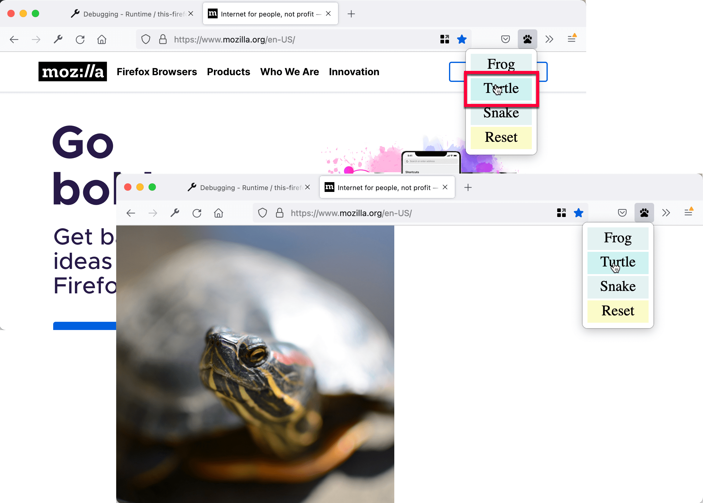

The [Your first extension](/en-US/docs/Mozilla/Add-ons/WebExtensions/Your_first_WebExtension) tutorial introduced you to the basic process of writing an extension. In this article, you write a slightly more complex extension that demonstrates additional APIs.

The extension you develop illustrates many of the basic concepts of the WebExtensions API, including:

- Adding a button to the toolbar.
- Defining a popup panel using HTML, CSS, and JavaScript.
- Injecting content scripts into web pages.
- Communicating between content scripts and the rest of the extension.
- Packaging resources with your extension that web pages can use.

The extension adds a button to the Firefox toolbar. When the user clicks the button, the extension displays a popup that lets them choose an animal. When the user chooses an animal, the extension replaces the active page's content with a picture of that animal.

To implement this, you:

- **Define an `action`, which is a [button](/en-US/docs/Mozilla/Add-ons/WebExtensions/user_interface/Toolbar_button) attached to the Firefox toolbar**.
  For the button you supply:
  - An icon, called "beasts-32.png".
  - A popup to open when the user presses the button. The popup includes HTML, CSS, and JavaScript.

- **Define an icon for the extension**, called "beasts-48.png". The Add-ons Manager displays this icon with the extension's details.
- **Write a content script, "beastify.js" that the extension injects into web pages**.
  This code modifies the pages to add or remove beasts.
- **Package some images of the animals as web accessible resources.**.
  These images are referred to by the pages updated by the content script to display a beast.

You could visualize the overall structure of the extension like this:


You can find the [complete source code for the extension on GitHub](https://github.com/mdn/webextensions-examples/tree/main/beastify).

## Writing the extension

Create a directory and navigate to it:

```bash
mkdir beastify
cd beastify
```

### manifest.json

Now create a file called "manifest.json", and give it this content:

```json
{
  "description": "Adds a browser action icon to the toolbar. Click the button to choose a beast. The active tab's body content is then replaced with a picture of the chosen beast. See https://developer.mozilla.org/en-US/Add-ons/WebExtensions/Examples#beastify",
  "manifest_version": 3,
  "name": "Beastify",
  "version": "1.0",
  "homepage_url": "https://github.com/mdn/webextensions-examples/tree/master/beastify",
  "icons": {
    "48": "icons/beasts-48.png"
  },
  "permissions": ["activeTab", "scripting"],
  "browser_specific_settings": {
    "gecko": {
      "id": "beastify@mozilla.org",
      "data_collection_permissions": {
        "required": ["none"]
      }
    }
  },
  "action": {
    "default_icon": "icons/beasts-32.png",
    "theme_icons": [
      {
        "light": "icons/beasts-32-light.png",
        "dark": "icons/beasts-32.png",
        "size": 32
      }
    ],
    "default_title": "Beastify",
    "default_popup": "popup/choose_beast.html"
  },

  "web_accessible_resources": [
    {
      "resources": ["beasts/*.jpg"],
      "matches": ["*://*/*"]
    }
  ]
}
```

- The first three keys ([`manifest_version`](/en-US/docs/Mozilla/Add-ons/WebExtensions/manifest.json/manifest_version), [`name`](/en-US/docs/Mozilla/Add-ons/WebExtensions/manifest.json/name), and [`version`](/en-US/docs/Mozilla/Add-ons/WebExtensions/manifest.json/version)) are mandatory and contain basic metadata for the extension.
- [`description`](/en-US/docs/Mozilla/Add-ons/WebExtensions/manifest.json/description) is required in Safari, otherwise it's optional. However, it's a good idea to set this property, as it's displayed in the browser's extension manager (for example, `about:addons` in Firefox).
- [`homepage_url`](/en-US/docs/Mozilla/Add-ons/WebExtensions/manifest.json/homepage_url) is optional, but recommended: it provide useful information about the extension.
- [`icons`](/en-US/docs/Mozilla/Add-ons/WebExtensions/manifest.json/icons) is optional but recommended; it lets you specify an icon for the extension.
- [`browser_specific_settings`](/en-US/docs/Mozilla/Add-ons/WebExtensions/manifest.json/browser_specific_settings) is required.
  - The `gecko` property provides addons.mozilla.org and Firefox with extra configuration information about the extension:
  - [`id`](/en-US/docs/Mozilla/Add-ons/WebExtensions/manifest.json/browser_specific_settings#id) defines a unique identifier for the extension. This ID is needed before an extension can be published on addons.mozilla.org (AMO).
  - [`data_collection_permissions`](/en-US/docs/Mozilla/Add-ons/WebExtensions/manifest.json/browser_specific_settings#data_collection_permissions) provides information on whether the extension collects and transmits personally identifiable information. This example doesn't collect or transmit any data.
- [`permissions`](/en-US/docs/Mozilla/Add-ons/WebExtensions/manifest.json/permissions) lists permissions the extension needs. In this example, the extension asks for the [`activeTab` permission](/en-US/docs/Mozilla/Add-ons/WebExtensions/manifest.json/permissions#activetab_permission).
- [`action`](/en-US/docs/Mozilla/Add-ons/WebExtensions/manifest.json/action) specifies the toolbar button. You supply three pieces of information here, all of which are optional:
  - `default_icon` points to the button's icon.
  - `default_title` provides text for a tooltip displayed for the action button.
  - `default_popup` points to an HTML file included with the extension that defines the popups content.
- [`web_accessible_resources`](/en-US/docs/Mozilla/Add-ons/WebExtensions/manifest.json/web_accessible_resources) lists files that you want to make accessible to web pages. As the extension replaces the page's content with images packaged in the extension, you need to make those images accessible to the page.

Note that all paths given are relative to the manifest.json file.

### The icon

The extension should have an icon. This icon is displayed by the Add-ons Manager ("about:addons") next to the extension's listing. The manifest.json specifies that the extension's icon is at "icons/beasts-48.png".

Create the "icons" directory and save an icon there named "beasts-48.png". You could use [the one from the example](https://raw.githubusercontent.com/mdn/webextensions-examples/main/beastify/icons/beasts-48.png), which is from [Aha-Soft's Free Retina iconset](https://www.aha-soft.com/free-icons/free-retina-icon-set/) and used under its license.

If you choose to supply an icon, it should be 48x48 pixels. You can supply a 96x96 pixel icon too, for high-resolution displays; specify it as the `96` property of the `icons` object in manifest.json:

```json
"icons": {
  "48": "icons/beasts-48.png",
  "96": "icons/beasts-96.png"
}
```

### The toolbar button

The toolbar button also needs an icon, and manifest.json specifies that it is at "icons/beasts-32.png".

Save an icon named "beasts-32.png" in the "icons" directory. You could use [the one from the example](https://raw.githubusercontent.com/mdn/webextensions-examples/main/beastify/icons/beasts-32.png), which is taken from the [IconBeast Lite icon set](https://www.iconbeast.com/free/) and used under its [license](https://www.iconbeast.com/faq/).

### The popup

If you don't supply a popup, when the user clicks the toolbar button, Firefox dispatches a click event to your extension. If you supply a popup, when the user clicks the toolbar button the popup opens, and Firefox doesn't dispatch a click event.

For this example, you want a popup. The function of the popup is to enable the user to choose one of three beasts.

Create a directory called "popup" under the extension root. This directory is where you create the popup's code. The popup consists of three files:

- `choose_beast.html` defines the content of the panel.
- `choose_beast.css` styles the content.
- `choose_beast.js` handles the user's choice by running a content script in the active tab.

```bash
mkdir popup
cd popup
touch choose_beast.html choose_beast.css choose_beast.js
```

#### choose_beast.html

The HTML file looks like this:

```html
<!DOCTYPE html>
<html>
  <head>
    <meta charset="utf-8" />
    <link rel="stylesheet" href="choose_beast.css" />
  </head>

  <body>
    <div id="popup-content">
      <button>Frog</button>
      <button>Turtle</button>
      <button>Snake</button>
      <button type="reset">Reset</button>
    </div>
    <div id="error-content" class="hidden">
      <p>Can't beastify this web page.</p>
      <p>Try a different page.</p>
    </div>
    <script src="choose_beast.js"></script>
  </body>
</html>
```

The HTML includes a [`<div>`](/en-US/docs/Web/HTML/Reference/Elements/div) element with an ID of `"popup-content"`. The element contains a button for each animal choice and a reset button. Another `<div>` has the ID of `"error-content"` and a class `"hidden"`. The extension uses this second `<div>` if it cannot initialize the popup.

Note that the HTML includes the CSS and JavaScript files from the directory, just as a web page can.

#### choose_beast.css

The CSS fixes the popup size, ensures the three choices fill the space, and adds basic styling. It also hides elements with `class="hidden"`, which means the extension hides the `<div id="error-content"...` element by default.

```css
html,
body {
  width: 100px;
}

.hidden {
  display: none;
}

button {
  border: none;
  width: 100%;
  margin: 3% auto;
  padding: 4px;
  text-align: center;
  font-size: 1.5em;
  cursor: pointer;
  background-color: #e5f2f2;
}

button:hover {
  background-color: #cff2f2;
}

button[type="reset"] {
  background-color: #fbfbc9;
}

button[type="reset"]:hover {
  background-color: #eaea9d;
}
```

#### choose_beast.js

Here's the JavaScript for the popup:

```js
/**
 * CSS to hide everything on the page,
 * except for elements that have the ".beastify-image" class.
 */
const hidePage = `body > :not(.beastify-image) {
                    display: none !important;
                  }`;

/**
 * Listen for clicks on the buttons, and send the appropriate message to
 * the content script in the page.
 */
function listenForClicks() {
  document.addEventListener("click", async (e) => {
    /**
     * Given the name of a beast, get the URL for the corresponding image.
     */
    function beastNameToURL(beastName) {
      switch (beastName) {
        case "Frog":
          return browser.runtime.getURL("beasts/frog.jpg");
        case "Snake":
          return browser.runtime.getURL("beasts/snake.jpg");
        case "Turtle":
          return browser.runtime.getURL("beasts/turtle.jpg");
      }
    }

    /**
     * Insert the page-hiding CSS into the active tab,
     * get the beast URL, and
     * send a "beastify" message to the content script in the active tab.
     */
    async function beastify(tab) {
      await browser.scripting.insertCSS({
        target: { tabId: tab.id },
        css: hidePage,
      });
      const url = beastNameToURL(e.target.textContent);
      await browser.tabs.sendMessage(tab.id, {
        command: "beastify",
        beastURL: url,
      });
    }

    /**
     * Remove the page-hiding CSS from the active tab and
     * send a "reset" message to the content script in the active tab.
     */
    async function reset(tab) {
      await browser.scripting.removeCSS({
        target: { tabId: tab.id },
        css: hidePage,
      });
      await browser.tabs.sendMessage(tab.id, { command: "reset" });
    }

    /**
     * Log the error to the console.
     */
    function reportError(error) {
      console.error(`Could not beastify: ${error}`);
    }

    /**
     * Get the active tab,
     * then call "beastify()" or "reset()" as appropriate.
     */
    if (e.target.tagName !== "BUTTON" || !e.target.closest("#popup-content")) {
      // Ignore when click is not on a button within <div id="popup-content">.
      return;
    }

    try {
      const [tab] = await browser.tabs.query({
        active: true,
        currentWindow: true,
      });

      if (e.target.type === "reset") {
        await reset(tab);
      } else {
        await beastify(tab);
      }
    } catch (error) {
      reportError(error);
    }
  });
}

/**
 * There was an error executing the script.
 * Display the popup's error message, and hide the normal UI.
 */
function reportExecuteScriptError(error) {
  document.querySelector("#popup-content").classList.add("hidden");
  document.querySelector("#error-content").classList.remove("hidden");
  console.error(`Failed to execute beastify content script: ${error.message}`);
}

/**
 * When the popup loads, inject a content script into the active tab
 * and add a click handler.
 * If the extension couldn't inject the script, handle the error.
 */
(async function runOnPopupOpened() {
  try {
    const [tab] = await browser.tabs.query({
      active: true,
      currentWindow: true,
    });

    await browser.scripting.executeScript({
      target: { tabId: tab.id },
      files: ["/content_scripts/beastify.js"],
    });
    listenForClicks();
  } catch (e) {
    reportExecuteScriptError(e);
  }
})();
```

The popup script executes [the content script](#the-content-script) in the active tab as soon as the popup is loaded, using the [`browser.scripting.executeScript()`](/en-US/docs/Mozilla/Add-ons/WebExtensions/API/scripting/executeScript) API. If the content script execution is successful, it stays loaded in the page until the tab is closed or the user navigates to a different page.

The `browser.scripting.executeScript()` call can fail if the extension can't execute content scripts in the active page. For example, an extension can't execute scripts in privileged browser pages such as `about:debugging`, or on pages in the [addons.mozilla.org](https://addons.mozilla.org/) domain. If the call fails, `reportExecuteScriptError()` hides the `<div id="popup-content">` element, displays the `<div id="error-content"...` element, and logs an error to the [console](https://extensionworkshop.com/documentation/develop/debugging/).

If the content script executes, the code calls `listenForClicks()`. This code listens for clicks on the popup. Then:

- If a click isn't on a button in the popup, it's ignored, and nothing is done.
- If a click is on a button with `type="reset"`, then the code calls `reset()`.
- If a click is on any other button (i.e., a beast button), then the code calls `beastify()`.

The `beastify()` function does three things:

- Maps the button clicked to a URL pointing to an image of a beast.
- Hides the page's content by injecting CSS, using the [`browser.scripting.insertCSS()`](/en-US/docs/Mozilla/Add-ons/WebExtensions/API/scripting/insertCSS) API.
- Sends a "beastify" message to the content script using the [`browser.tabs.sendMessage()`](/en-US/docs/Mozilla/Add-ons/WebExtensions/API/tabs/sendMessage) API, passing it the URL to the beast image and asking it to beastify the page.

The `reset()` function undoes a beastify. It:

- Removes the added CSS, using the [`browser.scripting.removeCSS()`](/en-US/docs/Mozilla/Add-ons/WebExtensions/API/scripting/removeCSS) API.
- Sends a "reset" message to the content script, asking it to reset the page.

### The content script

Create a directory, under the extension root, called "content_scripts" and create a file in it called "beastify.js", with this content:

```js
(function () {
  /**
   * Check and set a global guard variable to
   * ensure that if this content script is injected into a page again,
   * it returns (and does nothing).
   */
  if (window.hasRun) {
    return;
  }
  window.hasRun = true;

  /**
   * Given a URL for a beast image, remove all beasts,
   * then create and style an IMG node pointing to the image and
   * insert the node into the document.
   */
  function insertBeast(beastURL) {
    removeExistingBeasts();
    let beastImage = document.createElement("img");
    beastImage.setAttribute("src", beastURL);
    beastImage.style.objectFit = "contain";
    beastImage.style.position = "fixed";
    beastImage.style.height = "100%";
    beastImage.style.width = "100%";
    beastImage.className = "beastify-image";
    document.body.appendChild(beastImage);
  }

  /**
   * Remove all beasts from the page.
   */
  function removeExistingBeasts() {
    let existingBeasts = document.querySelectorAll(".beastify-image");
    for (let beast of existingBeasts) {
      beast.remove();
    }
  }

  /**
   * Listen for messages from the background script.
   * Depending on the message, call "beastify()" or "reset()".
   */
  browser.runtime.onMessage.addListener((message) => {
    if (message.command === "beastify") {
      insertBeast(message.beastURL);
    } else if (message.command === "reset") {
      removeExistingBeasts();
    }
  });
})();
```

The first thing the content script does is check for the global variable `window.hasRun`: if it's set, the script returns; otherwise, it sets `window.hasRun` and continues. The reason for this is that whenever the user opens the popup, it executes a content script in the active tab, so the extension could have multiple instances of the script running in a single tab. If this happens, the code needs to ensure that only the first instance does anything.

The content script then listens for messages from the popup, using the [`browser.runtime.onMessage`](/en-US/docs/Mozilla/Add-ons/WebExtensions/API/runtime/onMessage) API. You previously saw that the popup script can send two messages: "beastify" and "reset".

- If the message is "beastify", the code expects it to contain a URL pointing to a beast image. The extension removes any beasts added by previous "beastify" calls, then constructs and appends an [``](/en-US/docs/Web/HTML/Reference/Elements/img) element, whose `src` attribute is set, to the beast URL.
- If the message is "reset", the extension removes any added beasts.

### The beasts

Finally, you include the images of the beasts.

Create a directory called "beasts" and add the three images to it, with the appropriate names. You can get the images from [the GitHub repository](https://github.com/mdn/webextensions-examples/tree/main/beastify/beasts), or from here:


## Testing it out

First, double-check that you've the right files in the right places:

```plain
beastify/

    beasts/
        frog.jpg
        snake.jpg
        turtle.jpg

    content_scripts/
        beastify.js

    icons/
        beasts-32.png
        beasts-48.png

    popup/
        choose_beast.css
        choose_beast.html
        choose_beast.js

    manifest.json
```

Now load the extension as a temporary add-on. Open `about:debugging` in Firefox, click **This Firefox** and then **Load Temporary Add-on**, and select your manifest.json file. You see the extension's icon appear in the Firefox toolbar:


Open a web page, click the icon, select a beast, and see the web page change:



## Developing from the command line

You can automate the temporary installation step by using the [`web-ext`](https://extensionworkshop.com/documentation/develop/getting-started-with-web-ext/) tool. After installing `web-ext`, try this:

```bash
cd beastify
web-ext run
```

## What next?

Now that you've created a more advanced extension for Firefox:

- [Read about the anatomy of an extension](/en-US/docs/Mozilla/Add-ons/WebExtensions/Anatomy_of_a_WebExtension)
- [Explore the extension examples](/en-US/docs/Mozilla/Add-ons/WebExtensions/Examples)
- [Find out what you need to develop, test, and publish your extension](/en-US/docs/Mozilla/Add-ons/WebExtensions/What_next)
- [Take your learning further](/en-US/docs/Mozilla/Add-ons/WebExtensions/What_next#continue_your_learning_experience)
