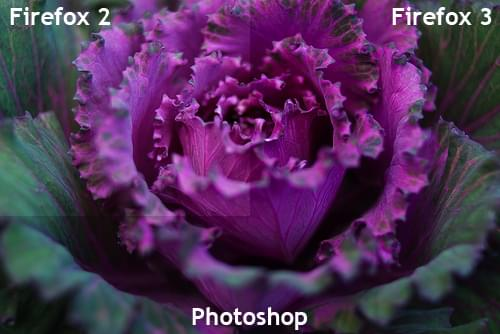

{{FirefoxSidebar}}

Although support for color correction was introduced in Firefox 3, it was disabled by default, requiring some tinkering about in the about:config window to enable it. Firefox 3.5 addresses the issues that caused it be disabled by default in the previous version, and now images with [International Color Consortium](https://www.color.org/index.xalter) (ICC) tagging are, by default, color corrected.

The image below is split into three sections. The top left corner shows the image as rendered by Firefox 2. The top right corner shows how the image renders in Firefox 3. The bottom shows the image rendered in Photoshop.

As you can see, Firefox 3 and Photoshop render the image identically, because both support the embedded color correction profile. Firefox 2 ignores the profile, resulting in mismatched color.

## Configuring color correction

Color correction can be controlled by setting the value of the `gfx.color_management.mode` preference, as follows:

<table>
  <tbody>
    <tr>
      <td>Value</td>
      <td>Description</td>
    </tr>
    <tr>
      <td>0</td>
      <td>
        Color management disabled. <strong>(Default in Firefox 3.)</strong>
      </td>
    </tr>
    <tr>
      <td>1</td>
      <td>Full color management.</td>
    </tr>
    <tr>
      <td>2</td>
      <td>
        Color management applied only to tagged image.
        <strong>(Default in Firefox 3.5.)</strong>
      </td>
    </tr>
  </tbody>
</table>

Full color management means that everything rendered by Firefox, with the exception of plugins, has its colors corrected.

### Specifying a color profile

You can also specify a specific color profile to use for your hardware by setting the value of the `gfx.color_management.display_profile` preference to be the path to a color profile to use.

If no path is specified for the color profile, Firefox queries the operating system and uses its configured color profile.

### Specifying a default rendering intent

In addition, you can choose to set the value of the `gfx.color_management.rendering_intent` preference to specify a default rendering intent. By default, the intent specified by images is ignored, unless you specify -1 for this value.

The following table lists the possible values.

<table>
  <tbody>
    <tr>
      <td>Value</td>
      <td>Description</td>
    </tr>
    <tr>
      <td>-1</td>
      <td>
        Use embedded intent. By default, the embedded intent on images is
        ignored.
      </td>
    </tr>
    <tr>
      <td>0</td>
      <td>
        Perceptual. Directs Firefox to render the image to preserve detail
        throughout the tonal range of the image. Useful for general purpose
        display of images in typical cases, especially for photographs and other
        pictures.
      </td>
    </tr>
    <tr>
      <td>1</td>
      <td>
        Media-relative colorimetric. This rescales the color spectrum so that
        the white point of the rendering medium (such as the display screen) is
        mapped to the white point of the reference medium. This is most useful
        for colors that have been mapped to a medium with a smaller gamut than
        the reference medium.
      </td>
    </tr>
    <tr>
      <td>2</td>
      <td>
        Saturation. This preserves vividness of color at the expense of
        preservation of precision of hue. This is particularly useful for charts
        and diagrams, and other media whose colors should "pop" while precise
        duplication of hue is less important.
      </td>
    </tr>
    <tr>
      <td>3</td>
      <td>
        ICC-Absolute colorimetric. This is most useful for spot color and when
        simulating one medium on another, as it doesn't alter in-gamut colors.
      </td>
    </tr>
  </tbody>
</table>

> **Note:** In Firefox 3.5, perceptual, media-relative, and saturation intents all render the same way.

### Caveats

The new QCMS color management system introduced in Firefox 3.5 currently only supports ICC version 2 color profiles, not version 4. This may result in images being too dark. See [bug 488800](https://bugzil.la/488800) and the [ICC version 4 profile test](https://www.color.org/version4html.xalter).

## See also

- [So Many Colors](https://bholley.wordpress.com/2008/09/12/so-many-colors/) (blog post)
- [Color Profiles in Firefox 3](https://johnresig.com/blog/color-profiles/) (blog post)
- [International Color Consortium](https://www.color.org/index.xalter)
