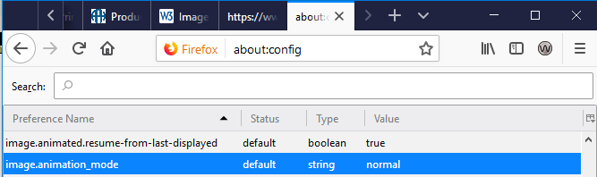
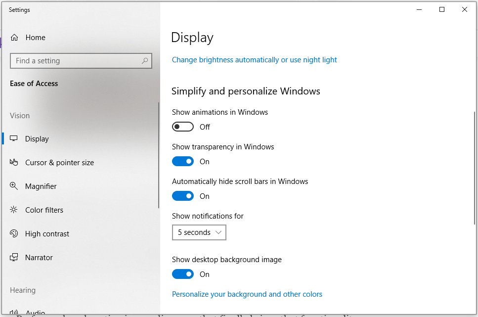

{{AccessibilitySidebar}}

This article discusses making web content accessible for those with vestibular disorders, and those who support them, by taking advantage of personalization and accessibility settings built into the operating systems. Taking advantage of personalization settings can help prevent exposure to content leading to seizures and / or other physical reactions.

## Personalization and accessibility settings

From the article, "**[Understanding Success Criterion 2.3.1: Three Flashes or Below Threshold](https://www.w3.org/WAI/WCAG21/Understanding/three-flashes-or-below-threshold.html)**"

> Flashing can be caused by the display, the computer rendering the image or by the content being rendered. The author has no control of the first two. They can be addressed by the design and speed of the display and computer

### Hardware and operating systems on many computers offer control that is not afforded to developers

The user can do much to protect himself by learning his operating system, its personalization and accessibility settings. Those in the public sector who must accommodate those with special sensitivities, should consider setting aside at least one work station and becoming familiar with its personalization and accessibility settings. Understanding personalization and accessibility settings can actually be a money-saving endeavor. One work station can be set up to accommodate both a low-vision individual (needs high-contrast) and to accommodate an individual with photosensitive susceptibilities, by, adjusting personalization and accessibility settings.

### Use modern browsers. Learn personalization and accessibility settings

Modern browsers support the CSS media feature [`prefers-reduced-motion`](/en-US/docs/Web/CSS/@media/prefers-reduced-motion). Browsers can detect whether a user has requested a reduced motion experience. The user would access this through an accessibility interface, as seen below.

CSS Transition events are supported. Examples include:

- `transitionrun`
- `transitionstart`
- `transitionend`
- `transitioncancel`

### Safari 10.1 and above (Desktop)

Do not enable Auto-Play (does not work for GIFs)

#### iOS Safari 10.3 and above (Mobile and Tablet)

Select the "Reduce motion option" in OS Accessibility settings for Apple (image source: developers.google.com from Thomas Steiner's article "Move Ya! Or maybe, don't, if the user prefers-reduced-motion!"). This will not work on animated GIFs; the source of the animation is self-contained within a gif and is not affected by these settings.

#### Use Reader Mode on browsers

- Enable Content Blockers; Gets rid of ads, reduces and/or removes distractions
- Enables text-to-speech
- In certain browsers, enable fonts by choice
- Enable Page Zoom

#### Turn off animated GIFs in the browser

Browsers offer much power to their users; it's just a matter of knowing where to go. Using Firefox as an example, it explains that by changing the value the **image.animation_mode** from "normal" to "none", all animated images will be blocked. To reverse it, you will have to change the value back to "normal"

#### Use browser extensions

- [Gif Blocker](https://chromewebstore.google.com/detail/gif-blocker/ahkidgegbmbnggcnmejhobepkaphkfhl?hl=en) For Chrome, GIF Blocker is an extension available at the web store.
- [Gif Scrubber](https://chromewebstore.google.com/detail/gif-scrubber/gbdacbnhlfdlllckelpdkgeklfjfgcmp?hl=en) Gif Scrubber is a chrome extension that allows you to control GIFs like a video player. There is a GitHub repository for it at **<https://github.com/0ui/gif-scrubber>**
- [Beeline Reader](https://www.beelinereader.com/) Beeline Reader has a browser extension that allows you to set up for grayscale and Dyslexi font, among other things

### Take advantage Operating System accessibility features

Most operating systems such as Windows 10, have accessibility options that are surprisingly powerful. Usually they are quite easy to find by typing (or saying) in the word, "Accessibility" in the search finder of the operating system.

#### Turn off animations in the operating system

In the Windows 10 operating system, the user has an ability to turn off animations. This will not work on animated GIFs; the source of the animation is self-contained within a gif and is not affected by these settings.

#### Grayscale

Those who have suffered traumatic brain injury (TBI) may be highly sensitive to color; it can require such a great "investment of cognitive energy" on their part, there's no energy for other daily tasks. Enabling grayscale presentation of the content reduces the cognitive workload. It may assist users with other disabilities, as well. An interesting discussion by users on the benefits of using grayscale may be found in the discussion thread, "[What is the "grayscale" setting for in accessibility options?](https://ask.metafilter.com/312049/What-is-the-grayscale-setting-for-in-accessibility-options)". Of particular interest is a user who has Photosensitive Epilepsy, and uses it when feeling "seizure-y".

Most Operating Systems have a way to let the user make an adjustment on the workstation. In the screenshot below, you can see an example of Windows 10 Accessibility Settings allowing for color filters to be selected. Grayscale is enabled when the color filters button is toggled "on"

## See also

- [Accessibility](/en-US/docs/Web/Accessibility)
- [Accessibility learning path](/en-US/docs/Learn_web_development/Core/Accessibility)
- [Web accessibility for seizures and physical reactions](/en-US/docs/Web/Accessibility/Seizure_disorders)
- [Color vision simulation](https://firefox-source-docs.mozilla.org/devtools-user/accessibility_inspector/simulation/index.html)
- Discussion: "[What is the "grayscale" setting for in accessibility options?](https://ask.metafilter.com/312049/What-is-the-grayscale-setting-for-in-accessibility-options)"

### Contributors

Many, many thanks to Eric Eggert from [Knowbility;](https://knowbility.org/) for his discussions and huge help on this topic.
