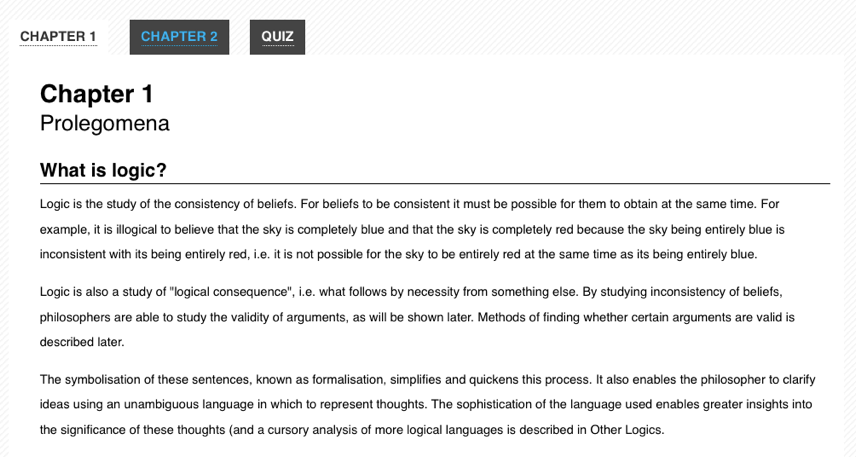

{{AccessibilitySidebar}}

Most JavaScript libraries offer a library of client-side widgets that mimic the behavior of familiar desktop interfaces. Sliders, menu bars, file list views, and more can be built with a combination of JavaScript, CSS, and HTML. Since the HTML4 specification doesn't provide built-in tags that semantically describe these kinds of widgets, developers typically resort to using generic elements such as {{HTMLElement('div')}} and {{HTMLElement('span')}}. While this results in a widget that looks like its desktop counterpart, there usually isn't enough semantic information in the markup to be usable by an assistive technology.

## The problem

Dynamic content on a web page can be particularly problematic for users who, for whatever reason, are unable to view the screen. Stock tickers, live twitter feed updates, progress indicators, and similar content modify the DOM in ways that an assistive technology (AT) may not be aware of. That's where [ARIA](/en-US/docs/Web/Accessibility/ARIA) comes in.

_Example 1: Markup for a tabs widget built without ARIA labeling. There's no information in the markup to describe the widget's form and function._

```html
<!-- This is a tabs widget. How would you know, looking only at the markup? -->
<ol>
  <li id="ch1Tab">
    <a href="#ch1Panel">Chapter 1</a>
  </li>
  <li id="ch2Tab">
    <a href="#ch2Panel">Chapter 2</a>
  </li>
  <li id="quizTab">
    <a href="#quizPanel">Quiz</a>
  </li>
</ol>

<div>
  <div id="ch1Panel">Chapter 1 content goes here</div>
  <div id="ch2Panel">Chapter 2 content goes here</div>
  <div id="quizPanel">Quiz content goes here</div>
</div>
```

_Example 2: How the tabs widget might be styled visually. Users might recognize it visually, but there are no machine-readable semantics for an assistive technology._ 

## ARIA

**ARIA** enables developers to describe their widgets in more detail by adding special attributes to the markup. Designed to fill the gap between standard HTML tags and the desktop-style controls found in dynamic web applications, ARIA provides roles and states that describe the behavior of most familiar UI widgets.

> **Warning:** Many of these were later added when browsers didn't fully support modern HTML features. **Developers should always prefer using the correct semantic HTML element over using ARIA**.

The ARIA specification is split up into three different types of attributes: roles, states, and properties. Roles describe widgets that aren't otherwise available in HTML 4, such as sliders, menu bars, tabs, and dialogs. Properties describe characteristics of these widgets, such as if they are draggable, have a required element, or have a popup associated with them. States describe the current interaction state of an element, informing the assistive technology if it is busy, disabled, selected, or hidden.

ARIA attributes are interpreted automatically by the browser and translated to the operating system's native accessibility APIs. So an element with role="slider" will be controlled in the same way as a native slider is controlled on the operating system.

This provides a much more consistent user experience than was possible in the previous generation of web applications, since assistive technology users can apply all of their knowledge of how desktop applications work when they are using web-based applications.

_Example 3: Markup for the tabs widget with ARIA attributes added._

```html
<!-- Now *these* are Tabs! -->
<!-- We've added role attributes to describe the tab list and each tab. -->
<ol role="tablist">
  <li id="ch1Tab" role="tab">
    <a href="#ch1Panel">Chapter 1</a>
  </li>
  <li id="ch2Tab" role="tab">
    <a href="#ch2Panel">Chapter 2</a>
  </li>
  <li id="quizTab" role="tab">
    <a href="#quizPanel">Quiz</a>
  </li>
</ol>

<div>
  <!-- Notice the role and aria-labelledby attributes we've added to describe these panels. -->
  <div id="ch1Panel" role="tabpanel" aria-labelledby="ch1Tab">
    Chapter 1 content goes here
  </div>
  <div id="ch2Panel" role="tabpanel" aria-labelledby="ch2Tab">
    Chapter 2 content goes here
  </div>
  <div id="quizPanel" role="tabpanel" aria-labelledby="quizTab">
    Quiz content goes here
  </div>
</div>
```

ARIA is [well supported](https://caniuse.com/#feat=wai-aria) by all major browsers and many assistive technologies.

### Presentational changes

Dynamic presentational changes include using CSS to change the appearance of content (such as a red border around invalid data, or changing the background color of a checked checkbox), as well as showing or hiding content.

#### State changes

ARIA provides attributes for declaring the current state of a UI widget. Examples include (but are certainly not limited to):

- `aria-checked`
  - : Indicates the state of a checkbox or radio button.
- `aria-disabled`
  - : Indicates that an element is visible but not editable or otherwise operable.
- `aria-grabbed`
  - : Indicates the 'grabbed' state of an object in a drag-and-drop operation.

(For a full list of ARIA states, consult the [ARIA list of states and properties](https://www.w3.org/TR/wai-aria-1.1/#introstates).)

Developers should use ARIA states to indicate the state of UI widget elements and use CSS attribute selectors to alter the visual appearance based on the state changes (rather than using script to change a class name on the element).

#### Visibility changes

When content visibility is changed (i.e., an element is hidden or shown), developers should change the **`aria-hidden`** property value. The techniques described above should be used to declare CSS to visually hide an element using `display:none`.

Here is an example of a tooltip that uses **`aria-hidden`** to control the visibility of the tooltip. The example shows a simple web form with tooltips containing instructions associated with the entry fields.

```html
<div class="text">
  <label id="tp1-label" for="first">First Name:</label>
  <input
    type="text"
    id="first"
    name="first"
    size="20"
    aria-labelledby="tp1-label"
    aria-describedby="tp1"
    aria-required="false" />
  <div id="tp1" class="tooltip" role="tooltip" aria-hidden="true">
    Your first name is optional
  </div>
</div>
```

The CSS for this markup is shown in the following code. Note that there is no custom classname used, only the status of the **`aria-hidden`** attribute.

```css
div.tooltip[aria-hidden="true"] {
  display: none;
}
```

The JavaScript to update the **`aria-hidden`** property has the form shown in the following code. Note that the script only updates the **`aria-hidden`** attribute; it does not need to also add or remove a custom classname.

```js
function showTip(el) {
  el.setAttribute("aria-hidden", "false");
}
```

### Role changes

ARIA allows developers to declare a semantic role for an element that otherwise offers incorrect or no semantics. The **`role`** of an element should not change. Instead, remove the original element and replace it with an element with the new **`role`**.

For example, consider an "inline edit" widget: a component that allows users to edit a piece of text in place, without switching contexts. This component has a "view" mode, in which the text is not editable, but is activatable, and an "edit" mode, in which the text can be edited. A developer might be tempted to implement the "view" mode using a read-only text {{ HTMLElement("input") }} element and setting its ARIA **`role`** to `button`, then switching to "edit" mode by making the element writable and removing the **`role`** attribute in "edit" mode (since {{ HTMLElement("input") }} elements have their own role semantics).

Do not do this. Instead, implement the "view" mode using a different element altogether, such as a {{ HTMLElement("div") }} or {{ HTMLElement("span") }} with a **`role`** of `button`, and the "edit" mode using a text {{ HTMLElement("input") }} element.

### Asynchronous content changes

> **Note:** Under construction. See also [Live Regions](/en-US/docs/Web/Accessibility/ARIA/ARIA_Live_Regions)

## Keyboard navigation

Often times developers overlook support for the keyboard when they create custom widgets. To be accessible to a variety of users, all features of a web application or widget should also be controllable with the keyboard, without requiring a mouse. In practice, this usually involves following the conventions supported by similar widgets on the desktop, taking full advantage of the Tab, Enter, Spacebar, and arrow keys.

Traditionally, keyboard navigation on the web has been limited to the Tab key. A user presses Tab to focus each link, button, or form on the page in a linear order, using Shift-Tab to navigate backwards. It's a one-dimensional form of navigation—forward and back, one element at a time. On fairly dense pages, a keyboard-only user often has to press the Tab key dozens of times before accessing the needed section. Implementing desktop-style keyboard conventions on the web has the potential to significantly speed up navigation for many users.

Here's a summary of how keyboard navigation should work in an ARIA-enabled web application:

- The Tab key should provide focus to the widget as a whole. For example, tabbing to a menu bar **should NOT** put focus on the menu's first element.
- The arrow keys should allow for selection or navigation within the widget. For example, using the left and right arrow keys should move focus to the previous and next menu items.
- When the widget is not inside a form, both the Enter and Spacebar keys should select or activate the control.
- Within a form, the Spacebar key should select or activate the control, while the Enter key should submit the form's default action.
- If in doubt, mimic the standard desktop behavior of the control you are creating.

So, for the Tabs widget example above, the user should be able to navigate into and out of the widget's container (the {{HTMLElement('ol')}} in our markup) using the Tab and Shift-Tab keys. Once keyboard focus is inside the container, the arrow keys should allow the user to navigate between each tab (the {{HTMLElement('li')}} elements). From here, conventions vary from platform to platform. On Windows, the next tab should automatically be activated when the user presses the arrow keys. On macOS, the user can press either Enter or the Spacebar to activate the next tab. An in-depth tutorial for creating [Keyboard-navigable JavaScript widgets](/en-US/docs/Web/Accessibility/Keyboard-navigable_JavaScript_widgets) describes how to implement this behavior with JavaScript.

## See also

- [ARIA](/en-US/docs/Web/Accessibility/ARIA)
- [Writing Keyboard-navigable JavaScript widgets](/en-US/docs/Web/Accessibility/Keyboard-navigable_JavaScript_widgets)
- [WAI-ARIA Specification](https://www.w3.org/TR/wai-aria-1.1/)
- [WAI-ARIA Authoring Practices](https://www.w3.org/WAI/ARIA/apg/)
