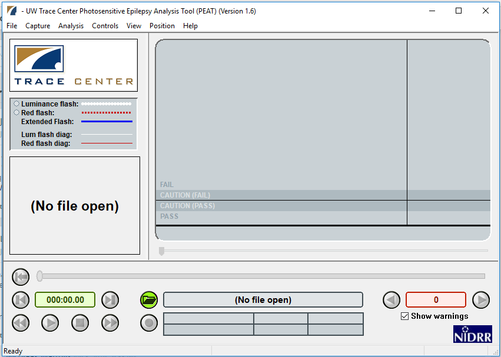
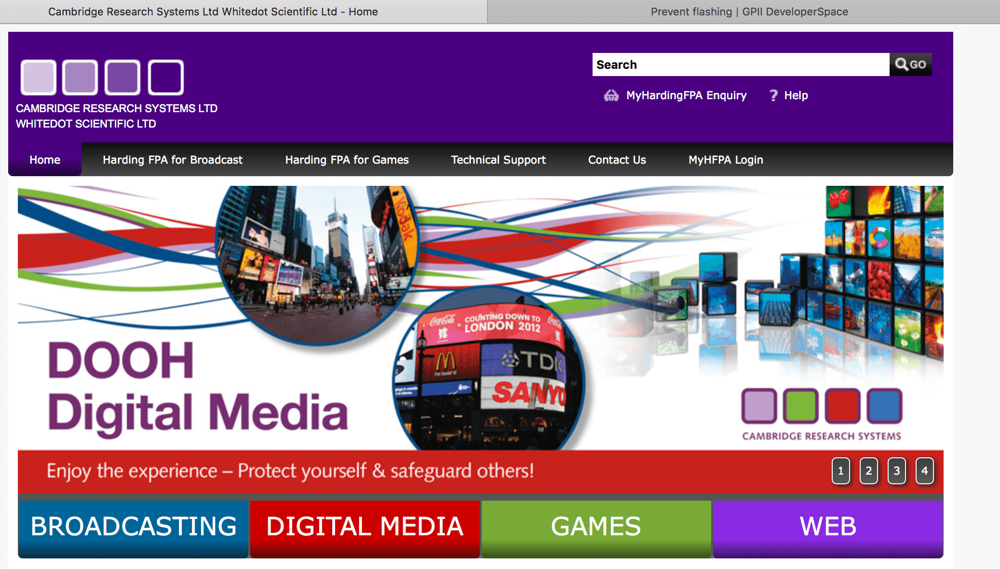

This article introduces concepts behind making web content accessible for those with vestibular disorders, and how to measure and prevent content leading to seizures and/or other physical reactions.

## Overview

### Seizures

Seizures caused by light are known as photosensitive epilepsy. Content that flickers, flashes, or blinks can trigger photosensitive epilepsy. Web technologies that use video, animated gifs, animated pngs, animated SVGs, Canvas, and CSS or JavaScript animations are all capable of content that can induce seizures or other incapacitating physical reactions. Certain visual patterns, especially stripes, can also cause physical reactions even though they are not animated. Photosensitive epilepsy is actually a kind of "reflex epilepsy"—seizures occurring in response to a trigger. In the case of photosensitive epilepsy, seizures are triggered specifically by flashing lights, but other types of reflex epilepsies may be triggered by the act of reading, or by noises. Patterns and images can also trigger epilepsy.

The fact that static images may cause seizures and other disorders is documented in articles such as ["Gamma Oscillations and photosensitive epilepsy"](https://linkinghub.elsevier.com/retrieve/pii/S0960982217304062), where it is noted "_Certain visual images, even in the absence of motion or flicker, can trigger seizures in patients with photosensitive epilepsy_". The Epilepsy Foundation, in its article, ["Shedding Light on Photosensitivity, One of Epilepsy's Most Complex Conditions"](https://www.epilepsy.com/stories/shedding-light-photosensitivity-one-epilepsys-most-complex-conditions-0) talks about static images and patterns: "_Static or moving patterns of discernable light and dark stripes have the same effect as flashing lights because of the alternation of dark and bright areas."_ The Epilepsy Foundation of America Working Group is able to "quantify" the problem a little: _"A pattern with the potential for provoking seizures contains clearly discernible stripes, numbering more than five light-dark pairs of stripes in any orientation_". In addition to stripes, checkered patterns have also been known to cause photosensitive seizures, according to [Cedars-Sinai](https://www.cedars-sinai.org/health-library/diseases-and-conditions/p/photosensitive-seizures.html).

Although static images are possible as triggers, they are less consistent. The trigger that is well established and strong is flashing/strobe lights. Dr. Selim Benbadis of USF's Comprehensive Epilepsy Program notes, _"The only thing that is really documented is flashing lights, which can trigger seizures in patients with photosensitive epilepsy. Only a few types of epilepsies are photosensitive though, and the vast majority of epilepsies are not."_ In addition to seizures brought about by photosensitivity, listening to certain pieces of music can also trigger what are called musicogenic seizures, although these types of seizures seem to be much more rare. For a great introduction on the topic of musicogenic seizures, visit Epilepsy Ontario's web page on [Musicogenic Seizures](https://epilepsyontario.org/musicogenic-seizures/).

Seizures and epilepsy are not the same. In its article ["A Revised Definition of Epilepsy"](https://www.epilepsy.com/stories/revised-definition-epilepsy), the Epilepsy Foundation notes that "_a seizure is an event and epilepsy is the disease involving recurrent unprovoked seizures_." According to the Epilepsy Foundation's page ["How Serious Are Seizures?"](https://www.epilepsy.com/what-is-epilepsy/understanding-seizures/how-serious-are-seizures), _"Sudden unexpected death in epilepsy (SUDEP) is likely the most common disease-related cause of death in with epilepsy. It is not frequent but it is a very real problem and people need to be aware of its risk"_.

The point is, seizures most definitely can be and are fatal, and developers and designers are incredibly important for making the web a safer place for those with sensitivities to photosensitive or musicogenic triggers.

Seizures can be fatal, but even the ones that are "only" debilitating can be of such severity that they render the user incapacitated. Other disorders, such as disorientation, nausea, vomiting, and more can also be so severe that the user is unable to function. The Epilepsy Foundation's article, ["Photosensitivity and Seizures"](https://www.epilepsy.com/what-is-epilepsy/seizure-triggers/photosensitivity), provides a list of triggers that may cause seizures in photosensitive people; here's an excerpt from that list:

- Television screens or computer monitors due to the flicker or rolling images.
- Certain video games or TV broadcasts containing rapid flashes or alternating patterns of different colors.
- Intense strobe lights like visual fire alarms.
- Natural light, such as sunlight, especially when shimmering off water, flickering through trees or through the slats of Venetian blinds.
- Certain visual patterns, especially stripes of contrasting colors.

That same article continues that many factors must combine to trigger the photosensitive reaction. Of note is that it includes the wavelength of light as a possible factor; wavelengths in the red part of the spectrum seem to be especially problematic. In the article, ["Understanding WCAG 2.0 Three Flashes or Below Threshold"](https://www.w3.org/TR/UNDERSTANDING-WCAG20/seizure-does-not-violate.html) notes generally that: _"Individuals who have photosensitive seizure disorders can have a seizure triggered by content that flashes at certain frequencies for more than a few flashes"_ and goes on to note, very specifically that: "_People are even more sensitive to red flashing than to other colors, so a special test is provided for saturated red flashing_".

You don't even need an image or video to cause harm. A {{HTMLElement('div')}} element set to change color and luminosity at high frequency, easily done via JavaScript, can cause real harm. And, flickering can occur everywhere. For example, "spinners" commonly used to display while pages load can easily "flicker" while spinning.

Additional concerns exist for individuals with motor-skill problems. For example, the page for Trace Research & Development Center's [Photosensitive Epilepsy Analysis Tool](https://trace.umd.edu/peat/) notes that _"Photosensitive seizures can be provoked by certain types of flashing in web or computer content, including mouse-overs that cause large areas of the screen to rapidly flash on and off repeatedly"_.

### Other physical reactions

Nausea, vertigo (or dizziness), and disorientation are very nonspecific symptoms associated with all kinds of diseases and not particularly suggestive of seizures (except maybe disorientation, which is seen in seizures). However, seizures are not the only adverse physical response possible from flashing, flickering, blinking, and other such stimuli. In 1997, a Japanese cartoon featured an animated "virus bomb". Some of the children watching the cartoon reacted by having seizures, others by suffering nausea, shaking, and vomiting blood. The reactions from the children were so severe, they had to be rushed to the emergency room. The physical disorders listed below are all possible consequences: each of these physical reactions may be so severe as to be incapacitating.

- Seizures
- Vestibular Disorders
- Migraines
- Nausea
- Vomiting

## Flashing, blinking, & flickering

Although "flashing" and "blinking" are sometimes used interchangeably, they are not the same. According to the W3C, blinking is a distraction problem, whereas flashing refers to content that occurs more than 3 times per second, and which is sufficiently large and bright. [Section 508](https://www.section508.gov/content/guide-accessible-web-design-development/#flashing) prohibits flickering effects with a frequency greater than 3 Hz (flickers per second) and lower than 55 Hz. The Epilepsy Foundation's article ["Shedding Light on Photosensitivity, One of Epilepsy's Most Complex Conditions"](https://www.epilepsy.com/stories/shedding-light-photosensitivity-one-epilepsys-most-complex-conditions-0) notes that _"Generally, flashing lights between the frequencies of five to 30 flashes per second (Hertz) are most likely to trigger seizures. In order to be safe, the consensus recommends that photosensitive individuals should not be exposed to flashes greater than three per second."_ For some people, however, flashing/blinking can cause symptoms at less than 3 Hz.

It's important to note that not all flashing and blinking is bad. NASA, in its document titled, ["Blinking, Flashing, and Temporal Response"](https://colorusage.arc.nasa.gov/flashing.php) notes that blinking and flashing can be powerful tools for drawing attention—as is necessary for warning buttons (this assumes that users can still see the screen while elements are flashing, which is not always true). For some users, blinking buttons also caution that they must be used sparingly, and with care. As it applies to web design, systems that alert company employees to danger by "hijacking" the screen to provide a flashing warning of emergency need to take into consideration the rate, size, and luminosity changes on the screen as these warnings are flashed.

### Flashing and flickering—how is danger quantified?

According to the article ["Photic- and pattern-induced seizures: expert consensus of the Epilepsy Foundation of America Working Group",](https://onlinelibrary.wiley.com/doi/epdf/10.1111/j.1528-1167.2005.31405.x) _"A flash is a potential hazard if it has luminance ≥20 cd/m<sup>2</sup>, occurs at a frequency of ≥3 Hz, and occupies a solid visual angle of ≥0.006 steradians (approximately 10% of the central visual field or 25% of screen area at typical viewing distances)."_

How far is a typical viewing distance? The recommendation considered for a typical viewing distance at the time of writing was "_the area can be taken as applying to an area >25% of the area of a television screen, assuming standard viewing distances of ≥2 m (∼9 feet)"_. Much has changed since that time, and we are now much closer to our screen.

Certain colors, and/or combinations of colors, also matter. ["Certain Colors More Likely To Cause Epileptic Fits, Researchers Find"](https://www.sciencedaily.com/releases/2009/09/090925092858.htm) notes that _"…complexities underlying brain dynamics could be modulated by certain color combinations more than the others, for example, red-blue flickering stimulus causes larger cortical excitation than red-green or blue-green stimulus."_

### Flashing & flashing red

[WCAG 2.3.1 general flash and red flash thresholds](https://www.w3.org/WAI/WCAG21/Understanding/three-flashes-or-below-threshold.html) are defined as follows:

- A **general flash** is defined as a pair of opposing changes in [relative luminance](https://www.w3.org/TR/WCAG21/#dfn-relative-luminance) of 10% or more of the maximum relative luminance where the relative luminance of the darker image is below 0.80, and where "a pair of opposing changes" is an increase followed by a decrease, or a decrease followed by an increase;
- A **red flash** is defined as any pair of opposing transitions involving a saturated red.

These standards are based on earlier research. In 2004, The Epilepsy Foundation of America convened a workshop developed a [consensus](https://pubmed.ncbi.nlm.nih.gov/16146438/) on photosensitive seizures, stating _"A flash is a potential hazard if it has luminance at least 20 cd/m<sup>2</sup> , occurs at a frequency of least 3 Hz, and occupies a solid visual angle of at least 0.006 steradians (about 10% of the central visual field or 25% of screen area at typical viewing distances)."_ The transition to or from a saturated red is important and constitutes a risk on its own: "_Irrespective of luminance, a transition to or from a saturated red is also considered a risk._"

### Size and distance

#### How big? It depends

"Relative" size and distance both matter. According to [PEAT](https://trace.umd.edu/peat/), _"The combined area of flashes occurring concurrently occupies no more than a total of one quarter of any 341 x 256 pixel rectangle anywhere on the displayed screen area when the content is viewed at 1024 by 768 pixels."_

The point that the field of vision is an important consideration arises in the article addressing WCAG 2.3.1 continues: "_The 1024 x 768 screen is used as the reference screen resolution for the evaluation. The 341 x 256 pixel block represents a 10 degree viewport at a typical viewing distance. (The 10 degree field is taken from the original specifications and represents the central vision portion of the eye, where people are most susceptible to photo stimuli.)_"

This pixel area ratio calculates for relative size, but distance also matters.

Distance matters because it affects the total field of vision. When viewers wear ocular masks for gaming, the field of vision is likely enveloped in its entirety by the screen. [WebVR](https://webvr.info/) is an open specification that makes it possible to experience VR in your browser, which can be experienced on phone, computer or headset. The concern about flashing images in an ocular mask is a growing one, since the mask is so close to the eyes.

[The Epilepsy Society (UK)](https://epilepsysociety.org.uk/), in their article, ["3d Films and Virtual Reality"](https://epilepsysociety.org.uk/3d-films-and-virtual-reality#.XQlC5ohKiUk), noted: _"With VR the images flash very quickly and generally this is too quickly to trigger a seizure in people with photosensitive epilepsy. However, the field of view is large and so more of the eye is stimulated. This means that more of the brain may be affected and this may trigger a photosensitive seizure."_

(Note that some users will not be able to see with blinking cursors, and may get migraines, motion sickness, and disorientation, although blinking cursors occupy a much smaller area of the screen.)

### Patterns, and parallax

Contrasting dark and light geometric patterns are a known culprit; stripes and checks are the best known examples. The Epilepsy Foundation of America Working Group lists how many light-dark pairs of stripes are likely to provoke seizures, and, in what conditions. If a pattern is unchanging and straight, eight lines is the maximum allowable, but if it undulates, no more than five lines.

Parallax effects can cause disorientation. Use parallax effects with caution; if you must use them, ensure the user has a control to turn them off.

"A pattern with the potential for provoking seizures contains clearly discernible stripes, numbering more than five light-dark pairs of stripes in any orientation. When the light-dark stripes of any pattern collectively subtend at the eye from the minimal-expected viewing distance a solid angle of >0.006 steradians, the luminance of the lightest stripe is >50 cd/m<sup>2</sup>, and the pattern is presented for ≥0.5 s, then the pattern should display no more than five light-dark pairs of stripes, if the stripes change direction, oscillate, flash, or reverse in contrast; if the pattern is unchanging or smoothly drifting in one direction, no more than eight stripes."

Not all is known, and even with the metrics listed above, additional factors come into play. For example, going from a smaller area to a larger one increases the likelihood that the brain responds, as well as increasing contrast, and increasing spatial frequency from a low to middle. It's also known, although the reasoning is not understood behind it, that going from simple orientations (for example, stripes) to a multiple one (for example, the checkered pattern that emerges when laying one set of stripes on top of, but perpendicular to, the original set) affects the brain.

### Colors

Understanding color is important for accessibility. See [understanding colors and luminance](/en-US/docs/Web/Accessibility/Understanding_Colors_and_Luminance) as it relates to web accessibility and accessibility in general.

How the color relates to its background—usually framed in terms of contrast—and how drastically the color changes frame to frame in animation is important. For more on this, see [Three Flashes or Below Threshold Understanding SC 2.3.1](https://www.w3.org/TR/UNDERSTANDING-WCAG20/seizure-does-not-violate.html).

#### The Special Case of Red

It has been demonstrated that [some colors are more likely to cause epileptic fits than others](https://www.sciencedaily.com/releases/2009/09/090925092858.htm). Human physiology and psychology are affected by the color red in general. Its power to influence behavior has even been noted in animals.

- **Red Desaturation tests:** The human eye is so sensitively tuned to red that ophthalmologists set up a test using it. The Red desaturation test assesses the integrity of the optic nerve. For more information as to how an ophthalmologist uses this test, see [Red Desaturation](https://www.smart-optometry.com/red-desaturation/).
- **Red Environment:** Studies have shown that for those who suffer Traumatic Brain Injury, [cognitive function is reduced in a red environment](https://pubmed.ncbi.nlm.nih.gov/20649469/).

[Saturated Red](/en-US/docs/Web/Accessibility/Understanding_Colors_and_Luminance) is a special, dangerous case, and there are special tests for it. In addition to a red environment affecting the cognitive function of those with Traumatic Brain Injury, color in the red spectrum wavelength seems to require special concern and special tests. Dr. Gregg Vanderheiden, when testing the Photosensitive Epilepsy Analysis Tool, noted that the seizure rates were much higher than expected. They found that we are much more sensitive to saturated red flashing. (See the video, [The Photosensitive Epilepsy Analysis Tool](https://www.pbs.org/video/university-place-the-photosensitive-epilepsy-analysis-tool-ep-429/).)

#### Websafe does not mean seizure-safe

Note that the color **#990000** is considered "**websafe**". That does _not_ mean it is "safe for not causing seizures", it only means that the color may be "safely" reproduced accurately by the technology used to generate color on screens.

## Measuring to prevent harm

Measuring the potential for harm is a good starting point. Factors considered within tests include color, luminosity, size, contrast, and in cases of animation, frequency. WCAG 2.1 provides guidance for evaluating content.

In August, 2004, the Epilepsy Foundation of America convened a workshop to begin to develop an expert consensus on photosensitive seizures. The following, expert, and authoritative information is from: [Photic- and pattern-induced seizures: expert consensus of the Epilepsy Foundation of America Working Group.](https://pubmed.ncbi.nlm.nih.gov/16146438/)

_"A flash is a potential hazard if it has luminance ≥20 cd/m<sup>2</sup>, occurs at a frequency of ≥3 Hz, and occupies a solid visual angle of ≥0.006 steradians (approximately 10% of the central visual field or 25% of screen area at typical viewing distances). A transition to or from saturated red also is considered a risk. A pattern with the potential for provoking seizures contains clearly discernible stripes, numbering more than five light-dark pairs of stripes in any orientation. When the light-dark stripes of any pattern collectively subtend at the eye from the minimal-expected viewing distance a solid angle of >0.006 steradians, the luminance of the lightest stripe is >50 cd/m2, and the pattern is presented for ≥0.5 s, then the pattern should display no more than five light-dark pairs of stripes, if the stripes change direction, oscillate, flash, or reverse in contrast; if the pattern is unchanging or smoothly drifting in one direction, no more than eight stripes. These principles are easier to apply in the case of fixed media, for example, a prerecorded TV show, which can be analyzed frame-by-frame, as compared with interactive media."_

The "cd/m<sup>2</sup>" refers to candela per square meter. So for the web developer, how does this relate to measurements for color, luminance, and saturation?

The candela is a SI unit (International System of units) of luminous intensity. It's a photometric term, and photometry deals with the measurement of visible light as perceived by human eyes. Wikipedia's article on ["Candela per square metre"](https://en.wikipedia.org/wiki/Candela_per_square_metre) puts it in terms of what we are familiar with as developers: on a display device, and in the RGB space. This is helpful, because there's a specific standard assumed to be used on monitors, printers, and the Internet, and it is the **sRGB** (standard Red Green Blue).

_"As a measure of light emitted per unit area, this unit is frequently used to specify the brightness of a display device. The [sRGB](https://en.wikipedia.org/wiki/SRGB) spec for monitors targets 80 cd/m<sup>2</sup>.[<sup>\[3\]</sup>](https://en.wikipedia.org/wiki/Candela_per_square_metre#cite_note-3) Typically, calibrated monitors should have a brightness of 120 cd/m<sup>2</sup>. Most consumer desktop [liquid crystal displays](https://en.wikipedia.org/wiki/Liquid_crystal_display) have luminances of 200 to 300 cd/m<sup>2</sup>.[<sup>\[4\]</sup>](https://en.wikipedia.org/wiki/Candela_per_square_metre#cite_note-4) [High-definition televisions](https://en.wikipedia.org/wiki/High-definition_television) range from 450 to about 1500 cd/m<sup>2</sup>."_

The takeaway is that the **sRGB** color space is a common touch point between research, assessment tools, and developers, since it is easily converted from the commonly used Hex code.

### Human physiology and psychology as a consideration

Many experts work to quantify and measure to the greatest extent possible the kinds of web content that can serve as triggers for seizures. That said, it can't be forgotten that color is as much about human perception in the brain as it is the measurement of light coming from a computer screen.

In addition to the psychological variances, there are also physiological differences among us. There will be variances and nuances as to how a real human being perceives, and responds to, color and light. For example, Tom Jewett, Lecturer Emeritus of Computer Sciences at Cal State University Long Beach, notes the following concerning [lightness in the HSL color scale](https://colortutorial.design/hsb.html) _"…The distinction between levels of lightness is not actually linear as the HSL scale would imply; we are much more sensitive to changes in lighter values than to darker ones."_

It's important to understand that light and its measurements are linear, but human vision and human perception are not. Investigation and discussion is ongoing as to how to relate the machine measurement of light as it passes from a computer screen, through the distance to the human eye, filtered by human vision, and then manipulated through the human brain.

Even age and sex can play a role. According to the Epilepsy Foundation's article, ["Shedding Light on Photosensitivity, One of Epilepsy's Most Complex Conditions"](https://www.epilepsy.com/stories/shedding-light-photosensitivity-one-epilepsys-most-complex-conditions-0), _"Children and adolescents are more prone than adults to have an abnormal response to light stimulation, and the first light-induced seizure almost always occurs before age 20"._ The article follows with this statistic: _"Girls (60 percent) are more often affected than boys (40 percent), although seizures are more frequent in boys because they are more likely to be playing video games. Video games often contain potentially provocative light stimulation"_.

**User testing is very problematic**. Naturally, no one wants to subject a seizure-prone individual to user testing. It's dangerous. To that point, one of the most ethical thing that developers and designers can do is use tools that have been developed by experts in the field who have worked hand-in-hand with physicians to develop the tool. As of this writing, there are two commonly available tools that have been ethically and professionally developed by researchers and physicians for film/videos: **PEAT**, and the **Harding Test**.

### Photosensitive Epilepsy Analysis Tool (PEAT)

The [Trace Research and Development Center](https://trace.umd.edu/) has set a gold standard for a [Photosensitive Epilepsy Analysis Tool](https://trace.umd.edu/peat/), and they've made a point to make it **_free_** to download. PEAT can help authors determine whether animations or video in their content are likely to cause seizures. Please note the restriction on its use: **_Use of PEAT to assess material commercially produced for television broadcast, film, home entertainment, or gaming industries is prohibited. Use the Harding Test or other tools for commercial purposes._**

To get a free copy of the University of Maryland's Photosensitive Epilepsy Analysis Tool, visit the [Trace Research & Development Center](https://trace.umd.edu/).



### The Harding Test

As use of the PEAT tool is prohibited for commercial use, television programmers can use the Harding Test at [HardingTest.com](https://www.hardingtest.com/). The Harding Test is another gold standard. Television programmers in various countries must pass this test before being able to broadcast, so the group at [HardingTest.com](https://www.hardingtest.com/) provides both analysis and certification of video content.



## Accessibility Solutions for Developers

All animations are potentially dangerous. As designers and developers our responsibility is to ensure we do no harm either intentionally or unintentionally. If we must include something that has the potential to cause harm, it is vital to prevent users from accidentally encountering the harmful content, and to provide ways for users to prevent and control animations mitigating potential harm.

### What the web developer can do

#### Do no harm

[WCAG Guideline 2.3 Seizures and Physical Reactions](https://www.w3.org/WAI/standards-guidelines/wcag/new-in-21/) provides an overview: _"Do not design content in a way that is known to cause seizures or physical reactions"_. Don't include animation that a user cannot control. Don't design with patterns known to cause problems. If you must include a gif or png with flashing in it, record it in a video format instead so that controls are available to the user. Give the user the ability to avoid it, turn it off, or render it less harmful.

#### Understand malice

As a developer or designer, ask yourself if strobing content really needs to be on your webpage. Even if handled properly, there are those who may download offending content from your site and weaponize it. It is believed the first documented attempt at using computers to effect physical harm via animation began Saturday, March 22, 2008: The Epilepsy Foundation's website was hacked via posts with flashing images and links falsely claiming to be helpful. Users with vestibular disorders who were seeking help from the site were affected.

A series of legal considerations are underway after journalist Kurt Eichenwald, a known epileptic, suffered a seizure after being sent an animated gif in December 2016: the flashing gif carried the message, _"You deserve a seizure for your posts"_.

#### Control exposure, control access

Controlling exposure to the page is key to ensuring that someone susceptible to seizures is not exposed to it accidentally. WCAG notes that a single object can make the entire page unusable.

If you believe you may have an image or animation that may cause seizures, control access to it by first displaying a warning about the content, and then putting it in a location where the user must opt in to it, such as clicking a button, or ensuring that the link to the page has a distinct and obvious warning.

Consider using metadata such as `<meta name="robots" content="noindex, nofollow">` so that the page is not indexed by search engines.

#### Do Not Index, Do Not Follow

By not indexing the page, the likelihood that users will stumble upon it via search will be reduced.

```html
<html lang="en">
  <head>
    <title>…</title>
    <meta name="robots" content="noindex, nofollow">
  </head>
</html>
```

### Animated GIFs

All image types are potentially dangerous, however, animated gifs deserve special mention because of their ubiquity, and the fact that the animation speed is actually controlled within the GIF file itself.

#### Detect if a GIF is animated

- [npm's animated-gif-detector](https://www.npmjs.com/package/animated-gif-detector) allows for the ability to determine animate _as early as possible_ in a given HTTP request.
- Zakirt provides a gist for [animated-gif-detect.js](https://gist.github.com/zakirt/faa4a58cec5a7505b10e3686a226f285)

With animated GIFs, ensure animation is inactive until the user chooses to activate it. For example, the user must push a button or check a box in order to start the animation.

**Resources for detecting and controlling animated GIFs include:**

- [RunKit Animated GIF Detector](https://npm.runkit.com/animated-gif-detector)
- [rubentd.com/gifplayer/](https://rubentd.com/gifplayer/), a jQuery plugin that will help you play and stop animated gifs on your website

### Videos

As in the case of animated GIFs, the user must push a button or check a box in order to start the animation. There are many ways to do this, such as NOT adding the [`autoplay`](/en-US/docs/Web/API/HTMLMediaElement/autoplay) attribute to `<video controls>`, or setting {{CSSxRef('animation-play-state')}} to `paused` as an initial state. To see a powerful example of how this can actually work see the article by Kirupa, ["Toggling Animations On and Off"](https://www.kirupa.com/html5/toggling_animations_on_off.htm). Kirupa uses the `animation-play-state` in concert with {{CSSxRef('transition')}}, {{CSSxRef('transform')}}, and [`prefers-reduced-motion`](/en-US/docs/Web/CSS/@media/prefers-reduced-motion) to create a very accessible experience under the user's control.

[`animation-play-state`](https://www.w3.org/TR/css-animations-1/#animation-play-state) is a CSS property that sets whether an animation is running or paused.

```css
div {
  animation-play-state: paused;
}
```

[`CSS Transitions`](https://www.w3.org/TR/css-transitions-1/) can be used to set the duration to zero for the initial stage of animation.

```css
div {
  transition-duration: 0s;
}
```

### Ensure the user can also stop animations as well as start them

A {{HTMLElement('video')}} element with no attributes will not play automatically, and will also have no controls. Ensure that you add the `controls` attribute to the video element so that the user can stop the video as well as start it.

```html
<video controls>
  <source src="video.mp4" type="video/mp4">
  <source src="video.ogg" type="video/ogg">
  Your browser does not support the video tag.
</video>
```

#### Programmatically ensure controls are available

The `HTMLMediaElement.controls` property reflects the `controls` HTML attribute, which controls whether user interface controls for playing the media item will be displayed.

##### Video

To ensure that a video has controls that a user can access, ensure that you add the word "controls" to HTML video and audio elements.

`<video controls>`

```html
<video controls>
  <source src="myVideo.mp4" type="video/mp4">
  <source src="myVideo.webm" type="video/webm">
  <p>
    Your browser doesn't support HTML video. Here is a
    <a href="myVideo.mp4">link to the video</a> instead.
  </p>
</video>
```

##### Audio

Taking that same example and applying it to audio:

`<audio controls>`

```html
<audio controls>
  <source src="myAudio.ogg" type="audio/ogg">
  <source src="myAudio.mp3" type="audio/mpeg">
  <p>Your browser does not support the audio element. Here is a <a href="myAudio.mp3">link to the audio</a> instead.</p>
</audio>
```

##### Audio as part of Video

Note that the audio in videos can be controlled by the `muted` content attribute, even though the content is within the {{HTMLElement('video')}} element rather than the {{HTMLElement('audio')}} element. This example is from the section on [muted media attribute](https://html.spec.whatwg.org/multipage/media.html#concept-media-muted) description from the HTML Living Standard. It explains that the video will autoplay quietly in the background until the user takes action to unmute the audio.

```html
<video src="adverts.cgi?kind=video" controls autoplay loop muted></video>
```

### Control speed

This seems obvious, but because there are so many MIME types, the mechanisms for handling them varies greatly, and for that reason there's not a one-size-fits-all solution to the problem. This is further complicated by the fact that even how files are classified complicates how they should be handled. For example, the .gif file format is usually understood to be an image, but is also considered a video file format in some circles because of its ability to be animated. For a comprehensive listing of media types, please visit [IANA.org's page for Media Types](https://www.iana.org/assignments/media-types/media-types.xhtml).

The methods for sniffing them out is not a casual exercise. You may be interested in following the [MIME Sniffing](https://mimesniff.spec.whatwg.org/) standard at whatwg.org. Just about every kind of image can be animated; how they are animated varies, and therefore, the control of the animation varies.

#### Commonly animated file types

- **Bitmap**: Animation
- **Canvas**: MDN's tutorial on Canvas has a great section on [basic animations](/en-US/docs/Web/API/Canvas_API/Tutorial/Basic_animations). `setInterval()` is a mainstay in Canvas animation, but it is also interesting to see how it interacts with screen refresh. See the article, ["Controlling fps with requestAnimationFrame?"](https://stackoverflow.com/questions/19764018/controlling-fps-with-requestanimationframe) in which they discuss the nuts and bolts of implementing `requestAnimationFrame` against the backdrop of screen refresh.
- **GIFs (Raster)**: Tough to crack because control for their animation resides within the gif files themselves. For information about controlling the speed of gifs see W3C's ["G152: Setting animated gif images to stop blinking after n cycles (within 5 seconds)"](https://www.w3.org/TR/WCAG20-TECHS/G152.html). A great Stack Overflow article on the subject is, ["Can you control GIF animation with Javascript?"](https://stackoverflow.com/questions/2385203/can-you-control-gif-animation-with-javascript)
- **GIFV (Raster)**: Considered a variant, video version of GIF. The format is not standardized, and must reference a "real" video file (e.g. a .webm file) which must exist elsewhere.
- **JPG (Raster)**
- **MNG (Raster)**: Multiple-image Network Graphics is a graphics file format for animated images. Also considered by some to be a video format.
- **PNG, APNG (Raster)**: Portable Network Graphics and Animated Portable Network Graphics may both be animated.
- **SVGs (Vector)**: The MDN document, ["SVG: Scalable Vector Graphics"](/en-US/docs/Web/SVG), notes that _"SVG is a text-based open Web standard. It is explicitly designed to work with other web standards such as [CSS](/en-US/docs/Web/CSS), [DOM](/en-US/docs/Web/API/Document_Object_Model), and [SMIL](/en-US/docs/Web/SVG/SVG_animation_with_SMIL)."_ SVGs can be used as an image like in this example: ``. This means that SVG appearance and animation can be controlled through CSS keyframes and animations. For interaction with JavaScript, see the MDN documents on [SVG Interfaces](/en-US/docs/Web/API/Document_Object_Model#svg_interfaces) and [Applying SVG effects to HTML content](/en-US/docs/Web/SVG/Applying_SVG_effects_to_HTML_content).
- **Voxel (Raster)**: Three-dimensional [voxel](https://en.wikipedia.org/wiki/Voxel) raster graphics are employed in video games, as well as in medical imaging.

#### Text can also be animated

Translations and transformations can animate text in a div, and do harm. Although it is experimental technology, [`CSSKeyframe.keyText`](/en-US/docs/Web/API/CSSKeyframeRule/keyText) is being developed. Moving text can induce seizures for the same reasons that moving images do, so avoid animating your text. It's a good idea to avoid using moving text anyhow, as many screen readers cannot read moving text and it's bad user experience even for those with no vision or vestibular issues.

### CSS for animation

In the style sheet or within the {{HTMLElement('style')}} element, many options can combine together to create a powerful experience for the user. We've already mentioned the `animation` property earlier in this document. It's actually shorthand for all animation properties, including:

- `animation-play-state`
- `animation-duration` has a value of `<time>`; this is the duration an animation takes to complete one cycle. This may be specified in either seconds `(s)` or milliseconds `(ms)`. A default value of `0s` indicates no animation should occur.
- `animation-timing-function`

The animation property is already powerful on its own, but combined with other properties and queries such as `prefers-reduced-motion`, a powerful set of options can be set up for the user. Setting `animation-duration` and `transition-duration` properties to a short duration rather than setting them to `animation: none` and `transition: none`, enables a safeguard to prevent issues in any case there is a dependency on the animation to run.

### JavaScript animation

JavaScript is often used to control {{HTMLElement('canvas')}} elements and SVGs. Most JavaScript code that applies to HTML video also applies to audio. `HTMLMediaElement.playbackRate` is used to implement user controls for the playback rate for both video and audio. A value of 1.0 is default and considered normal speed; a value of 0.5 is half the speed, a value of 2.0 is twice the speed. A negative number plays the video or audio backwards. Set the playback rate property: `HTMLMediaElement.playbackRate = playbackspeed`.

[document.getAnimations()](/en-US/docs/Web/API/Document/getAnimations) is an experimental technology, and includes [CSS Animations](/en-US/docs/Web/CSS/CSS_Animations), [CSS Transitions](/en-US/docs/Web/CSS/CSS_Transitions), and [Web Animations](/en-US/docs/Web/API/Web_Animations_API). The MDN page on [Document.getAnimations()](/en-US/docs/Web/API/Document/getAnimations) provides the following code sample of how to slow down all animations on a page to half speed:

```js
document.getAnimations().forEach((animation) => {
  animation.playbackRate *= 0.5;
});
```

**Image sources for animation**

One of the easiest ways is to start with an image that is already in existence, using it as an image source, and then animating it. Remember, you can use GIFs, JPGs, PNGs, SVGs and other file types here as an image source, as long as they are allowed file types—and sizes—in your environment. SVGs are often not allowed, due to security concerns. The MDN document, [Basic animations](/en-US/docs/Web/API/Canvas_API/Tutorial/Basic_animations), provides outstanding examples of this, using multiple image sources for the sun, earth, and moon, and using several canvas methods to control the speed and animation of the earth as it orbits around the sun, and the moon as it orbits around the earth. Use the codepen available with this tutorial to adjust `ctx.rotate` in the code to see how the animation is affected when changes are made.

#### If you absolutely, positively _must_ use a flashing animation…

Make sure it has a control on it. Make sure it is turned off when the viewer first encounters it, and that a user must opt-in to see the animation.

An example of a format that has no controls available to the user is a gif file. Animation speed is controlled within the gif image itself. Converting an animated gif to video enables controls to be put on the animation, and gives the user agency. There are many free online converters available for use, such as [EZGif](https://ezgif.com/) and [GIF to MP4](https://gif-2-mp4.com/).

#### Set user expectations

Give users a heads-up as to what will happen before they click on that link. Describe the animation that is to follow. See [WCAG 2.1 Success Criterion 3.2.5 Change on Request](https://www.w3.org/TR/WCAG21/#change-on-request).

#### Keep it small

If you absolutely positively must have flashing, keep it small. Generally speaking, limit the size of the flash to an area approximately 341 by 256 pixels or less. This pixel size assumes that a viewer is at a typical distance from the screen. As mentioned earlier, this size may be too big if the image is to be viewed at close range, such as in a VR headset. WebVR is an open specification that makes it possible to experience VR in your browser. WebVR can be experienced on phone, computer or headset.

If you are designing for a game or VR that uses an ocular mask, **or CAN be used by an ocular mask**, such as in Firefox Reality (a browser for virtual reality), ensure that the size of the rectangle is much smaller than 341 by 256 pixels, because the image is much closer to a user's eyes.

#### Reduce contrast

Normally, higher contrast is a good thing when it comes to accessibility. The greater the contrast of a text color to its background (technically called _luminosity contrast ratio,_ according to W3.org's page on [Colors with Good Contrast](https://www.w3.org/WAI/perspective-videos/contrast/), the easier such content is to read. Users with low vision are especially appreciative of efforts to ensure high contrast of text against its background. When the content is animated, however, **_reducing_** contrast is actually a way to reduce the likelihood that the animated content will cause seizures. Drop the contrast ratio if three flashes within one second are detected.

The contrast ratio is defined in [WCAG 2.1](https://www.w3.org/TR/WCAG21/) as follows:

- _contrast ratio_

  - : (L1 + 0.05) / (L2 + 0.05), where

    - L1 is the [relative luminance](https://www.w3.org/TR/WCAG21/#dfn-relative-luminance) of the lighter of the colors, and
    - L2 is the [relative luminance](https://www.w3.org/TR/WCAG21/#dfn-relative-luminance) of the darker of the colors.

It's best if you can adjust the contrast before it is uploaded or published to the web. For videos and animated GIFS, the Adobe Suite of products is a phenomenal resource for traditional images. Also for images, an online tool available is pinetools.com's [Brightness and contrast online](https://pinetools.com/brightness-contrast-image). If you intend to make animated gifs, for example, start with one that has a lower contrast ratio.

JavaScript is also an option for reducing contrast dynamically. Here's a code example from the section titled, ["Example: Setting the background color of a paragraph"](/en-US/docs/Web/API/Document_Object_Model/Traversing_an_HTML_table_with_JavaScript_and_DOM_Interfaces#setting_background_of_a_paragraph) from the MDN document, [Traversing an HTML table with JavaScript and DOM Interfaces](/en-US/docs/Web/API/Document_Object_Model/Traversing_an_HTML_table_with_JavaScript_and_DOM_Interfaces). Notice that the color in the example is described in the **RGB** color space.

**HTML Content [(link to source page)](/en-US/docs/Web/API/Document_Object_Model/Traversing_an_HTML_table_with_JavaScript_and_DOM_Interfaces#html_content_2)**

```html
<body>
  <input type="button" value="Set paragraph background color" onclick="set_background()">
  <p>hi</p>
  <p>hello</p>
</body>
```

**JavaScript Content [(link to source page)](/en-US/docs/Web/API/Document_Object_Model/Traversing_an_HTML_table_with_JavaScript_and_DOM_Interfaces#javascript_content_2)**

```js
function set_background() {
  // get a list of all the body elements (there will only be one),
  // and then select the zeroth (or first) such element
  myBody = document.getElementsByTagName("body")[0];

  // now, get all the p elements that are descendants of the body
  myBodyElements = myBody.getElementsByTagName("p");

  // get the second item of the list of p elements
  myP = myBodyElements[1];
  myP.style.background = "rgb(255,0,0)";
}
```

#### Avoid fully saturated reds for flashing content

As mentioned earlier in this document, the Epilepsy Foundation of America convened a workshop in August 2004 to begin to develop an expert consensus on photosensitive seizures. Among their results was the understanding that _"A flash is a potential hazard if it has luminance at least 20 cd/m2 , occurs at a frequency of least 3 Hz, and occupies a solid visual angle of at least 0.006 steradians (about 10% of the central visual field or 25% of screen area at typical viewing distances). A transition to or from saturated red also is considered a risk."_ They also note in that same consensus: _"Irrespective of luminance, a transition to or from a saturated red is also considered a risk."_

### Provide alternative CSS styles

With the understanding that much of animation and flashing can be controlled via CSS methods, it's important to explore ways to make alternative options available to users, and to make the control of these options convenient and visible.

**Alternative Style Sheets**

Modern browsers will display the alternate CSS available in alternate style sheets if the users know where to look for them. In some cases, the alternate styles are revealed when the users go through the View menu, in other cases they are manifested in the settings, sometimes both. Not all users know to look for these options via the browser or settings, so it's worth considering doing things the old-fashioned way, with obvious buttons or links to change the style so that users can see them. Doing so won't conflict with, or override, the browser's ability to read the alternate style sheets, or the ability of the user to set preferences in the settings.

It's important to know that certain users, such as those who rely on speech-recognition systems, often depend on legacy buttons and links because their disability prevents them from using a mouse, or to be able to take advantage of touch events on mobile tablets.

Common ways to include the alternative stylesheets into your HTML documents are to use the {{HTMLElement('link')}} element, and {{CSSxref('@import')}}.

**The {{HTMLElement('link')}} element**

Use the {{HTMLElement('link')}} element, alongside with and together with the attributes of `rel="alternate stylesheet"` and for title, `title="…"` in the {{HTMLElement('head')}} section of the webpage.

```html
<head>
  <title>Home Page</title>
  <link href="main.css" rel="stylesheet" title="Default Style">
  <link href="alternate1.css" rel="alternate stylesheet" title="Alternate One">
  <link href="alternate2.css" rel="alternate stylesheet" title="Alternate Two">
</head>
```

**{{CSSxref('@import')}}** is also a way to incorporate style sheets, but it is not quite as well supported as the {{HTMLElement('link')}} element.

```html
<style>
  @import url(alternate1.css);
  @import url(alternate2.css);
</style>
```

By using alternate style sheets (remember to add the titles) you are setting it up for users to be able to use their browsers to choose alternate styles.

### Dynamic Style Switching

One problem with relying on the browser to reveal alternative styles is that not all users are technically savvy enough to discover the alternate styles. Or, because of their disability, are not able to. Buttons or links make it obvious that options are available to many grateful users. There's a multitude of ways to add toggle buttons to allow the user to switch to the different style sheets. That said, the use of alternative style sheets are not the only option. Another option is to manipulate the style of the page itself. According to the MDN document, [Using dynamic styling information](/en-US/docs/Web/API/CSS_Object_Model/Using_dynamic_styling_information), _"where possible, it really is best practice to dynamically manipulate classes via the [`className`](/en-US/docs/Web/API/Element/className) property since the ultimate appearance of all of the styling hooks can be controlled in a single stylesheet"._ One of the best examples around as to how to do this is from the W3C's page, ["C29: Using a style switcher to provide a conforming alternate version"](https://www.w3.org/TR/WCAG20-TECHS/C29.html).

### Extreme Cases: Text-Only Alternatives

A separate, alternative stylesheet that prevents images from being displayed is easy to make. It's a draconian solution; but it is one that is sometimes necessary for school teachers and other public servants who must serve those with extreme sensitivities. These public servants can ask their developers to develop a special alternative style sheet using `display: none`. Here's how to do it via CSS:

```css
img {
  display: none;
}
```

#### Take advantage of media queries with {{HTMLElement('style')}}

In setting up media queries, you are enabling controls by the user; these controls are made available in the browser or in the OS. See the MDN document, [Accessibility: What users can do to browse more safely](/en-US/docs/Web/Accessibility/Accessibility:_What_users_can_to_to_browse_safely) to see more details of how a user accesses the controls.

#### `prefers-reduced-motion`

Support for `prefers-reduced-motion` in modern browsers is growing.

```css
@media screen and (prefers-reduced-motion: reduce) { }
@media screen and (prefers-reduced-motion) { }
```

To see a great example of how to use the code `prefers-reduced-motion`, visit the MDN document, [`prefers-reduced-motion`](/en-US/docs/Web/CSS/@media/prefers-reduced-motion), or see the example below from the section on ["New in Chrome 74"](https://developer.chrome.com/blog/new-in-chrome-74/).

```css
button {
  animation: vibrate 0.3s linear infinite both;
}

@media (prefers-reduced-motion: reduce) {
  button {
    animation: none;
  }
}
```

#### `prefers-color-scheme`

This can be useful if the ambient light API is not available. Support is emerging.

```css
@media (prefers-color-scheme: dark) {
  /* adjust styles for dark mode */
}
```

#### Window.matchMedia()

There is a powerful tool available to developers via Window.matchMedia(). A great resource is MDN's document on [`Window.matchMedia()`](/en-US/docs/Web/API/Window/matchMedia).

#### Media update feature

The more often the screen is refreshed, the more stable it appears to the human eye, and the less it "flickers". The vast majority of modern technology refreshes at a rate that does not cause problems with photosensitivity. However, not everybody is wealthy enough to be able to afford the most recent technology: older or underpowered computers can have low refresh rates. [AbilityNet's Factsheet (November 2015) Computers and Epilepsy](https://www.abilitynet.org.uk/sites/abilitynet.org.uk/files/Epilepsy%20and%20Computing%20Nov%202015.pdf) describes more of the details on refresh rates.

A very old article, Tech Republic's ["Epilepsy and CRT/LCD screen flicker"](https://www.techrepublic.com/forums/discussions/epilepsy-and-crt-lcd-screen-flicker/), had an interesting response concerning the refresh rates in Hz:

- _"This effect is noticeable, and documented, up to 70 Hz."_
- _"These studies would seem to indicate that you should stay away from refresh rates under 70 Hz, and use a rate not divisible by 10."_

Eric Bailey, of CSS-Tricks, found an innovative use the update feature which, used in combination with animation-duration or transition-duration, to conclude at a rate that is imperceptible to the human eye. In other words, Eric's techniques address the refresh-rate problem. The CSS below is from the CSS-Tricks article, [" Revisiting prefers-reduced-motion, the reduced motion media query"](https://css-tricks.com/revisiting-prefers-reduced-motion/).

```css
@media screen and (prefers-reduced-motion: reduce), (update: slow) {
  * {
    animation-duration: 0.001ms !important;
    animation-iteration-count: 1 !important; /* Hat tip Nick/cssremedy (https://css-tricks.com/revisiting-prefers-reduced-motion/#comment-1700170) */
    transition-duration: 0.001ms !important;
  }
}
```

From W3.org's page on [Media Queries 4](https://www.w3.org/TR/mediaqueries-4/):

The `update` media feature is used to query the ability of the output device to modify the appearance of content once it has been rendered. It has the values of "none", "slow", and "fast".

## Developmental & Experimental Features

#### MDN Navigator.doNotTrack

[From the documentation](/en-US/docs/Web/API/Navigator/doNotTrack): _"Returns the user's do-not-track setting. This is "1" if the user has requested not to be tracked by web sites, content, or advertising"_.

#### Media Queries Level 5

EnvironmentMQ (Planned in Media Queries Level 5)

- `light-level`
  - : [`light-level`](https://drafts.csswg.org/mediaqueries-5/#light-level) has three valid values: dim, normal, and washed. Interestingly, the specification refrains from actually defining the three levels in terms of a measurement of lux, because devices with a light sensor usually adjust the brightness of the screen automatically. The specifications also note the difference in technology, such as e-ink, which remains readable in bright daylight, versus liquid crystals, which do not.
- `environment-blending`
  - : From W3C's Draft document, Media Queries Level 5: _"The [`environment-blending`](https://drafts.csswg.org/mediaqueries-5/#descdef-media-environment-blending) media feature is used to query the characteristics of the user's display so the author can adjust the style of the document. An author might choose to adjust the visuals and/or layout of the page depending on the display technology to increase the appeal or improve legibility."_

##### User Preference Media Features (Planned in Media Queries Level 5)

[User Preference Media Features](https://drafts.csswg.org/mediaqueries-5/#mf-user-preferences) in [W3C Editor's Draft Media Queries Level 5](https://drafts.csswg.org/mediaqueries-5/) are especially promising in providing user control over media. Here are some highlights:

- `inverted-colors`
  - : According to the section, [User Preference Media Features](https://drafts.csswg.org/mediaqueries-5/#mf-user-preferences), "The [`inverted-colors`](https://drafts.csswg.org/mediaqueries-5/#descdef-media-inverted-colors) media feature indicates whether the content is displayed normally, or whether colors have been inverted."
- [`forced-colors`](https://drafts4.csswg.org/mediaqueries-5/#forced-colors)
  - : In [`forced-colors-mode`](https://drafts.csswg.org/css-color-adjust-1/#forced-colors-mode), the user agent enforces the user's preferred color palette on the page, overriding the author's chosen colors. From W3C's Draft document, Media Queries Level 5 section on forced-colors: _"The forced-colors media feature is used to detect if the user agent has enabled a [forced colors mode](https://drafts.csswg.org/css-color-adjust-1/#forced-colors-mode) where it enforces a user-chosen limited color palette on the page"._ The user will need to be made aware of this ability, and it will need to play nice with the appropriate value for the prefers-color-scheme media query.
- `light-level`
  - : From W3C's Draft document, Media Queries Level 5 section on light-level: _"The [`light-level`](https://drafts.csswg.org/mediaqueries-5/#descdef-media-light-level) media feature is used to query about the ambient light-level in which the device is used, to allow the author to adjust style of the document in response."_ This will be a godsend to those who have motor-skills problems, or for some with cognitive difficulties, who cannot find the right "button" to change their screen settings.
- prefers-contrast
  - : From W3C's Draft document, Media Queries Level 5 section on [`prefers-contrast`](https://drafts4.csswg.org/mediaqueries-5/#prefers-contrast): _"The `prefers-contrast` media feature is used to detect if the user has requested the system increase or decrease the amount of contrast between adjacent colors. For example, many users have difficulty reading text that has a small difference in contrast to the text background and would prefer a larger contrast."_ Sometimes there can be such a thing as too much contrast; a halo effect around text can occur in such situations and actually reduce legibility. Putting the amount of contrast in the user's control is a definite gift for accessibility.

#### `MediaQueryList` Interface

Section 4.2 from the CSSWG.org drafts integrates with the [event loop](https://html.spec.whatwg.org/multipage/webappapis.html#event-loop) defined in HTML. [HTML](https://drafts.csswg.org/cssom-view/#biblio-html) for the [`MediaQueryList`](https://drafts.csswg.org/cssom-view/#mediaquerylist) object. See the MDN document, [MediaQueryList](/en-US/docs/Web/API/MediaQueryList) for more information.

#### Personalization Help and Support

The requirement for the `literal` property is taken from [section 23 Non-literal Text and Images](https://www.w3.org/TR/personalization-semantics-help-1.0/).

**Requirement:** Some users cannot understand non-literal text and icons such as metaphors, idioms etc. The `literal` property is intended to identify text or images as non-literal and allows the author to explain non-literal text and images to users.

#### Transitions (for CSS and SVG)

The following is from the [Web Animations model](https://www.w3.org/TR/web-animations-1/) CSSWG.org drafts

The Web Animations model is intended to provide the features necessary for expressing [CSS Transitions](https://drafts.csswg.org/web-animations/#biblio-css-transitions-1), [CSS Animations](https://drafts.csswg.org/web-animations/#biblio-css-animations-1), and [SVG](https://drafts.csswg.org/web-animations/#biblio-svg11).

## See also

#### MDN

- [Accessibility: What users can do to browse more safely](/en-US/docs/Web/Accessibility/Accessibility:_What_users_can_to_to_browse_safely)
- [Accessibility: Understanding color and luminance](/en-US/docs/Web/Accessibility/Understanding_Colors_and_Luminance)
- [Applying SVG effects to HTML Content](/en-US/docs/Web/SVG/Applying_SVG_effects_to_HTML_content)
- [Basic Animations](/en-US/docs/Web/API/Canvas_API/Tutorial/Basic_animations) (Canvas Tutorial)
- [Canvas API](/en-US/docs/Web/API/Canvas_API)
- [CanvasRenderingContext2D.drawImage()](/en-US/docs/Web/API/CanvasRenderingContext2D/drawImage)
- [\<color>](/en-US/docs/Web/CSS/color_value)
- [Document Object Model](/en-US/docs/Web/API/Document_Object_Model)
- [MediaQueryList](/en-US/docs/Web/API/MediaQueryList)
- [Using dynamic styling information](/en-US/docs/Web/API/CSS_Object_Model/Using_dynamic_styling_information)
- [WebGL: 2D and 3D graphics for the web](/en-US/docs/Web/API/WebGL_API)
- [WebVR API](/en-US/docs/Web/API/WebVR_API)

#### Color

- [Color Tutorial: describing color](https://colortutorial.design/) Tom Jewett
- [Formula to Determine Brightness of RGB color](https://stackoverflow.com/questions/596216/formula-to-determine-perceived-brightness-of-rgb-color) Stack Exchange Discussion Thread
- [How the Color Red Influences Our Behavior](https://www.scientificamerican.com/article/how-the-color-red-influences-our-behavior/) Scientific American By Susana Martinez-Conde, Stephen L. Macknik on November 1, 2014

#### Discussions

- [Problems with WCAG 2.0 Flash Definition #553](https://github.com/w3c/wcag/issues/553)
- [WCAG 2.1 Understanding 2.3.1 - missing/vague dimension definitions #585](https://github.com/w3c/wcag/issues/585)

#### Epilepsy and Seizures

- [Shedding Light on Photosensitivity, One of Epilepsy's Most Complex Conditions](https://www.epilepsy.com/stories/shedding-light-photosensitivity-one-epilepsys-most-complex-conditions-0) Epilepsy Foundation: _"Certain individuals are born with special sensitivity to flashing lights or contrasting visual patterns, such as stripes, grids and checkerboards. Because of this condition, their brain will produce seizure-like discharges when exposed to this type of visual stimulation."_
- [Gamma oscillations and photosensitive epilepsy](https://www.sciencedirect.com/science/article/pii/S0960982217304062?via%3Dihub) Current Biology [Volume 27, Issue 9](https://www.sciencedirect.com/journal/current-biology/vol/27/issue/9), 8 May 2017, Pages R336-R338: _"Certain [visual images](https://www.sciencedirect.com/topics/biochemistry-genetics-and-molecular-biology/retina-image), even in the absence of motion or flicker, can trigger seizures in patients with photosensitive epilepsy."_
- [Photosensitive Seizures. Cedars-Sinai](https://www.cedars-sinai.org/health-library/diseases-and-conditions/p/photosensitive-seizures.html) "_Photosensitive seizures are triggered by flashing or flickering lights. These seizures can also be triggered by certain patterns such as stripes._"
- [Photic-and pattern-induced seizures: expert consensus of the Epilepsy Foundation of America Working Group](https://pubmed.ncbi.nlm.nih.gov/16146438/) Eplepsia 2005 Sept, 46(9):1423-5 PubMed.gov NCBI [Harding G](https://pubmed.ncbi.nlm.nih.gov/?term=Harding%20G%5BAuthor%5D&cauthor=true&cauthor_uid=16146438), [Wilkins AJ](https://pubmed.ncbi.nlm.nih.gov/?term=Wilkins%20AJ%5BAuthor%5D&cauthor=true&cauthor_uid=16146438), [Erba G](https://pubmed.ncbi.nlm.nih.gov/?term=Erba%20G%5BAuthor%5D&cauthor=true&cauthor_uid=16146438), [Barkley GL](https://pubmed.ncbi.nlm.nih.gov/?term=Barkley%20GL%5BAuthor%5D&cauthor=true&cauthor_uid=16146438), [Fisher RS](https://pubmed.ncbi.nlm.nih.gov/?term=Fisher%20RS%5BAuthor%5D&cauthor=true&cauthor_uid=16146438); [Epilepsy Foundation of America Working Group](https://pubmed.ncbi.nlm.nih.gov/?term=Epilepsy%20Foundation%20of%20America%20Working%20Group%5BCorporate%20Author%5D).

#### GPII

- [Accessibility Master List](https://ds.gpii.net/learn/accessibility-masterlist) Gregg Vanderheiden Ph.D. Editor

#### Harding

Along with the PEAT tool, is generally recognized to be one of the two "gold standards" for analyzing flashes.

- [Harding Flash and Pattern Analyzer](https://www.hardingfpa.com)

#### ISO

- [IEC 61966-2-2:2003(en)](https://www.iso.org/obp/ui/#iso:std:iec:61966:-2-2:ed-1:v1:en) Multimedia systems and equipment — Colour measurement and management — Part 2-2: Colour management — Extended RGB color space — scRGB

#### Photosensitive Epilepsy Analysis Tool

Along with the Harding tool, is generally recognized to be one of the two "gold standards" for analyzing flashes.

- [Trace Research and Development Center](https://trace.umd.edu/peat/)
- [Using PEAT To Create Seizureless Web Animations](https://www.useragentman.com/blog/2017/04/02/using-peat-to-create-seizureless-web-animations/)

#### W3C

- [CSS Color Module Level 3](https://www.w3.org/TR/css-color-3/)
- [Personalization Semantics Explainer 1.0](https://www.w3.org/TR/personalization-semantics-1.0/). Working Draft
- [Personalization Tools 1.0](https://www.w3.org/TR/2019/WD-personalization-semantics-tools-1.0-20190711/) Working Draft
- [Three Flashes or Below Threshold Understanding SC 2.3.1](https://www.w3.org/TR/UNDERSTANDING-WCAG20/seizure-does-not-violate.html) Understanding WCAG 2.0 (Older, but contains some explanations of references made in the WCAG 2.1 criteria)
- [Three Flashes or Below Threshold Understanding Success Criterion 2.3.1](https://www.w3.org/WAI/WCAG21/Understanding/three-flashes-or-below-threshold.html) Understanding WCAG 2.1
- [Understanding Success Criteria 1.4.3: Contrast (Minimum)](https://www.w3.org/WAI/WCAG21/Understanding/contrast-minimum.html)
- [Web Accessibility Initiative (WAI)](https://www.w3.org/WAI/)
- [Web Animations Model](https://www.w3.org/TR/web-animations-1/) W3C Working Draft
- [Web Content Accessibility Guidelines (WCAG) 2.0](https://www.w3.org/TR/WCAG20/#relativeluminancedef) definition of relative luminance
- [Web Content Accessibility Guidelines (WCAG) 2.1](https://www.w3.org/TR/WCAG21/)

## Contributors:

Heartfelt thanks to Teal; Wayne Dick of the [Low Vision Task Force of the W3C](https://www.w3.org/WAI/GL/task-forces/low-vision-a11y-tf/); Tom Jewett and Eric Eggert from [Knowbility](https://knowbility.org/); Jim Allan of the [Diagram Center](https://diagramcenter.org/); and Dr. Selim R. Benbadis, Director, [Comprehensive Epilepsy Program and Clinical Neurophysiology Laboratory at USF and TGH in Tampa, Florida](https://health.usf.edu/medicine/neurology/epilepsy) for their great, great assistance and discussions on this topic.

We are _all_ in tremendous gratitude to the Trace Research & Development Center for making their amazing tool, the [Photosensitive Epilepsy Analysis Tool (PEAT)](https://trace.umd.edu/peat/) for free.
