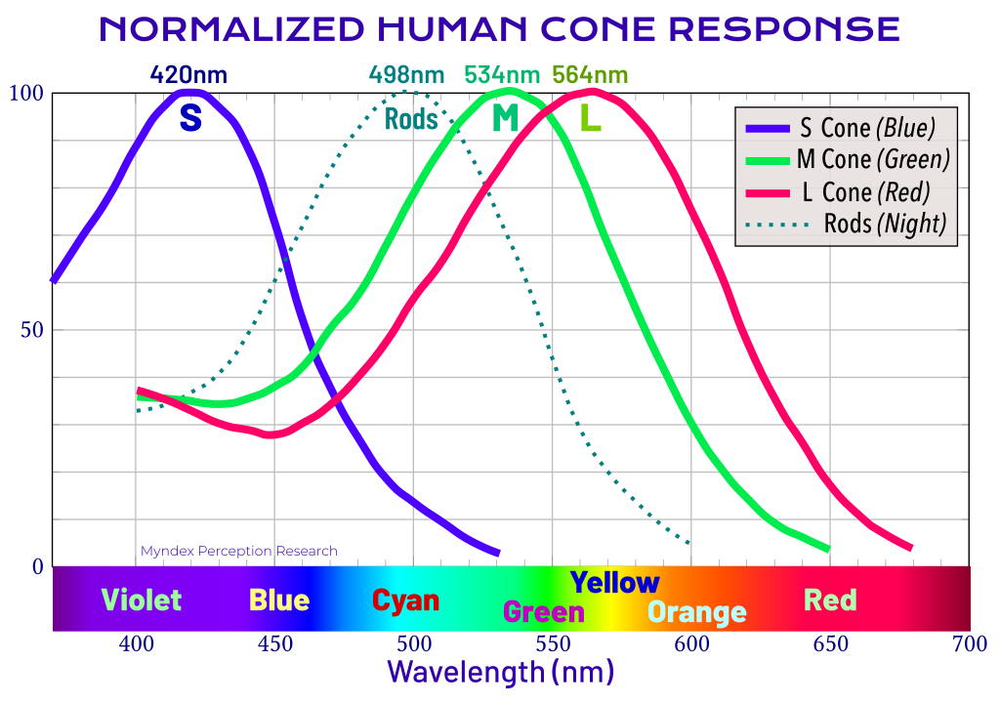
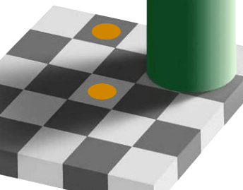
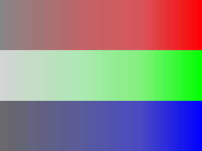
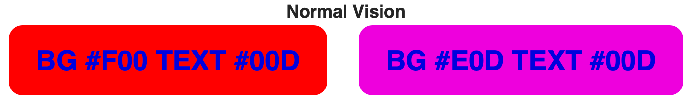
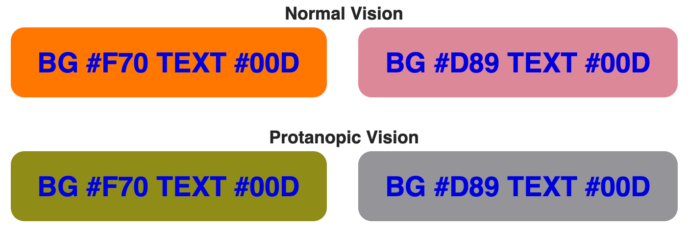
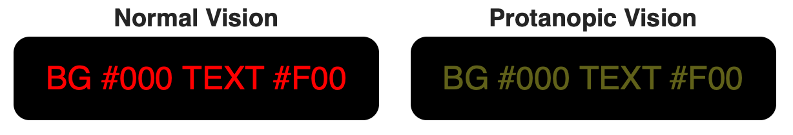
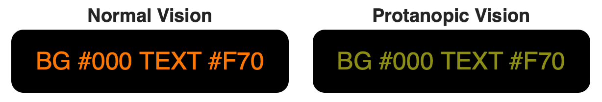

## Introduction to Color and Accessibility

When designing visual and readable content with the aim of accessibility for all sighted users, it is important to have an understanding of light, color, and perception. This page specifically discusses:

- luminance, which is a linear measure of light,
- Color, which is measured as hue, chroma, and saturation,
- lightness, brightness, and contrast which are measures of perception, and
- how these interrelate and interact with design elements.

While understanding these concepts are important for design and readability for all sighted users, they are especially important for those with reduced vision and color deficient vision, and also for those with certain neurological, cognitive, and other impairments.

### Standards and Guidelines

The [W3.org's](/en-US/docs/Glossary/W3C) [WAI](/en-US/docs/Glossary/WAI) publishes freely available guidelines, maintained by the AGWG (Accessibility Guidelines Working Group). Currently these are known as the [WCAG 2.1 accessibility guidelines](/en-US/docs/Glossary/WCAG). The next generation, [WCAG 3.0](https://www.w3.org/TR/wcag-3.0/), is presently published as a public working draft, pending further development and approvals.

The WCAG 2.x guidelines attempt to define adequate [luminance contrast](/en-US/docs/Web/Accessibility/Understanding_WCAG/Perceivable/Color_contrast) for sighted users with reduced vision, as well as guidelines intended to help users with color insensitive vision (inaccurately called "color blindness"), and further WCAG 2.x color guidelines are intended to [prevent seizures and other physical reactions](/en-US/docs/Web/Accessibility/Seizure_disorders) in people with vestibular or neurological disorders.

## Color basics

Color and how it is used is a major part of accessibility. While at first color may seem simple as it is something most sighted users experience on a daily basis, the underlying science of color perception is complex and often not intuitive.

To begin with, color is not "real," which might sound like an odd statement for an article on color. The fact is that in the visible range, light simply exists at different frequencies, or wavelengths. Consider how the keys on a piano create sounds at different frequencies. But while our ear and aural perception may "hear" sound as a range of notes, the normal human eye divides the visible light into three overlapping ranges. These three bands of light are detected by light sensitive cells in the eye known as cones, and the three cone types are called L, M, or S for long, medium, and short wavelengths.

We normally associate L, M, or S cone sensitivity with the sensation of red, green, and blue colors, respectively, the three primary colors of light. Specific red, green, and blue hues are used for the "color primaries" used in an RGB additive color model. The sRGB colorspace, the default standard colorspace for web content, is an example of an additive RGB color model.



### RGB additive model

RGB is called an additive color model because it functions by adding light of different wavelengths in different proportions to stimulate the L, M, S cones in the eye to create a particular color sensation. For instance when you see the color yellow on your monitor, the monitor is still only emitting red and green light. The separate red and green stimulate the L and M cones similarly to how a "yellow" wavelength of light might, as yellow is "in between" red and green. The red and green light do not "mix" in the air as if paint, they remain separate. The "mixing" happens in our vision system's neurological processing.


The monitor is only emitting the red and green light shown on top to create the yellow bar underneath.

#### CMYK subtractive model

CMYK is another form of color model, known as a subtractive model. Here, the cyan, magenta, yellow, black inks _remove_ certain wavelengths of light, reflecting back only the narrow range each is associated with. In this article we will be focusing on displayed web content, and so we discuss mainly the RGB color model.

See this overview for a deeper dive into how the [eye and vision system functions](https://www.olympus-lifescience.com/en/microscope-resource/primer/lightandcolor/humanvisionintro/).

## Perception of Color and Contrast

What's important to understand about our perception of color, light, and contrast is that:

- It is not absolute,
- that it is a context-sensitive perception,
- and that perception is mostly neurological in nature.

### The context of contrast

Like color, contrast is not "real," it is a perception. It takes the first 20 years of our life to develop peak contrast sensitivity. Age and many forms of health issues — even medicine you may be prescribed — can affect your contrast perception.

In the following image both of the yellow dots, and the grey of the square they are on, are identical in terms of the sRGB color value that is being displayed on your monitor. It is your context-sensitive perception of these colors that makes them appear so different, as your brain's image processing adjusts the perception based on what it thinks is in shadow or not.


The yellow dots in this image are identical colors coming from your monitor, but they appear different due to context. Image D.Lyon

Our contrast, lightness, and color perception is affected by the context of the nearby colors, and other features of a design or image. This makes predicting contrast challenging. It is clearly not as simple as the distance or ratio between two colors.

### Readability Contrast

For web content, readability is one very important goal. Readability is not the same as legibility. Readability is the point where a particular user can read at their best speed and best comprehension. Legibility refers to the "just noticeable difference" (JND) where a figure such as a letter just becomes discernible.

For normal vision, the contrast sensitivity (CS) JND legibility level is about 1%, while someone with a mild impairment might have a CS of 3%. 10% would be represent profound impairment in the area of low vision. These levels are for large, bold fonts on a special chart used for testing contrast sensitivity.

But the threshold of 1% to 3% is wholly insufficient for fluent, easy reading. The minimum critical contrast level is ten times the CS JND, and 20 times the JND is considered the better target to allow for "contrast reserve." [(Visual requirements for reading, S G Whittaker, J Lovie-Kitchin)](https://pubmed.ncbi.nlm.nih.gov/8430009/).

### Spatial Frequency

Our perception of contrast is not only affected by surrounding elements and the environment, but the "Spatial Frequency" of the stimulus itself. A higher spatial frequency means smaller, thinner, and more crowded. This applies very much to text and the font size and weight used, as well as letter and line spacing.

In a typical eye exam for acuity (ability to focus), legibility at a particular level means getting three out of five letters correct. This is wholly insufficient for fluent, easy reading.

"Normal" print is usually considered 11.5pt to 12pt, this is equivalent of 16px on screen. And this is for normal vision. To relate this to real world visual acuity, if you think of an eye doctor's chart, and focusing on a capital E. If that E is at the legibility or acuity limit for 20/20 vision, and that is at full contrast, it is equivalent to a Helvetica capital E that is 3.9px on screen, meaning a 5.5px CSS font-size. (In print, this is a 4pt font on coated paper).

This is the minimum for "just making out" letters at \~70% accuracy. That is legibility, not readability. For readability, the lower case [x-height](https://kazdesignworks.com/graphic-design-terms-x-height-and-cap-height/) needs to be a minimum of twice that [cap height](https://kazdesignworks.com/graphic-design-terms-x-height-and-cap-height/). This is called the critical font size for readability.

This means that while a 5.5px font may be the minimum for 20/20 legibility, the minimum for *read*ability is 15.6px (in print, about 12pt, the typical standard in books). And this is for normal vision. Someone with 20/40 needs twice that, about a 31px font. This is why the [WCAG standard requires](https://www.w3.org/TR/UNDERSTANDING-WCAG20/visual-audio-contrast-scale.html) that users have the ability to zoom text larger.

While text that is too small is hard to read, so is text that is too big. Above approximately 96px, reading speed decreases. Also, very large fonts make it difficult for a user to enlarge the smaller text on the page, as most browsers presently zoom all text regardless.

### Text Size Guidelines

The current WCAG 2.x contrast guidelines 1.4.3 and 1.4.6 define "large" text as text that is 18pt (24px) or larger at a normal weight (400), or text that is 14pt (18.7px) at a bold weight (700). This may have been sufficient in 2008 when the standard was created. At that time, most "web fonts" such as Verdana were only available in a normal and bold weight.

Today, the proliferation of easily available web fonts of all sizes and weights has complicated the issue. The emerging WCAG 3.0 standard on visual contrast is known as the [Advanced Perceptual Contrast Algorithm (APCA)](https://www.myndex.com/APCA/), and takes into account font weights and sizes in a variable manner, relative to the predicted contrast value.

[Non text elements such as icons also need adequate contrast for perception](https://www.w3.org/WAI/WCAG21/Techniques/general/G207).

## CSS and the sRGB Colorspace

The W3.org defines the sRGB colorspace as the [default for web content](https://www.w3.org/TR/css-color-3/#SRGB). The MDN page on [\<color>](/en-US/docs/Web/CSS/color_value) says "_The [CSS](/en-US/docs/Web/CSS) [color data type](/en-US/docs/Web/CSS/CSS_Types) represents a color in the [sRGB colorspace](https://en.wikipedia.org/wiki/SRGB)._"

### CSS Color Level 3 notations:

These are examples of the CSS notations used to define a color. Here the example color for each is magenta:

```css
/* by name (from a defined set of names) */
div { color: magenta; }

/* by HSL representation of the sRGB value */
div { color: hsl(300, 100%, 50%); }
div { color: hsla(300, 100%, 50%, 50%); }

/* by sRGB value as a percentage */
div { color: rgb(100%, 0%, 100%); }
div { color: rgba(100%, 0%, 100%, 50%); }

/* by sRGB integer values */
div { color: rgb(255, 0, 255); }
div { color: rgba(255, 0, 255, 0.5); }

/* by sRGB value in hex */
div { color: #f0f; }            /* #rgb, a shorthand for #rrggbb */
div { color: #ff00ff; }         /* #rrggbb */
div { color: #ff00ff80; }       /* #rrggbbaa */
```

The first example is using one of the defined color names. The list of basic color keywords is: `aqua`, `black`, `blue`, `fuchsia`, `gray`, `green`, `lime`, `maroon`, `navy`, `olive`, `purple`, `red`, `silver`, `teal`, `white`, and `yellow`. Some color names have aliases, for instance, `cyan` and `aqua` are the same color, as is `fuchsia` and `magenta`, and `grey` and `gray`. There are over [a hundred and forty more](https://www.w3.org/TR/css-color-3/#svg-color) names that came from the SVG specification that are supported by most browsers.

The next examples show "HSL" which stands for **"Hue, Saturation, Lightness"**. The color produced from the settings are still in the sRGB colorspace, but HSL is intended as a more convenient way to select and work with color. Because hue is adjusted as an angle, it is easy to create a user interface using a knob or circular control to adjust hue.

Next, we can set the sRGB values directly, as a percentage, 0% being off (black) and 100% being the full value for that color. The values are in the order of red, green, blue.

We can also set the sRGB values directly by an 8bit integer number, which means a whole number from 0 to 255. This is the number of values available in an 8bit byte, which is how numbers are often stored in a computer.

Shown after that, we can use a hex value. Hex value means "hexadecimal," where the 0-255 integer is represented by two digits that each range from 0-15. As there are no Arabic numerals above 9, we use the letters a-f to represent 10-15. We add the '#' symbol to indicate the value is hex. Thus, #ff = 255.

In some of the previous examples, you'll notice that some have a fourth value which is called "alpha", the A in RGBA. The alpha channel is not a color channel, but defines transparency in terms of the opacity value of the color. A higher value means the color is more opaque therefore less transparent. In the examples above, the alpha value is set to half or 50% opaque.

### sRGB: the accessible colorspace

For accessibility guidelines the **sRGB** colorspace is most commonly used. This is not only because sRGB is the current default standard for the web, but also the sRGB color primaries are well suited for accessibility concerns. For instance, the "red" sRGB primary is actually a red-orange, with a dominant wavelength of 611nm which overlaps into the M cone (green) sensitivity.

This is helpful for some impairments related to color vision deficiency (CVD). One form of CVD called protanopia means the eye has no red cones. But protanopia will still be able to perceive the sRGB red primary because the remaining green cones perceive it, though about 35% darker than normal vision. Nevertheless, both a protan (red deficient) and deutan (green deficient) type of CVD have difficulty distinguishing _between_ red and green.

Some other display colorspaces use different primary colors. For the new [ultraHD Rec2020](https://en.wikipedia.org/wiki/Rec._2020) colorspace, the red primary has a longer wavelength of 630nm. This greatly improves color fidelity for normal vision, but it also means that someone with protanopia will not see this red at all, or very dimly at best. The Rec2020 green primary may cause a greater reduction in luminance for deuteranopia (green deficient vision).

While some standards in development such as **[CSS Color Module Level 4](https://drafts.csswg.org/css-color-4/)** are adding additional colorspaces, sRGB will remain the default colorspace, and the preferred colorspace for accessibility for the foreseeable future.

---

## Light and Luminance

Luminance is a linear measure of light, which is spectrally weighted for human vision, but not perceptually weighted in terms of lightness to darkness. It is symbolized by **Y** for relative luminance, or **L cd/m²** for absolute. We will use Y for most of our discussions. The spectral weighting takes into account the different sensitivity of the L, M, S cones (sometimes thought of as the red, green, blue sensitive cells in the eye).

By far our eye is tuned to green, which makes up the majority of luminance. Relative to the total sRGB white (`#fff`), green is 71% of the total luminance measure. Red is second at 21%, and blue is a distant third as a mere 7% of luminance.

### Deeper dive into spectral sensitivity

The relative density of the three cone cell types is 63% L cones, 31% M cones, and 6% S cones, and is quite variable for each individual. Now if we look at these numbers for a moment, we might be puzzled as to why the majority of cones are the longwave, L type, yet the "red" in an sRGB monitor makes up only 21% of luminance.

This is because the peak sensitivity of the L cone is actually a green/yellow, and the L cone response almost entirely overlaps the M cone response. The reason we often refer to the L cone as the "red" cone is that it responds more to long wave red light than the M cone. It is this differential between M and L cones that results in the sensation of red.

At 611nm, the red primary in an sRGB monitor is spectrally distant from the L cone's peak sensitivity at 565nm. But the sRGB green primary is 549nm, in between the L cone peak and the M cone's peak at 540nm. This explains why the green primary makes up such a large portion of total luminance on a monitor.

Handprint.com has [an excellent deep dive into the nuances of spectral response, luminance, and color perception](https://www.handprint.com/HP/WCL/color1.html).

### The value of luminance values

Once an sRGB color value is converted to the linear light value of luminance (Y), that luminance value can be used relative to another color's luminance to determine a contrast ratio, or used to predict a perceptual contrast. This is an important part of determining the readability of text on the page.

In WCAG 2.x, the contrast math is not perceptually uniform, so it does not predict the contrast appearance over the full range of light to dark. For WCAG 3.0, a new method known as the Advanced Perceptual Contrast Algorithm provides a numeric contrast value that is relative to perception.

See also this article on [luminance contrast](https://www.myndex.com/WEB/LuminanceContrast) which discusses various math methods relating to luminance and contrast

.

### Perceptual lightness

While luminance is a linear measure of light, as light exists in the real world, it does not predict our perception of light. When we say light is linear, we don't mean that it travels in a straight line, we mean as an additive quantity. If we have 100 photons of light and triple it, we then have 300 photons of light. But in that example, we don't perceive a tripling. The human visual system sees a relatively modest increase, because our perception of light is non-linear.

Another way to describe this is that our perception roughly follows a power curve with an exponent of \~0.425, so perceptual lightness is approximately **L<sup>\*</sup> = Y<sup>0.425</sup>**, though this depends on adaptation.

### Adaptation

The human vision system normally has a remarkably wide range of vision, from bright daylight down to a dark moonless night where the eye is so sensitive, one study found a mere 54 photons of light are enough to perceive "something". [These researchers estimated](https://www.livescience.com/33895-human-eye.html) under ideal dark conditions the eye could see a candle flame flicker at 30 miles away.

This incredibly wide range is possible due to a mechanism known as light and dark adaptation, where the eye adjusts to the current overall light level.

#### Dark adaptation

Also known as scotopic or "night vision." Here the eye is adapted to a very dark level. Instead of the "color" sensitive cones, another type of cell called rods becomes active. Rods are sensitive to very low light levels and don't sense color. Despite being very sensitive to light, with night vision the resolution is very poor, and details can be hard to see.

When adapting to a dark condition, it can take thirty minutes to achieve full dark adaptation. Yet a brief exposure to a bright light can throw off that night vision, taking substantial time once again to adapt. In situations where it is important to maintain dark adaptation but something needs to be illuminate (such as a map or a control) a red light is often used, as that is less likely to interfere with the rods which are sensitive between green and blue.

#### Light adaptation

This is also known as photopic or "daylight vision." Here the eye is adapted to much higher levels of light, typically a luminance greater than 8 cd/m<sup>2</sup>. The equates to a CSS value of between `#444` and `#555` for a typical desktop monitor.

While dark adaption may take 30 minutes, light adaptation is much faster, taking only a few minutes. An example is leaving a dark theater on a Saturday afternoon, and being dazed by the bright sunlight for a minute or two. This adaptation period can even be painful for some people.

#### The twilight zone

There is a transitional area between dark and light adaptation known as mesopic vision, where both rods and cones operate at the same time. On a monitor, we'd consider this black (about `#000005`) up to as high as `#555` for a bright desktop monitor.

#### Other adaptations

We also adapt to contrast levels, and chroma and hue. Our perception is relative to context. If a page is very high contrast, we adapt to that high contrast. This will cause a low contrast item to seem even lower in contrast. We will also adapt to the overall hue cast of a page, as a result other colors on that page will be affected and perceived relative to the overall page color.

Here is [a much deeper discussion of the nature of eye adaptation](https://webvision.med.utah.edu/book/part-viii-psychophysics-of-vision/light-and-dark-adaptation/).

## Hue Chroma and Saturation

Where luminance is a measure of light, and L<sup>\*</sup> (Lstar) is a measure of our perception of lightness, hue, chroma, saturation refer to our perception of the color of that light.

Used properly, color can help to organize information, aide navigation, and add distinction for elements such as indicating focus or activity states.

### Color theory

A complete color theory and color design guide is beyond the scope of this document, but many classical design guidelines apply to web based content as they have to print for centuries. One classic resource is Johannes Itten's "The Art of Color", and [the trimmed-down version "Elements of Color"](https://archive.org/details/elementsofcolort00itte) can be read online at various archive libraries.

### Color terms

The world standard in terms of colorimetry (measuring color) is the **CIE**, and their [interactive glossary](http://cie.co.at/e-ilv) is filled with color information.

> **Note:** Tip: when searching the CIE glossary use the UK spelling of "colour."

#### Colorfulness

Colorfulness is the "Attribute of a visual perception according to which the perceived color of an area appears to be more or less chromatic." (CIE 17-233). For a color of a given chromaticity this attribute usually increases as the luminance is raised, except when the brightness is very high.

#### Saturation

Saturation is the "Colorfulness of an area judged in proportion to its brightness." (CIE 17-1136). For normal day viewing conditions a given chromaticity exhibits approximately constant saturation for all luminance levels, except when the brightness is very high.

#### Chroma

Chroma is the "Colorfulness of an area judged as a proportion of the brightness of a similarly illuminated area that appears white or highly transmitting." (CIE 17-139). A color exhibits approximately constant chroma for all levels of illuminance in normal day viewing conditions (except when the brightness is very high). If the luminance is increased, the chroma usually increases in the same circumstances.

Here is an example of high chroma vs no chroma. On the right, each of the three sRGB primaries are at maximum. On the left, there is no chroma, also known as "achromatic."



A good resource with many more detailed examples is at [the Munsell color site](https://munsell.com/color-blog/difference-chroma-saturation/).

### Color Combinations

Certain color combinations can be very problematic on a computer monitor or mobile device, and some color combinations can interfere with some impairments. The combination of red/blue is one such example.

Some impairments cannot differentiate all colors. And some colors, such as pure blue, are so low in luminance they need to be the darkest of two colors. Blue is also very low in resolution. There are far fewer blue cones, and they are scattered in our peripheral vision and not present in our central vision. This leads to some color use guidelines:

- Never rely on hue alone for differentiating details. Adequate luminance contrast is required.
- The green in a monitor makes up the vast majority of luminance (light), so it will usually be a significant part of the lighter colors.

### Working with Blue

- Pure blues should typically be the darkest of two colors.
- To use blue as the lighter of two colors, green needs to be added, otherwise there will be insufficient contrast and poor readability.
- This is both due to the low contrast and due to the human eye seeing blue at a lower resolution than green and red.

The nature of blue light causes it to focus at a different location on the retina than red, so a pure red and a pure blue color that are immediately adjacent and touching, may "shimmer" when next to each other. In the example below: Left, pure red (`#F00`) and a pure blue (`#00D`). Right, an equal amount of blue was added to the background which removes all detail from the blue channel.



Reducing or avoiding details in the blue channel can help prevent chromatic aberration, glare, or shimmer. However, both of these color combinations are still a significant problem for some forms of color vision deficiency. For instance, someone with protanopia (red deficient vision) sees the above examples as:


Adding green to the brightest of the two colors, in this case the background, improves the luminance contrast. This improves readability for everyone.



Thus it is always important to ensure ample luminance contrast. This is most easily regulated by adding green to the brightest of the two colors.

### Working with Red

Pure red (`#F00`) text on a pure black (`#000`) background is a bare minimum contrast for a 24px 700 weight bold font for normal vision. Someone with protanopia would have a difficult time reading this on an sRGB monitor, and it would be literally invisible on a next-generation Rec2020 display.



Adding a small amount of green (#77) makes a noticeable difference for protanopia, and in fact improves readability for all users by improving the luminance contrast.



There are [color vision simulators](https://www.myndex.com/CVD/), that allow you to process a screenshot of your design to demonstrate how your design might look to someone with a color vision deficiency.

An excellent guide regarding designing with color for accessibility is Maureen Stone's [Guidelines for Using Color](https://www.nist.gov/system/files/documents/itl/vote/NISTIR-7537.pdf) a free download published by NIST.

## Psychophysical aspects of color

Color as in hues and saturation can affect our mood, and enhance — or de-enhance — our interactive experiences.

### Examples of color's effect beyond vision

- **Color can be culturally dependent:** [A Cross-Cultural Study of the Affective Meanings of Color](https://journals.sagepub.com/doi/10.1177/002202217300400201)
- **Color affects our emotions:** [Color and emotion: effects of hue, saturation, and brightness](https://pubmed.ncbi.nlm.nih.gov/28612080/)
- **Higher contrasts can also have a positive affect on our emotions:** [Emotion Variation from Controlling Contrast of Visual Contents through EEG-Based Deep Emotion Recognition](https://pubmed.ncbi.nlm.nih.gov/32823741/)
- **Some colors can affect our perception of time:** [Color and time perception: Evidence for temporal overestimation of blue stimuli](https://pubmed.ncbi.nlm.nih.gov/29374198/)
- **Blue also has a significant effect on brightness and glare:** [Blue and glare & brightness](https://pubmed.ncbi.nlm.nih.gov/31288107/)
- **Red tinted glasses can provide increased happiness or joy:** [Looking Through "Rose-Tinted" Glasses: The Influence of Tint on Visual Affective Processing](https://pubmed.ncbi.nlm.nih.gov/31244627/)
- **Red is well known to have significant effects on our behavior:** [How the Color Red Influences Our Behavior](https://www.scientificamerican.com/article/how-the-color-red-influences-our-behavior/), Scientific American, S. Martinez-Conde, S,Macknik
- **Red Environment:** [Studies have shown that a red environment stimulates cognition](https://pubmed.ncbi.nlm.nih.gov/20649469/), but for those who suffer Traumatic Brain Injury cognitive function may be reduced in a red environment, while a green environment had no measurable effect according.

### Flashing and Seizures

Continuous flashing brighter/darker at rates higher than 3 flashes per second, and over an area that covers just 5° of central vision, has been shown to induce photic seizures in some people, most likely in children and adolescents. It has also been found that certain very regular, high contrast patterns such as parallel white and black stripes, can also induce seizures. Some studies have indicated that very deep saturated red (with wavelengths of 660nm-700nm+) may exacerbate the problem, if these deep reds flash between a saturated and unsaturated state, no matter the luminance.

The Epilepsy Foundation of America researched photic-related seizures thoroughly in this publication [Photic- and Pattern-induced Seizures A Review](https://www.researchgate.net/publication/7615895_Photic-_and_Pattern-induced_Seizures_A_Review_for_the_Epilepsy_Foundation_of_America_Working_Group). The study resulted in several important guidelines, a few key guidelines are:

**Single, double, or triple flashes in one second are acceptable, but a sequence of flashes is not recommended when both of the following occur:**

1. More than three flashes within any one second period.
2. From the minimal expected viewing distance, the total area of concurrent flashes subtends a visual angle of 5° or more (200px to 300px square on a desktop monitor to as little as 50px square for a closely held mobile device).

**When the light–dark stripes of any pattern are larger than a visual angle of 5° and the luminance of the lightest stripe is more than 50 cd/m², the pattern should display no more than:**

1. Five light–dark pairs of stripes, if the stripes change direction, oscillate, flash, or reverse in contrast.
2. Eight light–dark pairs of stripes, if the pattern is unchanging or continuously and smoothly drifting in one direction.

The consensus recommendations are in this brief paper, [Photic- and Pattern-induced Seizures: Expert Consensus of the Epilepsy Foundation of America](https://onlinelibrary.wiley.com/doi/epdf/10.1111/j.1528-1167.2005.31405.x). Some additional insights are available in this UK paper covering [guidelines for preventing seizures.](https://citeseerx.ist.psu.edu/viewdoc/download?doi=10.1.1.106.9473&rep=rep1&type=pdf).

Additional notes: The EFA recommendation from 2005 pre-dates smart phones, and was based on television set usage, defining a flash that _"occupies a solid visual angle of ≥0.006 steradians (∼10% of the central visual field or 25% of screen area at typical viewing distances)."_ This is essentially equivalent to a visual angle of 5° square. Since that time, mobile devices have substantially changed how we view media. For a typical smart phone viewed very close (5"-6" or 12cm-15cm) that would be an area about 50px to 70px square.

---

## Modeling Light Color and Vision

To help us in our work, be it content design or determining accessibility, or calibrating a monitor, we need a way to model and predict the behavior and perception of light and color. These models are built with basic math, and are specific to the given task. A colorimetric model is one that is involved in measuring light, an appearance model is designed to predict how we will perceive the light as measured.

### Calculating Relative Luminance

The IEC standard for calculating relative luminance (Y) from an sRGB color is as follows:

#### Step one: 8-bit integer to float

Convert 8-bit sRGB values to float (0.0 to 1.0) by dividing by 255.0:

**R´<sub>float</sub> = R´<sub>8bit</sub> / 255.0 G´<sub>float</sub> = G´<sub>8bit</sub> / 255.0 B´<sub>float</sub> = B´<sub>8bit</sub> / 255.0**

If your sRGB values are 16-bit then convert to decimal by dividing by 65535.

#### Step two: Linearize

Linearize the data to remove the encoded transfer curve.

**R<sub>lin</sub> = sRGBtoLin(R´<sub>float</sub>) G<sub>lin</sub> = sRGBtoLin(G´<sub>float</sub>) B<sub>lin</sub> = sRGBtoLin(B´<sub>float</sub>)**

Using the function shown below:

```javascript
function sRGBtoLin(colorChannel) {
  // Send this function a decimal sRGB gamma encoded color channel
  // between 0.0 and 1.0, and it returns a linearized value.
  if (colorChannel <= 0.04045) {
    return colorChannel / 12.92;
  } else {
    return Math.pow(((colorChannel + 0.055) / 1.055), 2.4);
  }
}
```

> **Note:** Those familiar with the WCAG 2.x contrast math may notice that the above code uses the threshold value of 0.04045. This is the official IEC standard. The WCAG 2.0 guidelines were drafted citing an obsolete value. In May 2021, this was corrected to  0.04045 in the WCAG 2.1 document. For the record, the WCAG 2.0 value is 0.03928.

#### Step three: Spectrally Weighted Luminance

The normal human eye has three types of cones that are sensitive to red, green, and blue light. But our spectral sensitivity is not uniform, as we are most sensitive to green (555 nm), and blue is a distant last place. Luminance is spectrally weighted to reflect this using the following coefficients for sRGB:

**Y = R<sub>lin</sub> \* 0.2126 + G<sub>lin</sub> \* 0.7152 + B<sub>lin</sub> \* 0.0722**

Multiply each linearized color channel by their coefficient and sum them all together to find Y, Luminance.

#### Alternate: sRGB to Y, simple

Use this version instead of the piecewise version above if you are less concerned with accuracy and more concerned with performance.

Raise each color channel to the power of 2.2, the same as an sRGB display. This is fine for most applications. But if you need to make multiple round trips into and out of sRGB encoded space, then use the more accurate version above.

**Y = 0.2126 \* (R´/255.0)<sup>2.2</sup> + 0.7152 \* (G´/255.0)<sup>2.2</sup> + 0.0722 \* (B´/255.0)<sup>2.2</sup>**

### Math and Methods

Within the W3 AGWG there is active discussion and investigation regarding the WCAG 2.x contrast method, math, and future proposals. The main discussion thread is on GitHub as [W3C/WCAG issue #695](https://github.com/w3c/wcag/issues/695).

- [WCAG 2.x Contrast Checker](https://webaim.org/resources/contrastchecker/)

  at WebAim.org. This popular and easy to use contrast check is for the WCAG 2.x guidelines 1.4.3 and 1.4.6

- [APCA Contrast Calculator](https://www.myndex.com/APCA/)

  The proposed method for assessing contrast for WCAG 3. See also [this catalog of links](https://git.myndex.com) to documentation and further discussions of readability contrast.

- [brucelindbloom.com](http://brucelindbloom.com)

  Bruce Lindbloom's site on colorspaces and the related math and transformations. It includes a very helpful calculator that converters between many color models, including the key CIE models.

- [W3 CSS Color Module Level 4](https://drafts.csswg.org/css-color-4/#color-conversion-code)

  Code examples for color conversions that are part of the CSS Color Module Level 4

## Additional Resources

#### MDN

- [Accessibility](/en-US/docs/Web/Accessibility)
- [Accessibility learning path](/en-US/docs/Learn/Accessibility)
- [color](/en-US/docs/Web/CSS/color)
- [`<color>`](/en-US/docs/Web/CSS/color_value)
- [Web accessibility for seizures and physical reactions](/en-US/docs/Web/Accessibility/Seizure_disorders)

#### W3C Issues and Discussions

- [The Visual Contrast Research Group](https://www.w3.org/WAI/GL/task-forces/silver/wiki/Visual_Contrast_of_Text_Subgroup) for WCAG 3.
- [Light and dark text](https://github.com/w3c/silver/issues/261) & WCAG 3.0 contrast (Silver thread #261)
- [Contrast Ratio Math](https://github.com/w3c/wcag/issues/695) and Related Visual Issue thread #695
- [Luminance / Luma confusion](https://github.com/w3c/wcag/issues/236) thread #236
- [Non-sRGB color spaces](https://github.com/w3c/wcag/issues/360), outdated sRGB threshold thread #360

#### W3C Standards and Guidelines

- [The latest draft of the new WCAG 3 standards](https://www.w3.org/TR/wcag-3.0/)
- [Ensuring that a contrast ratio of 3:1 is provided for icons](https://www.w3.org/WAI/WCAG21/Techniques/general/G207)
- [Understanding Success Criterion 1.4.3: Contrast (Minimum)](https://www.w3.org/WAI/WCAG21/Understanding/contrast-minimum.html)
- [CSS Color Module Level 3](https://www.w3.org/TR/css-color-3/)
- [CSS Color Module Level 4](https://drafts.csswg.org/css-color-4/)

### Page Source

This page is based largely on the white paper on color and contrast by Andrew Somers, which is being developed for the W3 and Accessibility Guidelines Working Group, used herein by permission. Andrew Somers is an invited expert of the W3 and the AGWG, the author of the WCAG 3 Visual Contrast specifications, and the inventor of the APCA.
