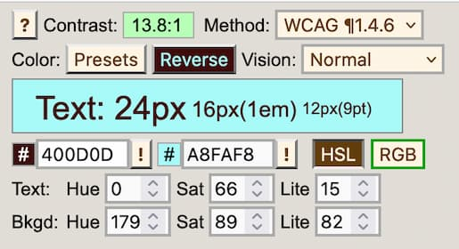

<section id="Quick_links">
  {{ListSubpagesForSidebar("Web/Accessibility", 1)}}
</section>

While understanding color, luminance, and saturation is important for design and readability for all sighted users, they are especially important for those with reduced vision and color deficient vision, and also for those with certain neurological, cognitive, and other impairments.

Accessibility guidelines define adequate [color contrast](/en-US/docs/Web/Accessibility/Understanding_WCAG/Perceivable/Color_contrast) for sighted users with reduced vision, as well as guidelines intended to help users with color insensitive vision, commonly referred to as "color blindness". Understanding color is also important in preventing [seizures and other physical reactions](/en-US/docs/Web/Accessibility/Seizure_disorders) in people with vestibular disorders or other neurological disorders.

## Overview

Colors, and how they are used, are a major component of accessibility. At the surface, the subject seems simple, but it is actually a complex subject because color is as much about the physiology of the eye and human perception as it is about light emitting from a computer screen.

### Environment and perception

Environment matters. Perception of color in a well-lit room will be different than perception of that same color on that same computer screen in a dark room. In terms of accessibility, the use of certain color-combinations have more impact than others. Font size, [font style ](https://www.nngroup.com/articles/glanceable-fonts/) (some fonts are so thin or fancy that they present accessibility problems on their own), background color, the size of the background space around the text, even pixel densities, and more all affect how color is delivered from the screen.

A viewer's distance from the screen, the ambient background, the health of his eyes, and more all affect how that color is received by the viewer. How the viewer perceives color after it gets to their eyes is yet another matter, and can be affected by overall health. Fortunately, there are [media queries](/en-US/docs/Web/CSS/@media/) that enable developers to provide styles based on user preferences, including [contrast](/en-US/docs/Web/CSS/@media/prefers-contrast) and [color scheme](/en-US/docs/Web/CSS/@media/prefers-color-scheme) preferences.

When supported, the [Ambient Light Sensor](/en-US/docs/Web/API/AmbientLightSensor) interface returns the current light level or illuminance of the ambient light around the hosting device enabling a web page to be aware of any change in the light intensity, and consequently, adjust the text accordingly. Additionally, the above media queries enable developers to provide alternative user experiences when user preferences indicate prefered contrast levels, automatically adjusting levels depending upon where the user is and what kind of screen they are using.

### Luminance and perception

Color, contrast, and luminance are among the most central and critical concepts to creating accessible web content with color. Luminance is of particular importance, however, because at the end of the day, understanding of what it is and how it is employed enables accessibility for those who are color-blind, as well as those who can perceive color. It is the luminance contrast that enable the color-blind to distinguish dark against light.

Luminance must be established before the contrast may be. When speaking of color contrast, W3C formulas are actually incorporating luminance, not just the colors ("hues") themselves.

### Terminology

Terminology can be confusing, because different terms are often used to describe the same thing. "Luminance" and "Saturation" are particularly important to get right. For example, "saturation" is known as "chroma" in some circles. In others, "chroma" and "saturation" are two different concepts. The "L" in the HSL color space is sometimes referred to as "luminosity," other times as "lightness." Even something seemingly simple like naming common colors can be open to debate. For example, the color "crimson red" may be described in hex values as `#990000` by some and `#DC143C` by others. For the purposes of this document, we'll use terminology as it is defined in the W3C, in the [CSS Color Module Level 4](https://www.w3.org/TR/css-color-4/)

When working with color, it's important to know which "color space" you are working in, as different color spaces map to different measurement systems.

In color printing, your printer likely have cyan, magenta, yellow, black (CMYK) ink cartridges. CMYK is a subtractive model wherein the four inks _remove_ certain wavelengths of light, reflecting back only the narrow range each is associated with. RGB is an additive color model that adds red, green, and blue lights in different proportions.

Currently, the RGB color space predominates as the space web developers work in. While HEX, RGB and HSL color spaces are notated differently, browseres automatically convert values between these color notations. [CSS color modules](en-US/docs/Web/CSS/CSS_Colors) provide for additional color spaces, but because of the current domination of the RGB color space in measuring color output, most calculations in this document are presumed to be in the RGB color space, and very specifically, in the sRGB color space.

## The sRGB color space

Color has many ways of being defined, as is apparent in the [`<color>` data type](/en-US/docs/Web/CSS/color_value), including RGB, RGB decimal, RGB percent, HSL, HWB, LCH, and CMYK, among others.

For digital concerns, much of the technology has historically resided in the RGB color space. The RGB color model is extended to include “alpha” -- RGBA -- to allow specification of the opacity of a color. Other methods for measuring color involving measurements using other color spaces exist and are supported in modern displays and browsers, but color measurements in the RGB color space predominates, including in video production.

Technologies, such as [OpenGL](https://en.wikipedia.org/wiki/OpenGL) and [Direct3D](https://en.wikipedia.org/wiki/Direct3D) incorporate support for the sRGB gamma curve, although some articles for OpenGL reference use of RGBA rather than sRGB. WebGL is usually in the RGBA format; see an example of how it is used in "[Clearing with colors](/en-US/docs/Web/API/WebGL_API/By_example/Clearing_with_colors)".

### CSS color values

It's important to know that there are variations even within one color space, such as the RGB color space. For example, variations of the RGB color space include **RGB**, **sRGB**, **Adobe RGB**, **Adobe Wide Gamut RGB**, and **RGBA**, among others.

These are examples of the CSS notations used to define a color. Here the example color for each is a fully opaque magenta:

```css
/* named color */
color: magenta;

/* sRGB value with percentage values */
color: rgb(100% 0% 100%);
color: rgb(100% 0% 100% / 100%);

/* by sRGB numeric values */
color: rgb(255 0 255);
color: rgb(255 0 255 / 1);

/* legacy rgba notation */
color: rgba(100%, 0%, 100%, 100%);
color: rgba(255, 0, 255, 1);

/* by sRGB value in hex */
color: #f0f; /* #rgb, a shorthand for #rrggbb */
color: #ff00ff; /* #rrggbb */
color: #f0ff; /* #rgba */
color: #ff00ffff; /* #rrggbbaa */

/* by HSL representation of the sRGB value */
color: hsl(300 100% 50%);
color: hsl(300deg 100% 50% / 1);

/* by HWB representation of the sRGB value */
color: hwb(300deg 0% 0%);
color: hwb(300 0% 0% / 1);
```

The first example is using one of the defined [named colors](/en-US/docs/Web/CSS/named-color).

We can set the sRGB values directly, as a percentage, 0% being off (black) and 100% being the full value for that color. The values are in the order of red, green, blue. We can also set the sRGB values directly by a number from 0 to 255.

Shown after that are hex color values. Hexadecimal is a numbering system with base-16, where the 0-255 integer is represented by two digits that each range from 0-15 represented using 0-9 and a-f for 10-15. Thus, `ff` = `255`, `00` = `0`, and `d5` = `200`. The '#' symbol precedes the color to indicate the value is hex.

If all values are pairs of identical digits, the value can be represented by single digits that the browser will duplicate. Thus `f00` is the same as `ff0000`. If a forth set of numbers is present, that value is the A in RGBA; the alpha channel definining transparency in terms of the opacity value of the color. A higher value means the color is more opaque therefore less transparent. In the examples above, the alpha value is `f`, `ff`, `1`, and `100$` for fully opaque.

The examples also show the [legacy `rgba()`](/en-US/docs/Web/CSS/color_value/rgb#legacy_syntax_rgba) syntax. The older syntax for color functions was comma separated, with separated functions for when the alpha channel was included. New color functions only have one syntax with space-separated (rather than comma separated) values, with the alpha channel, if present, being preceded by a slash.

The next examples show "HSL" which stands for **"Hue, Saturation, Lightness"**. HSL color values are considered by many to be more intuitive than RGB values.The color produced from the settings are still in the sRGB colorspace, but [`hsl()`](/en-US/docs/Web/CSS/color_value/hsl) is an intuitive syntax for many. The hue is adjusted as an angle, it is easy to create a user interface using a knob or circular control to adjust hue. Do note that HSL colors incorporate _lightness_, not _luminance_, and this is a significant consideration.

The last examples shows "HWB" which stands for **"Hue, Whiteness, Blackness"**. Unlike `rgba()` and `hsla()`, [`hwb()`](/en-US/docs/Web/CSS/color_value/hwb) does not have a legacy `a` syntax and does not support comma-separated values. With both `hsl()` and `hwb()` the first value can be a [`<number>`](/en-US/docs/Web/CSS/number) or an [`<angle>`](/en-US/docs/Web/CSS/angle) value. When unitless, the value is interpreted as `deg` degrees.

### Conversions

As we saw, one color within the same color space may be expressed in different ways. Looking at how the RGB color space is used to describe a color "magenta", you can see that the same color may be expressed in a shorthand, three-digit hex number that converts to a rgb value, as a full six-digit hex number that also converts to the same rgb value, or as a rgba value, expressed in percentages.

RGB is hardware-oriented, reflecting the use of CRTs. Many developers and designers prefer the intuitiveness of [`hsl()`](/en-US/docs/Web/CSS/color_value/hsl) notation. Converting from RGB to HSL is not a simple equation. Fortunately, browsers do it automatically and shift-clicking on colors in browser developer tools provide conversion functionality.

In addition to developer tools, there are many tools that can convert RGB to HSL for you, with both the RGB hexadecimal and CSS function syntax. A great example of a tool that converts colors for you is Tom Jewett's "[mini color selector](https://colortutorial.design/microColorsC.html)" with HSL, RGB, Hex options for checking contrast in the browser. Note that developer tools color pickers and this tool all provide WCAG color contrast values.



As noted earlier **[CSS color module](/en-US/docs/Web/CSS/CSS_Colors)** includes adding additional colorspaces, including [`lch()`](/en-US/docs/Web/CSS/color_value/lch) functional color notation and the [`lab()`](/en-US/docs/Web/CSS/color_value/lab) color coordinate system which can specify any visible color, but because of its upbiquity, sRGB is the default and preferred colorspace for accessibility.

Where accessibility is concerned, however, standards and guidelines are currently written predominantly using the sRGB color space, especially as it applies to color contrast ratios. In speaking specifically to relative luminance, [WCAG's definition of relative luminance](https://www.w3.org/WAI/GL/wiki/Relative_luminance) notes:

> **Note:** Almost all systems used today to view Web content assume sRGB encoding. Unless it is known that another color space will be used to process and display the content, authors should evaluate using sRGB colorspace. If using other color spaces, see Understanding Success Criterion 1.4.3."

[CSS Color Module Level 5](https://drafts.csswg.org/css-color-5/) introduced [`lch()`](/en-US/docs/Web/CSS/color_value/lch) functional color notation and the [`lab()`](/en-US/docs/Web/CSS/color_value/lab) color coordinate system which can specify any visible color. These will change the domination of the sRGB color space in the future; but we are not there yet.

### Querying color values

{{domxref('Window.getComputedStyle()')}} returns values using RGB Decimal Reference scale. For example, calling `Window.getComputedStyle()` on a div with a `background-color: #990000;` set returns the computed background color as `rgb(153 0 0)` -- the RGB Decimal reference. Being tied to computer hardware,`Window.getComputedStyle()` measures color in terms of RGB, not how the human eye perceives color.

### Red / green color blindness

Protanopia is a color vision deficiency in which the eye has no red cones; sRGB can still be perceived via green cones, though darker than normal vision. Both protan (red deficient) and deutan (green deficient) deficiencies cause difficulty distinguishing _between_ red and green.

## Luminance and Contrast

### Contrast

Contrast between colors ("hues") is a critical component, but the use of color ("hues") alone is not enough to create accessible content. As mentioned before, any calculation of contrast must include luminance in the calculation.

In addition, the "shape" of the text itself will matter. Thin letters will be harder to read than thick ones; all type faces need space to "breathe" for human perception.

### Contrast and font size

[WCAG contrast guidelines](/en-US/docs/Web/Accessibility/Understanding_WCAG/Perceivable#guideline_1.4_make_it_easier_for_users_to_see_and_hear_content_including_separating_foreground_from_background) define "large" text as text that is `18pt` (approximately `24px`) or larger when {{cssxref('font-weight')}} is `normal` and `14pt` (approximately `18.7px`) for `bold` text. Stating:

_Text that is larger and has wider character strokes is easier to read at lower contrast. The contrast requirement for larger text is therefore lower. This allows authors to use a wider range of color choices for large text, which is helpful for design of pages, particularly titles._

While larger text does not require as great of a color contrast with its background as smaller text, increasing font size is not a panacea.

"Normal" print is usually considered 11.5pt to 12pt, this is equivalent of 16px on screen. While smaller font may be legible -- a user can make out letters at \~70% accuracy -- that is not readable. A 16px font size is generally readable for people with normal vision. Someone with 20/40 needs twice that, about a 31px font. This is why the WCAG guidelines require that users have the ability to zoom text larger.

While text that is too small is hard to read, so is text that is too large. For users with 20/20 vision, when text size is greater than approximately 96px, reading speed decreases. Also, when there is a large disparity between the smallest and largest font size on a page,the larger text will become less readable if users enlarge the smaller text on the page, as most browsers zoom all text as the user zooms.

In general, for accessibility purposes, the more contrast the better. That changes with animation. "Safer" animation means images with less contrast, not more. For more on color contrast in animation, see [Three Flashes or Below Threshold Understanding SC 2.3.1](https://www.w3.org/TR/UNDERSTANDING-WCAG20/seizure-does-not-violate.html)

Also note that icons need sufficient contrast for perception. See [WCAG 2.1 technique G207](https://www.w3.org/WAI/WCAG21/Techniques/general/G207)

### Luminance

It is the difference in the luminance of a color that enables us to see contrast. The definition of [_relative luminance_](https://www.w3.org/WAI/GL/wiki/Relative_luminance) as defined by the W3C is "The relative brightness of any point in a colorspace, normalized to 0 for darkest black and 1 for lightest white."

This statement is of course accurate, but may be confusing when used in reference to the RGB color space, which is an integer between 0 and 255. White has 100% relative luminance, black has 0% relative luminance (in most but not all literature). Interpreting for the W3C standard above, that would mean that white, normalized to 1, would have an RGB value of `rgb(255 255 255)` and black, normalized to 0, would have an RGB value of `rgb(0 0 0)`. Note that black and white can also be written as `rgb(100% 100% 100%)` and `rgb(0% 0% 0%)` respectively, which may be more intuitive.

So, where do these numbers of 0 to 255 come from? Historically, graphics engines store the color channels as a single byte; that means a range of integers between 0 and 255.

The luminances of the primary colors are different. Yellow has a greater luminance than blue, for example. This was done by way of design, "to achieve white alignment of the monitor" according to the NASA document, "[Luminance Contrast in Color Graphics](https://colorusage.arc.nasa.gov/design_lum_1.php)"

A color contrast ratio is meaningless without its luminance component; and once luminance is established, the color contrast ratio can be established.

Where human perception is concerned, a difference in luminance matters more than a difference in color. This is important, luminance contrast enables the development of content that even those with color-blindness can see. With this understanding, luminance may be manipulated so that colors that are difficult to see because of their low luminance could be made more legible by placing these colors against another that had contrasting luminance. An interesting study by NASA on the color blue, for example, noted that this color, which has low luminance, can be made legible if "care was taken to achieve adequate luminance contrast" (From the article, [Designing With Blue](https://colorusage.arc.nasa.gov/blue_2.php))

### Measuring relative luminance

The W3C's [wiki on relative luminance](https://www.w3.org/WAI/GL/wiki/Relative_luminance) notes that as long as systems use sRGB encoding, unless it is known that another color space will be used to process and display the content, the sRGB colorspace should be used when calculating luminance.

The calculations for evaluating luminance are spelled out in WCAG 2.1 in the definition for [relative luminance](https://www.w3.org/TR/WCAG21/#dfn-relative-luminance), and is as follows:

R, G, and B have distinct weights in the relative luminance formula.For the sRGB colorspace, the relative luminance of a color is defined as `L = 0.2126 * R + 0.7152 * G+ 0.0722 * B` where red, green and blue, _R_, _G_ and _B_, are defined as:

- if `RsRGB <= 0.03928` then `R = RsRGB/12.92` else `R = ((RsRGB+0.055)/1.055) ^ 2.4`
- if `GsRGB <= 0.03928` then `G = GsRGB/12.92` else `G = ((GsRGB+0.055)/1.055) ^ 2.4`
- if `BsRGB <= 0.03928` then `B = BsRGB/12.92` else `B = ((BsRGB+0.055)/1.055) ^ 2.4`

These formulas come from [sRGB](https://www.w3.org/TR/WCAG21/#bib-sRGB)] and [IEC-4WD](https://www.w3.org/TR/WCAG21/#bib-IEC-4WD).

Calculations for relative luminance are not casual ones, luckily, there are tools that will do it for you. Here are a few.

- [Relative luminance calculation.](https://planetcalc.com/7779/)
- [Calculate relative luminance](https://www.topster.net/relative-luminance/)
- [Analyze Luminosity Contrast Ratio](http://juicystudio.com/services/luminositycontrastratio.php)

## Color perception

When it comes to "perceiving" colors, not all colors are created equal. Our eyes are tuned to perceive certain colors, red, blue, and green, but we do not perceive these colors with equal strength. According to the article, [Hypersensitive cones](http://hyperphysics.phy-astr.gsu.edu/hbase/vision/colcon.html), the authors note that "By population, about 64% of the cones are red-sensitive, about 32% green sensitive, and about 2% are blue sensitive." Surprisingly, although cones that are blue-sensitive typically make up the fewest number of cones, they are also the most "sensitive" to color.

Put another way, as humans, the color blue is perceived differently than other colors, for multiple reasons. First, because the blue cones are actually the most sensitive of the three, second, we have fewer blue cones than red or green, and third, it so happens that these "blue sensitive" cones tend to be located at the rims of our eyeballs, away from the center ([fovea centralis](http://hyperphysics.phy-astr.gsu.edu/hbase/vision/retina.html#c2)) of the back of the eyeball, where the red and green cones tend to cluster.

There is software that actually takes advantage of that fact. Because we do not perceive the color "blue" as well as other colors, for example, some algorithms for compressing image sizes remove the parts of the image with "blue" in them more heavily than other parts of an image. This fact is also used by television signals to allocate less bandwidth to the yellow-blue part of their signal, thus saving bandwidth.

Another important point to consider is the ambience of light surrounding the color. The color will appear differently if the background lighting is dark, or light.

Color contrast and perception are impacted by internal and external factors. In the following image both of the yellow dots, and the grey of the square they are on, are identical in terms of the sRGB color value that is being displayed on your monitor. It is your context-sensitive perception of these colors that makes them appear so different, as your brain's image processing adjusts the perception based on what it thinks is in shadow or not.


The yellow dots in this image are identical colors coming from your monitor, but they appear different due to context. Image D.Lyon

Our contrast, lightness, and color perception is affected by the context of the nearby colors, and other features of a design or image. This makes predicting contrast challenging. It is clearly not as simple as a mathematical ratio between two colors.

To summarize, color is as much about human physiology and perception in the brain as it is the measurement of light coming from a computer screen. It's also important to understand that the ambient light environment affects the ability to perceive color and contrast. Light, and its measurements, are linear, but human vision and human perception are not.

## Adaption

Our eyes don't adapt equally, in the same way, going from light areas to dark ones, and vice versa. This is due to the physiological ways our eye are built. This affects the ability of a user to read text against a background. There are at least two kinds of adaptation that take place: local adaptation, and adaptation to an ambient environment.

Local adaptation takes place right on the "page" a reader is looking at. For example, if you have blue text within a gray "highlighted" area, your eyes will perceive that same blue text with a gray highlight differently if it is in a black div, or a white one. This is called _local_ adaptation. This difference in the ability to perceive the text is affected even though the ambient lighting of the room does not change.

The implication is that web developers who seek to improve legibility of text against a background can take advantage of the principles of local adaptation.

Dark adaptation, to low luminance, is slow. When you come in from outside where the sun was bright, and walk into a dark room, you are experiencing dark adaptation. It can take a few minutes to adjust to this.

Light adaptation is the reverse. Going from a dark room into bright sunlight is quicker, but it can also hurt.

The implication is that web developers who seek to improve legibility of text in which the ambient conditions of a room have changed can take advantage of the `AmbientLightSensor` interface and the [`prefers-contrast`](/en-US/docs/Web/CSS/@media/prefers-contrast) media query.

## Saturation

Saturation deserves special mention in discussions about color ("hues") and accessibility. Generally speaking, most of the focus is on luminance when attempting to ensure that there is enough contrast between text and its background, or, in evaluating for the possibility of inducing seizures in those sensitive to photosensitive seizures. There is one aspect about color ("hues"), however, independent of luminance, that deserves special attention as it applies to accessibility, and that is the concept of saturation. This is because of its ability to cause seizures in those susceptible to photosensitive seizures, no matter what the luminance of the color. As discussed in [the special case of red](#the-special-case-of-red),
the [Epilepsy Foundation](http://citeseerx.ist.psu.edu/viewdoc/download?doi=10.1.1.532.7063&rep=rep1&type=pdf) noted that, "irrespective of luminance, a transition to or from a saturated red is also considered a risk".

Saturation is sometimes described as the "purity" or "intensity" of a color. Although these are good definitions for "pigments" in an artist's paint set, they are not quite accurate as definitions for color from a computer screen.

When it comes to color on a monitor, saturated colors are of a particular wavelength. While the definition of saturation for each of the color spaces may differ, saturation is readily measured. The key is to know which color space you are working in, and be ready to convert it, if necessary.

The color spaces that come up most frequently when discussing photosensitivity are the RGB, HSL, and HSV, also known as HSB, color spaces. The HSV color space, which stands for _hue_, _saturation_, and _value_, and the synonym HSB, which stands for _hue_, _saturation_, and _brightness_), are represented in CSS as [`hwb()`](/en-US/docs/Web/CSS/color_value/hwb) for _hue_, _whiteness_, and _blackness_.

It's important to know what color space you're working with. For example, saturated colors have lightness `0.5` in HSL, while in HWB they have value `1`. Saturation in the RGB color space is usually indicated by an RGB value of `255` or `100%` for the color in question. For example, a saturated red of hex value `#ff0000` has an RGB value of `rgb(255 0 0)` and an HSL value of `hsl(0 100% 50%)`. A different saturated red with a hex value of `#ff3300` has an RGB value of `rgb(255 51 0)` and an HSL value of `hsl(12 100% 50%)`. Both are "saturated" reds. They are two different "hues", but are both considered to be a saturated color.

Saturation is not brightness. Brightness refers to how much white or black is mixed in with a color. One can decrease saturation by adding white, black, or gray to the color; to take the example further, brightness can be increased by adding the color white, which also reduces saturation. A common example is to add white to red to get the color pink. Pink is considered a desaturated red.

### Saturation and luminance

There is a loss of saturation at the extremes of luminance, at the extremes of black and white. In NASA's [effect of luminance on saturation](https://colorusage.arc.nasa.gov/design_lum_1.php), they point out that there is a loss of saturation at low luminances. and also, "..the loss of saturation at high luminances--the colors converge on white."

## Color combinations

Contrast alone is not enough when it comes to accessibility considerations. In the case of animation, certain color combinations are more likely to cause photosensitive seizures to those who are susceptible to them than others. For example, alternating flashes between red and blue is more problematic than alternating flashes between green and blue. It has been theorized that this is because the "red" sensitive cones of our eyes, which tend to cluster around the fovea (near the center) are physically located at a different location than the "blue" sensitive cones of our eyes, which are located away from the fovea and towards the rims. The electrical signals that go from eye to brain have much to resolve between them as the information is processed in our brains.

In [Certain Colors More Likely To Cause Epileptic Fits, Researchers Find](https://www.sciencedaily.com/releases/2009/09/090925092858.htm), the authors noted that "..complexities underlying brain dynamics could be modulated by certain color combinations more than the other, for example, red-blue flickering stimulus causes larger cortical excitation than red-green or blue-green stimulus.."

Certain color combinations can be very problematic on a computer monitor or mobile device, and some color combinations can interfere with some impairments. The combination of red/blue is one such example.

- Never rely on hue alone for differentiating details. Adequate luminance contrast is required.
- The green in a monitor makes up the vast majority of luminance (light), so it will usually be a significant part of the lighter colors.

### Working with blue

Some people cannot differentiate between all colors. Some colors, such as pure blue, are low in luminance. Colors that are low in luminance should be the darker of contrasting colors. Blue is also very low in resolution. There are far fewer blue cones, and they are scattered in our peripheral vision and not present in our central vision. The human eye sees blue at a lower resolution than green and red.

This leads to some blue color use guidelines:

- Pure blues should typically be the darkest of two colors.
- When using blue as the lighter of two colors, add green to increase contrast and improve readability.

The nature of blue light causes it to focus at a different location on the retina than red, so a pure red and a pure blue color that are immediately adjacent and touching, may "shimmer" when next to each other.

## The special case of red

Not all colors ("hue") are processed the same way by our brains. Human physiology and psychology are affected by the color "red" generally speaking, in ways different from that of other colors. We respond physiologically as well as psychologically to colors. For example, it has been demonstrated that [some colors are more likely to cause epileptic fits than others](https://www.sciencedaily.com/releases/2009/09/090925092858.htm); There is an interesting observation in a discussion thread, "[What is the “grayscale” setting for in accessibility options?](https://ask.metafilter.com/312049/What-is-the-grayscale-setting-for-in-accessibility-options)" in which one of the participants states: "I have photo-triggered ocular migraines and wish everything had a greyscale option. Even better a red or violet scale, but that is probably very specific to me."

### Saturated red

"Saturated Red" is a special, dangerous case, and there are special tests for it.

The concept of color saturation is a difficult one to understand when only looking at numbers and terminology, so consider looking at the image below to illustrate the concept of saturation in a color:

![Red Saturation from Wikimedia Commons svg saved as png Attribution: Datumizer [CC0]](320px-red_saturations.svg.png)

The same "color" proceeds from least saturated on the left hand side to most saturated on the right hand side.

**More than one "red" color may be considered a "saturated" red.** For example, the color `#990000` at `hsl(0 100% 30%)` is fully saturated, but is less bright than the colors described above. Similarly, the color `#8b0000` also has a saturation of 100%.

Not all saturated reds may be represented well in the RGB spectrum, or other spectrums commonly used in web development. According to Wikipedia's page on "Shades of Red", the color "Carmine" is a saturated red in which, in its pigment form, mostly contains the red light with wavelengths longer than 600nm; the article makes the special note that "Carmine" is close to the extreme spectrum. This places it far beyond standard gamuts (both RGB and CMYK), and its given RGB value is a poor approximation only."

### Saturated red flashing

In addition to a red environment affecting the cognitive function of those with traumatic brain injury, color in the red spectrum wavelength requires special attention and tests.

Dr. Gregg Vanderheiden, when testing the Photosensitive Epilepsy Analysis Tool, noted seizure rates were much higher than expected. They found that we are much more sensitive to saturated red flashing. (See the video,[ The Photosensitive Epilepsy Analysis Tool](https://www.pbs.org/video/university-place-the-photosensitive-epilepsy-analysis-tool-ep-429/)[)](https://www.pbs.org/video/university-place-the-photosensitive-epilepsy-analysis-tool-ep-429/)

### Flashing and seizures

Continuous flashing brighter/darker at rates higher than 3 flashes per second has been shown to induce photic seizures in some people. It has also been found that certain very regular, high contrast patterns such as parallel white and black stripes, can also induce seizures.

The Epilepsy Foundation of America researched [photic- and pattern-induced seizures](https://www.researchgate.net/publication/7615895_Photic-_and_Pattern-induced_Seizures_A_Review_for_the_Epilepsy_Foundation_of_America_Working_Group). The study resulted in several important guidelines, a few key guidelines are:

1. Single, double, or triple flashes in one second are acceptable, but a sequence of flashes is not recommended when more than three flashes within any one second period.

2. When displaying light and dark stripes, the pattern should display no more than five light–dark pairs of stripes, if the stripes change direction, oscillate, flash, or reverse in contrast or eight light–dark pairs of stripes, if the pattern is unchanging or continuously and smoothly drifting in one direction.

The consensus recommendations are in this brief paper, [Photic- and Pattern-induced Seizures: Expert Consensus of the Epilepsy Foundation of America](https://onlinelibrary.wiley.com/doi/epdf/10.1111/j.1528-1167.2005.31405.x). Some additional insights are available in this UK paper covering [guidelines for preventing seizures.](https://citeseerx.ist.psu.edu/viewdoc/download?doi=10.1.1.106.9473&rep=rep1&type=pdf).

## Psychophysical aspects of color

Color as in hues and saturation can affect our mood, and enhance — or de-enhance — our interactive experiences.

### Examples of color's effect beyond vision

- **Color can be culturally dependent:** [A Cross-Cultural Study of the Affective Meanings of Color](https://journals.sagepub.com/doi/10.1177/002202217300400201)
- **Color affects our emotions:** [Color and emotion: effects of hue, saturation, and brightness](https://pubmed.ncbi.nlm.nih.gov/28612080/)
- **Higher contrasts can also have a positive affect on our emotions:** [Emotion Variation from Controlling Contrast of Visual Contents through EEG-Based Deep Emotion Recognition](https://pubmed.ncbi.nlm.nih.gov/32823741/)
- **Some colors can affect our perception of time:** [Color and time perception: Evidence for temporal overestimation of blue stimuli](https://pubmed.ncbi.nlm.nih.gov/29374198/)
- **Blue also has a significant effect on brightness and glare:** [Blue and glare & brightness](https://pubmed.ncbi.nlm.nih.gov/31288107/)
- **Red tinted glasses can provide increased happiness or joy:** [Looking Through "Rose-Tinted" Glasses: The Influence of Tint on Visual Affective Processing](https://pubmed.ncbi.nlm.nih.gov/31244627/)
- **Red is well known to have significant effects on our behavior:** [How the Color Red Influences Our Behavior](https://www.scientificamerican.com/article/how-the-color-red-influences-our-behavior/), Scientific American, S. Martinez-Conde, Stephen L. Macknik
- **Red Environment:** Studies have shown that for those who suffer Traumatic Brain Injury, [cognitive function is reduced in a red environment](https://www.ncbi.nlm.nih.gov/pubmed/20649469).

## See also

- [Accessibility](/en-US/docs/Web/Accessibility)
- [Accessibility learning path](/en-US/docs/Learn/Accessibility)
- CSS [`color`](/en-US/docs/Web/CSS/color) property
- [`<color>`](/en-US/docs/Web/CSS/color_value) data type
- [Web accessibility for seizures and physical reactions](/en-US/docs/Web/Accessibility/Seizure_disorders)
- [What is the “grayscale” setting for in accessibility options?](https://ask.metafilter.com/312049/What-is-the-grayscale-setting-for-in-accessibility-options)
- [How the Color Red Influences Our Behavior](https://www.scientificamerican.com/article/how-the-color-red-influences-our-behavior/) Scientific American By Susana Martinez-Conde, Stephen L. Macknik on November 1, 2014
- [Red Desaturation](https://www.smart-optometry.com/red-desaturation/) The human eye is so sensitively "tuned" to red, that opthamolegists set up a test using it, assessing the integrity of the optic nerve.
- [Photic- and pattern-induced seizures: expert consensus of the Epilepsy Foundation of America Working Group](http://citeseerx.ist.psu.edu/viewdoc/download?doi=10.1.1.532.7063&rep=rep1&type=pdf)
- [WCAG Working Group's Wiki page on Relative Luminance](https://www.w3.org/WAI/GL/wiki/Relative_luminance)
