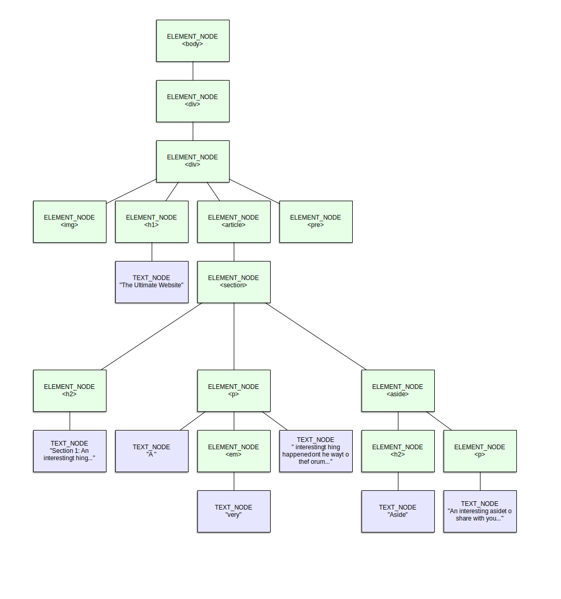
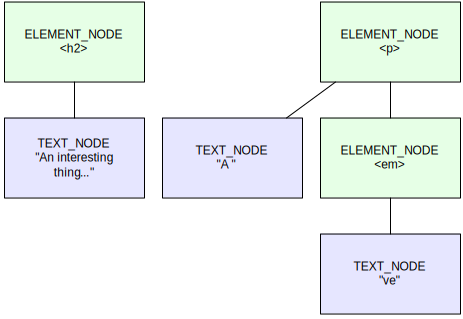

{{APIRef("DOM")}}

The **`AbstractRange`** abstract interface is the base class upon which all {{Glossary("DOM")}} range types are defined. A **range** is an object that indicates the start and end points of a section of content within the document.

> [!NOTE]
> As an abstract interface, you will not directly instantiate an object of type `AbstractRange`. Instead, you will use the {{domxref("Range")}} or {{domxref("StaticRange")}} interfaces. To understand the difference between those two interfaces, and how to choose which is appropriate for your needs, consult each interface's documentation.

{{InheritanceDiagram}}

## Instance properties

- {{domxref("AbstractRange.collapsed", "collapsed")}} {{ReadOnlyInline}}
  - : A Boolean value which is `true` if the range is _collapsed_. A collapsed range is a range whose start position and end position are the same, resulting in a zero-character-long range.
- {{domxref("AbstractRange.endContainer", "endContainer")}} {{ReadOnlyInline}}
  - : The {{domxref("Node")}} object in which the end of the range, as specified by the `endOffset` property, is located.
- {{domxref("AbstractRange.endOffset", "endOffset")}} {{ReadOnlyInline}}
  - : An integer value indicating the offset, in characters, from the beginning of the node's contents to the last character of the range represented by the range object. This value must be less than the length of the `endContainer` node.
- {{domxref("AbstractRange.startContainer", "startContainer")}} {{ReadOnlyInline}}
  - : The DOM {{domxref("Node")}} in which the beginning of the range, as specified by the `startOffset` property, is located.
- {{domxref("AbstractRange.startOffset", "startOffset")}} {{ReadOnlyInline}}
  - : An integer value indicating the offset, in characters, from the beginning of the node's contents to the first character of the contents referred to by the range object. This value must be less than the length of the node indicated in `startContainer`.

## Instance methods

_The `AbstractRange` interface doesn't provide any methods._

## Usage notes

### Range types

All ranges of content within a {{domxref("Document", "document")}} are described using instances of interfaces based on `AbstractRange`. There are two such interfaces:

- {{domxref("Range")}}
  - : The `Range` interface has been around for a long time and has only recently been redefined to be based upon `AbstractRange` as the need arose to define other forms of range data. `Range` provides methods that allow you to alter the range's endpoints, as well as methods to compare ranges, detect intersections between ranges, and so forth.
- {{domxref("StaticRange")}}
  - : A `StaticRange` is a basic range which cannot be changed once it's been created. Specifically, as the node tree mutates and changes, the range does not. This is useful when you need to specify a range that will only be used once, since it avoids the performance and resource impact of the more complex {{domxref("Range")}} interface.

### Contents of elements

When trying to access the contents of an element, keep in mind that the element itself is a node, but so is any text inside it. In order to set a range endpoint within the text of an element, be sure to find the text node inside the element:

```js
const startElem = document.querySelector("p");
const endElem = startElem.querySelector("span");
const range = document.createRange();

range.setStart(startElem, 0);
range.setEnd(endElem, endElem.childNodes[0].length / 2);
const contents = range.cloneContents();

document.body.appendChild(contents);
```

This example creates a new range, `range`, and sets its starting point to the third child node of the first element. The end point is set to be the middle of the first child of the span, and then the range is used to copy the contents of the range.

### Ranges and the hierarchy of the DOM

In order to define a range of characters within a document in a way that is able to span across zero or more node boundaries, and which is as resilient as possible to changes to the DOM, you can't specify the offset to the first and last characters in the {{Glossary("HTML")}}. There are a few good reasons for that.

First, after your page is loaded, the browser isn't thinking in terms of HTML. Once it's been loaded, the page is a tree of DOM {{domxref("Node")}} objects, so you need to specify the beginning and ending locations of a range in terms of nodes and positions within nodes.

Second, in order to support the mutability of the DOM tree as much as possible, you need a way to represent positions relative to nodes in the tree, rather than global positions within the entire document. By defining points within the document as offsets within a given node, those positions remain consistent with the content even as nodes are added to, removed from, or moved around within the DOM tree—within reason. There are fairly obvious limitations (such as if a node is moved to be after the endpoint of a range, or if the content of a node is heavily altered), but it's far better than nothing.

Third, using node-relative positions to define the start and end positions will generally be easier to make perform well. Rather than having to negotiate the DOM figuring out what your global offset refers to, the {{Glossary("user agent")}} (browser) can instead go directly to the node indicated by the starting position and start from there, working its way forward until it reaches the given offset into the ending node.

To illustrate this, consider the HTML below:

```html
<div class="container">
  <div class="header">
    
    <h1>The Ultimate Website</h1>
  </div>
  <article>
    <section class="entry" id="entry1">
      <h2>Section 1: An interesting thing…</h2>
      <p>A <em>very</em> interesting thing happened on the way to the forum…</p>
      <aside class="callout">
        <h2>Aside</h2>
        <p>An interesting aside to share with you…</p>
      </aside>
    </section>
  </article>
  <pre id="log"></pre>
</div>
```

After loading the HTML and constructing the DOM representation of the document, the resulting DOM tree looks like this:



In this diagram, the nodes representing HTML elements are shown in green. Each row beneath them shows the next layer of depth into the DOM tree. Blue nodes are text nodes, containing the text that gets shown onscreen. Each element's contents are linked below it in the tree, potentially spawning a series of branches below as elements include other elements and text nodes.

If you want to create a range that incorporates the contents of the {{HTMLElement("p")}} element whose contents are `"A <em>very</em> interesting thing happened on the way to the forum…"`, you can do so like this:

```js
const pRange = document.createRange();
pRange.selectNodeContents(document.querySelector("#entry1 p"));
```

Since we wish to select the entire contents of the `<p>` element, including its descendants, this works perfectly.

If we wish to instead copy the text "An interesting thing…" from the {{HTMLElement("section")}}'s heading (an {{HTMLElement("Heading_Elements", "h2")}} element) through the end of the letters "ve" in the {{HTMLElement("em")}} within the paragraph below it, the following code would work:

```js
const range = document.createRange();
const startNode = document.querySelector("section h2").childNodes[0];
range.setStart(startNode, 11);

const endNode = document.querySelector("#entry1 p em").childNodes[0];
range.setEnd(endNode, 2);

const fragment = range.cloneContents();
```

Here an interesting problem arises—we are capturing content from multiple nodes located at different levels of the DOM hierarchy, and then only part of one of them. What should the result look like?

As it turns out, the DOM specification fortunately addresses this exact issue. For example, in this case, we're calling {{domxref("Range.cloneContents", "cloneContents()")}} on the range to create a new {{domxref("DocumentFragment")}} object providing a DOM subtree which replicates the contents of the specified range. To do this, `cloneContents()` constructs all the nodes needed to preserve the structure of the indicated range, but no more than necessary.

In this example, the start of the specified range is found within the text node below the section's heading, which means that the new `DocumentFragment` will need to contain an {{HTMLElement("Heading_Elements", "h2")}} and, below it, a text node.

The range's end is located below the {{HTMLElement("p")}} element, so that will be needed within the new fragment. So will the text node containing the word "A", since that's included in the range. Finally, an `<em>` and a text node below it will be added below the `<p>` as well.

The contents of the text nodes are then determined by the offsets into those text nodes given when calling {{domxref("Range.setStart", "setStart()")}} and {{domxref("Range.setEnd", "setEnd()")}}. Given the offset of 11 into the heading's text, that node will contain "An interesting thing…". Similarly, the last text node will contain "ve", given the request for the first two characters of the ending node.

The resulting document fragment looks like this:



Notice especially that the contents of this fragment are all _below_ the shared common parent of the topmost nodes within it. The parent `<section>` is not needed to replicate the cloned content, so it isn't included.

## Example

Consider this simple HTML fragment of HTML.

```html
<p><strong>This</strong> is a paragraph.</p>
```

Imagine using a {{domxref("Range")}} to extract the word "paragraph" from this. The code to do that looks like the following:

```js
const paraNode = document.querySelector("p");
const paraTextNode = paraNode.childNodes[1];

const range = document.createRange();
range.setStart(paraTextNode, 6);
range.setEnd(paraTextNode, paraTextNode.length - 1);

const fragment = range.cloneContents();
document.body.appendChild(fragment);
```

First we get references to the paragraph node itself as well as to the _second_ child node within the paragraph. The first child is the {{HTMLElement("strong")}} element. The second child is the text node " is a paragraph.".

With the text node reference in hand, we create a new `Range` object by calling {{domxref("Document.createRange", "createRange()")}} on the `Document` itself. We set the starting position of the range to the sixth character of the text node's string, and the end position to the length of the text node's string minus one. This sets the range to encompass the word "paragraph".

We then finish up by calling {{domxref("Range.cloneContents", "cloneContents()")}} on the `Range` to create a new {{domxref("DocumentFragment")}} object which contains the portion of the document encompassed by the range. After that, we use {{domxref("Node.appendChild", "appendChild()")}} to add that fragment at the end of the document's body, as obtained from {{domxref("document.body")}}.

The result looks like this:

{{EmbedLiveSample("Example", 600, 80)}}

## Specifications

{{Specifications}}

## Browser compatibility

{{Compat}}
