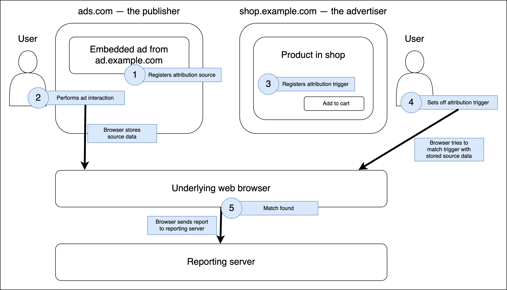

{{SeeCompatTable}}{{securecontext_header}}{{DefaultAPISidebar("Attribution Reporting API")}}

The **Attribution Reporting API** enables developers to measure conversions — for example when a user clicks an ad embedded on one site and then proceeds to purchase the item over on the vendor's site — and then access reports on those conversions. It does this without relying on third-party tracking cookies.

## Concepts and usage

Advertisers commonly want to measure how many users see an ad and then go on to view and purchase a product (conversions). This allows them to figure out what advertising placements are giving them the greatest return on investment (ROI) so they can adjust their advertising strategy accordingly. The process of measuring conversions usually includes capturing data such as:

- Which users converted (for example purchased an item, or signed up for a service), and how many.
- The geographic regions they are based in.
- What sites the ads were placed on.
- How many products were sold, services were signed up for, etc.
- How much revenue was generated.

Traditionally on the web, conversion has been measured using third-party tracking cookies. An ad will typically be embedded on a web page in an {{htmlelement("iframe")}}, which can set a cookie containing information about the user and their interaction with the ad.

Later on, when the user decides to visit the advertiser's site, provided it is from the same domain as the ad, that site can access the third-party cookie set previously by the ad. The advertiser can then associate the data from the ad with their own first-party data to answer questions such as "did the user purchase a product after interacting with an ad for the product from another site?"

This is bad for user [privacy](/en-US/docs/Web/Privacy). At this point, any page from the same domain can get access to that cookie, plus information from sites that embed those pages. A surprisingly large number of parties will be able to access that data, and infer other data about the user based on their browsing habits.

The Attribution Reporting API provides a way to measure ad conversions in a way that protects user privacy.

### How does it work?

Let's illustrate how the Attribution Reporting API works via an example.

Say we have a online shop, `shop.example` (aka the advertiser), which embeds an ad for one of its products on a content site, `news.example` (aka the publisher). The ad content is found at `ad.shop.example`.

The online shop owners want to measure how many conversions they get from users interacting with the ad, viewing the product page on their site, and putting the product into their shopping cart.

The steps involved are as follows:

1. When a user visits the `news.example` site, an **attribution source** can be registered for specific user interactions with the embedded ad. There are several ways that a user can interact with ads on the page. For an ad interaction to register an attribution source, the ad must send a request with an {{httpheader("Attribution-Reporting-Eligible")}} header to indicate that the response is eligible to register an attribution source. Registration will be completed if the response includes an appropriate {{httpheader("Attribution-Reporting-Register-Source")}} header. The attribution source can be, for example:
   - A link. In this case, the interaction is the user clicking on the link (directly via an {{htmlelement("a")}} element, or via a {{domxref("Window.open()")}} call). The source is registered via the response to the navigation request.
   - An image such as an advertising banner or a 1x1 transparent tracking pixel. In this case, the interaction is the user visiting the page. The source is registered when the image loads, i.e. when the server responds to the image request.
   - A fetch request (i.e. a {{domxref("Window/fetch", "fetch()")}} or {{domxref("XMLHttpRequest")}}). In this case the interaction can be specified as whatever makes sense for your app — for example the fetch request could be invoked by a `click` or `submit` event. The source is registered once the response comes back.
2. When the attribution source interaction occurs, the source data returned in the {{httpheader("Attribution-Reporting-Register-Source")}} header is stored in a private local cache accessible only by the browser. This data includes the contextual and first-party data available to the page and the advertiser, the origin of the ad tech company that is collecting the conversion data, and one or more destinations ([eTLD+1](/en-US/docs/Glossary/eTLD)s) where you expect the conversion from that ad to occur (i.e. the advertiser's site(s), for example `shop.example`).
3. When the user later visits `shop.example`, this site can register an **attribution trigger** when an interaction indicates that a conversion has occurred (for example, the user clicks the "Add to cart" button on `shop.example`). The browser will then send a request along with an {{httpheader("Attribution-Reporting-Eligible")}} header to indicate that the response is eligible to register an attribution trigger, and registration will be completed if the response includes an appropriate {{httpheader("Attribution-Reporting-Register-Trigger")}} header. The attribution trigger can be, for example:
   - An image such as a shopping cart icon or a 1x1 transparent tracking pixel. In this case, the interaction is the user visiting the page. The trigger is registered when the image loads, i.e. when the server responds to the image request.
   - A fetch request (i.e. a {{domxref("Window/fetch", "fetch()")}} or {{domxref("XMLHttpRequest")}}). In this case the interaction can be specified as whatever makes sense for your app — for example the fetch request could be invoked by a `click` or `submit` event. The trigger is registered once the response comes back.
4. When the trigger attribution completes, the browser attempts to match the data from the [Attribution-Reporting-Register-Trigger](/en-US/docs/Web/HTTP/Headers/Attribution-Reporting-Register-Trigger) header with a source data entry saved in the private local cache (see 2.). See [Registering attribution triggers](/en-US/docs/Web/API/Attribution_Reporting_API/Registering_triggers) for matching methodology and requirements.
5. If a match is made, the browser sends report data to an endpoint on a reporting server typically owned by the ad tech provider where it can be securely analyzed. Unlike with cookies, the data is only available to the specific site you send it to - there will be no data shared elsewhere. These reports can be either:
   - **Event-level reports**: Reports based on an attribution source event, where detailed source data is associated with coarse trigger data. For example, a report may look like "Click ID 200498 on `ad.shop.example` led to a purchase on `shop.example`", where "Click ID 200498" is the detailed source data, and "purchase" is the coarse trigger data. The detailed source data may encode first-party or contextual data from the source page, and the trigger data may encode the event from the trigger page.
   - **Summary reports**: More detailed reports that combine data from multiple conversions on both the source and trigger side. For example "Campaign ID 774653 on `news.example` has led to 654 sales of widgets on `shop.example` from users in Italy, with a total revenue of $9540." Compiling a summary report requires usage of an aggregation service (see for example the [Google aggregation service](https://github.com/privacysandbox/aggregation-service)).

For more information on implementing the functionality required for the above steps, see:

1. [Registering attribution sources](/en-US/docs/Web/API/Attribution_Reporting_API/Registering_sources)
2. [Registering attribution triggers](/en-US/docs/Web/API/Attribution_Reporting_API/Registering_triggers)
3. [Generating reports](/en-US/docs/Web/API/Attribution_Reporting_API/Generating_reports)

## Interfaces

The Attribution Reporting API doesn't define any distinct interfaces of its own.

### Extensions to other interfaces

- {{domxref("HTMLAnchorElement.attributionSrc")}}, {{domxref("HTMLImageElement.attributionSrc")}}, {{domxref("HTMLScriptElement.attributionSrc")}}
  - : The `attributionSrc` property allows you to get and set the `attributionsrc` attribute on {{htmlelement("a")}}, {{htmlelement("img")}}, and {{htmlelement("script")}} elements programmatically. It reflects the value of that attribute.
- {{domxref("Window/fetch", "fetch()")}} and the {{domxref("Request.Request", "Request()")}} constructor, the `attributionReporting` option
  - : When generating a request via {{domxref("Window/fetch", "fetch()")}}, this indicates that you want the response to be able to register an attribution source or trigger.
- {{domxref("XMLHttpRequest.setAttributionReporting()")}}
  - : When generating a request via {{domxref("XMLHttpRequest")}}, this indicates that you want the response to be able to register an attribution source or trigger.
- {{domxref("Window.open()")}}, the `attributionsrc` feature keyword
  - : Causes completion of the registration of an attribution source _and_ triggers the browser to store the associated source data (as provided in the {{httpheader("Attribution-Reporting-Register-Source")}} response header) when the `open()` method completes. Note that `Window.open()` calls cannot be used to register attribution triggers.

## HTML elements

- {{htmlelement("a")}}, {{htmlelement("img")}}, and {{htmlelement("script")}} — the `attributionsrc` attribute
  - : Specifies that you want the browser to send an {{httpheader("Attribution-Reporting-Eligible")}} header along with the associated resource request. On the server-side this header is used to trigger sending an {{httpheader("Attribution-Reporting-Register-Source")}} or {{httpheader("Attribution-Reporting-Register-Trigger")}} header in the response. When registering an attribution source, this is required; when registering an attribution trigger it is only required if you want to specify a separate registration server to the resource the `src` attribute is pointing at. Note that `<a>` elements cannot be used to register attribution triggers.

## HTTP headers

- {{httpheader("Attribution-Reporting-Eligible")}}
  - : HTTP request that indicates that the corresponding response is eligible to register an attribution source or trigger.
- {{httpheader("Attribution-Reporting-Register-Source")}}
  - : HTTP response that registers a page feature as an attribution source. This is included as part of a response to a request that included an `Attribution-Reporting-Eligible` header.
- {{httpheader("Attribution-Reporting-Register-Trigger")}}
  - : HTTP response that registers a page feature as an attribution trigger. This is included as part of a response to a request that included an `Attribution-Reporting-Eligible` header.
- {{httpheader("Permissions-Policy")}} {{httpheader('Permissions-Policy/attribution-reporting','attribution-reporting')}} directive
  - : Controls whether the current document is allowed to use attribution reporting.

## Enrollment and local testing

To use the Attribution Reporting API in your sites, you must specify it in the [privacy sandbox enrollment process](/en-US/docs/Web/Privacy/Privacy_sandbox/Enrollment). If you don't do this, the API flow is blocked at response time, i.e. the response headers are ignored and sources and triggers are not registered.

You can still test your Attribution Reporting API code locally without enrollment. To allow local testing, enable the following Chrome developer flag:

`chrome://flags/#privacy-sandbox-enrollment-overrides`

## Examples

See [Demo: Attribution Reporting API](https://arapi-home.web.app/) for an example implementation (see the [source code also](https://github.com/GoogleChromeLabs/trust-safety-demo/tree/main/attribution-reporting)).

## Specifications

{{Specifications}}

## Browser compatibility

{{Compat}}

## See also

- [Attribution Reporting Header Validation tool](https://wicg.github.io/attribution-reporting-api/validate-headers)
- [Attribution reporting](https://developers.google.com/privacy-sandbox/private-advertising/attribution-reporting/) on developers.google.com (2023)
- [Enable conversion measurement](https://developers.google.com/privacy-sandbox/private-advertising/attribution-reporting/enable-conversion-measurement) on developers.google.com (2023)
- [The Privacy Sandbox](https://developers.google.com/privacy-sandbox/) on developers.google.com (2023)
