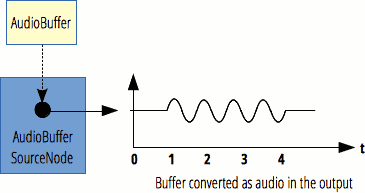

{{APIRef("Web Audio API")}}

The **`AudioBufferSourceNode`** interface is an {{domxref("AudioScheduledSourceNode")}} which represents an audio source consisting of in-memory audio data, stored in an {{domxref("AudioBuffer")}}.

This interface is especially useful for playing back audio which has particularly stringent timing accuracy requirements, such as for sounds that must match a specific rhythm and can be kept in memory rather than being played from disk or the network. To play sounds which require accurate timing but must be streamed from the network or played from disk, use a {{domxref("AudioWorkletNode")}} to implement its playback.

{{InheritanceDiagram}}

An `AudioBufferSourceNode` has no inputs and exactly one output, which has the same number of channels as the `AudioBuffer` indicated by its {{domxref("AudioBufferSourceNode.buffer", "buffer")}} property. If there's no buffer set—that is, if `buffer` is `null`—the output contains a single channel of silence (every sample is 0).

An `AudioBufferSourceNode` can only be played once; after each call to {{domxref("AudioBufferSourceNode.start", "start()")}}, you have to create a new node if you want to play the same sound again. Fortunately, these nodes are very inexpensive to create, and the actual `AudioBuffer`s can be reused for multiple plays of the sound. Indeed, you can use these nodes in a "fire and forget" manner: create the node, call `start()` to begin playing the sound, and don't even bother to hold a reference to it. It will automatically be garbage-collected at an appropriate time, which won't be until sometime after the sound has finished playing.

Multiple calls to {{domxref("AudioScheduledSourceNode/stop", "stop()")}} are allowed. The most recent call replaces the previous one, if the `AudioBufferSourceNode` has not already reached the end of the buffer.



<table class="properties">
  <tbody>
    <tr>
      <th scope="row">Number of inputs</th>
      <td><code>0</code></td>
    </tr>
    <tr>
      <th scope="row">Number of outputs</th>
      <td><code>1</code></td>
    </tr>
    <tr>
      <th scope="row">Channel count</th>
      <td>defined by the associated {{domxref("AudioBuffer")}}</td>
    </tr>
  </tbody>
</table>

## Constructor

- {{domxref("AudioBufferSourceNode.AudioBufferSourceNode", "AudioBufferSourceNode()")}}
  - : Creates and returns a new `AudioBufferSourceNode` object. As an alternative, you can use the {{domxref("BaseAudioContext.createBufferSource()")}} factory method; see [Creating an AudioNode](/en-US/docs/Web/API/AudioNode#creating_an_audionode).

## Instance properties

_Inherits properties from its parent, {{domxref("AudioScheduledSourceNode")}}_.

- {{domxref("AudioBufferSourceNode.buffer")}}
  - : An {{domxref("AudioBuffer")}} that defines the audio asset to be played, or when set to the value `null`, defines a single channel of silence (in which every sample is 0.0).
- {{domxref("AudioBufferSourceNode.detune")}}
  - : A [k-rate](/en-US/docs/Web/API/AudioParam#k-rate) {{domxref("AudioParam")}} representing detuning of playback in [cents](https://en.wikipedia.org/wiki/Cent_%28music%29). This value is compounded with `playbackRate` to determine the speed at which the sound is played. Its default value is `0` (meaning no detuning), and its nominal range is -∞ to ∞.
- {{domxref("AudioBufferSourceNode.loop")}}
  - : A Boolean attribute indicating if the audio asset must be replayed when the end of the {{domxref("AudioBuffer")}} is reached. Its default value is `false`.
- {{domxref("AudioBufferSourceNode.loopStart")}} {{optional_inline}}
  - : A floating-point value indicating the time, in seconds, at which playback of the {{domxref("AudioBuffer")}} must begin when `loop` is `true`. Its default value is `0` (meaning that at the beginning of each loop, playback begins at the start of the audio buffer).
- {{domxref("AudioBufferSourceNode.loopEnd")}} {{optional_inline}}
  - : A floating-point number indicating the time, in seconds, at which playback of the {{domxref("AudioBuffer")}} stops and loops back to the time indicated by `loopStart`, if `loop` is `true`. The default value is `0`.
- {{domxref("AudioBufferSourceNode.playbackRate")}}
  - : A [k-rate](/en-US/docs/Web/API/AudioParam#k-rate) {{domxref("AudioParam")}} that defines the speed factor at which the audio asset will be played, where a value of 1.0 is the sound's natural sampling rate. Since no pitch correction is applied on the output, this can be used to change the pitch of the sample. This value is compounded with `detune` to determine the final playback rate.

## Instance methods

_Inherits methods from its parent, {{domxref("AudioScheduledSourceNode")}}, and overrides the following method:_.

- {{domxref("AudioBufferSourceNode.start", "start()")}}
  - : Schedules playback of the audio data contained in the buffer, or begins playback immediately. Additionally allows the start offset and play duration to be set.

## Examples

In this example, we create a two-second buffer, fill it with white noise, and then play it using an `AudioBufferSourceNode`. The comments should clearly explain what is going on.

> [!NOTE]
> You can also [run the code live](https://mdn.github.io/webaudio-examples/audio-buffer/), or [view the source](https://github.com/mdn/webaudio-examples/blob/main/audio-buffer/index.html).

```js
const audioCtx = new AudioContext();

// Create an empty three-second stereo buffer at the sample rate of the AudioContext
const myArrayBuffer = audioCtx.createBuffer(
  2,
  audioCtx.sampleRate * 3,
  audioCtx.sampleRate,
);

// Fill the buffer with white noise;
// just random values between -1.0 and 1.0
for (let channel = 0; channel < myArrayBuffer.numberOfChannels; channel++) {
  // This gives us the actual ArrayBuffer that contains the data
  const nowBuffering = myArrayBuffer.getChannelData(channel);
  for (let i = 0; i < myArrayBuffer.length; i++) {
    // Math.random() is in [0; 1.0]
    // audio needs to be in [-1.0; 1.0]
    nowBuffering[i] = Math.random() * 2 - 1;
  }
}

// Get an AudioBufferSourceNode.
// This is the AudioNode to use when we want to play an AudioBuffer
const source = audioCtx.createBufferSource();
// set the buffer in the AudioBufferSourceNode
source.buffer = myArrayBuffer;
// connect the AudioBufferSourceNode to the
// destination so we can hear the sound
source.connect(audioCtx.destination);
// start the source playing
source.start();
```

> [!NOTE]
> For a `decodeAudioData()` example, see the {{domxref("BaseAudioContext/decodeAudioData", "AudioContext.decodeAudioData()")}} page.

## Specifications

{{Specifications}}

## Browser compatibility

{{Compat}}

## See also

- [Using the Web Audio API](/en-US/docs/Web/API/Web_Audio_API/Using_Web_Audio_API)
- [Web Audio API](/en-US/docs/Web/API/Web_Audio_API)
