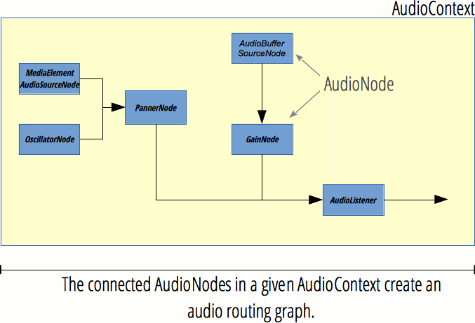

{{APIRef("Web Audio API")}}

The **`AudioNode`** interface is a generic interface for representing an audio processing module.

Examples include:

- an audio source (e.g. an HTML {{HTMLElement("audio")}} or {{HTMLElement("video")}} element, an {{domxref("OscillatorNode")}}, etc.),
- the audio destination,
- intermediate processing module (e.g. a filter like {{domxref("BiquadFilterNode")}} or {{domxref("ConvolverNode")}}), or
- volume control (like {{domxref("GainNode")}})

{{InheritanceDiagram}}

> [!NOTE]
> An `AudioNode` can be target of events, therefore it implements the {{domxref("EventTarget")}} interface.

## Instance properties

- {{domxref("AudioNode.context")}} {{ReadOnlyInline}}
  - : Returns the associated {{domxref("BaseAudioContext")}}, that is the object representing the processing graph the node is participating in.
- {{domxref("AudioNode.numberOfInputs")}} {{ReadOnlyInline}}
  - : Returns the number of inputs feeding the node. Source nodes are defined as nodes having a `numberOfInputs` property with a value of `0`.
- {{domxref("AudioNode.numberOfOutputs")}} {{ReadOnlyInline}}
  - : Returns the number of outputs coming out of the node. Destination nodes — like {{ domxref("AudioDestinationNode") }} — have a value of `0` for this attribute.
- {{domxref("AudioNode.channelCount")}}
  - : Represents an integer used to determine how many channels are used when [up-mixing and down-mixing](/en-US/docs/Web/API/Web_Audio_API/Basic_concepts_behind_Web_Audio_API#up-mixing_and_down-mixing) connections to any inputs to the node. Its usage and precise definition depend on the value of {{domxref("AudioNode.channelCountMode")}}.
- {{domxref("AudioNode.channelCountMode")}}
  - : Represents an enumerated value describing the way channels must be matched between the node's inputs and outputs.
- {{domxref("AudioNode.channelInterpretation")}}
  - : Represents an enumerated value describing the meaning of the channels. This interpretation will define how audio [up-mixing and down-mixing](/en-US/docs/Web/API/Web_Audio_API/Basic_concepts_behind_Web_Audio_API#up-mixing_and_down-mixing) will happen.
    The possible values are `"speakers"` or `"discrete"`.

## Instance methods

_Also implements methods from the interface_ {{domxref("EventTarget")}}.

- {{domxref("AudioNode.connect()")}}
  - : Allows us to connect the output of this node to be input into another node, either as audio data or as the value of an {{domxref("AudioParam")}}.
- {{domxref("AudioNode.disconnect()")}}
  - : Allows us to disconnect the current node from another one it is already connected to.

## Description

### The audio routing graph



Each `AudioNode` has inputs and outputs, and multiple audio nodes are connected to build a _processing graph_. This graph is contained in an {{domxref("AudioContext")}}, and each audio node can only belong to one audio context.

A _source node_ has zero inputs but one or multiple outputs, and can be used to generate sound. On the other hand, a _destination node_ has no outputs; instead, all its inputs are directly played back on the speakers (or whatever audio output device the audio context uses). In addition, there are _processing nodes_ which have inputs and outputs. The exact processing done varies from one `AudioNode` to another but, in general, a node reads its inputs, does some audio-related processing, and generates new values for its outputs, or lets the audio pass through (for example in the {{domxref("AnalyserNode")}}, where the result of the processing is accessed separately).

The more nodes in a graph, the higher the latency will be. For example, if your graph has a latency of 500ms, when the source node plays a sound, it will take half a second until that sound can be heard on your speakers (or even longer because of latency in the underlying audio device). Therefore, if you need to have interactive audio, keep the graph as small as possible, and put user-controlled audio nodes at the end of a graph. For example, a volume control (`GainNode`) should be the last node so that volume changes take immediate effect.

Each input and output has a given amount of _channels_. For example, mono audio has one channel, while stereo audio has two channels. The Web Audio API will up-mix or down-mix the number of channels as required; check the Web Audio spec for details.

For a list of all audio nodes, see the [Web Audio API](/en-US/docs/Web/API/Web_Audio_API) homepage.

### Creating an `AudioNode`

There are two ways to create an `AudioNode`: via the _constructor_ and via the _factory method_.

```js
// constructor
const analyserNode = new AnalyserNode(audioCtx, {
  fftSize: 2048,
  maxDecibels: -25,
  minDecibels: -60,
  smoothingTimeConstant: 0.5,
});
```

```js
// factory method
const analyserNode = audioCtx.createAnalyser();
analyserNode.fftSize = 2048;
analyserNode.maxDecibels = -25;
analyserNode.minDecibels = -60;
analyserNode.smoothingTimeConstant = 0.5;
```

You are free to use either constructors or factory methods, or mix both, however there are advantages to using the constructors:

- All parameters can be set during construction time and don't need to be set individually.
- You can [sub-class an audio node](https://github.com/WebAudio/web-audio-api/issues/251). While the actual processing is done internally by the browser and cannot be altered, you could write a wrapper around an audio node to provide custom properties and methods.
- Slightly better performance: In both Chrome and Firefox, the factory methods call the constructors internally.

_Brief history:_ The first version of the Web Audio spec only defined the factory methods. After a [design review in October 2013](https://github.com/WebAudio/web-audio-api/issues/250), it was decided to add constructors because they have numerous benefits over factory methods. The constructors were added to the spec from August to October 2016. Factory methods continue to be included in the spec and are not deprecated.

## Example

This simple snippet of code shows the creation of some audio nodes, and how the `AudioNode` properties and methods can be used. You can find examples of such usage on any of the examples linked to on the [Web Audio API](/en-US/docs/Web/API/Web_Audio_API) landing page (for example [Violent Theremin](https://github.com/mdn/webaudio-examples/tree/main/violent-theremin)).

```js
const audioCtx = new AudioContext();

const oscillator = new OscillatorNode(audioCtx);
const gainNode = new GainNode(audioCtx);

oscillator.connect(gainNode).connect(audioCtx.destination);

oscillator.context;
oscillator.numberOfInputs;
oscillator.numberOfOutputs;
oscillator.channelCount;
```

## Specifications

{{Specifications}}

## Browser compatibility

{{Compat}}

## See also

- [Using the Web Audio API](/en-US/docs/Web/API/Web_Audio_API/Using_Web_Audio_API)
