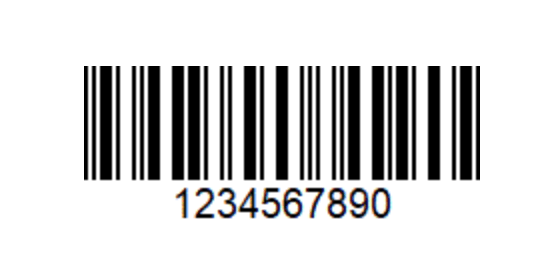

{{securecontext_header}}{{DefaultAPISidebar("Barcode Detection API")}} {{AvailableInWorkers}} {{SeeCompatTable}}

The Barcode Detection API detects linear and two-dimensional barcodes in images.

## Concepts and usage

Support for barcode recognition within web apps unlocks a variety of use cases through supported barcode formats. QR codes can be used for online payments, web navigation or establishing social media connections, Aztec codes can be used to scan boarding passes and shopping apps can use EAN or UPC barcodes to compare prices of physical items.

Detection is achieved through the {{domxref('BarcodeDetector.detect()','detect()')}} method, which takes an image object; it can be one of these objects:
an {{domxref("SVGImageElement")}},
an {{domxref("HTMLVideoElement")}},
an {{domxref("HTMLCanvasElement")}},
an {{domxref("ImageBitmap")}},
an {{domxref("OffscreenCanvas")}},
a {{domxref("VideoFrame")}},
a {{domxref('Blob')}},
or an {{domxref('ImageData')}}.
Optional parameters can be passed to the {{domxref('BarcodeDetector')}} constructor to provide hints on which barcode formats to detect.

### Supported barcode formats

The Barcode Detection API supports the following barcode formats:

<table class="no-markdown">
  <thead>
    <tr>
      <th>Format</th>
      <th>Description</th>
      <th>Image</th>
    </tr>
  </thead>
  <tbody>
    <tr>
      <td>aztec</td>
      <td>
        A square two-dimensional matrix following iso24778 and with a square
        bullseye pattern at their center, thus resembling an Aztec pyramid. Does
        not require a surrounding blank zone.
      </td>
      <td>
        
      </td>
    </tr>
    <tr>
      <td>code_128</td>
      <td>
        A linear (one-dimensional), bidirectionally-decodable, self-checking
        barcode following iso15417 and able to encode all 128 characters of
        {{Glossary("ASCII")}} (hence the naming).
      </td>
      <td>
        
      </td>
    </tr>
    <tr>
      <td>code_39</td>
      <td>
        A linear (one-dimensional), self-checking barcode following iso16388. It
        is a discrete and variable-length barcode type.
      </td>
      <td>
        
      </td>
    </tr>
    <tr>
      <td>code_93</td>
      <td>
        A linear, continuous symbology with a variable length following bc5. It
        offers a larger information density than Code 128 and the visually
        similar Code 39. Code 93 is used primarily by Canada Post to encode
        supplementary delivery information.
      </td>
      <td>
        
      </td>
    </tr>
    <tr>
      <td>codabar</td>
      <td>
        A linear barcode representing characters 0-9, A-D and symbols - . $ / +
      </td>
      <td>
        
      </td>
    </tr>
    <tr>
      <td>data_matrix</td>
      <td>
        An orientation-independent two-dimensional barcode composed of black and
        white modules arranged in either a square or rectangular pattern
        following iso16022.
      </td>
      <td>
        
      </td>
    </tr>
    <tr>
      <td>ean_13</td>
      <td>
        A linear barcode based on the UPC-A standard and defined in iso15420.
      </td>
      <td>
        
      </td>
    </tr>
    <tr>
      <td>ean_8</td>
      <td>A linear barcode defined in iso15420 and derived from EAN-13.</td>
      <td>
        
      </td>
    </tr>
    <tr>
      <td>itf</td>
      <td>
        A continuous, self-checking, bidirectionally decodable barcode. It will
        always encode 14 digits.
      </td>
      <td>
        
      </td>
    </tr>
    <tr>
      <td>pdf417</td>
      <td>
        A continuous two-dimensional barcode symbology format with multiple rows
        and columns. It's bi-directionally decodable and uses the iso15438
        standard.
      </td>
      <td>
        
      </td>
    </tr>
    <tr>
      <td>qr_code</td>
      <td>
        A two-dimensional barcode that uses the iso18004 standard. The
        information encoded can be text, URL or other data.
      </td>
      <td>
        
      </td>
    </tr>
    <tr>
      <td>upc_a</td>
      <td>
        One of the most common linear barcode types and is widely applied to
        retail in the United States. Defined in iso15420, it represents digits
        by strips of bars and spaces, each digit being associated to a unique
        pattern of 2 bars and 2 spaces, both of variable width. UPC-A can encode
        12 digits that are uniquely assigned to each trade item, and it's
        technically a subset of EAN-13 (UPC-A codes are represented in EAN-13
        with the first character set to 0).
      </td>
      <td>
        
      </td>
    </tr>
    <tr>
      <td>upc_e</td>
      <td>
        A variation of UPC-A defined in iso15420, compressing out unnecessary
        zeros for a more compact barcode.
      </td>
      <td>
        
      </td>
    </tr>
    <tr>
      <td>unknown</td>
      <td>
        This value is used by the platform to signify that it does not know or
        specify which barcode format is being detected or supported.
      </td>
      <td></td>
    </tr>
  </tbody>
</table>

You can check for formats supported by the user agent via the {{domxref('BarcodeDetector/getSupportedFormats_static','getSupportedFormats()')}} method.

## Interfaces

- {{domxref("BarcodeDetector")}} {{Experimental_Inline}}
  - : The **`BarcodeDetector`** interface of the Barcode Detection API allows detection of linear and two dimensional barcodes in images.

## Examples

### Creating A Detector

This example tests for browser compatibility and creates a new barcode detector object, with specified supported formats.

```js
// check compatibility
if (!("BarcodeDetector" in window)) {
  console.log("Barcode Detector is not supported by this browser.");
} else {
  console.log("Barcode Detector supported!");

  // create new detector
  const barcodeDetector = new BarcodeDetector({
    formats: ["code_39", "codabar", "ean_13"],
  });
}
```

### Getting Supported Formats

The following example calls the `getSupportedFormats()` method and logs the results to the console.

```js
// check supported types
BarcodeDetector.getSupportedFormats().then((supportedFormats) => {
  supportedFormats.forEach((format) => console.log(format));
});
```

### Detect Barcodes

This example uses the `detect()` method to detect the barcodes within the given image. These are iterated over and the barcode data is logged to the console.

```js
barcodeDetector
  .detect(imageEl)
  .then((barcodes) => {
    barcodes.forEach((barcode) => console.log(barcode.rawValue));
  })
  .catch((err) => {
    console.log(err);
  });
```

## Specifications

{{Specifications}}

## Browser compatibility

{{Compat}}

## See also

- [barcodefaq.com: A website with information about different barcodes and examples of the different types.](https://www.barcodefaq.com/)
- [The Shape Detection API: a picture is worth a thousand words, faces, and barcodes](https://web.dev/shape-detection/#barcodedetector)
