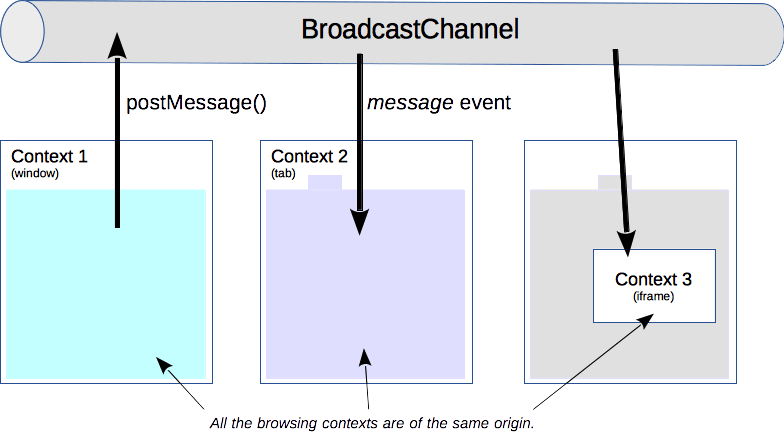

{{DefaultAPISidebar("Broadcast Channel API")}}

The **Broadcast Channel API** allows basic communication between {{glossary("browsing context", "browsing contexts")}} (that is, _windows_, _tabs_, _frames_, or _iframes_) and workers on the same {{glossary("origin")}}.

{{AvailableInWorkers}}

By creating a {{domxref("BroadcastChannel")}} object, you can receive any messages that are posted to it. You don't have to maintain a reference to the frames or workers you wish to communicate with: they can “subscribe” to a particular channel by constructing their own {{domxref("BroadcastChannel")}} with the same name, and have bi-directional communication between all of them.



## Broadcast Channel interface

### Creating or joining a channel

A client joins a broadcast channel by creating a {{domxref("BroadcastChannel")}} object. Its [constructor](/en-US/docs/Web/API/BroadcastChannel/BroadcastChannel) takes one single parameter: the _name_ of the channel. If it is the first to connect to that broadcast channel name, the underlying channel is created.

```js
// Connection to a broadcast channel
const bc = new BroadcastChannel('test_channel');
```

### Sending a message

It is enough to call the {{domxref("BroadcastChannel.postMessage", "postMessage()")}} method on the created `BroadcastChannel` object, which takes any object as an argument. An example string message:

```js
// Example of sending of a very simple message
bc.postMessage('This is a test message.');
```

Any kind of object can be sent, not just a {{domxref("DOMString")}}.

The API doesn't associate any semantics to messages, so it is up to the code to know what kind of messages to expect and what to do with them.

### Receiving a message

When a message is posted, a {{event("message")}} event is dispatched to each {{domxref("BroadcastChannel")}} object connected to this channel. A function can be run for this event with the {{domxref("BroadcastChannel.onmessage", "onmessage")}} event handler:

```js
// A handler that only logs the event to the console:
bc.onmessage = function (ev) { console.log(ev); }
```

### Disconnecting a channel

To leave a channel, call the {{domxref("BroadcastChannel.close", "close()")}} method on the object. This disconnects the object from the underlying channel, allowing garbage collection.

```js
// Disconnect the channel
bc.close();
```

## Conclusion

The Broadcast Channel API's self-contained interface allows cross-context communication. It can be used to detect user actions in other tabs within a same origin, like when the user logs in or out.

The messaging protocol is not defined and the different browsing contexts need to implement it themselves; there is no negotiation nor requirement from the specification.

## Specifications

{{Specifications("api.BroadcastChannel")}}

## Browser compatibility

{{Compat("api.BroadcastChannel")}}

## See also

- {{domxref("BroadcastChannel")}}, the interface implementing it.
